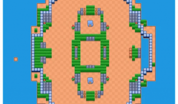
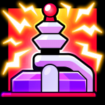
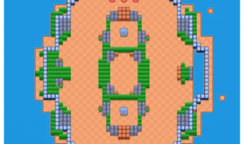
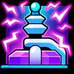
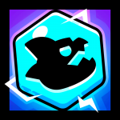
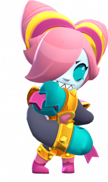

随着荒野乱斗全新 MOBA 模式的到来，《荒野乱斗》也推出免费获得精美皮肤的新机会！首个主题挑战即将上线，主要奖励是特摄科莱特皮肤！

本文将详细介绍挑战的所有详细信息，包括：日期、胜利奖励、MOBA 模式地图以及如何组建您的团队以赢得所有比赛并赢得皮肤！

## 免费科莱特·特摄皮肤挑战

免费挑战赛将于本周四（6 月 5 日）开始，持续 8 天，直至 6 月 13 日。

> _赢得 12 场比赛即可获胜：特摄科莱特！
> 
> 邀请朋友或“寻找团队”以最大限度地提高您获胜的机会。
> 
> 挑战仅限 192 小时。祝您好运，玩得开心。

这次是生命有限（3 条命）的挑战，每多一条命需要花费 9 颗宝石。

## 竞技场乱斗模式

竞技场乱斗是《荒野乱斗》的全新游戏模式，其灵感源自 MOBA 类游戏，拥有两条主线（上路和下路），每条线都由自动炮塔守护。玩家的目标是摧毁位于地图另一侧的敌方基地。两条线之间是丛林地带，玩家可以在这里对抗中立敌人，例如机器人和怪兽，从而获得经验值和强化道具。

在乱斗竞技场中，三名玩家组队对抗另一个三人小队，目标很简单：**率先摧毁敌方基地的一方获胜！**

战场由两条连接双方基地的战线构成，每条线上都设有防御塔，一旦敌人进入射程，防御塔就会自动开火。与此同时，每个基地会源源不断地生成小型机器人，它们会顺着战线推进，并自动攻击敌方的机器人、英雄、塔和基地，构成整场对战的前线基础。

为了取得胜利，队伍需要先逐步摧毁敌方防御塔，最终才能攻破核心——敌方基地。

除了战线上的交火，地图中央的“野区”同样暗藏玄机。那里会定期刷出中立单位，击败它们能获取经验值。中立单位的刷新是逐步升级的：起初是1个机器人，接着是2个，最后是4个。当这4个机器人被清除后，地图中央会降临一只强力怪兽。谁能击败这只怪兽，不仅能获得大量经验值，还能为全队带来临时的移速加成和减伤效果，往往是整局的关键转折点。

在竞技场中，无论是你还是身边的队友，只要击倒敌方机器人、英雄、怪兽，或是摧毁防御塔，都可以获得竞技场经验值，进而提升自身的竞技场等级。每位英雄从0级起步，最高可升至15级。等级提升后，英雄会获得属性加成，这些成长与每个英雄的特性紧密挂钩，也让比赛节奏在对局中逐渐加快。

最后还有个好消息：在这个模式中你可以获得**双倍奖杯**，但不用担心——哪怕战败也不会损失双倍，放手冲就对了！

## 地图和奖励

每次胜利，玩家都将获得专属奖励。查看完整关卡列表、奖励以及将分发的特殊图标！

### 第一阶段：辉煌竞技场

-   首胜奖励：星秒赠品
-   第二场胜利奖励：星秒赠品
-   三胜奖励：“MOBA 红色基地”头像

### 第二阶段：虚幻竞技场

-   第四次获胜奖励：星秒赠品
-   第五次获胜奖励：星秒赠品
-   第六胜奖励：“MOBA 蓝色基地”个人资料图标

### 第三阶段：辉煌竞技场

-   第七次获胜奖励：星秒赠品
-   第八次获胜奖励：星秒赠品
-   第九胜奖励：“MOBA”个人资料图标

### 第四阶段：虚幻竞技场

-   第十胜奖励：星秒赠品
-   第 11 次获胜奖励：星秒赠品
-   第 12 次获胜奖励：星秒赠品

最终奖励：免费 Colette Tokusatsu 皮肤

___

## 小提示

**如果您真的想要获得这个皮肤，最好不要野排**，快去找个朋友！

