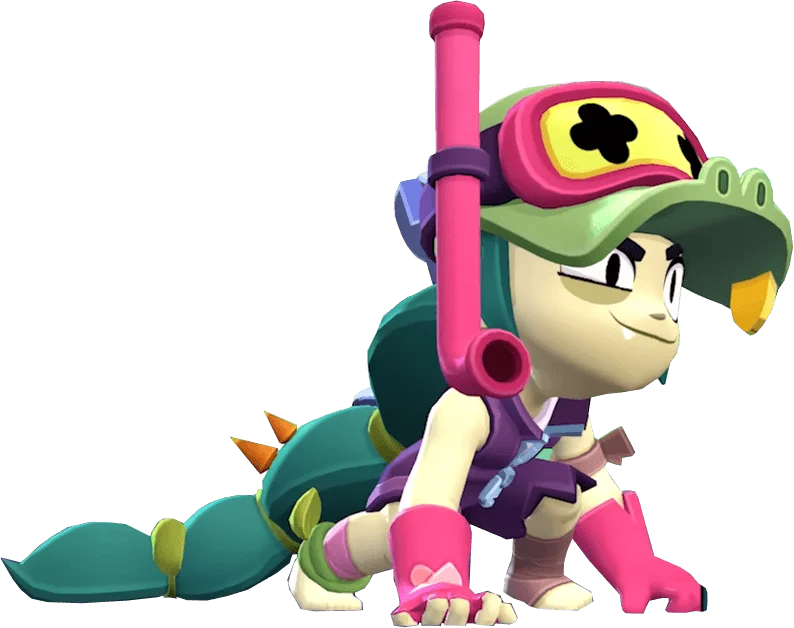
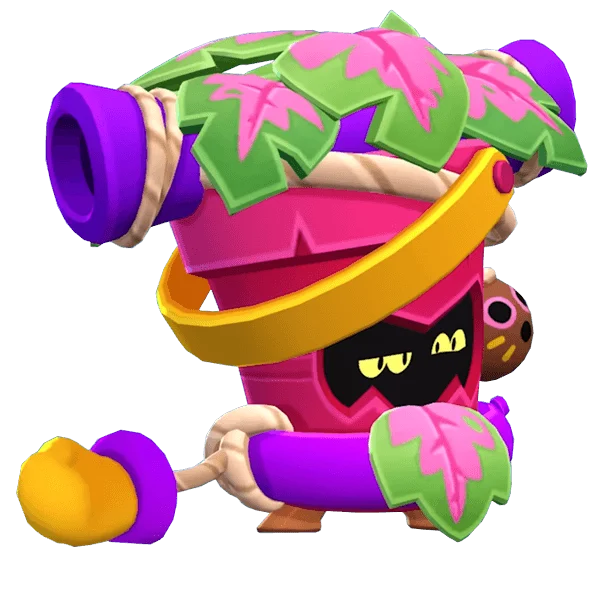
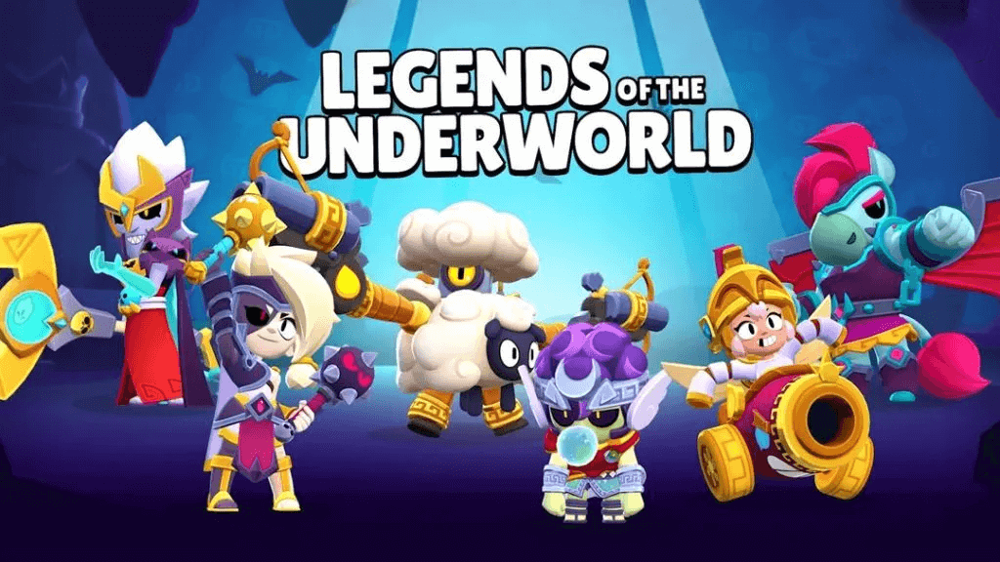
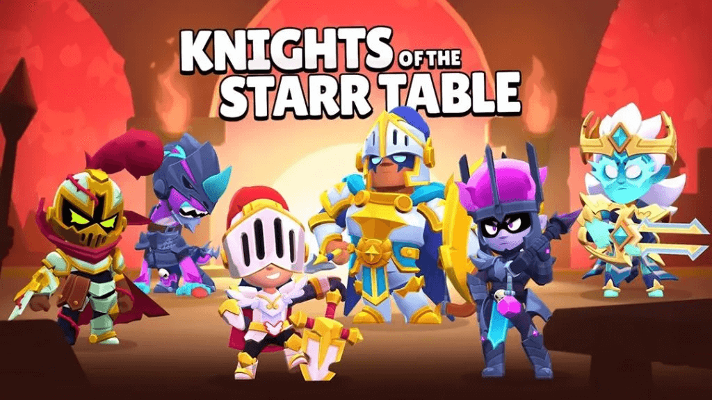
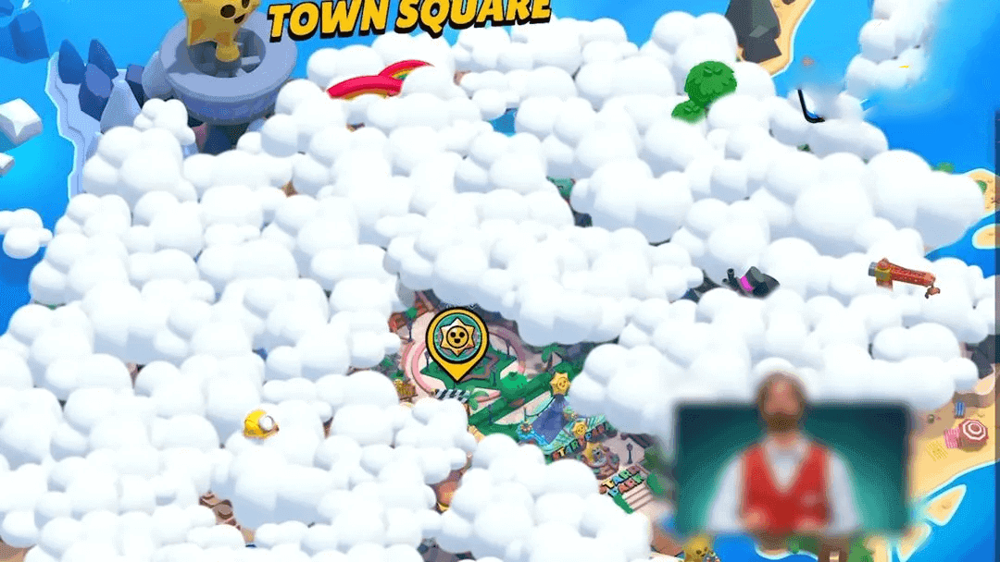
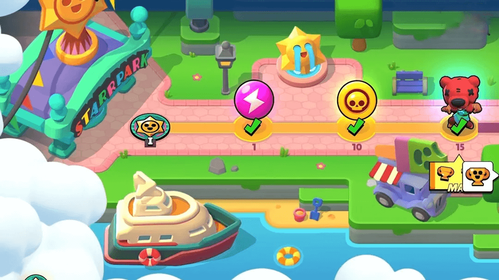
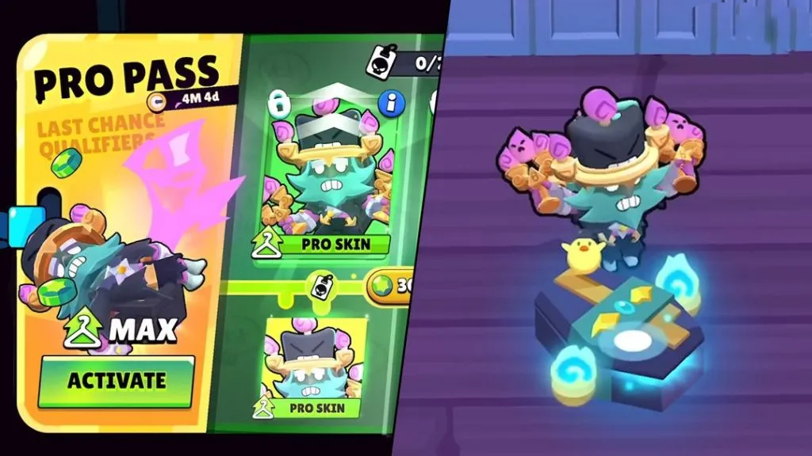
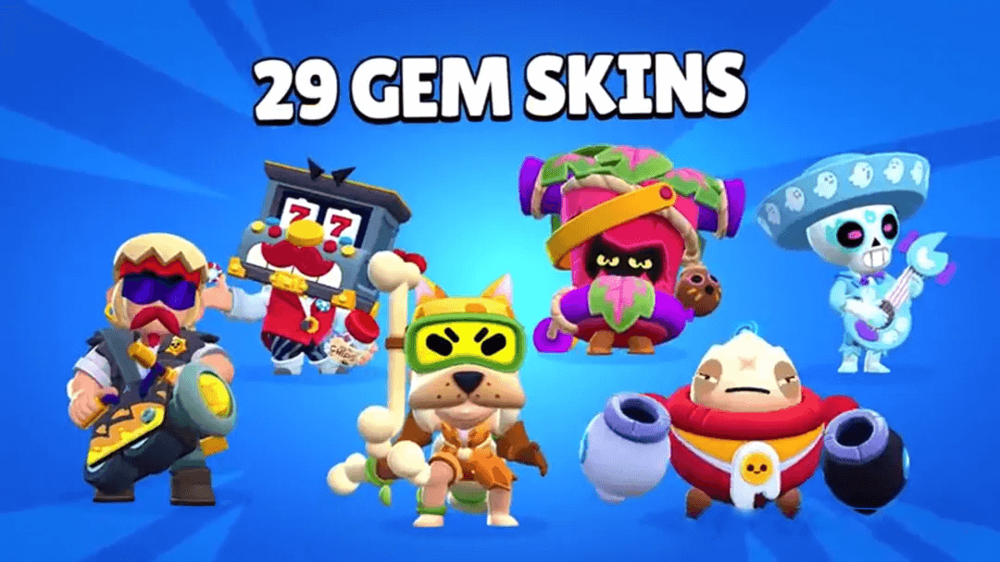
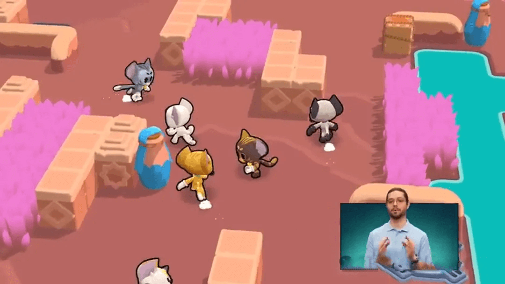

令人期待的时刻终于到来了，全新《荒野乱斗》抢先看上线，《荒野乱斗》团队揭晓了下周初即将发布的新更新中的所有新功能。

<iframe width="790" height="445" src="https://www.youtube.com/embed/nzZm9vl81XU" title="Brawl Talk: TROPHY ROAD = STARR PARK?! 🤯" frameborder="0" allow="accelerometer; autoplay; clipboard-write; encrypted-media; gyroscope; picture-in-picture; web-share" referrerpolicy="strict-origin-when-cross-origin" allowfullscreen></iframe>

本次更新还公布了两位英雄：「鳄梨」（Avocado）与「桩」（Stump）。此外，还包括两大主题季更新、「荣誉之路」重做、三种全新游戏模式、新一轮皮肤上架计划，以及与天使/恶魔主题相关的皮肤活动。

## 全新极限充能上线

- 露米「密集鼓点」：超级技能最后一次爆炸时，左右各增加一次爆炸。
- 道格「免费加料」：被道格热狗治疗过的队友，在道格攻击时会同步发出一次道格的普通攻击。
- 凯特「猫爪在上」：超级技能击晕敌人时自身可边移动边攻击；跳上队友时治疗效果更强，毛球爆炸可弹跳。
- 阿尔缇「全面监控」：使用超级技能时，自己和底座周围出现造成伤害的安保激光。
- 查克「全速火车」：下一次冲刺不受距离限制，冲刺路径留下造成伤害的蒸汽云雾。
- 谢德「骇人熊抱」：开启极限充能后使用超级技能，普通攻击始终造成最大伤害。
- 阿萌「奶酪动力」：钻机攻击距离更远，持续时间更长。
- 德拉科「焚烬烈焰」：火龙喷吐更多火焰，范围更广、射程更远。
- 邦妮「惊天一跃」：起飞和落地时击晕敌人，周围生成造成伤害的牙齿。

极限充能将分两批随更新逐步推出，每个主题季上线一部分。

## 新英雄

### 「鳄梨」Avocado（神话，突袭者）

鳄梨是一位沼泽主题的害羞机械师，拥有独特的水中形态。他靠近生命值较低的敌方英雄时会进入「激怒状态」，目标生命越低，他移动速度越快。

- **普通攻击「泥沼横扫」**：在水中或草丛中使用时，会从藏身处跃出造成伤害。
- **超级技能「无情追猎」**：进入潜行状态并增强普通攻击，对生命值更高的敌人造成额外伤害。

伴生皮肤「游猎者鳄梨」将于 7 月上线，售价 29 宝石。

### 「桩」Stump（史诗，坦克）

桩是一棵由蚂蚁操控的假树，能够在地图上洒落蚂蚁，并在靠近时获得增益。

- **普通攻击**：旋转攻击，外圈造成更高伤害，并在攻击时散布蚂蚁。
- **超级技能**：冲刺攻击并在路径上留下蚂蚁。
- **被动天赋**：靠近蚂蚁可增加自身移速与攻击速度，并降低附近敌人的输出能力。

伴生皮肤「游泳健将桩」将于 8 月推出，售价 29 宝石。

## 两大主题季

### 冥界传说

- 金券皮肤：「冥王莫提斯」配色款包括「来世之神莫提斯」、「冥界之星莫提斯」
- 主题皮肤：睡神沙迪、天马拜瑞、伊卡洛斯邦妮、牧羊巨人达里尔、冥后露米

### 星妙骑士团

- 金券皮肤：「圣骑士阿渤」配色款包括「石中弓阿渤」、「骑士王阿渤」
- 主题皮肤：恶魂骑士琥珀、邪灵骑士道格、高洁骑士雅琪、不羁骑士莉莉、先祖骑士贝尔

## 荣誉之路重做

新版本中「荣誉之路」被重构并扩展至 **10 万奖杯**，并加入两个新世界：「小镇广场」和「摩登都会」。

奖励包括金币、战力能量、英雄、普通星妙惊喜、传奇星妙惊喜，新增的「极限充能星妙惊喜」是解锁稀有及超稀有英雄的唯一途径。

## 新成就系统——记录系统

替代原有的「专精」系统，玩家可通过完成不同英雄的任务获得「记录点数」，解锁专属名片与称号。

- 简单任务：使用某个英雄胜利
- 困难任务：单人模式击败所有敌人
- 奖励：星妙惊喜、传奇星妙惊喜、专属头衔（如「乱斗总裁」）
- 原专精系统的第三级装扮将可通过记录解锁

## 新皮肤合集

### 排位奖励皮肤

7 月 17 日巅峰通行证推出，推进通行证进度可以升级皮肤，附带 10 个升级阶段

### 29 宝石皮肤

机车党巴斯特、头奖格里夫、大炸蛋迪克和昔日幻影波克。

### 凯特系列

国际猫咪日特别活动：虎斑凯特、三花凯特、GUISMO 凯特、MARIANO 凯特、暹罗凯特、YUKI 凯特

### 辉金与铂银皮肤
风姬、载勇获得对应版本，巴利头部材质全面重制。

## 天使与魔鬼事件

7 月和 8 月将举办两个主题迷你活动，一个是天使，一个是恶魔

- 每个活动都会持续几天，并提供天使或恶魔掉落物品供您领取，以及新的力量供您使用。
- 您将能够同时装备最多三种力量，并在整个活动期间解锁更多插槽，测试不同的组合以创建最佳构建。

### 天使活动

- 新的天使皮肤：梅格、巴斯特 和 8-bit。
- 可以解锁之前的天使皮肤，包括难以获得的黑暗天使埃德加和他的配色

### 恶魔事件

- 全新恶魔皮肤：尖牙、公牛和古斯
- 可以解锁其他之前的恶魔皮肤，例如恶魔莫提斯和他的配色

##  新游戏模式

### 乱斗躲避球
地图中央刷新球，击中敌人得分，先达 10 分获胜。
### 骑士比武
夺取敌方奖杯送回己方基地，英雄可边携带边攻击。
### 跑得快
收集星妙乐园代币，道具顺序固定，无法携带道具跳跃。

## 英雄重做与其他优化

- **公牛**：超级技能冲刺距离可变，撞击敌人后会停下并造成减速；新随身妙具「践踏重靴」可在命中时短暂击晕敌人。
- **道格**：治疗可为超级技能充能；超级技能大幅自动转向飞向队友；星徽之力「提神快餐」复活友军后为自身回满血。
- **德拉科**：超级技能新增持续时间提示。
- 新手教程进行了全面更新。

## 最新消息

乱斗抢先看透露的其他消息：

- 游戏教程已针对新玩家更新/重新制作
- 荒野乱斗将出席圣地亚哥动漫展。
- 将举行皮肤赠送活动，玩家必须在社交媒体上搜索特定标签才能参加。
- 巴利的头被抛光了，现在更加闪亮