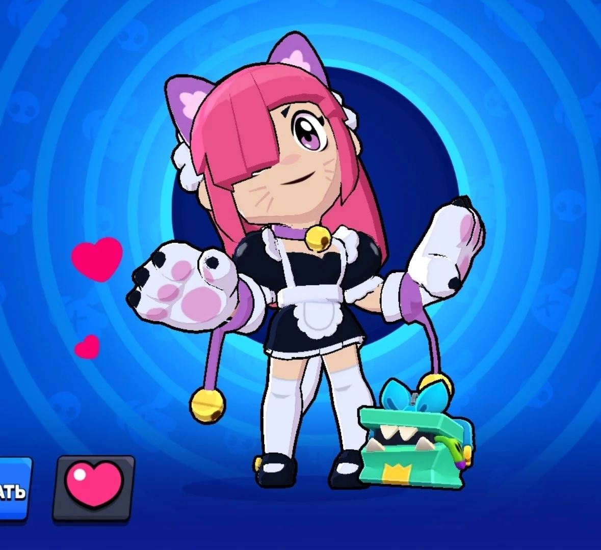
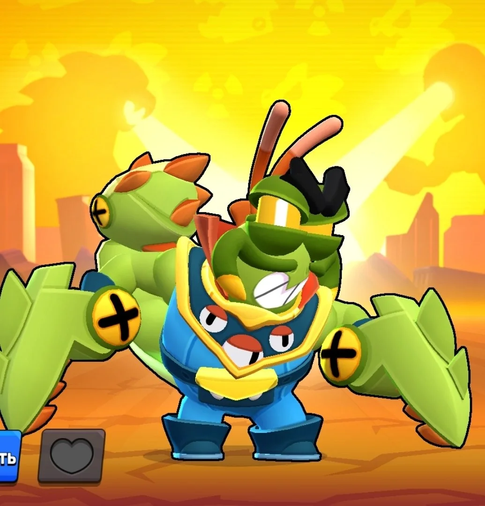
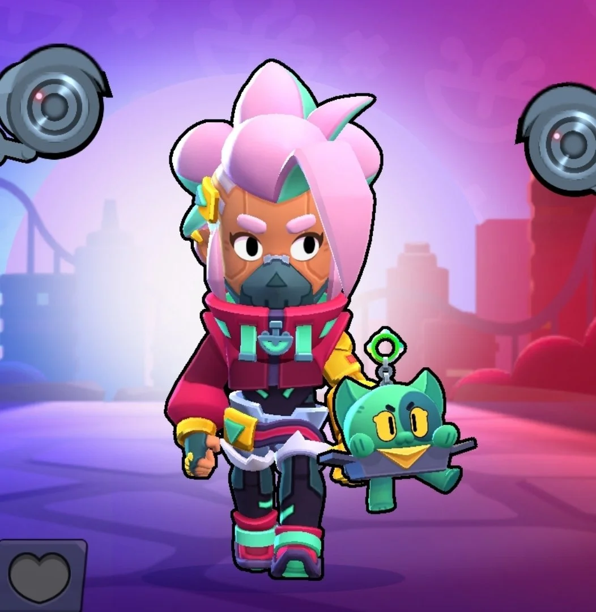
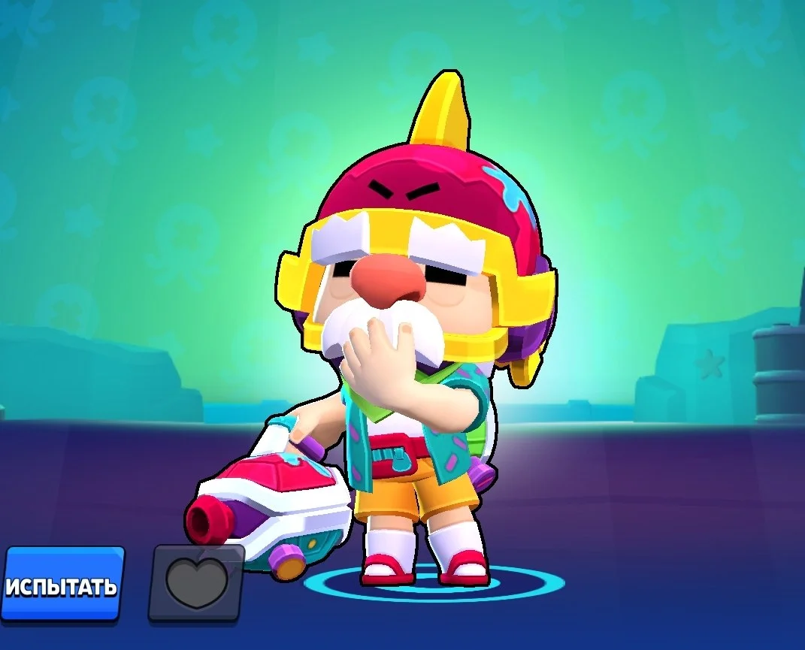

弗兰肯、艾尔·普里莫或公牛总是顶着伤害压上来？下面这四位英雄，更适合用来拦住坦克。

对付坦克，光有高伤害还不够。你要么在对方贴近之前削掉大半生命值，要么在近身后还有办法把人推开，打断这一轮进攻。

## 科莱特

科莱特的普通攻击会根据目标当前的生命值计算伤害。坦克剩余的生命值越高，科莱特前几次攻击打得越疼。弗兰肯和艾尔·普里莫还没走到面前，血量往往已经掉了一大截。

超级技能可以继续补伤害。搭配星徽之力「横冲直撞」，还能把路径上的敌人推到最远处。

排位对战中，看到对方先选出一两位高血量英雄，再拿科莱特会比较稳妥。她的射程和百分比伤害都很适合处理坦克，也是四位英雄里适用范围最广的选择。

## 克兰西

对方坦克喜欢不断向前压，克兰西就会打得很舒服。体型大、走位靠前的英雄很适合用来积攒兵牌，克兰西升级后，普通攻击发射的弹药也会越来越多。

升到第三阶段以后，克兰西的近距离爆发尤其可怕。他的超级技能会向前方连续射出 12 发弹药，坦克体型较大，很难躲开整片攻击范围。

克兰西需要时间积攒兵牌。对方愿意主动靠近，反而会帮他更快进入强势阶段。到了第三阶段，坦克再贴脸通常占不到便宜。

## 雪莉

雪莉适合草丛较多、通道狭窄的封闭地图。坦克想接近目标，通常得穿过草丛或狭窄路口。距离越近，雪莉单次攻击命中的弹丸越多，下一次超级技能也会充得更快。

她的超级技能可以击退敌人并摧毁掩体。即便艾尔·普里莫或公牛已经贴到脸上，雪莉仍有机会把对方推开，重新拉开距离。

雪莉的限制也很明显。到了开阔地图，她很难舒服地接近敌人，普通攻击的伤害也会迅速降低。选她之前，最好先看看地图有没有足够多的草丛和墙体。

## 格尔

格尔的强项是持续控制。超级技能可以把坦克吹回去，遇到通道狭窄的地图，对方每次被推开后，都得重新花时间接近目标。

艾尔·普里莫、雅琪、公牛和弗兰肯都需要亲自走到目标附近，格尔打这类英雄最舒服。足球、热区等需要争夺固定位置的模式，也很适合发挥他的击退能力。

到了非常开阔的地图，科莱特通常更合适。她的射程更远，也能利用坦克的高生命值打出更多伤害。

## 应该选谁

**科莱特**适合中远距离，也是最稳妥的反坦克选择。看到对方选出一两位高血量英雄后，可以优先考虑她。

**克兰西**更喜欢对手主动压上来。坦克会帮他快速积攒兵牌，进入第三阶段后，他的近距离爆发非常高。

**雪莉**适合草丛、墙体和狭窄路口较多的地图。只要坦克必须近身，她就有发挥空间。

**格尔**更偏向控制。队伍需要把坦克赶出足球、热区或队友身边时，他的超级技能会很有用。

面对坦克阵容，英雄强度只是一部分。地图是否开阔、对方能从哪里接近，以及队伍需要伤害还是击退，同样会影响最终选择。

