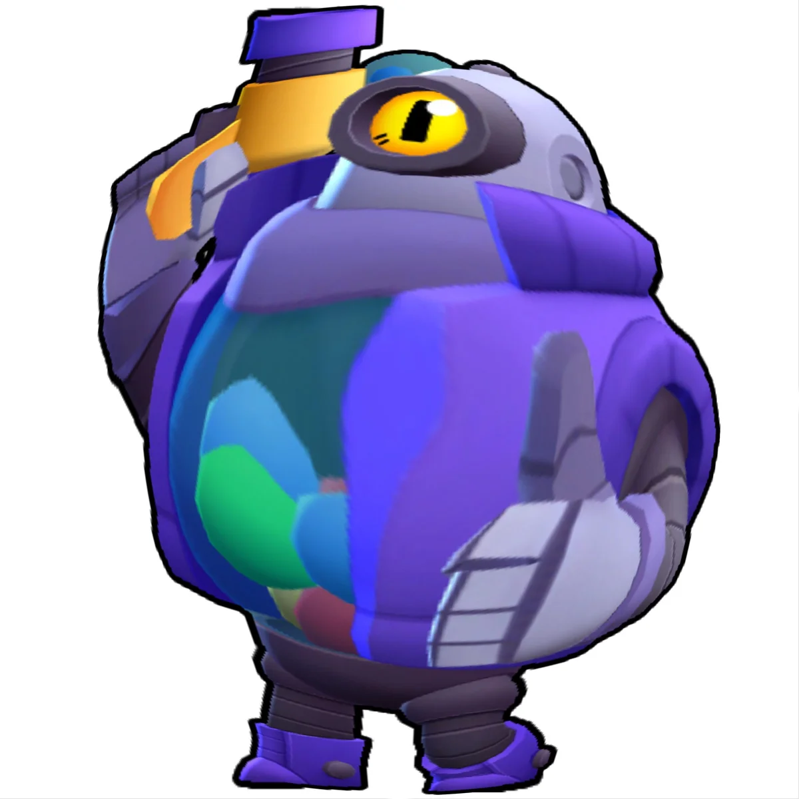
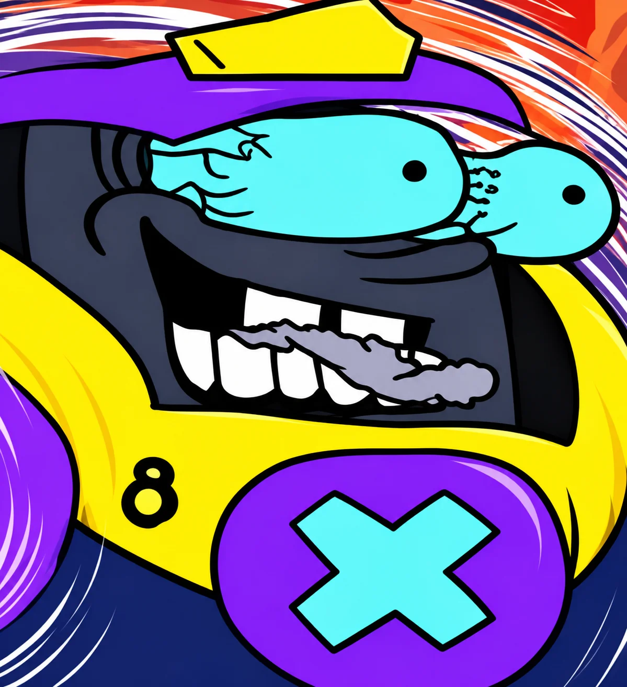
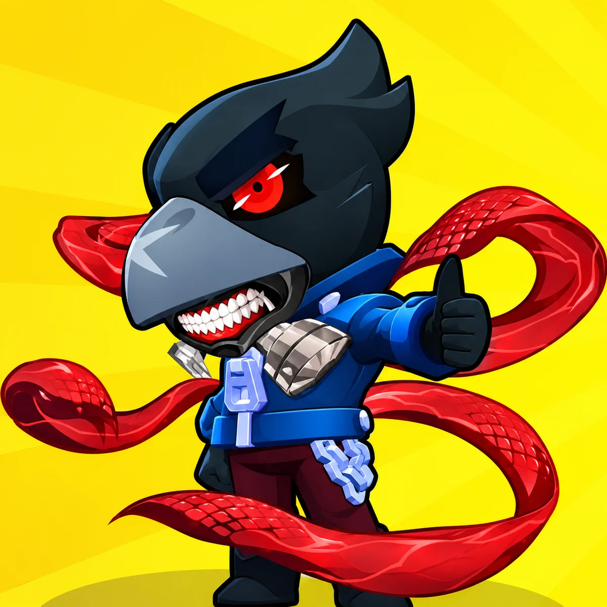
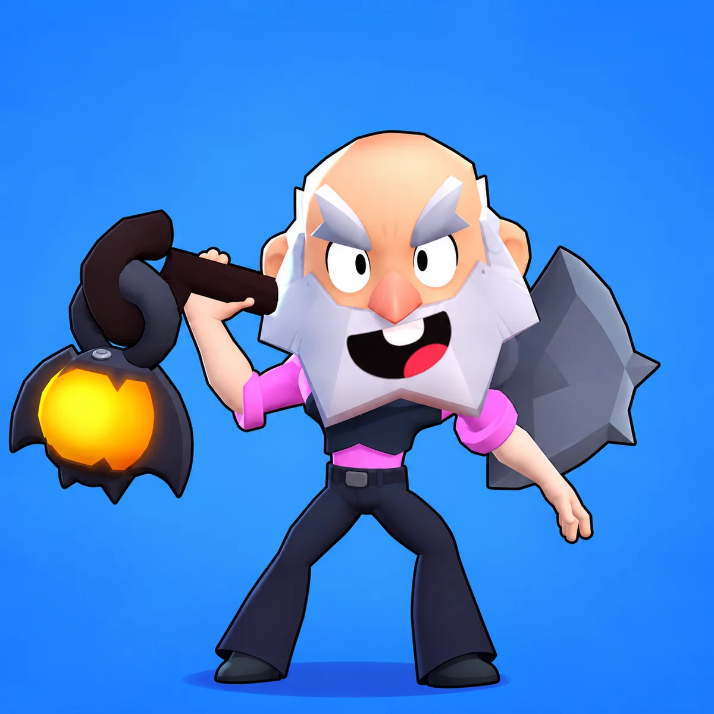
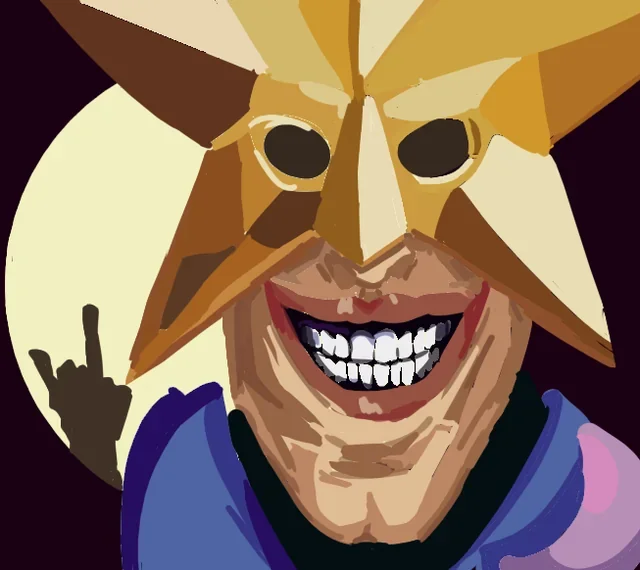

有些英雄无论当前版本强不强，只要出现在对面，就能让整场游戏变得很累。

你得一直绕开地雷，等中毒效果结束，还要提防墙后飞来的子弹。单独看，每一种机制都有应对方法。几种压力连续出现时，玩家很容易被折磨得失去耐心。

下面这六位英雄，经常因为各自的机制被玩家点名。

## 瑞科

在墙体较多的地图上，瑞科一直是最难缠的英雄之一。他的子弹碰到墙壁后可以继续弹射，躲到附近的掩体后面，很多时候依然不安全。

乱斗足球里的感受尤其明显。封闭地图通常只有几条狭窄通道，瑞科可以持续封锁入口，把子弹送到其他英雄根本打不到的位置。想推进得先躲弹射，想后退又可能被他继续压住路线。

## 博尔特

博尔特上线后，很快成了 2026 年最容易引起抱怨的英雄之一。玩家讨论最多的几个问题，都和他的速度与生存能力有关。

他可以迅速冲到对手面前，靠高速撞击制造压力。情况不对时，又能很快离开。追不上、甩不掉，再加上自身不容易被直接解决，整场对局很容易被他牵着走。

## 黑鸦

面对黑鸦，安心恢复生命值往往是一件很奢侈的事。

飞刃只要命中一次，中毒效果就会继续扣血并阻止恢复。刚等到毒伤快结束，下一发飞刃又可能碰到你，恢复时间只能重新计算。

黑鸦不一定急着完成击倒。他可以用持续中毒把对手长时间压在低血量，逼人后退，也让对方很难找到舒服的反击时机。

## 爆破麦克

爆破麦克隔着墙就能给人添麻烦，带击晕效果的随身妙具更是常年被玩家讨论。

一旦被炸药击中并陷入击晕，后续攻击通常很难躲开。这段控制会直接拿走走位和还手机会。

草丛地图里还会更麻烦。爆破麦克可以提前开启随身妙具，等有人靠近后突然出手。没看到他的位置，踩进去时往往已经来不及反应。

## 迪克

迪克甚至不需要每次都准确命中。

一轮普通攻击留下三颗地雷，地雷会在地面停留一段时间。对手即使没有受到伤害，也得绕开那片区域。地图的一部分就这样被暂时封住了。

到了热区争夺，体验会更明显。迪克可以不断把地雷扔进目标区域，站点的人忙着躲避，想稳定留在热区里会很困难。

## 西里乌斯

西里乌斯带来的麻烦，来自场上不断增加的目标。

魔影出现后，你既要留意西里乌斯的位置，也要判断几只魔影会从哪里接近。屏幕上的攻击来源变多，走位空间和注意力都会被挤压。

不少喜欢使用西里乌斯的玩家，也承认在对面遇到他时，体验完全是另一回事。自己指挥魔影很有意思，被一群魔影围着追就没那么轻松了。

## 这是对战体验盘点

这份盘点更接近玩家的对战感受，并不是当前版本的英雄强度排名。

有些英雄胜率未必夸张，却能依靠弹射、毒伤、击晕或区域封锁，迫使对手整场改变走位。你可能赢下了比赛，过程仍然会觉得很累。

对付这些英雄时，玩家不能只计算伤害，还得把地图、草丛、墙体和技能冷却一起考虑进去。

