《荒野乱斗》开发团队发布了新一期 **Time to Explain** 播客，集中回答了玩家关心的一批问题。

这次聊到的内容很多，包括排位赛重做、荣誉之路、新英雄、稀有度、俱乐部、剧情和联动活动等。下面按原节目涉及的议题，整理一下目前已经公开的信息。

## 排位赛还会继续重做

排位赛将再次调整。开发团队准备改善英雄选择和禁用环节，在选人期间提供更多与队友沟通的方式，也会让整轮比赛的计分更加直观。

今后，2 比 0 获胜的价值会高于 2 比 1。前几个段位的晋级速度也会加快，每个赛季重置时只会下降两个段位。

团队希望排位赛进一步面向竞技玩家。重做之后，参与人数可能会减少，但真正喜欢排位赛的玩家会在这个模式里投入更多时间。

新玩家的解锁门槛也可能调整为 5000 奖杯。这样可以让玩家先熟悉更多英雄，并为后面的选人环节准备一套足够完整的英雄阵容。

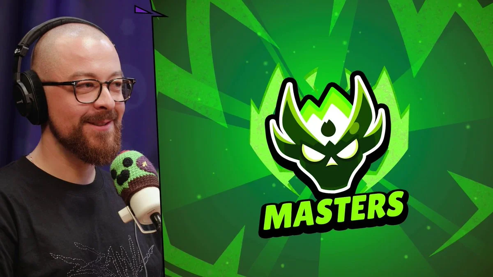

## 荣誉之路和增益挂饰

荣誉之路以后还会继续延长。开发团队想为已经走到终点的玩家增加更多奖励，不过目前还没有公布新的终点，也没有给出具体上线时间。原文认为，20 万奖杯可能会是一个比较合理的新节点，但这不是官方确认的信息。

增益挂饰（Buffies）的发布计划已经排到了 2028 年 7 月左右，因此尚未凑齐三人的英雄小队暂时不会影响整体安排。

如果某个小队届时仍然只有两位英雄，团队可能先为这两位英雄推出增益挂饰，等第三位英雄加入后再补上，也可能直接调整发布顺序。开发团队不会为了补齐旧小队而停止创造新组合，两种做法会交替进行。

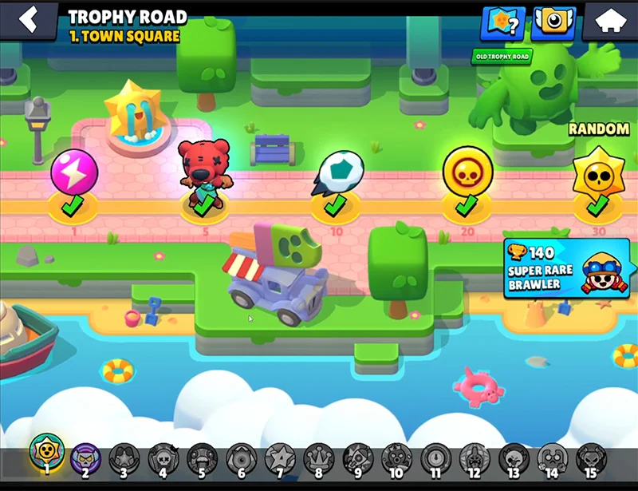

## 新英雄仍会保持每月至少一位

英雄更新速度暂时不会改变，Supercell 仍计划每个月至少推出一位新英雄。

团队也明白，英雄数量不断增加，会让刚入坑的玩家感到压力。开发者正在讨论让玩家在部分阶段只接触有限的英雄池，不过目前还没有形成具体方案。

节目里还解释了为什么新英雄上线时经常偏强。团队通常会把新英雄的强度放在平均线以上，让玩家有动力立刻尝试。如果英雄登场时太弱，部分玩家很快就会失去兴趣，即使后来加强，也未必愿意回来再玩。

开发者列出了几位英雄刚上线时的胜率。Alli 约为 78%，温蒂略高于 80%，科斯莫则更接近团队期望的水平，大约为 55% 至 60%。

团队还在考虑扩大新英雄上线前的测试范围，其中一个想法是开放公共测试周末，但目前仍停留在讨论阶段。

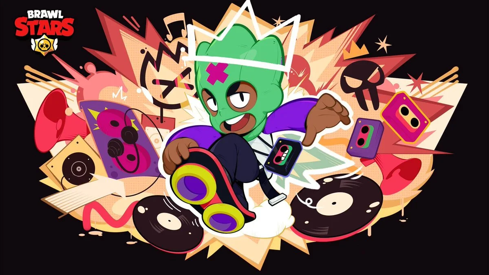

## 可能增加新的稀有度

开发团队同样不喜欢神话英雄一个接一个上线，但他们也不想大量增加稀有和超稀有英雄。这些英雄太容易被新玩家快速解锁，反而会让游戏前期一下子塞进太多内容。

目前讨论中的一个方案，是在史诗和神话之间增加新的稀有度，不过团队还没有作出决定。

可以确认的是，游戏之后会推出一位**传奇稀有度的压制型英雄**。他的名字、机制和上线时间都还没有公布。

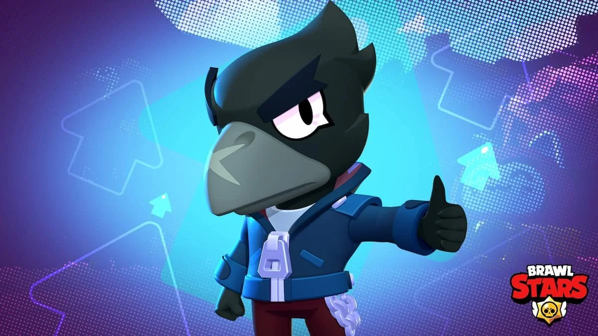

## 西里乌斯的剧情还会继续

西里乌斯的故事不会停在现在。开发团队承认，第一段剧情铺垫了很长时间，却没有给出一个完整的结局。

这段故事在英雄上线前不到两个月时临时修改，原先准备的剧情和动画也要跟着重做，最后的宣传内容更多变成了预告和谜题。

健次和 Nori 长达两个月的故事也让团队得到了一些经验。整个情节过于复杂，又被分散到许多视频和活动中，故事越往后，继续追视频的玩家就越少。

后续剧情会尽量做得简单，并更多地直接放进游戏里。团队认为，桩和科斯莫的短篇故事就是更合适的例子。

现阶段不用期待完整的剧情模式。相比之下，团队对可以反复挑战的 Boss 战、合作冒险和抵御敌人波次的生存玩法更感兴趣。

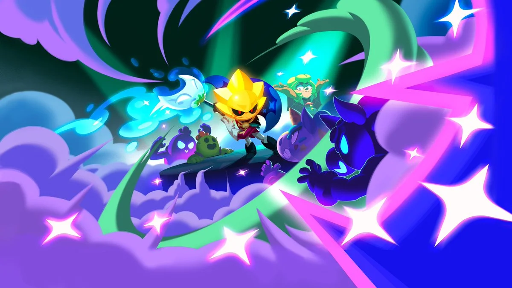

## 超级猪猪和俱乐部

开发团队认为，超级猪猪的问题不能只靠提高奖励解决。如果玩家不喜欢活动本身，更丰厚的奖励只会迫使大家去玩一个原本不想玩的模式。

俱乐部接下来会加强社交体验。目前讨论过的方向包括小型好友群组、共同目标，以及更多需要大家定期一起玩的内容。

超级猪猪是否会彻底重做，目前还没有确定。团队已经承认现有体验存在问题，正在研究不同的处理办法。

地图编辑器今年不会更新。开发者仍希望以后重新维护这项功能，只是现阶段还有优先级更高的工作。

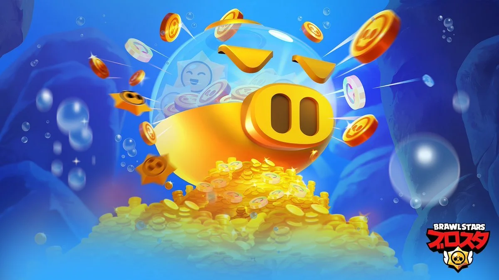

## 表情、喷漆和头像将调整

表情、喷漆和玩家头像正在准备重做，更多信息会在下一期乱斗抢先看中公布。

团队希望简化装扮内容的搜索和选择，让它们在游戏不同界面里的使用方式保持一致。槽位也可能变得更自由，方便玩家安排英雄表情、普通表情和喷漆。

收藏玩家以后可能获得新的稀有物品。Supercell 不想继续把所有装扮都做成“现在不买，以后就永远没有”，但仍有可能为高难度成就准备限量装扮。

已经承诺过不会返场的限定内容不会改变。类似皮肤如果重新推出，团队更倾向于采用异色版本。

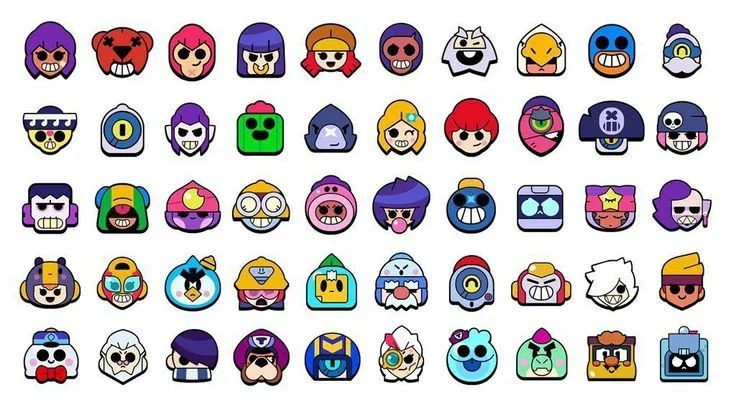

## 荒野决斗+与平衡调整

开发团队希望让荒野决斗+更频繁地开放，但奖杯经济目前仍是它无法成为常驻模式的主要原因。

强势玩家可以通过击倒对手获得额外奖杯，实力较弱的玩家则可能连续亏杯，最后直接放弃这个模式。双人或三人组队时，还可能出现反复击倒和复活队友来刷奖杯的问题。

团队也想提高平衡调整的速度。现在几乎每次改动都需要维护并暂时关闭游戏，因此开发者有时会先等待，把几个问题集中到同一次更新中处理。

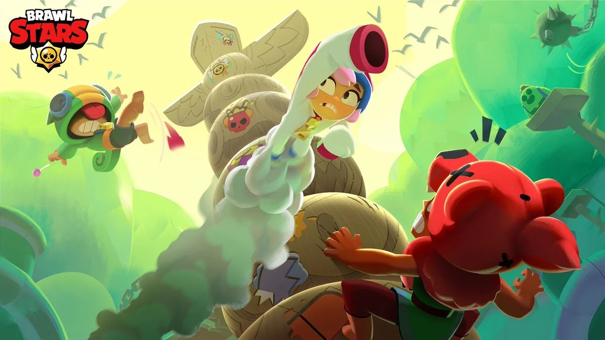

## 联动活动不会再反复套用临时强化

开发团队也对“联动活动再加一套临时强化”的固定格式感到疲倦。今年剩余时间里，不会再推出相同结构的新活动。

团队正在尝试其他联动机制，避免大型活动看起来只是换了主题，玩法却几乎一样。

健次和 Nori 的两个月故事也会影响后面的活动设计。开发者会保留其中有效的做法，但未来的活动会更简单，周期也会更短。

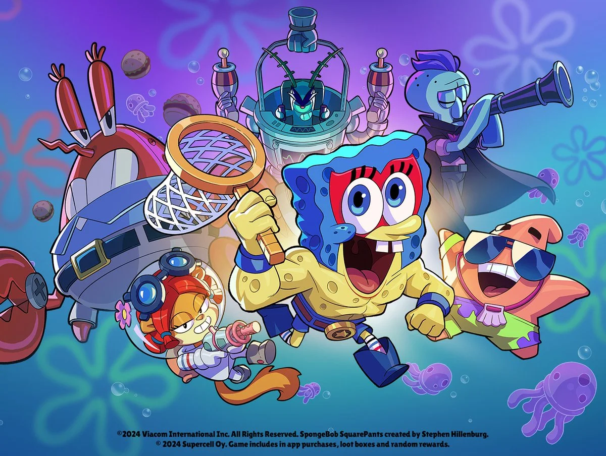

## 游戏漏洞如何处理

开发团队把许多漏洞归因于游戏规模不断扩大。超过 100 位英雄、多种模式和数以百万计的对局，会产生不少测试阶段很难复现的组合。

漏洞的处理顺序取决于严重程度、受影响的玩家数量，以及能否稳定复现。闪退和购买问题通常会优先修复，小问题则可能留到下一次维护，以免紧急修复又引起新的问题。

对于明知是漏洞却反复利用的玩家，团队今后也会采取更严格的处理方式。

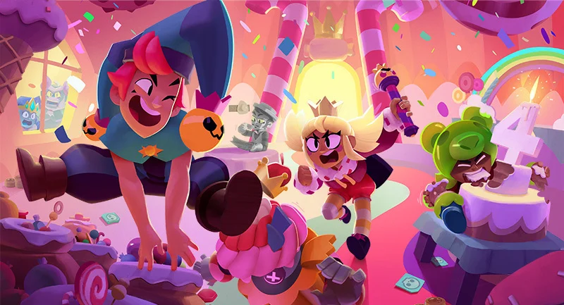

## 游戏之外的计划

Supercell 对《荒野乱斗》向其他内容形式发展很感兴趣。节目里提到了剧集、漫画、动画和电影等方向，不过现在还不能说明其中任何项目已经开始制作，开发团队自己也没有确定最终会选择哪一种形式。

更长期的设想还包括英雄起源故事、继续扩展星妙乐园、无限进度，以及更强大的地图和模式创作工具。

至于 2027 年的具体目标，目前还没有准备好公开，团队会在以后继续介绍。

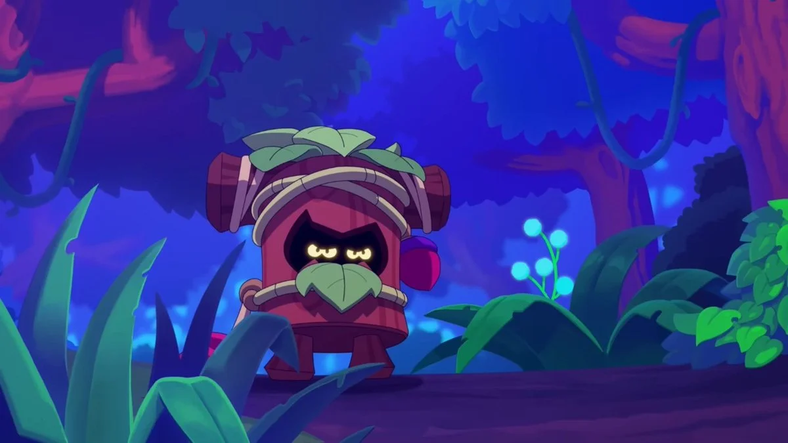
