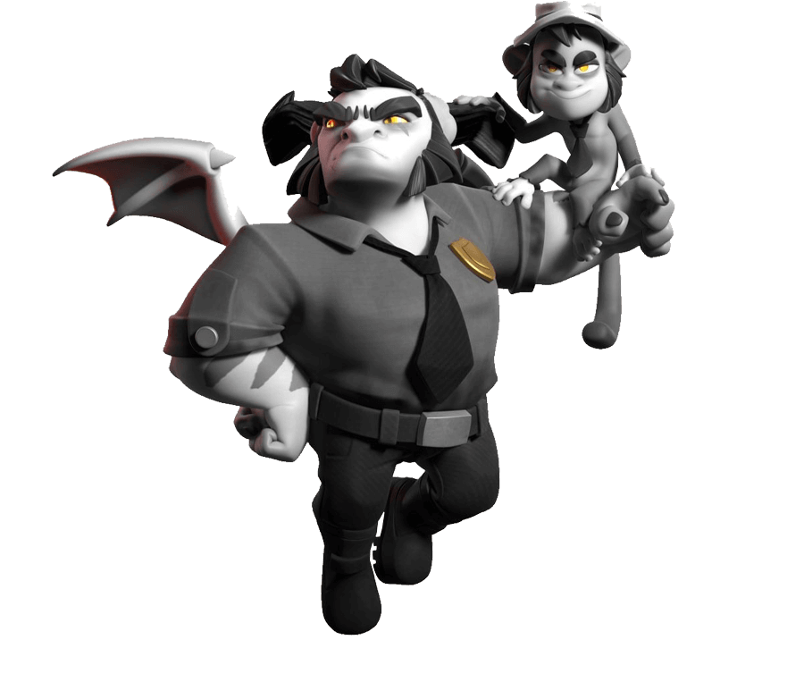
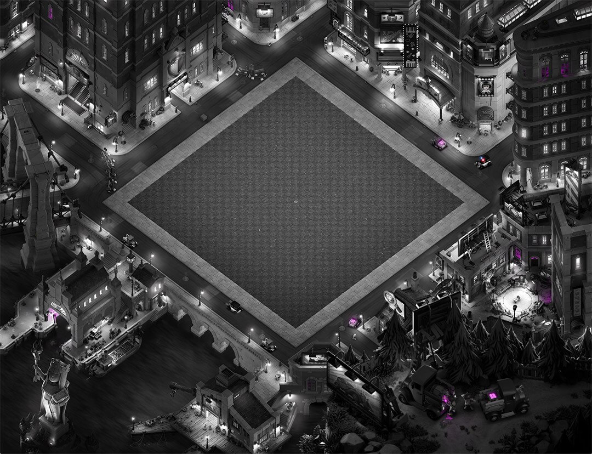
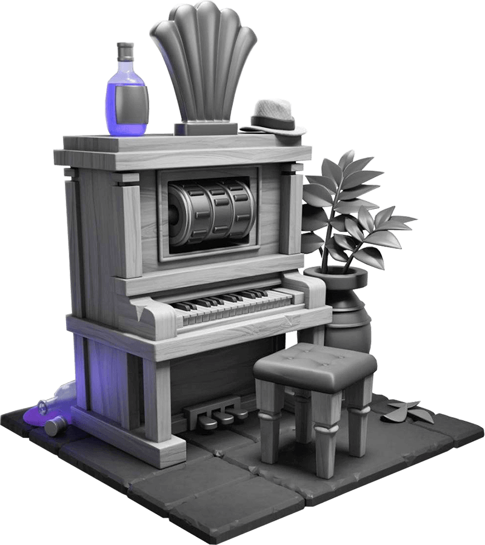

全新《部落冲突》六月赛季迎来了黑暗和混乱的年代！本赛季正式名称为 **复古年代** ，它以**黑白皮肤、独特的超精细景观**和**身临其境的好莱坞配乐** ，带来了**黑色黑手党氛围** 。

准备好沉浸在黑手党家族占领的城市氛围中，这里有强大的英雄、时尚的建筑和遍布角落的神秘感。

## 复古年代赛季皮肤

在最近 Supercell 商店发布的文件中，这个季节被称为“黑手党”，这解释了为什么这个月的氛围非常特殊，尽管官方名称是“复古年代”。您可以在下面查看每个皮肤的详细信息。

### 舞台战神

舞台战神 ，有着复古的发型、优雅的服装，并用麦克风代替长矛——这是一场真正的黑色表演。一抹**蓝色**让黑白外观变得生动活泼。

这将是 **6 月份金票的独家造型** 。

### 野蛮屠夫

**野蛮人之王**成为了一名屠夫（或者是黑手党的伪装？）。他用刀代替了剑，穿着阴险的衣服，身上的色彩变成了**紫色** 。时尚、危险、气势逼人！

**商店发售日期：** 6 月 7 日

### 蛇蝎女皇

**弓箭女王**现在成了“蛇蝎美人”！复古的发型、大胆的服装、珍珠项链和一把汤普森机枪（而不是弩）。 **红色**细节引人注目！

**商店发售日期：** 6 月 5 日

### 强大的守护者

**大守护者**身着西装，打着领结，面色冷峻。它的**绿色**细节在黑色外观中显得格外突出。一位真正时尚的黑手党成员！

**商店发售日期：** 6 月 9 日

### 警察王子

《 **仆人王子》** 饰演一名 20 世纪 50 年代的警察。但真正吸引眼球的是他的吉祥物——一只猴子！他出现在最近的预告片中，并被推测是一支可能的新部队，但这只是宣传艺术中的一个装饰细节。其突出显示颜色为**黄色** 。

**商店发售日期：** 6 月 11 日

## 复古都市场景

新的景观将您的村庄变成了 **20 世纪 40 年代/50 年代的黑色小镇** ，拥有古典建筑、路灯和巨大的自由女神像风格的弓箭女王雕像。一切都是黑白色调，几乎没有彩色元素。

**商店发售日期：** 6 月 3 日

场景将冲突带到了 40 年代/50 年代的一个黑暗城市，全是黑白色，只有少数颜色脱颖而出。大型古典建筑、具有时代建筑风格的建筑以及一座巨大的弓箭女王雕像，参考了自由女神像。

亲眼看看，你会惊叹于这里的风景：

在这里聆听让黑手党城市焕发生机的配乐：

## 主题装饰

本赛季，玩家将能够获得这个主题装饰，一架时代钢琴：

## 活动日历

复古年代赛季将带来以下内容：

- 6月1日-30日：可获取黄金令牌！解锁舞台战神英雄皮肤和更多奖励，让这个赛季变成难忘的时光。

- 6月1日-30日：如果你的村庄是经典的默认场景，那你可能会注意到这个地方变得有点……更暗了！

- 6月1日-9日：在这个掌控英雄特别赛季挑战中，探索复古年代的阴暗街道，赢取奖励！

- 6月1日-11日：部落对战联赛开始啦！再一次证明，你的部落就是最棒的部落！

- 6月3日-30日：复古都市震撼登场！将你的村庄打造成一座邪恶都市，变身为大反派们的巢穴。

- 6月5日-30日：复古年代反派……呃，“英雄”皮肤登场，准备掀起一场风波！

- 6月8日-16日：在第二个赛季挑战中尽情肆虐，并在战斗中启用新装备“暗黑皇冠”！

- 6月10日-30日：在黑暗交易奖章活动中，和一位神秘英雄进行交易，让限时兵种收债哥布林加入你的军队。他们夺取的战利品数量是普通哥布林的两倍。资源存储建筑也换上了全新外观，一直持续到这个赛季结束！

- 6月18日-30日：旋律优美的超级装饰登场，还有一些关“键”特色！

- 6月19日-26日：当然，这样的赛季怎么会少了哥布林建筑工人！给他宝石他就会帮你建造。

- 6月22日-28日：部落竞赛回归！证明你像大力士一样强大！

首领，你觉得你有能力在复古年代大放异彩吗？是时候展现你的实力了！
