今年，是 Supercell 成立 15 周年。

为了纪念成立 15 周年的重要时刻，Supercell 邀请了来自全球各地的艺术家，围绕一个简单却深刻的问题展开创作：**以你自己的风格，诠释 Supercell 的精神、游戏与发展旅程。** 

在这次特别项目中，有的艺术家重新构想了 Supercell 游戏中的角色与世界观，有的则将个人经历与情感融入画作，展现这些游戏对他们的独特意义。十五年或许不算久远，但对于无数玩家和一路相伴的创作者而言，这段历程留下了深刻而真实的印记，而这些情感在此次展览中得到了充分表达。

值得一提的是，这并非由某位“艺术总监”主导的展览。正如 Supercell 一贯所倡导的——独立性至上。这家公司一直给予团队开发者充分的自由，组建各自的团队，打造属于自己的游戏世界。

这种理念，孕育出 Supercell 至今发布的七款线上游戏：**部落冲突**、**皇室战争**、**卡通农场**、**海岛奇兵**、**荒野乱斗**、**Squad Busters** 以及最新作品 **mo.co**。

这些作品首次亮相于伦敦 SXSW 艺术节，接下来将陆续在 Supercell 分布于世界各地的办公室展出，包括总部赫尔辛基在内。欢迎欣赏这一场跨越风格与文化的视觉致敬。

### 15 周年蛋糕军团  | **SUZY Q，韩国**

我以一场盛大的庆典之战为主题创作了这款游戏，多年来深受喜爱的 Supercell 角色们齐聚一堂，共度节日派对。我专注于将各种角色组合在一起，尤其是我最喜欢的战士女主角。毕竟，派对上人越多越热闹！

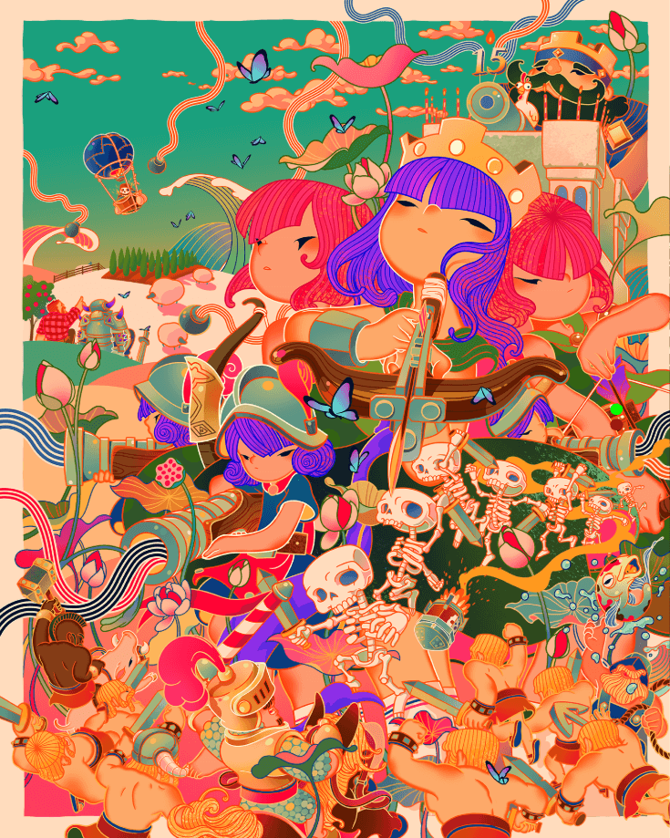

我是一位居住在韩国的插画家兼画家，主要在亚洲地区创作。最近，我积极参与亚洲各国的艺术博览会和画廊展览。我的作品以明亮多彩的风格而闻名，通常以潜意识中挥之不去的童年记忆为主题。

### 驾！|  ** DASOM 韩国**

我是一名自由插画师，我的创作以幽默的方式将各种文化符号与现代元素融合在一起。这幅作品的灵感来源于《奔跑的马》（通常被认为是世界上第一部电影），描绘了一只猫骑着一只形似马的生物，象征着 Supercell 对移动游戏行业的重大影响。

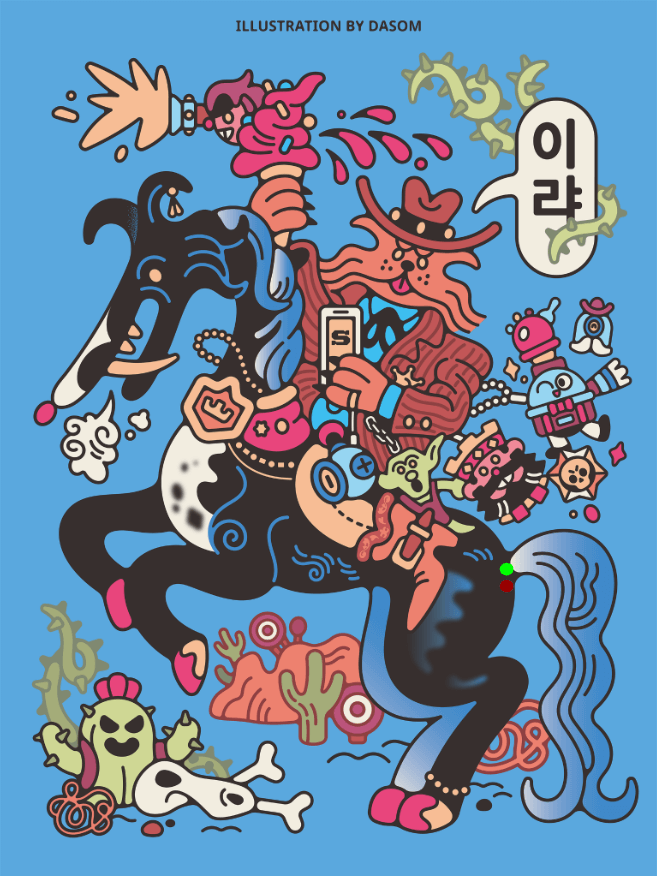

这只猫一只手拿着《荒野乱斗》中的 Penny 角色，埋在冰淇淋蛋筒里，另一只手拿着一部装饰着《荒野乱斗》和《皇室战争》钥匙扣的手机。这只马形生物的脖子上装饰着《皇室战争》的标志，在背景中，你可以看到《荒野乱斗》中的角色 Spike 和一个目标。

通过这件作品，我旨在探索受游戏和电影启发的全新视觉符号，以我独特的方式重新诠释游戏角色和元素。我的作品展现了幽默而多元的文化影响，为观众带来熟悉而又耳目一新的体验。作品上的“이랴”意为“快点！”。

我将继续通过探索各种文化主题和融入幽默的视觉效果来发展我的创作。

### 战争计划 ｜ **SALVAtorre zee yazzie，美国**

我和表兄弟在暑假快要结束的时候一起发现了《部落冲突》。我们一起熬夜，组建并探索最佳的军队阵容和防御阵地。部落战争更新发布后，我们小队的阴谋诡计更加激烈，我们也更加坚定了必胜的决心。最终，辉煌的胜利和险胜都不再重要，重要的是，无论身在何处，我们都能拥有一款充满乐趣的游戏，将我们紧紧联系在一起。

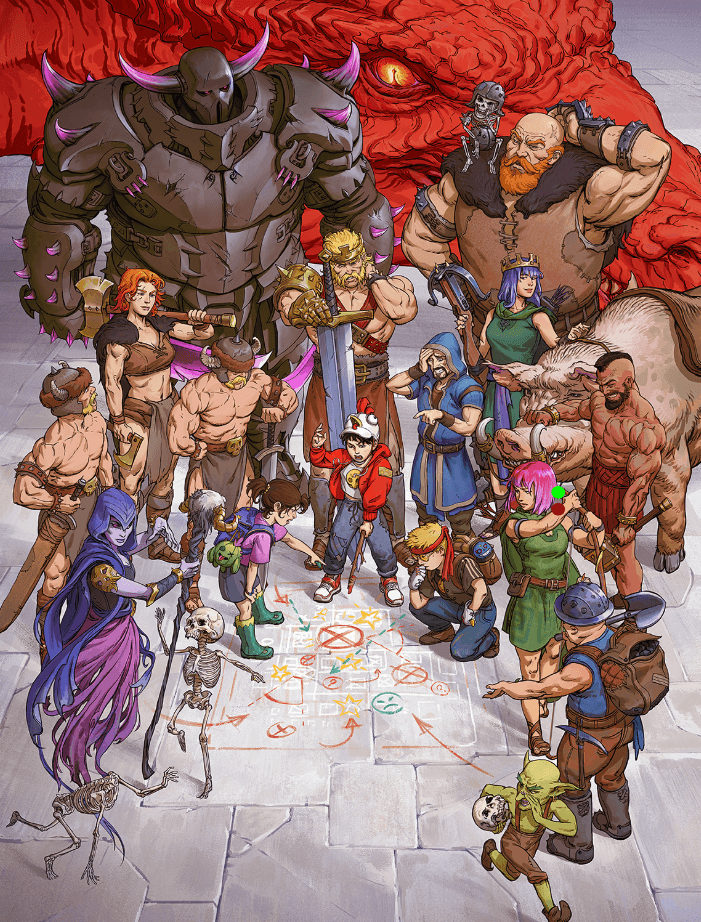

即使后来因为上学和搬家而分开，我们仍然坚持在一起。为了庆祝这个周年纪念日，也为了重温那些夏夜的氛围，我想象着我们的生活会是这样的，不过回想起来，我不敢说我们的策略真的奏效了。

我是 Salvatorre Zee Yazzie，一位常驻美国的概念艺术家和插画师，目前就职于索尼圣莫尼卡工作室。我主要从事游戏和电影创作，但我也是漫画和动画的忠实粉丝！

### 等距 ｜ **GErmán REINA CARMONA，西班牙**

我的方法是创作一种能够增强 Supercell 宇宙感觉的作品，这个世界充满活力、充满活力和幽默。

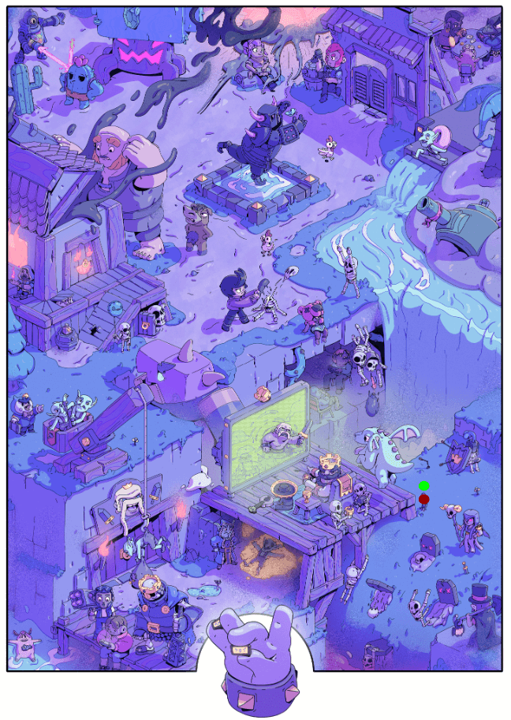

为了捕捉那种氛围，我将不同游戏中我最喜欢的（也是最具代表性的）元素组合成一个充满动作的单一、详细等距场景。

我叫 Germán。我是一位来自兰萨罗特岛的视觉艺术家和艺术总监，专注于为游戏和动画领域的新 IP 构建世界观。我为 OlliOlli World 创作了艺术和视觉风格，并曾与 Psyop、Yuga Labs、Rovio、Riot Games 和 Supercell 等公司合作。

### Supercell ｜ **BROsmind，西班牙**

我们的插画理念是捕捉 Supercell 游戏的精髓。我们创造了我们自己的视觉世界与 Supercell 游戏标志性的、细节丰富的世界之间的碰撞。

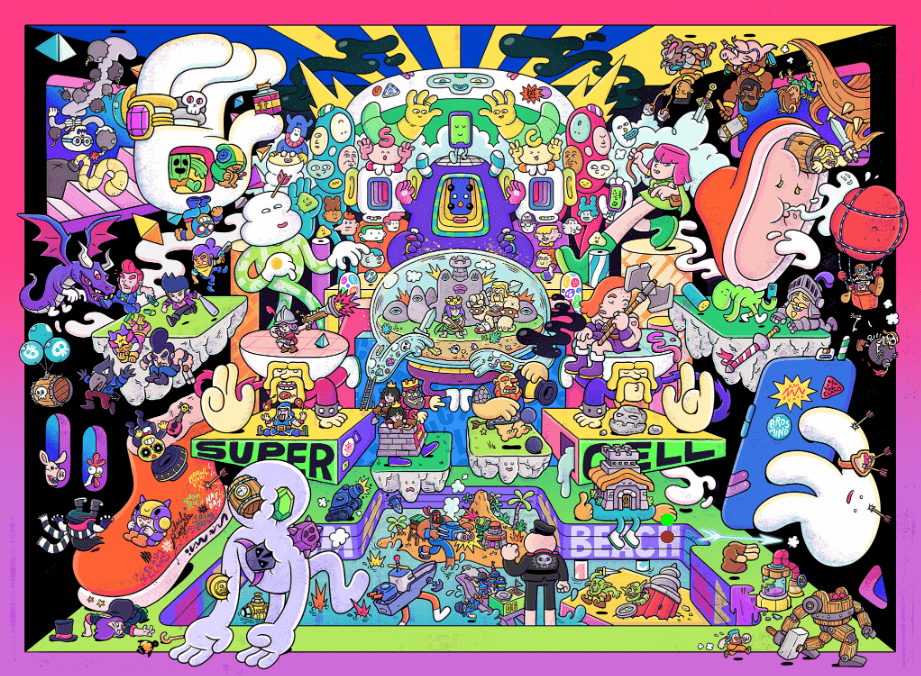

我们喜欢用大量的角色来增强我们的插图，因此将我们的风格与他们标志性的、富有魅力的演员阵容以及对他们所有游戏系列的引用融合在一起是一种乐趣。

我们是兄弟 Juan 和 Alejandro Mingarro，是多学科项目 Brosmind 的创始人。

我们是设计师、插画家、电子爱好者、视频爱好者、bocadillo de fuet 爱好者、讲师，偶尔也做音乐。我们在巴塞罗那的工作室，通过商业委托、装置艺术、个人项目和展览，探索所有这些面向。

我们的风格以幽默感、鲜艳的色彩运用、对细节的关注和强烈的 DIY 精神而闻名。

### Clashborn ｜ **Armand Serrano，美国**

“这些氏族并没有选择战争，而是战争选择了他们。”

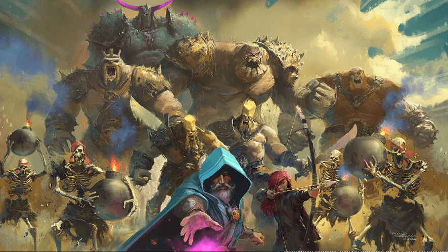

在一片被城墙分割、钢铁统治的土地上，各个氏族在烈火与灰烬中崛起——每个氏族都经历了数个世纪的血腥、背叛和痛苦的生存。野蛮人部落，凶猛而顽强。弓箭手，如影随形，却又如风暴般致命。巨人，如同行走的复仇之塔。他们不受王冠的束缚，不效忠于任何国王，他们并非为荣耀而战，而是因为战争才是他们唯一的认知。他们不仅仅是战士……他们是生于冲突的生灵。

Armand Serrano 是一位资深视觉开发艺术家、艺术总监和制作设计师，在动画电影和游戏领域拥有超过三十年的经验，尤其擅长环境设计。他目前就职于 Skydance Animation，此前曾在华特迪士尼动画工作室、漫威影业、索尼影视动画和圣经计划任职。他参与制作的电影作品包括《花木兰》、《星际宝贝》、《超能陆战队》、《疯狂动物城》、《寻龙传说》、《漫威的假设》以及 Skydance 的《WondLa》。Armand 还曾与 Netflix Animation、Premise Studio、暴雪娱乐、Riot Games、Niantic 和 Blur Studio 等客户合作。

### 友谊之花 ｜ **Katri Valkamo 芬兰 **

美好的事物可以通过友谊、创造力和奉献精神得以孕育。携手合作，我们不仅能成就更伟大的事业，还能增进彼此联系，为社区带来持久的改变。

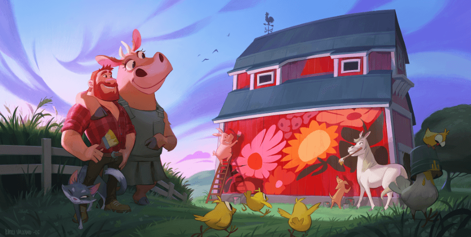

我是一名自由角色设计师兼角色艺术总监，从事动画和游戏行业。过去十年里，我参与了众多项目的角色设计，从构思到制作，我最近发布的项目是 Netflix 的《狼王》。  
我喜欢深入故事并从内到外设计角色。

### 女巫的巢穴 ｜ **Julia Metzger，德国**

我在为这幅画挑选女巫的过程中度过了一段美好的时光——尤其是我自己有时也喜欢打扮成女巫，而且模仿她的动作来规划场景也很有趣。她用上了我最喜欢的一些颜色，还有骷髅，真是锦上添花。我还利用这个机会把超级女巫融入了背景——毕竟，谁会不喜欢一幅很酷的超级女巫壁画呢？

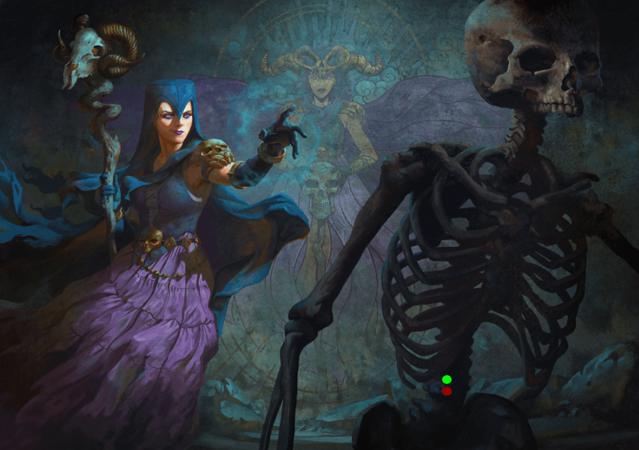

另外，大家好！我是 Julia——一位自由职业的 2D 艺术家，对各种精彩的艺术作品充满热情。我一直致力于将这些世界及其居民的多彩面貌展现得栩栩如生。我热爱游戏的广阔世界——无论是数字游戏、卡牌游戏还是桌游。你们中的一些人可能在《万智牌》、《Humblewood》或《龙与地下城》中见过我的作品。

### 美好的旧时光 |  **Misha Oplev，美国**

说实话，我仿佛回到了年轻时住在拖车公园的时光，那时我刚搬到另一个国家，口袋里只有 200 美元。玩游戏、画画，梦想着成为某个人。对我来说，《Clash》的世界特别好玩。那时候我朋友不多（因为语言障碍）。

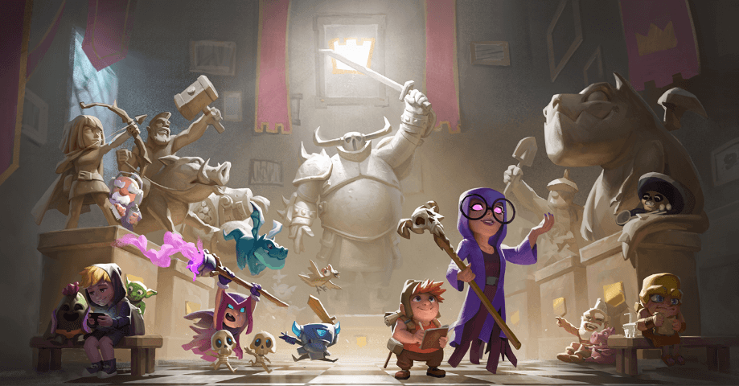

为了这幅画，我画了我最喜欢的卡片和人物，整个过程都咯咯地笑个不停。这幅画就是关于那些时光的。永远铭刻着那些有趣的回忆。我的私人博物馆 :3

我在动画/游戏行业工作了近十年。主要担任视觉开发艺术家和调色艺术家。我也是一名教师。我最喜欢的格言是：画故事，触动心灵，竭尽全力。

我参与制作过许多 SUPERCELL 的动画。其中我最喜欢的当然是《Lost and Crowned》。

大多数人因为我的维京项目“Lumber Saga”而认识我。

### 地铁日 | **Stephanie Hans，法国**

最近我非常想尝试更多以诺曼·洛克威尔风格为灵感的现实生活场景，我真的很想营造一种苦乐参半的感觉，就像吉卜力工作室《千与千寻》里的火车场景一样。同时，我也想沿用游戏的原始设计，即使我的风格与原作截然不同，以此表达对原作者的尊重。我很早就想到了这个概念，因为它让我能够运用最近一直在思考的所有问题：逃避现实、构图、肢体语言。当然，这对我来说真的是一个尝试新事物的绝佳机会。

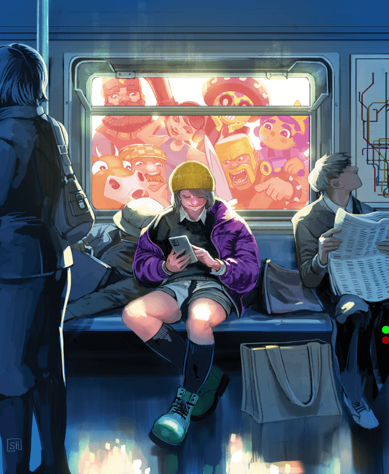

我叫斯蒂芬妮·汉斯，是一名漫画艺术家。我最出名的作品是为漫威漫画创作封面。我在 Image Comics 也有自己的漫画作品，分别是《Die》和《We Called Them Giants》，这两本书是我和 Kieron Gillen 共同创作的。我从事插画工作已经 20 多年了，至今仍然热爱插画。

### 复古超级细胞 ｜ **Andrea 弗朗西斯科**

由于这次活动项目赋予了我充分的创作自由，我决定创作一些完全受我艺术创作中最重要的影响所启发的作品。作为黄金时代（90 年代）卡普空的粉丝，我想从不同的 Supercell 品牌中选择一些角色，拼贴出一张集体海报，清晰地唤起那个时代的电子游戏宣传海报，尤其是卡普空的《口袋斗士》系列。

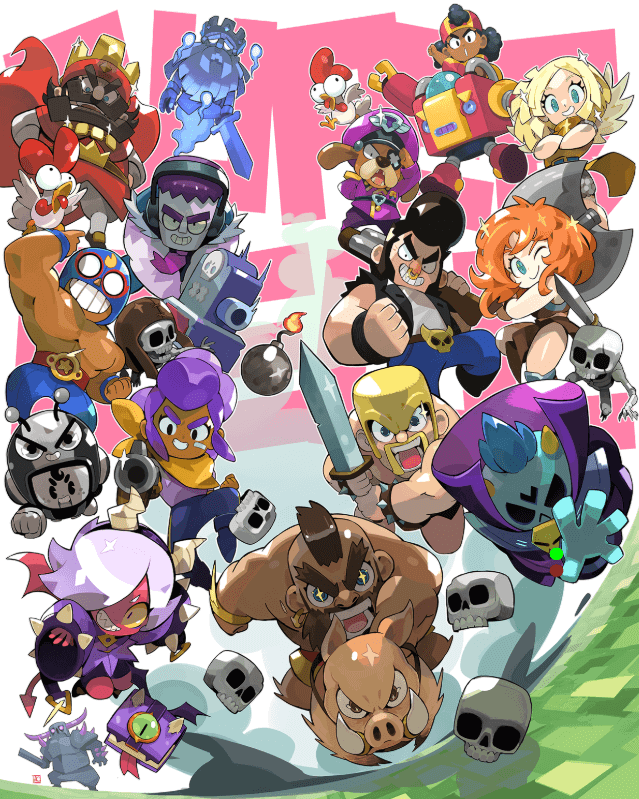

我先分别创作了所有角色，然后再把它们组合在一起。我觉得如果能有一堆角色，既可以用作集体海报，也可以根据需要用作单人海报，那就太好了！换句话说，插画可以完全拆开，每个角色都可以单独使用。我很高兴能遵循这样的创作流程，因为我平时很少有机会这样做！

我是一名专业的概念艺术家和插画师，成长于 90 年代，那个年代最重要的电子游戏和动漫是塑造我个人艺术风格的重要参考。近年来，我有幸与 Supercell 合作，参与了他们一些精彩的项目。此外，我也在桌面游戏行业工作多年，参与过 Cool Mini Or Not（现在还在！），还担任过 Udon/Capcom 项目的封面艺术家。

### 超级细胞的调色板 ｜ **Mike Azevedo，巴西**

我是一名出生于巴西奥萨斯库的艺术家，周围的环境对我的作品影响很大，身边有这么多独特且真正令人振奋的人，决定了我与绘画的关系。

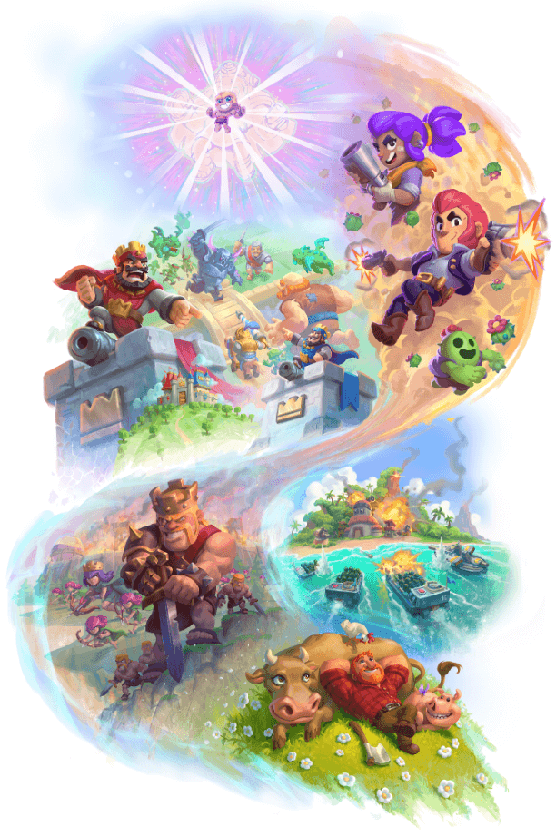

色彩是我在艺术中最喜欢的主题之一，平衡，从一种颜色到另一种颜色的过渡，关于它的一切都吸引着我的好奇心，所以我希望拥有尽可能多的颜色，就像艺术家的木制调色板一样，看起来不会不平衡，至少对我的艺术品味来说是这样。

白色背景下的愿景展现了 Supercell 的每一款游戏，以及它们如何相互衔接。色彩和纹理的过渡连接着各个游戏，致敬着参与所有这些项目的人们。时间线并非直线简单，而是精心设计，充满了值得关注的点，最终展现了这一时刻。

### 野蛮人肖像 | **James Ellis，新西兰**

我从 2014 年起就在 Supercell 担任美术师。《部落冲突》是我参与制作的第一款游戏，从那时起，野蛮人就成了我生活的一部分。我画过无数次这个角色，对我来说，他就是标志性的人物。

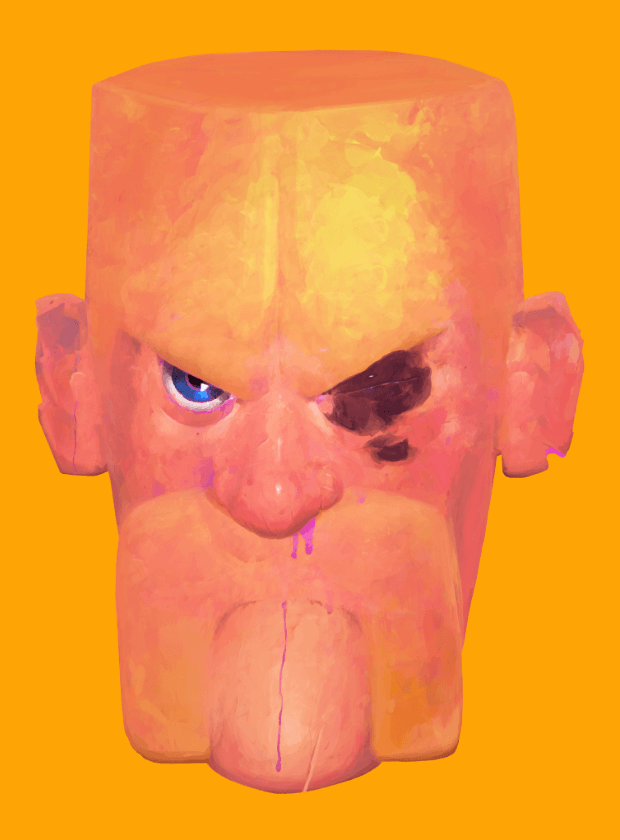

我决定简单地画一幅野蛮人的肖像，这是我以前从未做过的事情。我不想画游戏美术，甚至概念图。我的目标是把这个角色表现得像真实存在一样。

画肖像的过程让你与人物久久凝视，欣赏其本质。野蛮人并不光鲜亮丽，也不是英雄。他粗犷、执着、固执。

或许我只是在揣测。总之，跟他共事多年，我就是这么看他的。

### 让我们庆祝 | **Ilustrata, 巴西**

为了庆祝 Supercell 的这一里程碑，我们想创作一张关于这一成就的海报。我们设想了 Supercell 角色庆祝周年纪念日的欢乐场景。为了从视觉上构思，我们查阅了生日派对照片，尤其是童年时期的照片，以捕捉我们想要营造的氛围和庆祝气氛。

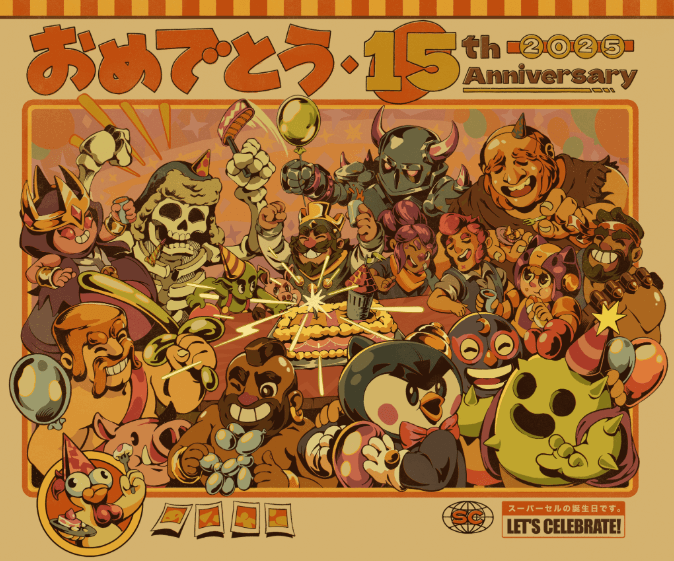

我们是一家巴西插画工作室，由三位主要艺术家组成：Bruno Silva、David Faraum 和 Victor Kahn。我们热爱将复古美学与日式及流行文化元素融入作品中。我们的作品以标题和文字等图形元素的运用、信息量丰富、富有说明性的构图以及纹理的运用而闻名。

###  奥萨斯科的涂鸦 ｜ **Doug Lira , 巴西**

我创作这幅插画的初衷是捕捉乐趣的精髓，以及粉丝们对 Supercell 众多魅力角色的喜爱。为了庆祝公司成立 15 周年，他们齐聚一堂，共同绘制一面墙，但这次的场景更具巴西风情！

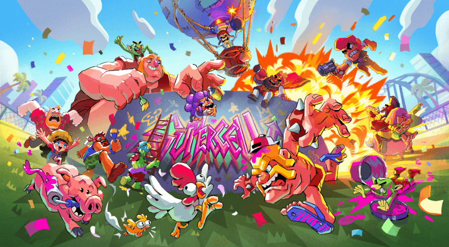

我叫 Doug Lira，是来自巴西奥萨斯库市的插画家。我从 2009 年开始从事插画工作，多年来，我什么都做过。自 2011 年以来，我一直从事广告插画工作。2022 年，我和未婚妻创办了一所名为 Arte Revide 的在线学校，这所学校专注于插画市场，旨在帮助有需要的人，并让巴西人更容易接触到艺术。现在，我的时间主要分配在教学和自由职业上。我还共同主持了一个已经持续了十年的幽默和流行文化播客。

### 疯狂茶会 ｜  **Dave Mottram，美国**

这场疯狂茶会是我为 Supercell 15 周年创作的形象。我构思了角色们在爱丽丝梦游仙境主题茶会上的场景。他们的游戏角色种类繁多，所以我想加入一些我最喜欢的角色（尤其是那只鸡）。

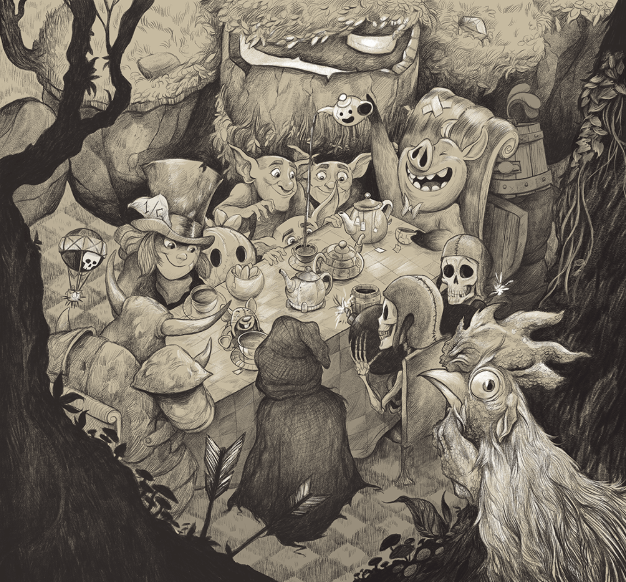

我画的大多是动物和童话故事。我喜欢对不同的寓言故事加入自己的诠释。我画过几本童书和几本章节书。对我来说，思考角色的背景故事和画角色一样有趣。

### 耀眼明星 | **Ttoja, S. , 韩国**

我是来自韩国的插画师 TTOJA。能够参与 Supercell 的 15 周年纪念项目，我感到无比荣幸，说实话，也有点紧张和兴奋。我想在创作这幅作品的同时，为特别的明星 Melodie 构思一个写实的拍摄概念。我运用我标志性的渲染技巧，强调逼真的纹理，试图将耀眼的明星 Melodie 和 Supercell 的标志融合在一起。不知道创作这幅作品时的兴奋和感动是否也体现在了这幅作品中。Supercell，你真是一颗闪耀的“明星”！祝贺你 15 周年！

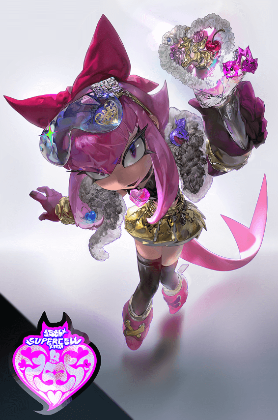

### 长达 15 年的时刻 | **Andre Forni,  芬兰**

与他人分享的最有意义的时刻是那些舒适的沉默，此时无需言语，任何言语也不足以表达。

Supercell 15 周年就是这样的时刻之一。这是一个停下来反思过去、现在和未来的时刻。

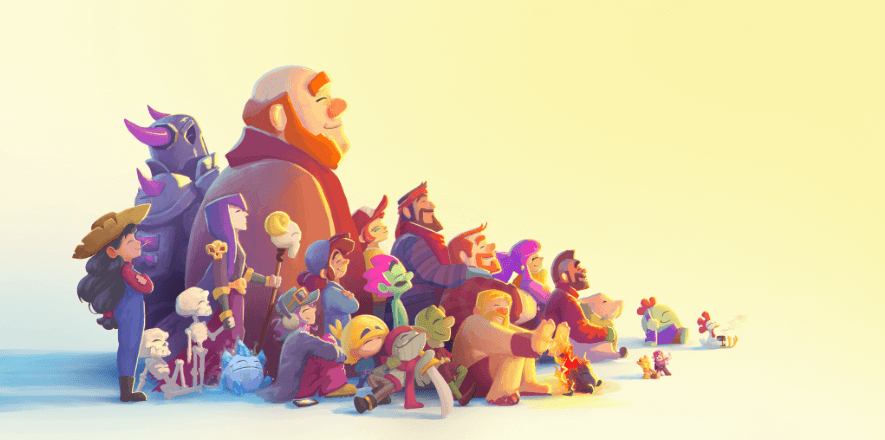

这些年，充满了如此生动深刻的故事，无论是文字还是图像都无法真正捕捉它们。只有安静、共享、舒适的沉默才能捕捉到。

我是一位艺术家，从插画和动画到执导迪士尼和尼克儿童频道的原创剧集，最终在 Supercell 打造游戏世界。我创作的动力源于构建沉浸式故事的刺激，我喜欢游戏不仅引导玩家探索世界，更鼓励他们以自己的方式塑造世界。
