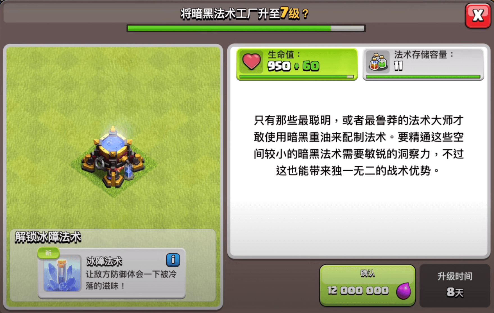
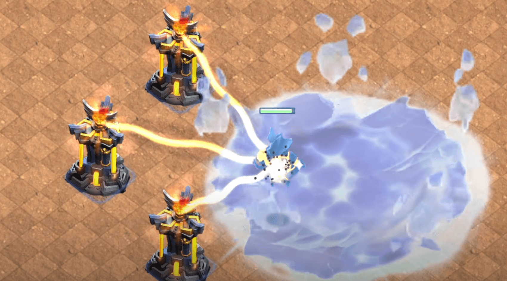
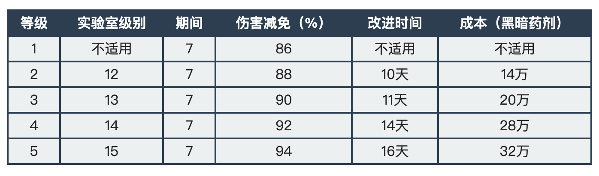
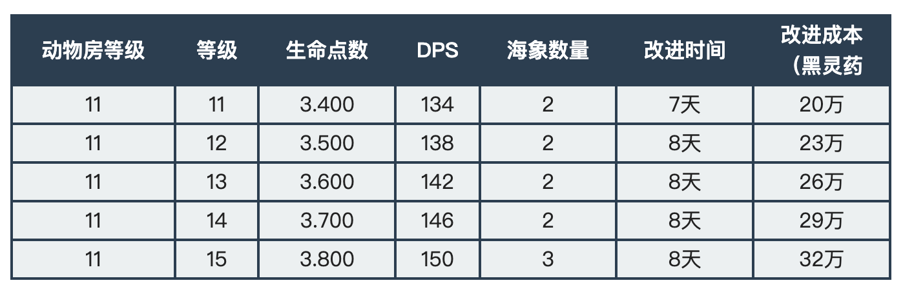
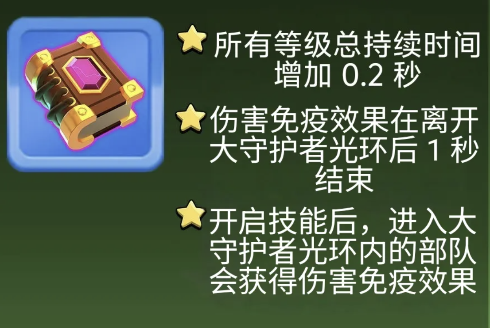
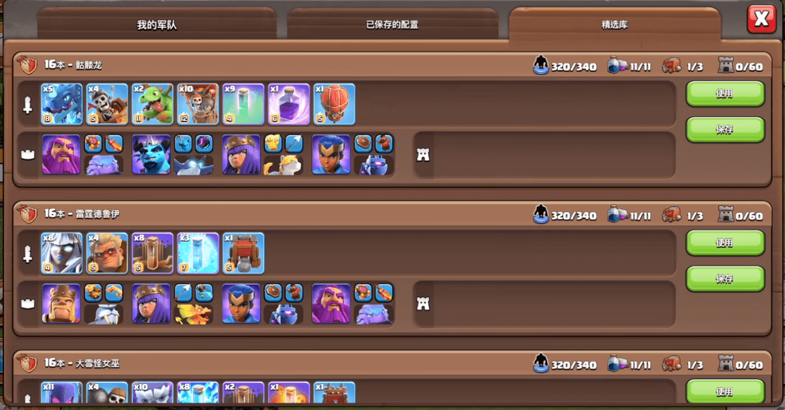

部落冲突 6 月首个更新爆料来了！

## 新法术：冰障法术

冰障法术是一项极具战略意义的奇特技能：施放后，它会冻结你的部队 ，阻止他们移动或攻击……但作为回报， 他们在效果生效期间受到的伤害会大幅减少 。

非常适合在关键时刻阻拦英雄或部队，在其他军队跟随时保护他们。

* 黑暗法术工厂所需等级：7级（14级大本营可以解锁）
* 所需空间：1
* 效果类型：区域溅射
* 目标：地面和空中目标
* 相关数据如下：

## 新的部队、宠物和飞艇等级

谁不喜欢几个新的关卡来让基地忙碌起来呢？

### 气球新等级：12级

* 所需大本营等级：17级
* 升级时间：15天12小时
* 升级费用：22,500,000 圣水
* 生命值：1240
* 每秒伤害值：304
* 被摧毁时造成伤害：398

### 熔岩猎犬新等级：7级

* 所需大本营等级：16级
* 升级时间：8天
* 升级费用：200,000 暗黑重油
* 生命值：8500
* 每秒伤害值：22
* 被摧毁时造成伤害：400
* 生成（迷你熔岩犬）数量：20

### 德鲁伊新等级：5级

* 所需大本营等级：17级
* 升级时间：16天
* 升级费用：320,000 暗黑重油
* 生命值：1700
* 每秒伤害值：304
* 治疗量：85
* 第二形态（巨熊）
  * 生命值：2300
  * 每秒伤害值：190

## 攻城机器新等级

### 战斗飞艇新等级：5级

* 所需大本营等级：15级
* 升级时间：9天
* 升级费用：10,000,000 圣水
* 生命值：5000
* 每秒伤害值：390
* 被摧毁时造成伤害：398

## 宠物新等级

### 冰牙新等级：11-15

* 所需战宠小屋等级：11级
* 相关数据如下：

## 其他更新

* 最后 75 个 18 级城墙开放升级（18 级城墙全部可以升级）

## 平衡性调整
大守护者的永恒魔法书现在有了新的运作方式！！！

- 所有等级持续时间增加0.2秒。
- 伤害免疫效果现在在离开大守护者光环后持续 1 秒。
- 激活后，进入大守护者光环的单位现在也将获得伤害免疫效果。

## 其他变化

* 增加新语言：波兰语（国际服）
* 增加 2V2 和 3V3 友谊赛模式
* 修改了大守护者大火球和飓风陷阱的视觉效果
* 英雄信息栏中不再显示恢复时间（国际服已经取消英雄恢复时间）
* 如果玩家军队中包含对应单位，法术工厂、攻城作坊等建筑将会播放动画。

## 游戏优化

* 可以通过点击英雄左下角衣架图标，在训练屏幕中修改英雄皮肤
* 可以像在英雄展示大厅一样，从训练界面上旋转英雄
* 可以通过按住并拖动英雄，重新排列训练阵容
* 可以在训练界面中重新排列部队或法术，确保进攻时以设定顺序出现
* 更新了警报和警告，提供问题的详细信息
* 商店中显示场景优惠，若你已拥有该场景，则不再提供优惠
* 增加资源车存储容量，以适应更多资源的回收

## 新功能：精选库

* 部队训练界面出现第三个选项卡——精选库
* 包含玩家可使用或保存到自己的军队配置
* 入门部队由常规部队（不含超级部队）、法术和普通装备组成，方便尝试新策略
* 特殊部队和创造者部队稍微复杂，可能包含游戏中的任何内容
* 特殊部队毁灭性强，但使用时间有限
* 玩家仅可看到当前大本营等级的精选库
* 每个大本营将提供多个特殊部队和创造者部队版本
* 精选库在 4 级大本营解锁，10 级大本营之前仅有入门部队
* 10 级起提供特殊部队和创造者部队
