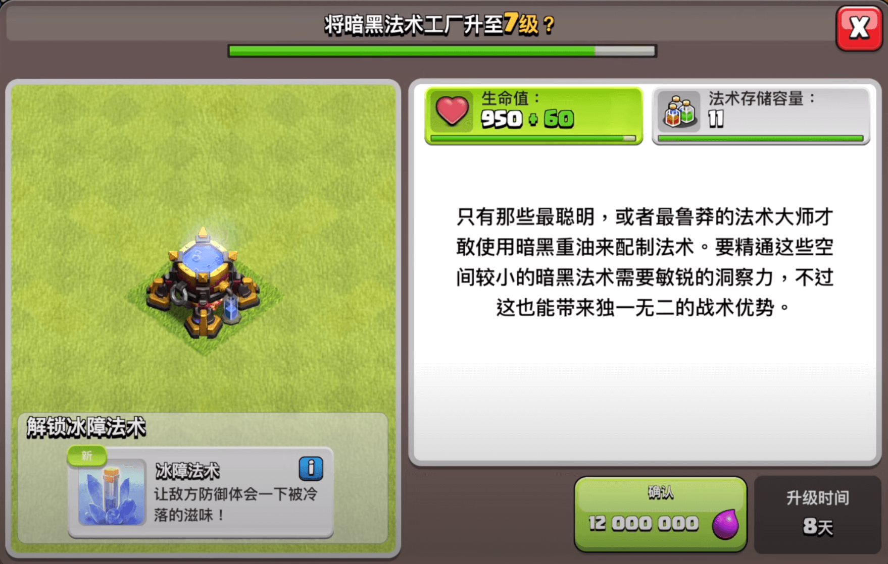

这波更新的关键词：精益求精。

部落冲突史上首次，“我来定制防御”模式上线！首领不再只是看着建筑工人刷刷锤子，现在你能亲手决定，如何升级“精工防御”。每个阶段你最多能上场3座，能选模块、能切换样式，简直像是给防御塔装了换装系统。

详细说明如下：

- 精制台：大本营17级解锁，可建最多3座精工防御  
- 同时只能启用一座，但可以随时切换  
- 每个“精制阶段”持续3个月，之后刷新新的精工防御  
- 每座精工防御可从3种模块中自由选择升级路径  
- 阶段更新时将推出新防御，让你不断试新尝鲜  

首发登场的三位“精工兄弟”如下：

- **钩索塔**：一钩一拉一晕厥，把敌人直接扯到怀里。不过攻城机器？拉不动。  
- **旋转喷火器**：360度火焰旋风，自动转圈攻击周围单位，别靠太近。  
- **碎岩迫击炮**：大炮飞天落地爆，谁敢接正面，就请吃一记巨型碎石。  

## 新法术上线：冰障法术！

你问有没有那种“我不动但也不挨打”的法术？来了——冰障法术。

给你的部队套上冷冻外壳，几乎免疫伤害，但——也不会动，不会打。简直是最忠实的肉盾部队，你推我我不走，你打我我不痛！

- 大本营14级解锁  
- 需7级暗黑法术工厂  
- 初始可升级2次，后续每升一级大本营可再升1次  
- 升级能提升减伤百分比，坦度越升越顶  

## 精选库上线，军队配置再也不迷路

“配兵我真的不会”，不用怕，这次官方来帮你抄作业。精选库系统正式上线，军队训练新增第三标签页，推荐阵容一键上手，谁用谁知道。

精选库内容如下：

- **新手军队**：按大本营等级量身定做，构成简单，部队稳定  
- **推荐/创作者精选军队**：根据当前活动和内容创作者推荐，随时变换阵容，适配性更强  
- 大本营4级开启精选库  
- 推荐军队配置需大本营10级以上才能看到  

## 全新等级开放，一大波提升来袭！

这波不只是新玩法，还有“全面升级”计划。以下单位获得新等级开放：

| 单位           | 新等级   | 所需大本营等级 |
|----------------|----------|----------------|
| 气球兵         | 12       | 17             |
| 火箭气球兵     | 12       | 17             |
| 熔岩猎犬       | 7        | 16             |
| 德鲁伊         | 5        | 17             |
| 攻城飞艇       | 5        | 15             |
| 冰牙（宠物）   | 11 - 15  | 17             |

此外，大本营剩余的所有城墙也终于可以升级到18级了，不用看着那几段老墙心烦了。

### **平衡性调整**

-   寒冰猎犬吞了一大堆冰雪，现在它们的冰冻效果持续时间变为所有等级保持一致了。1级的冰冻效果从3.5秒延长至3.75秒。

-   大守护者的永恒书卷有了新的章节！永恒书卷调整包括：

-   所有等级的持续时间均延长0.2秒。

-   免疫伤害的效果会在离开大守护者光环后，持续1秒再消失。

-   在效果激活后进入大守护者光环范围内的单位，也能获得此效果。

-   游戏中的初级兵种也希望向首领证明自己的价值！为了使游戏前期的战斗节奏更快、更有趣，我们调整了较低大本营等级的部分建筑和兵种。

### 平衡性调整详情

<table><tbody><tr><td>建筑/兵种</td><td>调整前生命值</td><td>调整后生命值</td><td>调整前每秒伤害值</td><td>调整后每秒伤害值</td></tr><tr><td>1级大本营</td><td>450</td><td>400</td><td>N/A</td><td>N/A</td></tr><tr><td>2级大本营</td><td>1600</td><td>800</td><td>N/A</td><td>N/A</td></tr><tr><td>3级大本营</td><td>1850</td><td>1600</td><td>N/A</td><td>N/A</td></tr><tr><td>4级大本营</td><td>2100</td><td>2000</td><td>N/A</td><td>N/A</td></tr><tr><td>1级兵营</td><td>250</td><td>100</td><td>N/A</td><td>N/A</td></tr><tr><td>2级兵营</td><td>270</td><td>150</td><td>N/A</td><td>N/A</td></tr><tr><td>3级兵营</td><td>290</td><td>200</td><td>N/A</td><td>N/A</td></tr><tr><td>4级兵营</td><td>310</td><td>250</td><td>N/A</td><td>N/A</td></tr><tr><td>5级兵营</td><td>330</td><td>300</td><td>N/A</td><td>N/A</td></tr><tr><td>6级兵营</td><td>350</td><td>330</td><td>N/A</td><td>N/A</td></tr><tr><td>1级金矿</td><td>400</td><td>75</td><td>N/A</td><td>N/A</td></tr><tr><td>2级金矿</td><td>440</td><td>150</td><td>N/A</td><td>N/A</td></tr><tr><td>3级金矿</td><td>480</td><td>300</td><td>N/A</td><td>N/A</td></tr><tr><td>4级金矿</td><td>520</td><td>400</td><td>N/A</td><td>N/A</td></tr><tr><td>5级金矿</td><td>560</td><td>500</td><td>N/A</td><td>N/A</td></tr><tr><td>6级金矿</td><td>600</td><td>550</td><td>N/A</td><td>N/A</td></tr><tr><td>7级金矿</td><td>640</td><td>600</td><td>N/A</td><td>N/A</td></tr><tr><td>8级金矿</td><td>680</td><td>660</td><td>N/A</td><td>N/A</td></tr><tr><td>1级圣水收集器</td><td>400</td><td>75</td><td>N/A</td><td>N/A</td></tr><tr><td>2级圣水收集器</td><td>440</td><td>150</td><td>N/A</td><td>N/A</td></tr><tr><td>3级圣水收集器</td><td>480</td><td>300</td><td>N/A</td><td>N/A</td></tr><tr><td>4级圣水收集器</td><td>520</td><td>400</td><td>N/A</td><td>N/A</td></tr><tr><td>5级圣水收集器</td><td>560</td><td>500</td><td>N/A</td><td>N/A</td></tr><tr><td>6级圣水收集器</td><td>600</td><td>550</td><td>N/A</td><td>N/A</td></tr><tr><td>7级圣水收集器</td><td>640</td><td>600</td><td>N/A</td><td>N/A</td></tr><tr><td>8级圣水收集器</td><td>680</td><td>660</td><td>N/A</td><td>N/A</td></tr><tr><td>1级储金罐</td><td>400</td><td>150</td><td>N/A</td><td>N/A</td></tr><tr><td>2级储金罐</td><td>600</td><td>300</td><td>N/A</td><td>N/A</td></tr><tr><td>3级储金罐</td><td>800</td><td>450</td><td>N/A</td><td>N/A</td></tr><tr><td>4级储金罐</td><td>1000</td><td>600</td><td>N/A</td><td>N/A</td></tr><tr><td>5级储金罐</td><td>1200</td><td>800</td><td>N/A</td><td>N/A</td></tr><tr><td>6级储金罐</td><td>1400</td><td>1000</td><td>N/A</td><td>N/A</td></tr><tr><td>7级储金罐</td><td>1600</td><td>1250</td><td>N/A</td><td>N/A</td></tr><tr><td>8级储金罐</td><td>1700</td><td>1500</td><td>N/A</td><td>N/A</td></tr><tr><td>9级储金罐</td><td>1800</td><td>1700</td><td>N/A</td><td>N/A</td></tr><tr><td>1级圣水瓶</td><td>400</td><td>150</td><td>N/A</td><td>N/A</td></tr><tr><td>2级圣水瓶</td><td>600</td><td>300</td><td>N/A</td><td>N/A</td></tr><tr><td>3级圣水瓶</td><td>800</td><td>450</td><td>N/A</td><td>N/A</td></tr><tr><td>4级圣水瓶</td><td>1000</td><td>600</td><td>N/A</td><td>N/A</td></tr><tr><td>5级圣水瓶</td><td>1200</td><td>800</td><td>N/A</td><td>N/A</td></tr><tr><td>6级圣水瓶</td><td>1400</td><td>1000</td><td>N/A</td><td>N/A</td></tr><tr><td>7级圣水瓶</td><td>1600</td><td>1250</td><td>N/A</td><td>N/A</td></tr><tr><td>8级圣水瓶</td><td>1700</td><td>1500</td><td>N/A</td><td>N/A</td></tr><tr><td>9级圣水瓶</td><td>1800</td><td>1700</td><td>N/A</td><td>N/A</td></tr><tr><td>1级部落城堡</td><td>1000</td><td>600</td><td>N/A</td><td>N/A</td></tr><tr><td>2级部落城堡</td><td>1400</td><td>1200</td><td>N/A</td><td>N/A</td></tr><tr><td>3级部落城堡</td><td>2000</td><td>1800</td><td>N/A</td><td>N/A</td></tr><tr><td>1级训练营</td><td>250</td><td>100</td><td>N/A</td><td>N/A</td></tr><tr><td>2级训练营</td><td>290</td><td>200</td><td>N/A</td><td>N/A</td></tr><tr><td>3级训练营</td><td>330</td><td>250</td><td>N/A</td><td>N/A</td></tr><tr><td>4级训练营</td><td>370</td><td>300</td><td>N/A</td><td>N/A</td></tr><tr><td>5级训练营</td><td>420</td><td>360</td><td>N/A</td><td>N/A</td></tr><tr><td>6级训练营</td><td>470</td><td>420</td><td>N/A</td><td>N/A</td></tr><tr><td>7级训练营</td><td>520</td><td>500</td><td>N/A</td><td>N/A</td></tr><tr><td>8级训练营</td><td>580</td><td>575</td><td>N/A</td><td>N/A</td></tr><tr><td>1级城墙</td><td>300</td><td>100</td><td>N/A</td><td>N/A</td></tr><tr><td>2级城墙</td><td>500</td><td>200</td><td>N/A</td><td>N/A</td></tr><tr><td>3级城墙</td><td>700</td><td>400</td><td>N/A</td><td>N/A</td></tr><tr><td>4级城墙</td><td>900</td><td>800</td><td>N/A</td><td>N/A</td></tr><tr><td>5级城墙</td><td>1400</td><td>1200</td><td>N/A</td><td>N/A</td></tr><tr><td>6级城墙</td><td>2000</td><td>1800</td><td>N/A</td><td>N/A</td></tr><tr><td>7级城墙</td><td>2500</td><td>2400</td><td>N/A</td><td>N/A</td></tr><tr><td>1级加农炮</td><td>420</td><td>300</td><td>9</td><td>7</td></tr><tr><td>2级加农炮</td><td>470</td><td>360</td><td>11</td><td>10</td></tr><tr><td>3级加农炮</td><td>520</td><td>420</td><td>15</td><td>13</td></tr><tr><td>4级加农炮</td><td>570</td><td>500</td><td>19</td><td>17</td></tr><tr><td>5级加农炮</td><td>620</td><td>600</td><td>25</td><td>23</td></tr><tr><td>6级加农炮</td><td>670</td><td>660</td><td>30</td><td>30</td></tr><tr><td>1级野蛮人</td><td>N/A</td><td>N/A</td><td>8</td><td>9</td></tr><tr><td>2级野蛮人</td><td>N/A</td><td>N/A</td><td>11</td><td>12</td></tr><tr><td>3级野蛮人</td><td>N/A</td><td>N/A</td><td>14</td><td>15</td></tr><tr><td>1级弓箭手</td><td>20</td><td>22</td><td>7</td><td>8</td></tr><tr><td>2级弓箭手</td><td>23</td><td>26</td><td>9</td><td>10</td></tr><tr><td>3级弓箭手</td><td>26</td><td>29</td><td>12</td><td>13</td></tr><tr><td>1级巨人</td><td>300</td><td>400</td><td>11</td><td>12</td></tr><tr><td>2级巨人</td><td>360</td><td>500</td><td>14</td><td>15</td></tr><tr><td>3级巨人</td><td>450</td><td>600</td><td>19</td><td>20</td></tr><tr><td>4级巨人</td><td>600</td><td>700</td><td>N/A</td><td>N/A</td></tr><tr><td>5级巨人</td><td>800</td><td>900</td><td>N/A</td><td>N/A</td></tr><tr><td>1级炸弹人</td><td>N/A</td><td>N/A</td><td>6</td><td>10</td></tr><tr><td>2级炸弹人</td><td>N/A</td><td>N/A</td><td>10</td><td>20</td></tr><tr><td>3级炸弹人</td><td>N/A</td><td>N/A</td><td>15</td><td>25</td></tr><tr><td>4级炸弹人</td><td>N/A</td><td>N/A</td><td>20</td><td>30</td></tr></tbody></table>

### **军队训练相关优化**

-   现在你可以在训练界面点击英雄，再点击衣架图标来更换他们的皮肤。

-   和英雄殿堂一样，训练界面也可以旋转查看英雄了！

-   现在可以通过按住并拖动英雄来调整他们在军队训练阵容中的顺序。

-   部队和法术也一样，可以通过按住并拖动来调整他们在军队训练阵容中的顺序。战斗中，他们也会按照这一顺序排列！

-   对于军队训练界面的部分警告信息，现在可以点击或选择该信息来查看详细内容。

-   随着进攻奖励的提升，建筑大师基地圣水车储量也同样得到提升。

### **商店改动**

-   商店中的“信息”按钮现在会导向我们的自助支持中心文章，其中详细介绍了游戏内特惠的价格和价值。

-   有特惠礼包上线时，商店按钮会有相应的提示。

### **亚马逊应用商店玩家须知**

如果你是通过亚马逊下载游戏的玩家，可能会注意到，更新后游戏中移除了商店特惠。这是因为我们决定停止在亚马逊应用商店发布未来的更新。

如果你正在通过这一渠道玩游戏，请务必将游戏绑定Supercell ID，以妥善保护你的游戏进度、继续畅玩《部落冲突》！

### **全球定价**

我们将“全球定价”测试扩展到了更多地区。全球定价能让我们更贴近玩家所在国家/地区的商品与服务成本，从而提供更符合当地消费水平的优惠价格。同一国家/地区的玩家可能会看到不同的游戏特惠价格。温馨提示：全球定价仍处于测试阶段，目前并非最终版本。

### **SCID游客账号**

没有Supercell ID账号的玩家现在将获得Supercell ID游客账号。

-   新玩家完成新手教程后，系统将为其自动创建一个Supercell ID游客账号。

-   当前没有Supercell ID账号的其他玩家在登录时，也会获得一个Supercell ID游客账号。

-   Supercell ID游客账号可升级为正式的Supercell ID账号。

-   Supercell ID游客账号也可迁移至已有的Supercell ID账号。

-   账号绑定Supercell ID才能解锁的相应成就与奖励，仅适用于正式Supercell ID账号。

### **问题修复**

-   修复了天使在战斗中偶尔迷失目标、随意切换治疗对象的问题。她们已重新学习《治疗基础教程》。

-   修复了新手玩家挑战升级按钮导致游戏闪退的问题。

-   修复了友谊战中显示的部落城堡援军图标及等级错误的问题。

-   修复了超级大雪怪被移出军队的问题。之前，如果玩家的大雪怪为2级或更低等级，重新加载游戏后，通过大舞台活动获得的超级大雪怪会被移出军队，现在该问题已修复。

-   修复了从商人精选里购买的场景未正确发放的问题。

-   修复了在家乡村庄点击部落对战联赛结算界面的“开始对战”按钮会导致游戏闪退的问题。

-   修复了友谊战中部落城堡援军等级显示错误的问题。

-   修复了德鲁伊在变身巨熊的同时被击倒，会额外生成一只巨熊的问题。啊呜！

-   修复了建筑大师基地隐形弹簧具有无限弹飞能力的问题。

-   修复了在友谊战、部落对战或部落对战联赛中通过侦察模式进入军队编辑器界面时，部队图标无法滑动的问题。

-   修复了部落都城进攻中“强化军队”按钮错误显示为灰色的问题。

-   修复了即使部落城堡已升级，但友谊战中部落城堡援军等级不同步更新的问题。

-   修复了超级大雪怪穿过城墙的视觉问题。

-   修复了弓箭女皇被击倒时不能触发未使用技能的问题。

-   修复了2本玩家可以利用漏洞进入传奇杯联赛的问题。

-   修复了对大守护者范围内的部队使用回溯法术，会导致大守护者动作卡顿的问题。

-   修复了友谊战部落城堡援军实际出战单位与预览不一致的问题。

-   修复了部落友谊战军队预览显示家乡村庄军队的问题。

-   修复了4本和5本玩家的建筑工人菜单里建议升级建筑大师小船的问题。

-   修复了当接收方的攻城机器处于强化状态时，其收到的攻城机器等级显示有误的问题。

-   修复了部落对战进攻确认界面中，进攻方部落城堡容量显示为防守方容量的问题。

-   修复了部落对战进攻确认界面中，正在升级的英雄未显示为灰色的问题。

-   修复了当亡灵王子正在升级，移动其英雄战旗会出现白色方块的问题。

-   修复了在部落对战增援界面点击下一个箭头会关闭增援菜单的问题。

-   修复了使用城墙升级功能时无法使用哥布林建筑工人的问题。

-   修复了友谊战中出现的部落城堡援军有误的问题。

-   修复了当分享含有损坏建筑（部落城堡、宝石矿井、时光钟楼）的村庄阵型链接时，会出现画面重叠显示的问题。

-   修复了使用部落聊天中分享的军队配置参加友谊战时，部落城堡援军的等级会默认为1级的问题。

-   修复了部分成就标题与描述文字重叠的问题。

-   修复了关闭游戏后重新进入时，商店通知重复出现的问题。

-   修复了使用宝石升级部分兵种后，其等级未在信息界面及时更新的问题。

-   修复了能量点心会让英雄装备界面的装备显示为满级的问题。

### **其他调整**

-   新增支持的语言：波兰语！

-   部落友谊战现已支持2对2和3对3规模！

-   如果军队中包含相关单位，法术工厂、攻城机器工坊和训练营现在会播放动画。

-   大守护者的巨大火球和飓风陷阱已获得全新特效。

-   商人精选中的场景特惠现在可以进行预览。如果玩家已拥有某个场景，则该场景不再会出现在商人商店中。