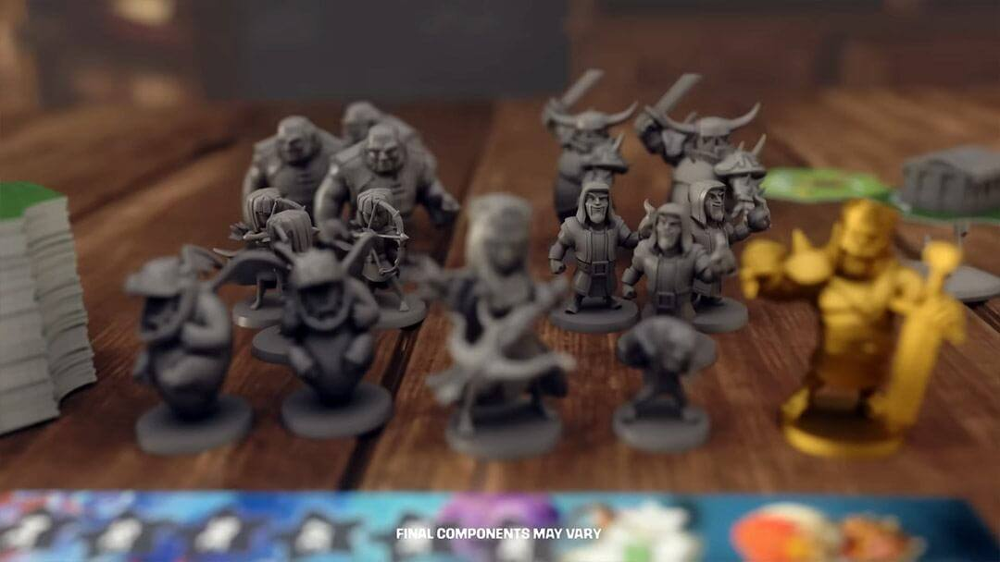
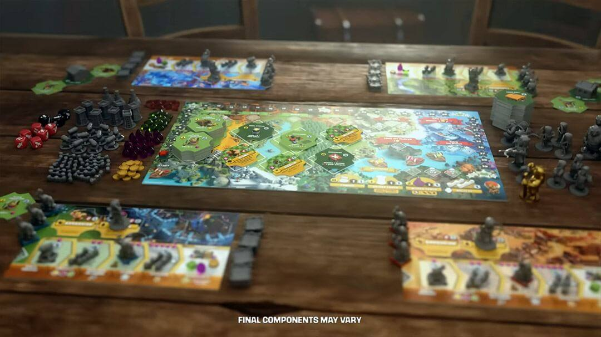
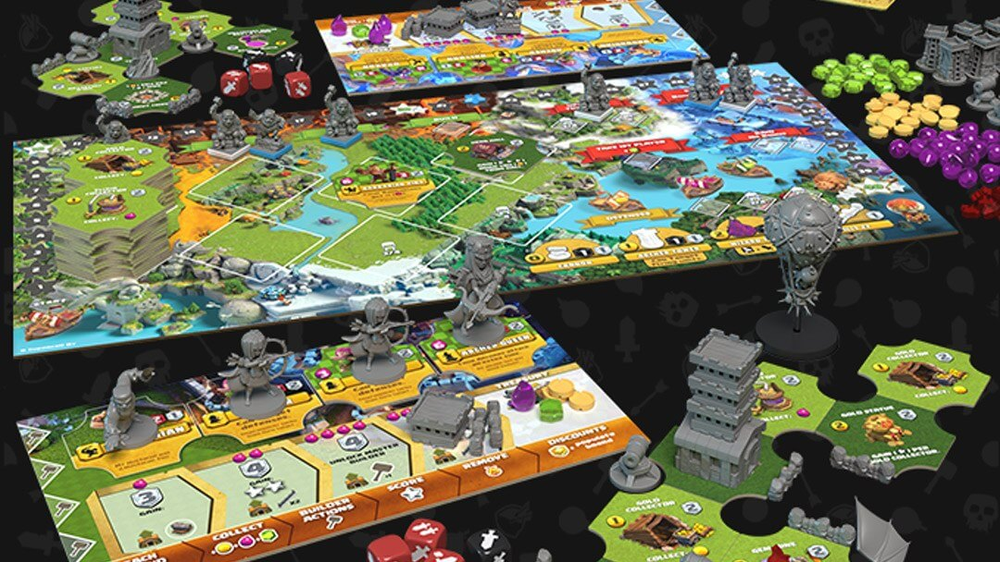

6月19日，超级细胞旗下游戏《部落冲突》(Clash of Clans) 正式宣布，将首次走出数字世界，以实体桌游的形式与广大玩家见面。这款备受期待的官方授权桌游名为《部落冲突：史诗突袭》(Clash of Clans: The Epic Raid)，现已登陆全球知名的众筹平台 Kickstarter，邀请全球的部落首领们共同开启一场前所未有的桌面战争。

这款桌游由 Supercell 公司与知名的桌面游戏发行商 Maestro Media 联手打造，并由业界传奇设计师 Eric M. Lang（代表作：《血色狂怒》、《漫威联名款》）和 Ken Gruhl 倾力合作设计。游戏旨在将《部落冲突》核心的策略、建造与掠夺乐趣，原汁原味地呈现在实体游戏板上。

## 游戏核心特色

在《部落冲突：史诗突袭》中，玩家们将能体验到：

* **建造与防御：** 像在手机游戏中一样，精心设计并建造你的大本营，布置坚固的防御工事，抵御来自对手的猛烈攻击。
* **训练与部署：** 招募并升级你所钟爱的《部落冲突》兵种。从野蛮人、弓箭手到巨人、法师，每个单位都将以精美的微缩模型呈现。
* **史诗级突袭：** 调兵遣将，向你的朋友们发起激动人心的突袭！运用你的智慧和策略，摧毁他们的防御，掠夺宝贵的资源，赢取最终的胜利。
* **高度互动性：** 这是一款为朋友和家人设计的桌面游戏。玩家们将围坐一堂，面对面地进行策略博弈，享受最直接、最真实的社交游戏体验。

## 来自开发团队的声音

Maestro Media 的创始人兼首席执行官 Javon Frazier 表示：“《部落冲突：史诗突袭》是一次突破性的尝试，它以前所未有的方式将这个深受喜爱的游戏宇宙带到现实生活中。通过与传奇设计师 Eric Lang、Ken Gruhl 以及 Supercell 的紧密合作，我们创造了一款能够给玩家带来惊喜和快乐的游戏，它将成为《部落冲突》粉丝们不可或缺的桌面冒险。”

Supercell 全球授权主管 Andrea Fasulo 补充道：“我们始终致力于为玩家创造难忘的游戏体验。《部落冲突：史诗突袭》是我们这段旅程中激动人心的新篇章。与 Maestro Media 的合作为我们提供了一个绝佳的机会，让我们能以一种全新的方式，将《部落冲突》的策略精髓与紧张刺激的战斗带给玩家。”

## 参与众筹

Epic Raid 活动于昨天 6 月 17 日上午 9 点（巴西利亚时间）开始，您现在可以在 Kickstarter 上支持该项目以获得独家奖励！

为了感谢早期支持者，项目方为在活动初期参与众筹的玩家准备了丰厚的独家奖励，包括但不限于限定版的“黄金野蛮人之王”微缩模型以及其他特殊的解锁内容。

项目在上线后短时间内便迅速达成了其初始众筹目标，充分显示了全球玩家对这款作品的巨大热情与期待。

通过支持该项目，您可以：

- 抢先体验游戏
- 为桌面体验的发展做出贡献
- 保证独家物品，例如野蛮人之王的金色缩影
- 关注创作者的更新和广播

如何参与：

感兴趣的玩家可以访问 Kickstarter 网站，搜索 “Clash of Clans: The Epic Raid” 即可找到项目页面，了解更多游戏详情并选择你的支持档位。

## 关于

《部落冲突》是 Supercell 公司于2012年推出的一款现象级手机策略游戏。玩家在游戏中可以建立自己的村庄，组建部落，并与全球数百万玩家一同参与部落对战。凭借其深度策略和趣味玩法，《部落冲突》已成为移动游戏史上最成功的作品之一。

Maestro Media 是一家专注于将热门数字 IP 转化为高品质桌面游戏和周边产品的发行商，以其成功的众筹项目而闻名。

众筹老手 Maestro Media 已与一些世界知名品牌建立了合作关系，其中包括迪士尼、Hello Kitty 和蓝精灵。

他们是热门游戏《以撒的结合：四个灵魂》和创纪录的《四个灵魂：安魂曲》的创作者。他们还开发了《蓝精灵：隐秘村庄》，该游戏曾获得 TAGIE 奖年度授权游戏提名。

而通过 “史诗突袭” ，他们承诺将为粉丝和收藏家带来又一次史诗般的体验！

