---
title: "皇室战争国际服安卓下载、安装全攻略！"
image: "images/2025/b03fc75d52cb8cbf73a3989e20a1a77e.png"
description: "本文重点介绍安卓手机玩家如何下载、安装国际服版本皇室战争"
date: 2025-03-17 13:15:05
slug: /how_to_install_clashroyale_android/
categories:
  - 皇室战争
tags:
  - 教程
draft: false
---  
  
今天来讲一下，皇室战争国际服在安卓手机上的最新安装方法。  
  
  
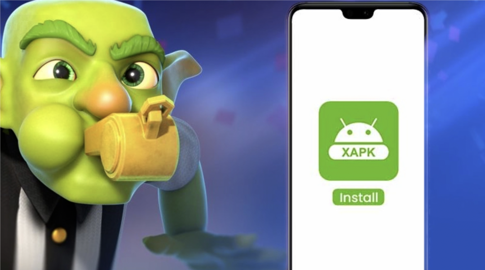  
  
  
此前，我曾经做过一期《[苹果手机皇室战争国际服的安装指南](/posts/clashroyale/2025/03/how-to-play-global-clash-royale)  
》，主要面向苹果手机用户。当时，对于安卓手机而言，即便用户不熟悉通过 Google Play 进行安装，在网络上随意找寻一个客户端进行安装应可顺利完成。  
  
  
  
  
  
然而，在最近一次皇室战争更新之后，众多同学反馈安卓版在安装过程中遭遇障碍，要么难以找到适配的客户端，要么在启动时出现闪退现象。  
  
  
出现此情况的原因在于，此次更新后，几乎所有提供 apk 下载的网站，如 ApkMirror、UptoDown 等，所提供的均为 xapk 包。这是一种新兴的打包方式，本质上属于一种 zip 压缩文件，其中不仅包含主体的 apk 包，还涵盖众多其他资源的 apk。但需注意，此类包文件无法直接进行安装。  
  
  
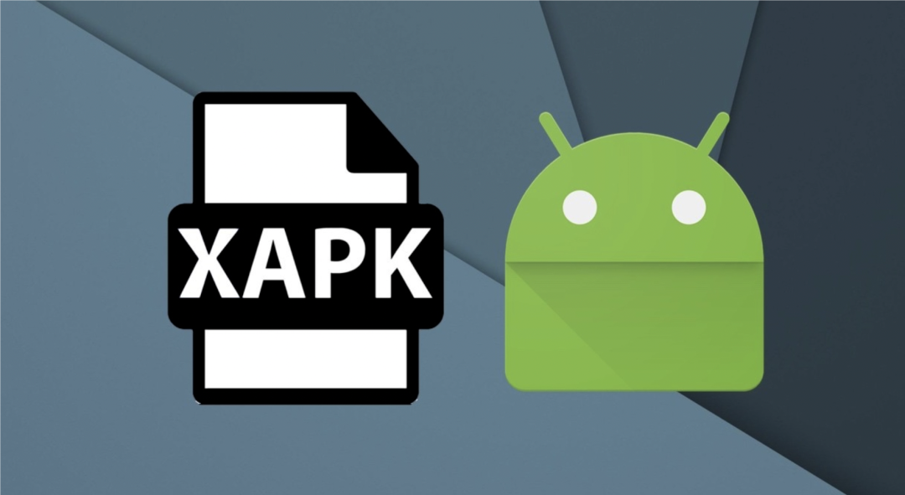  
  
  
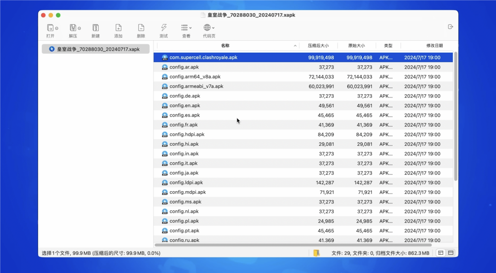  
  
  
其实，安卓手机上最好也是最佳的方式是安装Google Play，但是此种方式并不适合所有人或者所有手机。  
  
  
接下来，为您详细介绍日后如何安装和更新安卓版客户端。  
  
  
  
**第一种方法：**  
  
  
使用 Xapk-installer，也就是 xapk 的安装器。  
  
  
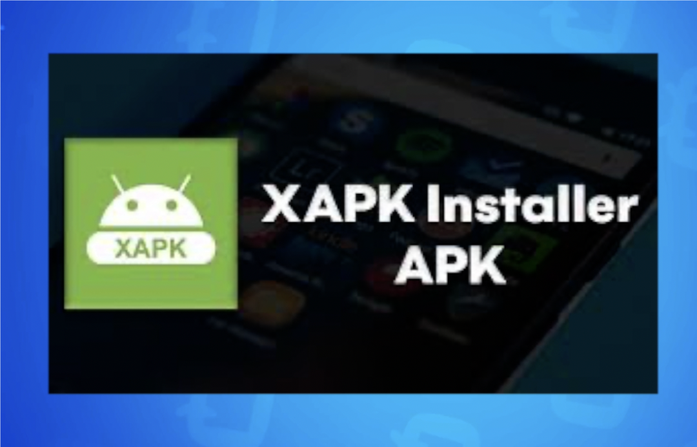  
  
  
此类应用程序众多，在此我们选取了其中一个。  
  
  
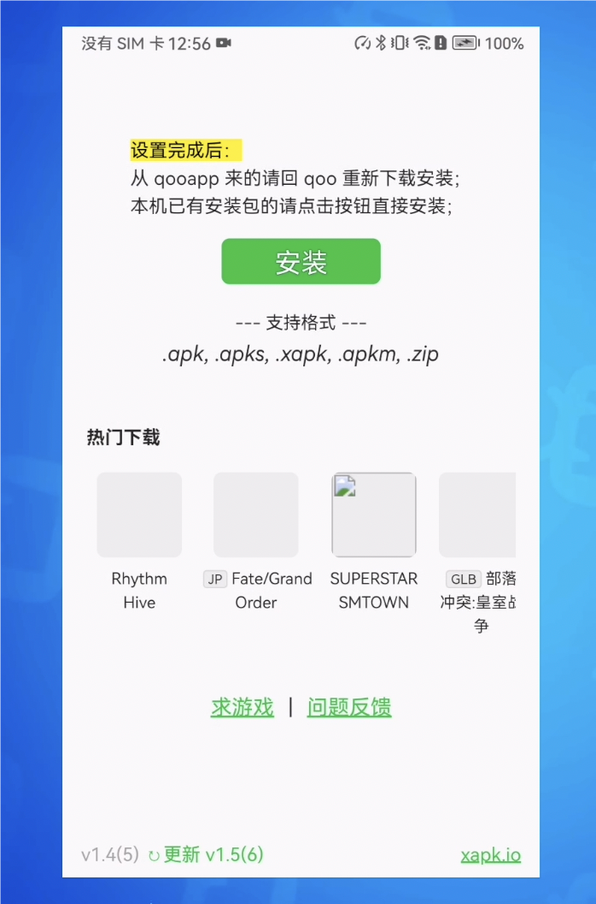  
  
  
  
首先将其安装至手机并打开，然后选择已下载的皇室战争最新安装文件 xapk。  
  
  
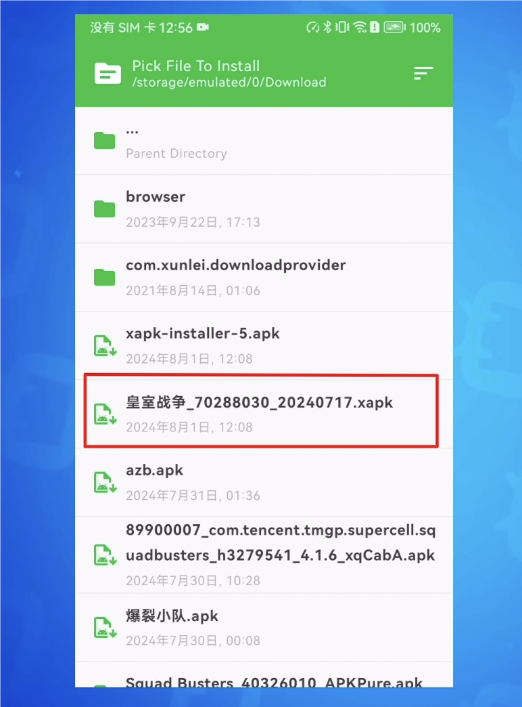  
  
  
  
此时会弹出选项框供您选择安装内容。若您不明确每个包的具体作用，直接全部勾选即可。  
  
  
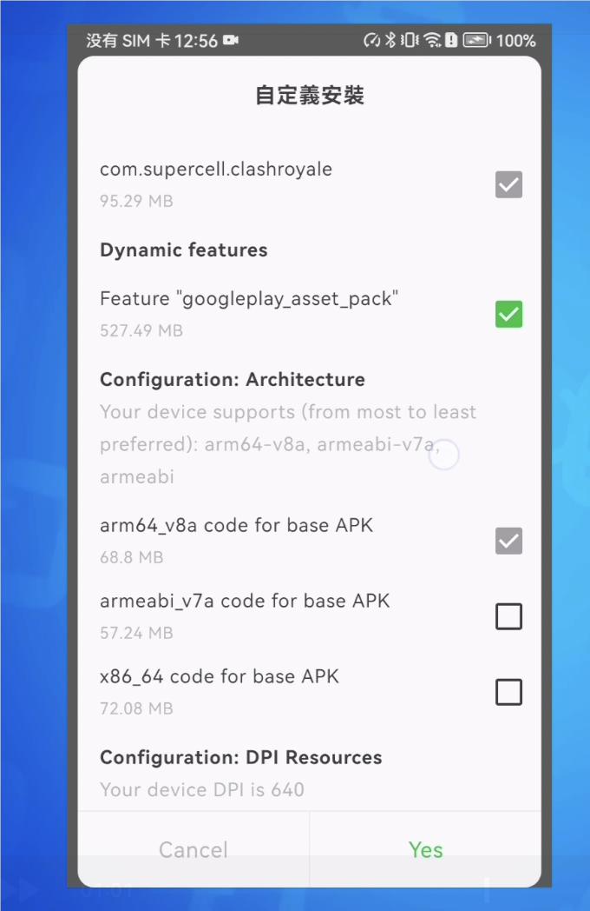  
  
  
  
稍作等待，即可直接安装成功，游戏启动亦能正常运行。  
  
  
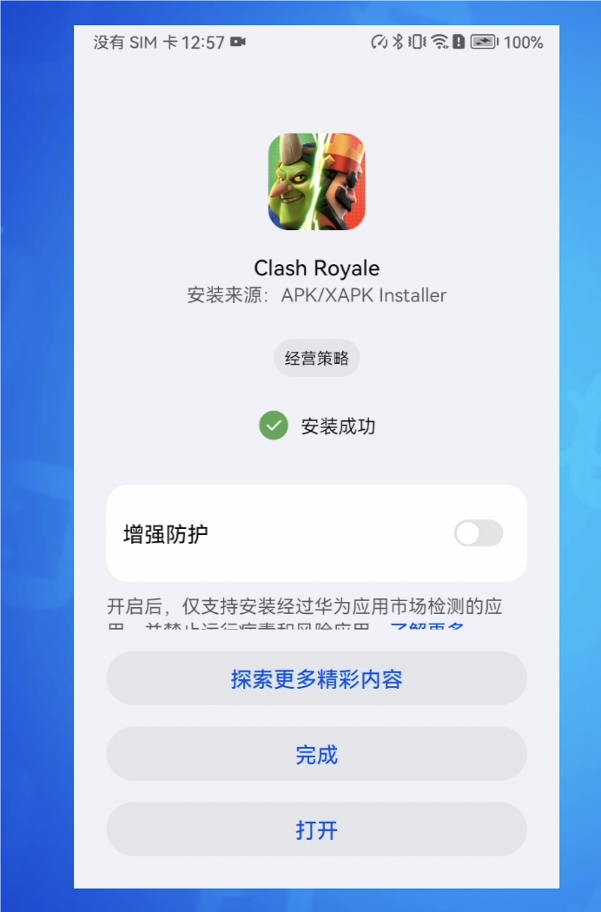  
  
  
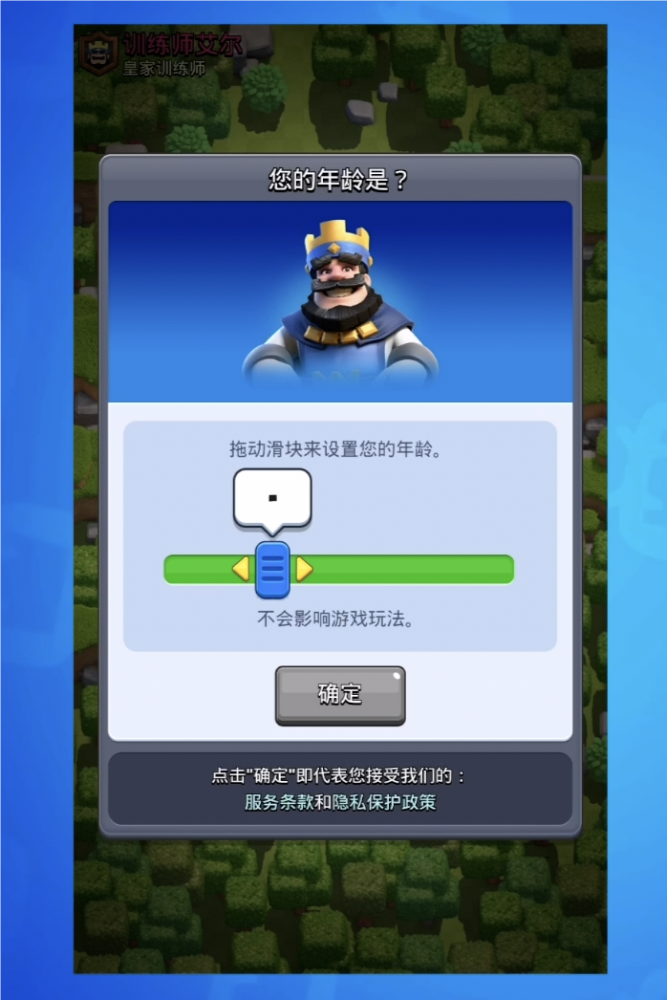  
  
  
  
**第二种方法：**  
  
  
当前还存在一种经过二次封装的安装包。其打开后的界面呈现如下，直接确认安装即可。  
  
  
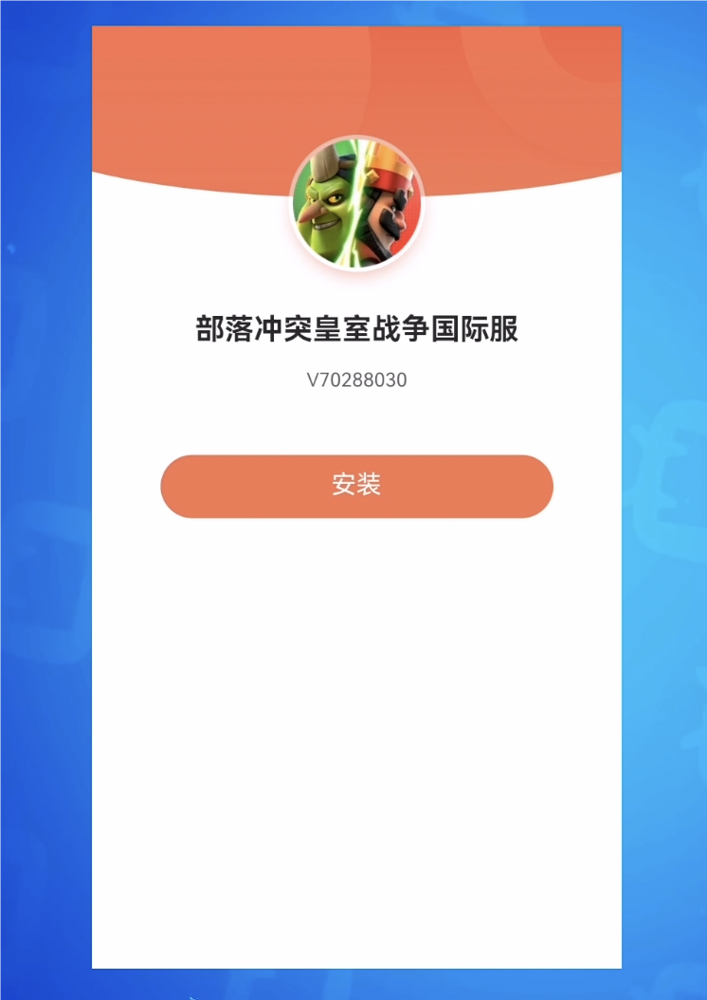  
  
  
  
经过短暂等待便可直接安装成功，且经测试启动无异常。  
  
  
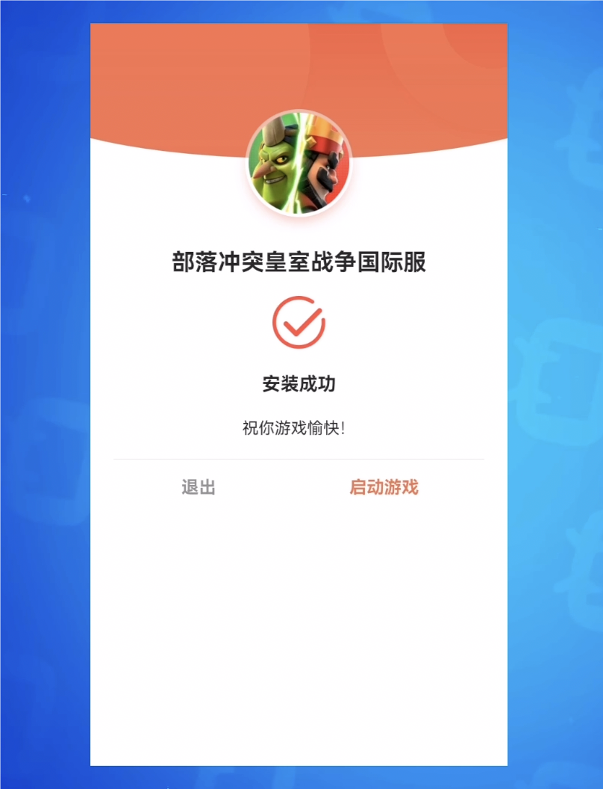  
  
  
  
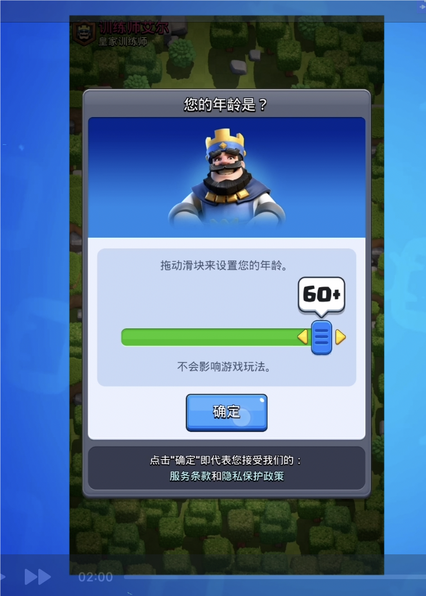  
  
  
我们查看了此安装器，实际上它是将原始的 xapk 文件和 xapk 的安装器整合至一个新的 apk 中。通俗来讲，其类似于一个自解压文件。经我们测试，此方法可行有效，但对于此类经过二次封装的安装包，如果无法确切保证其来源的可靠性，仍需谨慎对待。  
  
  
  
**总结**  
  
  
这两种安装方式，经群内同学在多数手机上进行测试，均已成功通过。特别提醒**小米手机用户，需在开发者选项中，将“启用 MiUI 优化”的选项关闭**，否则安装过程可能会出现报错情况。  
  
  
另外，安卓手机型号众多，部分厂商对手机系统也进行了深度的改造和定制，导致部分机型并不能适配新的xapk的安装方式。如果以上两种方式依然不行，可以考虑通过其他平台或者容器来安装。  
例如通过 qoo、ourplay、gamestoday 等。  
但我更推荐以上这两种不依赖其他容器、相对更为纯净的安装方式，避免这些第三方平台或者容器夹带私货。  
  
  
  
**安装包及xapk-installer获取方式**  
  
  
最后，相应的 apk、xapk 文件以及 xapk-installer 文件均已上传至网盘。**每次客户端更新，网盘内容也会同步更新**。  

网盘链接：

[国际服资源下载](/global)
  
  
记得关注”**皇室小蜜**“微信公众号，关注后，在公众号后台发送“全家桶”关键字，同样即可获取包含文中各种资源的自动回复。  
  
 
