---
title: "皇室战争国际服下载、安装、更新、畅玩全攻略！"
image: "/images/2025/globalplay.webp"
description: "本文重点介绍苹果手机玩家如何下载、安装、更新和畅玩国际服版本皇室战争。"
date: 2025-03-17 12:15:05
slug: /how-to-play-global-clash-royale/
categories:
  - 皇室战争
tags:
  - 教程
draft: false
---

  
> 自从2022年的3月16日皇室战争分服以来，国服彻底沦为皇室战争的国内私服。国服版本不能及时更新、在线人数日益减少、匹配时间过长、各种运营骚操作，真是令人不胜唏嘘。反观国际服的一系列更新动作，卡牌进化、新玩法、升级特惠，火爆的各种官方、民间联赛，着实也让不少国服玩家羡慕不已。  
  
  
润还是不润？这个问题的答案个人认为是显而易见的，不管是购买成型的老号还是重新培养国际服新号，其实现在都是一个挺合适的节点。然而，如何畅玩国际服版本，这又成为了横亘在对电脑不太熟悉的玩家面前的一大难题。安卓版本国际服下载安装相对简单，本文就不再讨论了。  
  
  
本文重点介绍苹果手机玩家如何下载、安装、更新和畅玩国际服版本皇室战争。  
  
  
  
其实分服之初，苹果手机玩家下载国际服相对简单：只需要一个外网App ID，在Apple Store中直接下载皇室战争即可。但是随着时间的推移，皇室战争国际服经历数次更新后，这个办法失灵了。  
  
  
现在，如果你是新买的手机，或者你的手机无重要数据，可以接受清除数据，那很简单，就这几步：  
- 准备一个国外的 Apple ID  
  
- 清除手机数据（新买手机或者之前从没装过皇室战争可以省略此步）  
  
- 用国外的 Apple ID 登录 App Store，搜索 Clash Royale 下载  
  
- 打开游戏，做完新手教程后进游戏设置，注册一个 Supercell ID，然后就可以畅玩了  
  
如果你不确定，可以验证一下：  
用国外的 Apple ID 登录 App Store，搜索 Clash Royale 下载，开全局魔法或者打开游戏加速器，启动游戏。  
如果直接能够进入新手教程，那么恭喜你，可以开玩了。  
  
如果启动界面无限提示：  
“你可以下载新版本了”，如下图，那么很不幸，你需要继续阅读，按照本文的提供的办法折腾一遍。  
  
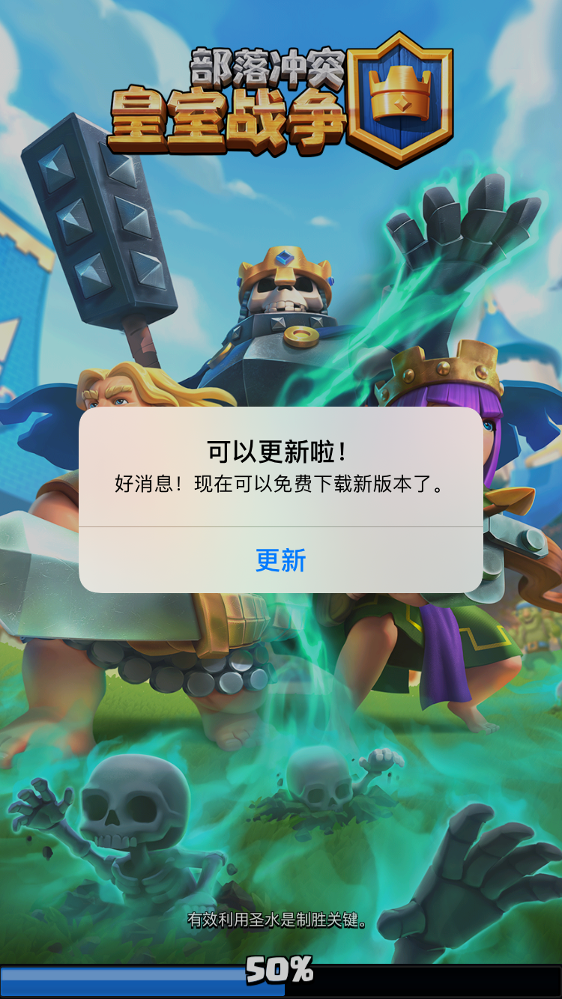  
  
  
那么，接下来我们进入正题。  
  
  
### 1. 准备工作
  
本文提供的办法，思路很简单：利用iTunes旧版本下载助手，下载分服前的旧版本皇室战争ipa文件，该版本能够正常运行和更新，不会强制跳转到国服更新，然后通过爱思助手安装至手机。因此，你需要做以下准备工作：  
- 一台 Windows 系统的电脑，建议 Win 7 以上。  
  
- 一根数据线，用来连接手机和电脑。  
  
- 爱思助手（网上搜爱思助手官网下载最新版即可）。  
  
- iTunes 旧版应用拦截工具（后续也会说在哪里下载）。  
  
- 一个美区的 App Store 账号  
  
- 魔法上网方式或者网游加速器  
  
  
  
  
### 2. 下载和安装  
  
首先确认你的电脑上没有安装任何版本的Itunes，如果有，彻底卸载干净。  
  
然后去爱思官网下载爱思助手，爱思助手安装时会提示是否自动安装和更新itunes，点否，如果点了确认就会安装最新的 iTunes，到时候还需要再卸载新版安装旧版，会麻烦许多。  
  
接下来进入爱思助手，点击最上面一排的智能刷机，然后点最左侧的其他工具，这是会有两个 iTunes，我们安装下面那个，**12.6.5.3**的版本。  
  
  
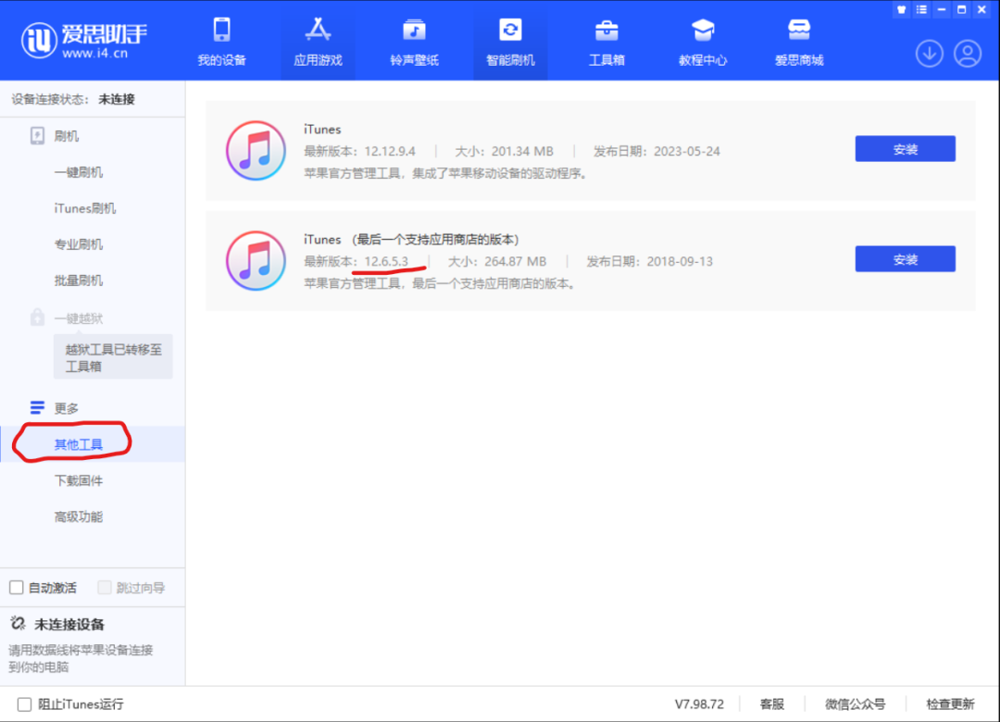  
  
  
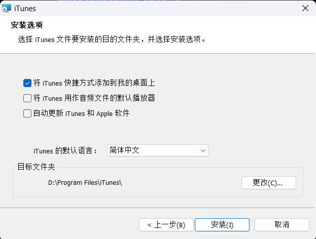  
  
itunes安装完毕后启动，使用美区Apple ID登录。注意，iTunes旧版应用拦截工具在登录后再打开，否则有可能导致iTunes登录失败。  
  
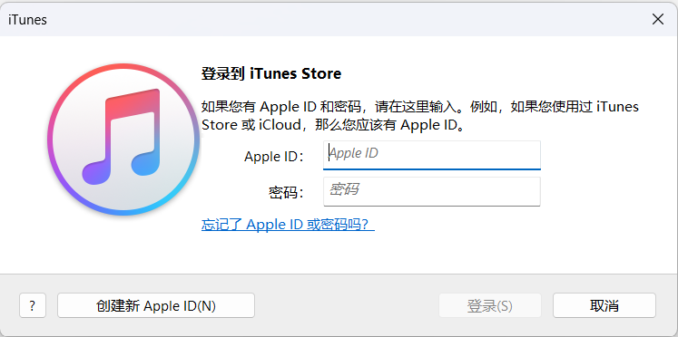  
  
  
iTunes主界面，左上角切换成应用，然后右上角搜索 Clash Royale。  
  
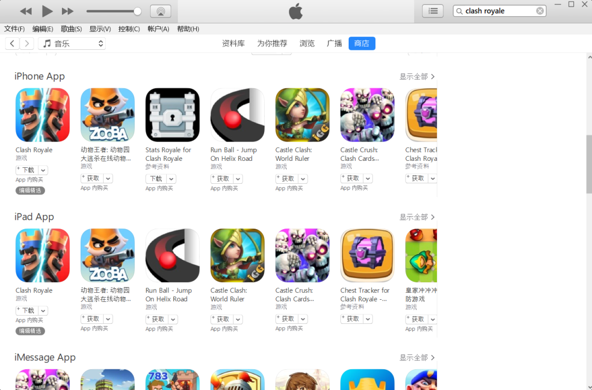  
  
看到搜索结果后，别忙于下载，此时打开iTuens旧版本下载工具（此工具在下载或者启动的时候，有可能会被识别为恶意软件，请关闭相应软件的“实时保护”）。  
  
接下来在iTuens旧版本下载工具中搜索 Clash Royale，**注意搜索框后的地区切换到美国**，点击搜索，能看到搜索到了皇室战争。  
  
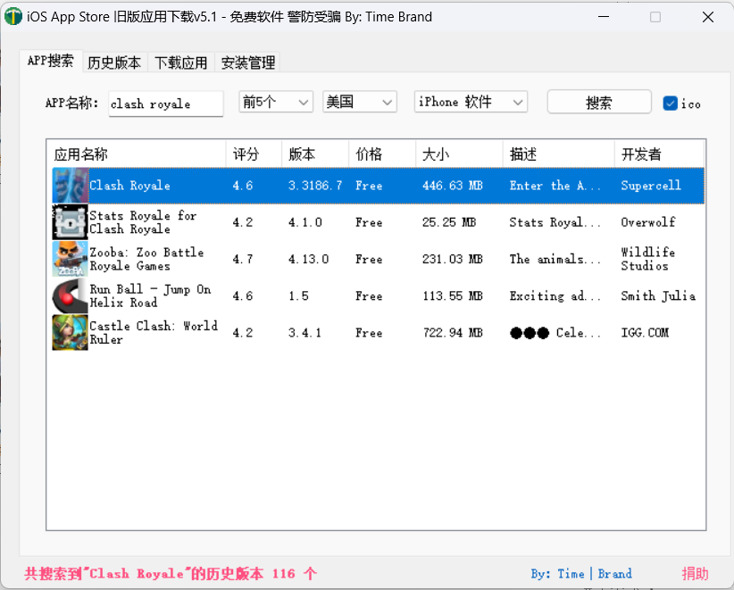  
  
  
  
双击搜索结果中的Clash Royale，此时会切换到“历史版本”页签，在历史版本中找到**3.1708.3**，后面对应的版本ID是**830919677**，双击锁定。  
  
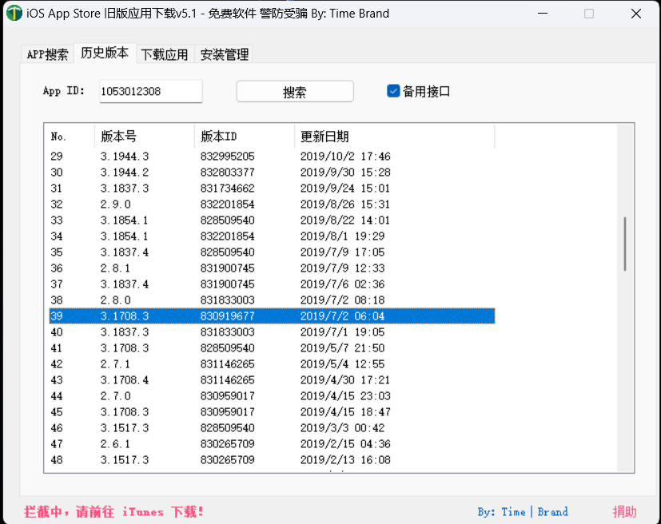  
  
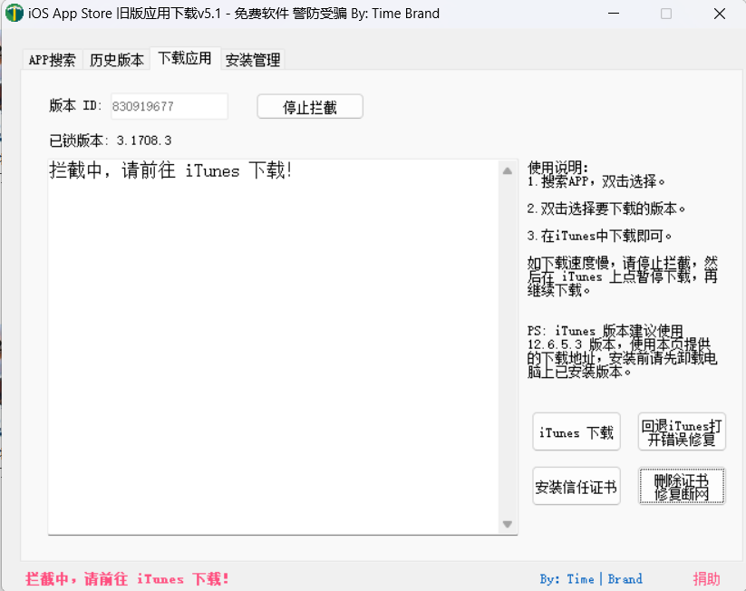  
  
  
此时，这个版本的皇室战争就拦截成功了，现在切换到iTunes刚才的搜索结果页面，点击皇室战争图标下的"下载”。右上角的下载图标出现就表示开始下载了，耐心等待到下载成功，如果失败可以多重试几次。  
  
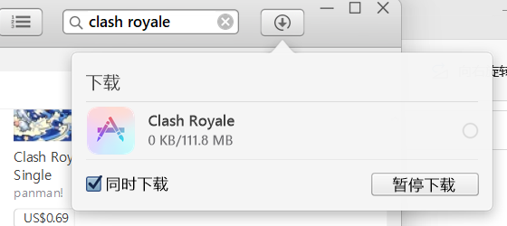  
  
  
  
  
  
下载完成后，点击iTunes界面上的“资料库”，就能看到皇室战争的安装包了。  
  
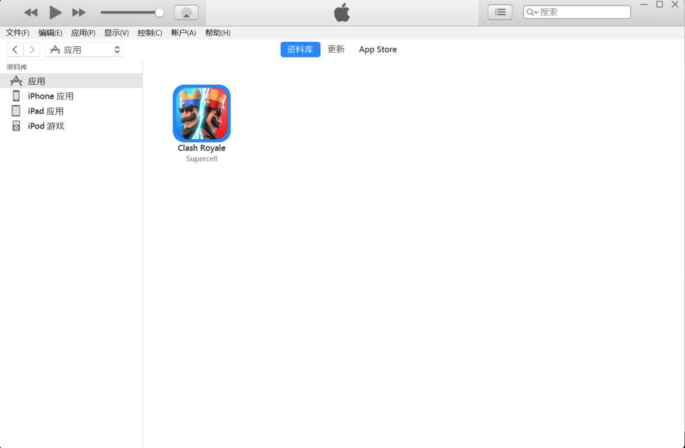  
  
右键点击安装包，点击“在 Windows 资源管理器中显示”，跳转到Windows资源管理器，这就是我们需要的 **3.1708.3** 版本的安装包，右键安装包，选择使用爱思助手安装。  
  
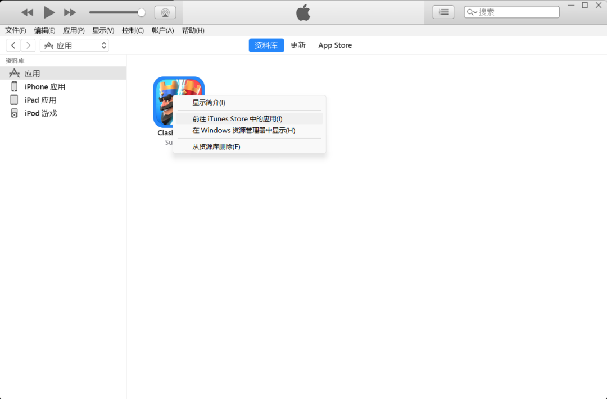  
  
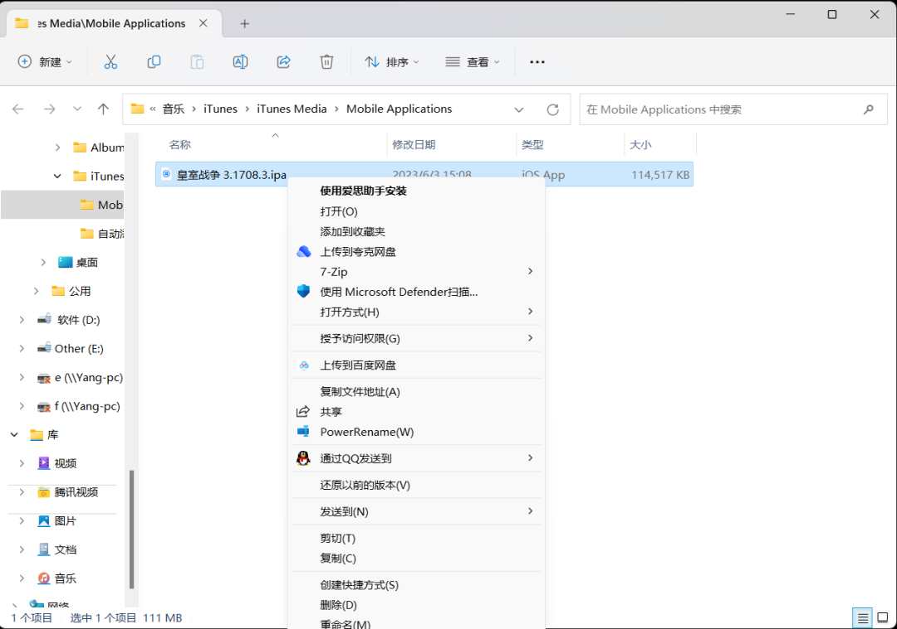  
  
安装完毕后，不要着急打开游戏。启动你的网游加速器，然后在手机Apple Store里登录你的美区ID，启动游戏，主界面上点击“游客登录”，这一步是用来清除你手机皇室战争的缓存的，还原出厂设置就是为了这一步。  
  
  
  
点击之后，游戏会提示你更新，点击后跳转到App Store更新，更新后启动游戏完成新手教程后注册Supercell ID。  
  
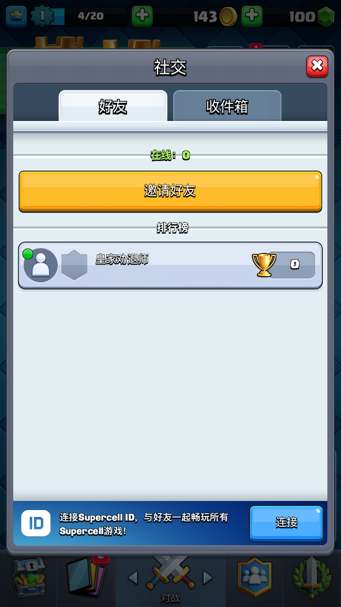  
   
  
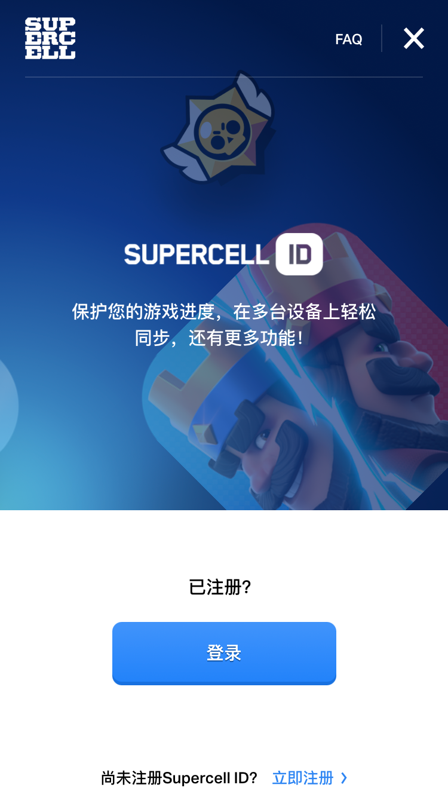  
  
至此，大功告成。  
  
  
  
### 3. 日常畅玩和更新  
  
网游加速器其实仅在在注册Supercell ID的时候需要，平时  
玩的时候如果不卡顿基本可以不用，但是有时候网络波动，还是需要开一下加速器。刚从国服切换到国际服的小伙伴，可能还是需要适应一段时间，国际服的延迟略比国服高，下牌的时候提前量是需要考虑的。  
  
国际服版本和国服版本是可以同时并存在手机上的，你大可以再用一个国区的 Apple ID 下载一个国服安装到手机上同时玩。每次哪个版本的皇室战争大更新，就登录对应区服的 Apple ID 进行更新就行。  
  
  
  
### 写在最后  
  
教程中用到的相关工具，为大家打包准备好了，有需要的小伙伴，请参见：

[国际服资源下载](/global)

  
  
