---
title: "皇室战争国际服 Android 安装指南：APK、XAPK 下载与更新"
image: "/images/2025/b03fc75d52cb8cbf73a3989e20a1a77e.png"
description: "皇室战争国际服 Android 怎么安装？详细了解 APK、XAPK 下载与安装流程，以及安装失败、闪退和后续更新等常见问题。"
date: 2025-03-17 13:15:05
updated: 2026-07-15T00:00:00+08:00
slug: /how_to_install_clashroyale_android/
home_popular: 3
game: clashroyale
content_type: guide
difficulty: intermediate
evergreen: true
featured: false
categories:
  - 皇室战争
tags:
  - 皇室战争
  - 国际服
  - Android安装
keywords:
  - 皇室战争国际服
  - 皇室战争Android
  - 皇室战争安卓安装
  - XAPK
related:
  - /posts/clashroyale/2025-03-17/how-to-play-global-clash-royale
faq:
  - question: XAPK 为什么不能像 APK 一样直接安装？
    answer: XAPK 通常同时包含主程序和其他资源包，本质上是组合安装包，需要支持 XAPK 的安装器解析并安装其中的各个部分。
  - question: 皇室战争国际服安装失败怎么办？
    answer: 先确认安装包完整、存储空间充足，并允许安装器访问文件和安装未知应用；部分深度定制系统还可能需要调整安装限制。仍然失败时，可改用 Google Play 或可信游戏平台。
  - question: 国际服更新时需要重新安装吗？
    answer: 通过 Google Play 安装的版本可直接在商店更新；使用 APK 或 XAPK 的玩家，需要下载与当前版本和设备架构匹配的新安装包进行覆盖更新。
wechat:
  template: redream-obsidian-blue
draft: false
---  
  
本文整理皇室战争国际服在 Android 手机上的几种常见安装方法。

## 适合谁

这篇指南适合无法直接通过 Google Play 安装皇室战争国际服，或者下载到 XAPK 后不知道如何处理的 Android 用户。不同品牌的 Android 系统在权限名称和安装限制上会有差异，实际界面可能与截图略有不同。

## 开始前准备

- 如果设备能够正常使用 Google Play，优先从官方商店安装和更新。
- 从第三方渠道获取 APK、XAPK 或安装器时，确认来源可信，并避免使用来历不明的二次封装包。
- 安装前预留足够空间，并确认系统允许所用文件管理器或安装器安装未知应用。
  
  
此前，我曾经做过一期《[苹果手机皇室战争国际服的安装指南](/posts/clashroyale/2025/03/how-to-play-global-clash-royale)  
》，主要面向苹果手机用户。当时，对于安卓手机而言，即便用户不熟悉通过 Google Play 进行安装，在网络上随意找寻一个客户端进行安装应可顺利完成。  
  
  
  
  
  
实际安装时，常见问题主要是找不到适配的客户端、下载后无法直接安装，或者启动时闪退。
  
  
其中一个常见原因是下载到的并非单独 APK，而是 XAPK。它本质上是组合安装包，除了主 APK，还可能包含按设备架构拆分的程序包和其他资源，因此不能像普通 APK 一样直接点击安装。
  
  
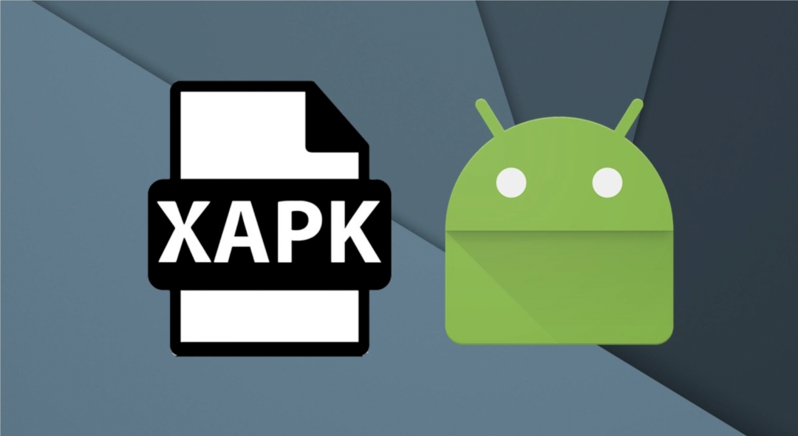  
  
  
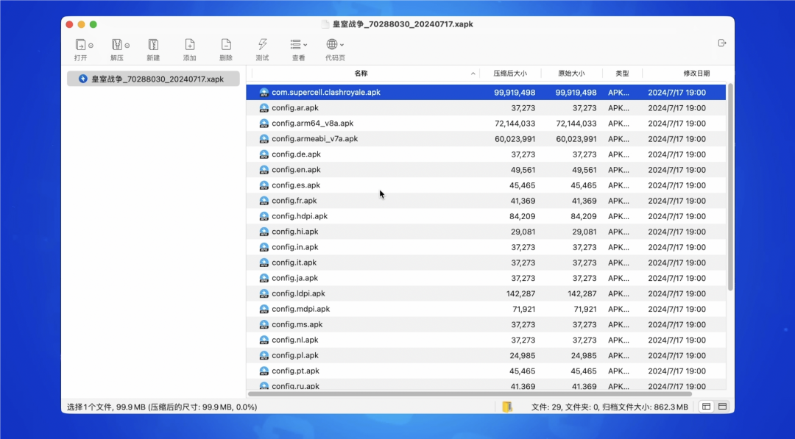  
  
  
其实，安卓手机上最好也是最佳的方式是安装Google Play，但是此种方式并不适合所有人或者所有手机。  
  
  
接下来，为您详细介绍日后如何安装和更新安卓版客户端。  
  
  
  
## 方法一：使用 XAPK 安装器
  
  
使用 Xapk-installer，也就是 xapk 的安装器。  
  
  
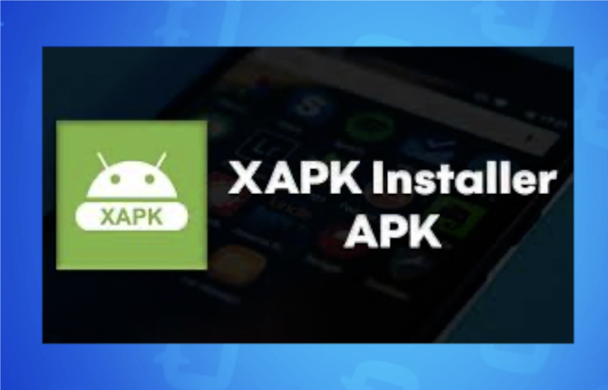  
  
  
此类应用程序众多，在此我们选取了其中一个。  
  
  
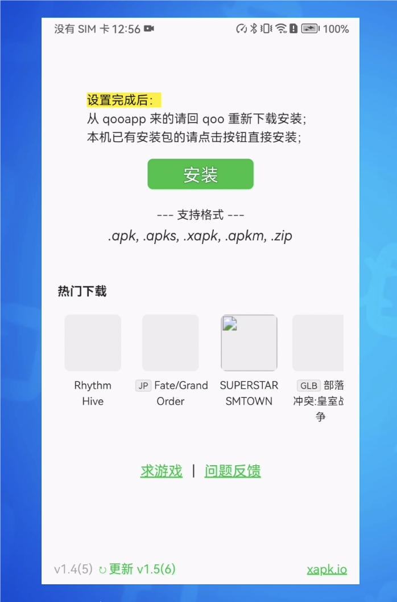  
  
  
  
首先将其安装至手机并打开，然后选择已下载的皇室战争最新安装文件 xapk。  
  
  
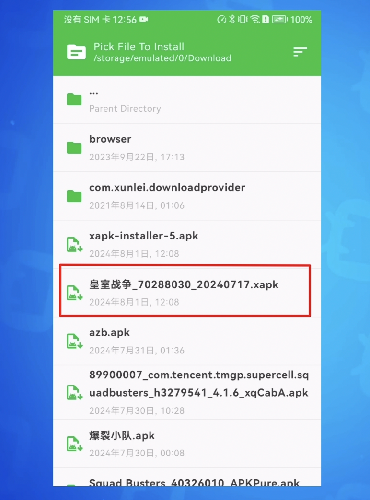  
  
  
  
此时会弹出选项框供您选择安装内容。若您不明确每个包的具体作用，直接全部勾选即可。  
  
  
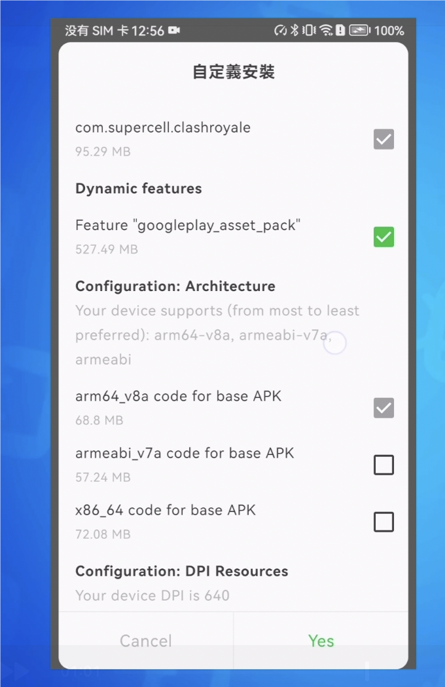  
  
  
  
稍作等待，即可直接安装成功，游戏启动亦能正常运行。  
  
  
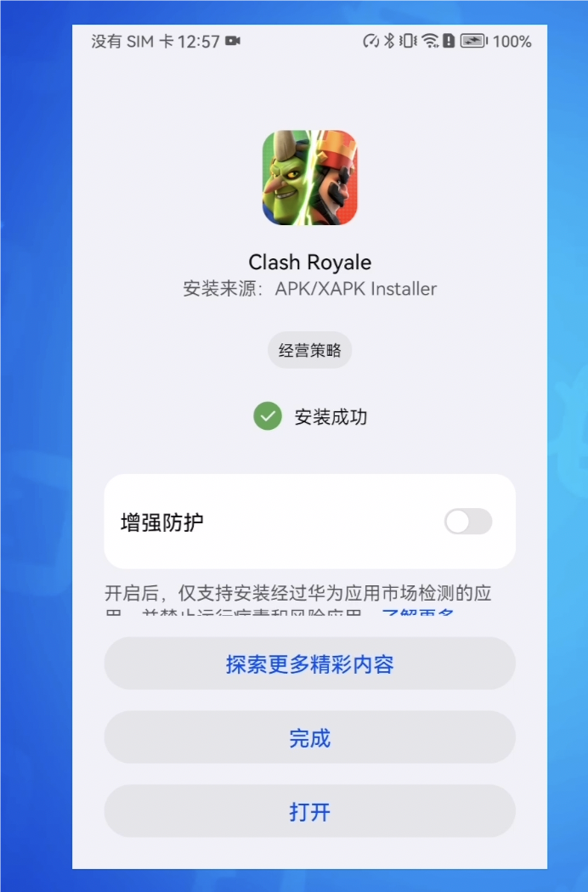  
  
  
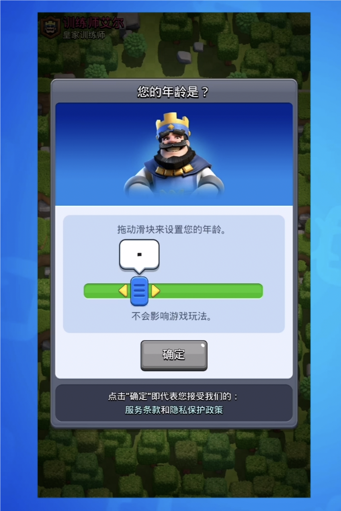  
  
  
  
## 方法二：使用二次封装安装包
  
  
当前还存在一种经过二次封装的安装包。其打开后的界面呈现如下，直接确认安装即可。  
  
  
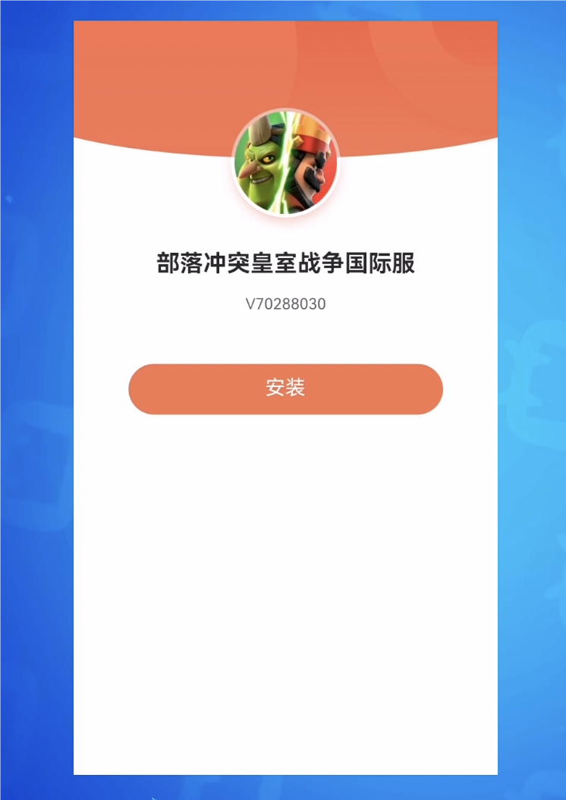  
  
  
  
经过短暂等待便可直接安装成功，且经测试启动无异常。  
  
  
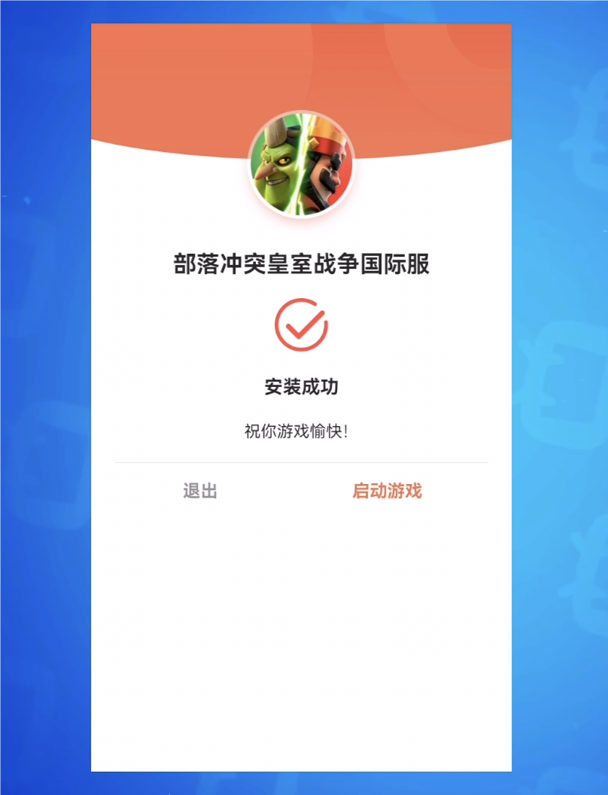  
  
  
  
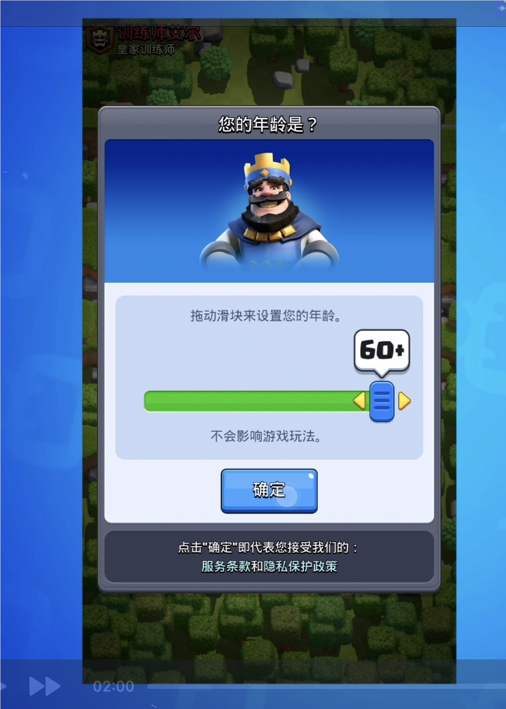  
  
  
我们查看了此安装器，实际上它是将原始的 xapk 文件和 xapk 的安装器整合至一个新的 apk 中。通俗来讲，其类似于一个自解压文件。经我们测试，此方法可行有效，但对于此类经过二次封装的安装包，如果无法确切保证其来源的可靠性，仍需谨慎对待。  
  
  
  
## 常见安装问题
  
  
这两种安装方式经群内玩家在多款手机上测试可用。部分旧版 MIUI 设备如果安装时报错，可以检查开发者选项中的系统优化设置；新版系统不一定提供同名选项，不建议在没有报错时主动修改。
  
  
另外，安卓手机型号众多，部分厂商对手机系统也进行了深度的改造和定制，导致部分机型并不能适配新的 xapk 安装方式。如果以上两种方式依然不行，可以考虑通过其他平台或者容器来安装。
例如通过 qoo、ourplay、gamestoday 等。  
无论采用哪种方式，都应优先考虑安装包的来源和可验证性。二次封装包虽然方便，但如果不能确认制作者和文件完整性，不应为了省步骤而冒险安装。

## 总结

Android 安装国际服最省心的方式仍然是 Google Play。无法使用商店时，可以选择可信来源的 XAPK 配合安装器；二次封装包只适合能够确认来源的情况。后续更新时沿用原渠道，通常更容易避免签名不一致或覆盖安装失败。
  
  
  
## 安装包与工具获取
  
  
最后，相应的 apk、xapk 文件以及 xapk-installer 文件均已上传至网盘。**每次客户端更新，网盘内容也会同步更新**。  

网盘链接：

[国际服资源下载](/global)
  
  
记得关注”**皇室小蜜**“微信公众号，关注后，在公众号后台发送“全家桶”关键字，同样即可获取包含文中各种资源的自动回复。  
  
 
