皇室战争国际服在 Android 上安装起来不算难，真正麻烦的是渠道选择：有的手机可以直接走 Google Play，有的只能下载 APK 或 XAPK，还有一些安装包看起来能用，实际却可能是别人重新打包过的版本。

这篇文章不推荐你盲目找“最新版安装包”。更稳妥的思路是先判断自己的设备适合哪条路线，再决定用 Google Play、XAPK 安装器，还是已经封装好的安装包。最后核验时间为 2026 年 8 月 8 日，具体客户端版本仍以官方商店和资源页实际更新为准。

## 适合谁

这篇指南适合三类玩家：

- Android 手机无法直接通过 Google Play 安装皇室战争国际服。
- 已经下载到 APK、XAPK，但不知道该用哪个安装方式。
- 安装后遇到失败、闪退、无法覆盖更新，想先判断问题出在哪里。

不同品牌的 Android 系统在权限名称和安装限制上会有差异，实际界面可能与截图略有不同。只要思路对，按钮位置变了也不影响处理。

## 开始前准备

- 如果设备能够正常使用 Google Play，优先从 Google Play 安装和更新。
- 如果只能用安装包，优先选择来源清楚、文件名和版本信息一致的 APK 或 XAPK。
- 安装前预留足够空间，并允许文件管理器或安装器“安装未知应用”。
- 不要向任何安装器、网盘页面或陌生人提供 Supercell ID、Google 账号密码和验证码。

之前我也整理过一篇《[皇室战争国际服 iOS 安装指南](/posts/clashroyale/2025/03/how-to-play-global-clash-royale)》，那篇主要解决苹果设备的问题。Android 的限制少一些，但安装包格式更乱，所以更需要先看清楚自己下载到的到底是什么。

实际安装时，最常见的问题通常有三个：找不到适配的客户端，下载后无法直接安装，或者安装成功后启动闪退。其中很多问题都和 XAPK 有关。

APK 可以理解为普通安装包，点开后就能进入系统安装流程。XAPK 则更像一个“组合包”，里面可能包含主程序、拆分 APK、不同设备架构需要的资源文件，所以不能像普通 APK 一样直接点击安装。

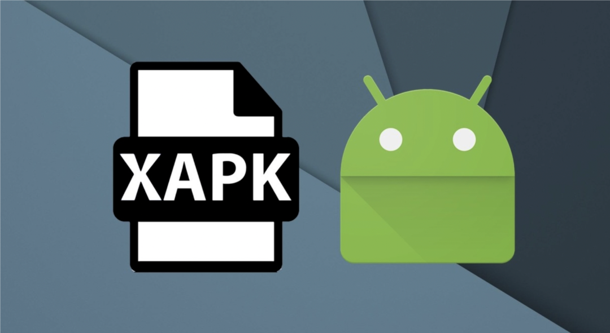

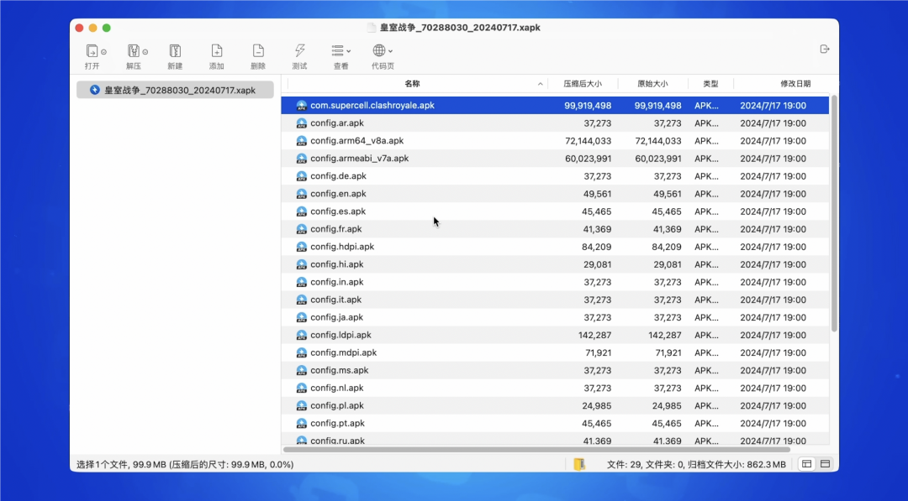

## 先选安装路线

如果你能使用 Google Play，直接走 Google Play。这是最省心的方式，后续更新也最少出问题。

如果不能使用 Google Play，但能下载到完整的 XAPK，那就使用 XAPK 安装器。这个方案相对通用，适合大多数需要手动安装的玩家。

如果你下载到的是别人已经封装好的 APK，也可以安装，但前提是你能确认来源。二次封装包的好处是简单，风险是你很难判断里面是否被加了别的东西。

一句话总结：**Google Play 优先，其次是可信来源的 XAPK，最后才考虑二次封装包。**

## 方法一：使用 XAPK 安装器

如果你下载到的是 `.xapk` 文件，就需要用支持 XAPK 的安装器来处理。不同安装器界面不一样，但核心流程基本一致：先选择 XAPK 文件，再让安装器解析里面的多个安装包，最后交给系统完成安装。

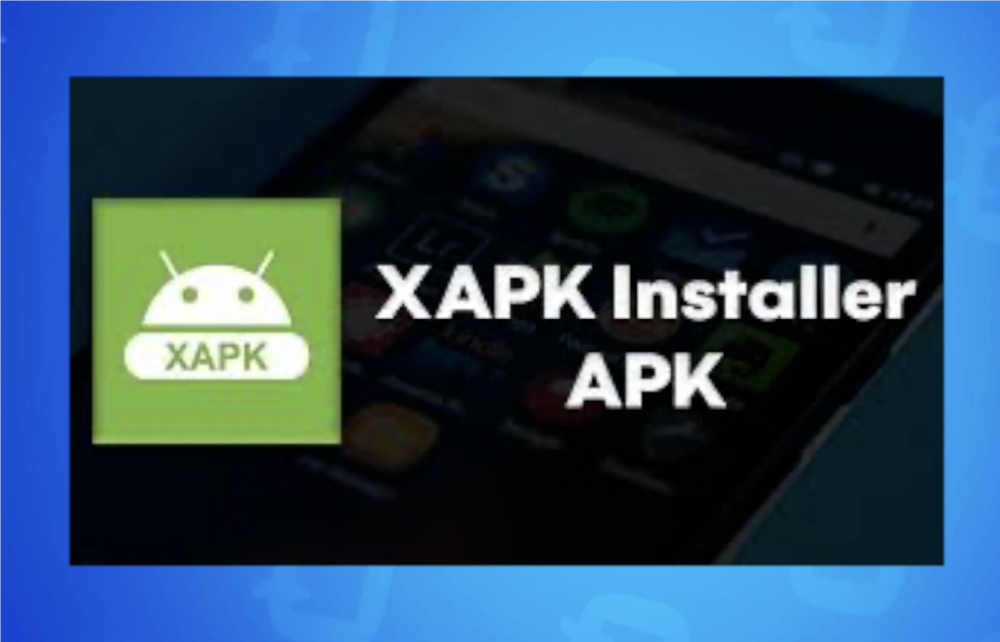

此类工具有很多，本文截图只是其中一种，不代表只能使用这一款。选择安装器时，尽量使用下载量高、评价正常、来源清楚的版本。

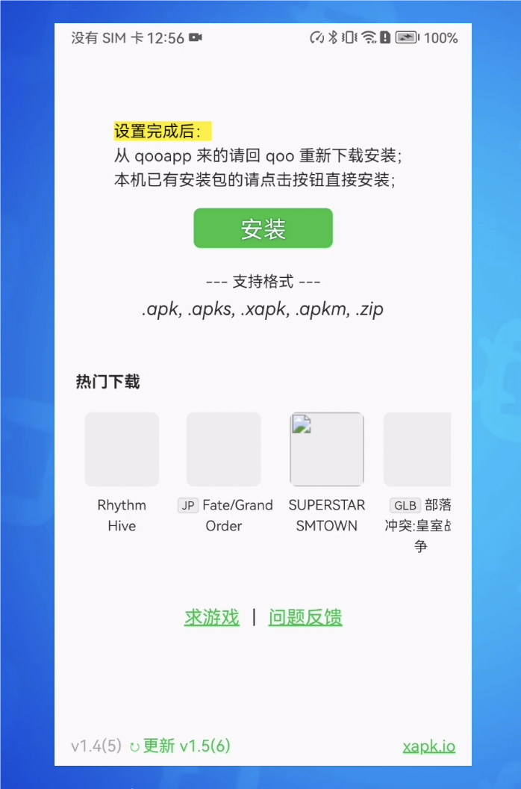

安装并打开 XAPK 安装器后，选择已经下载好的皇室战争国际服 XAPK 文件。

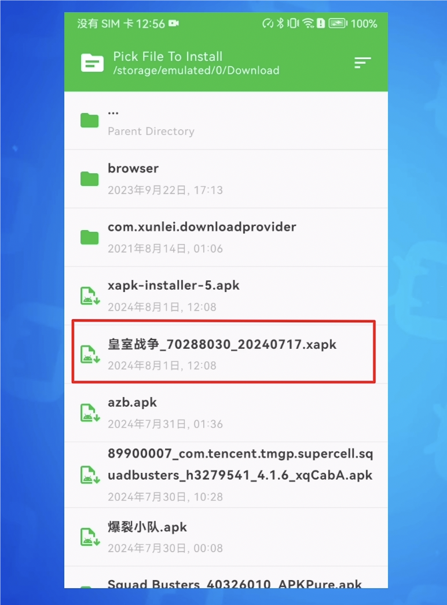

如果安装器弹出多个待安装组件，通常全部勾选即可。除非你非常清楚每个拆分包的作用，否则不建议手动取消某一项。

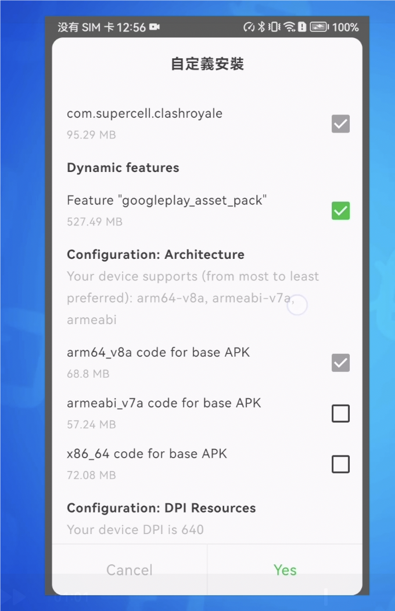

稍等片刻，系统会进入安装流程。安装完成后先启动一次游戏，如果能进入加载界面或登录界面，就说明安装包本身基本没有问题。

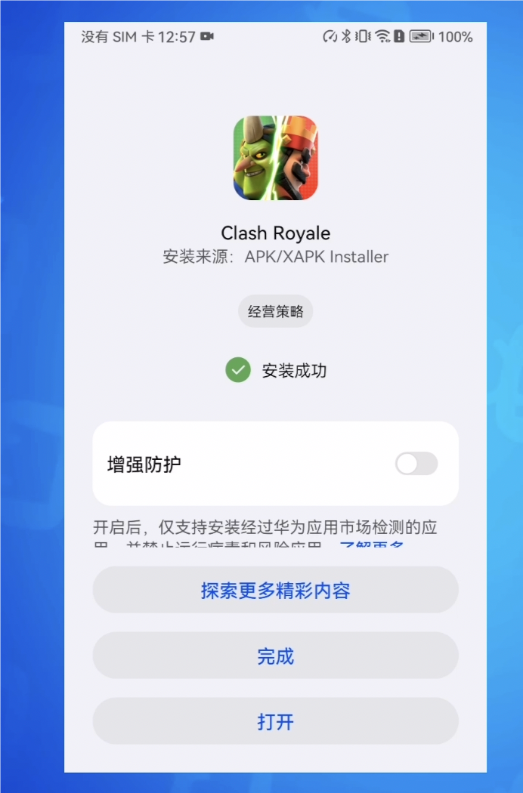

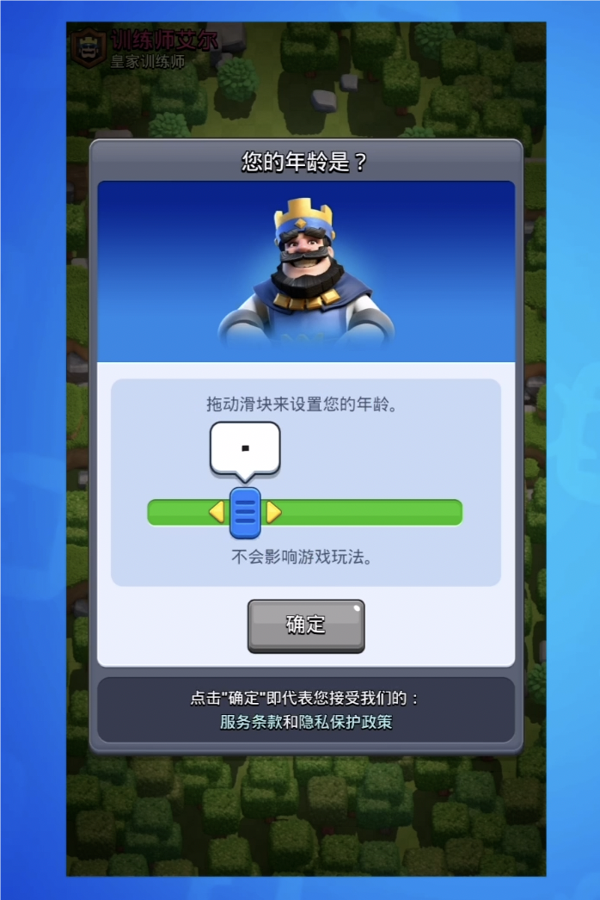

## 方法二：使用二次封装安装包

有些网站会把 XAPK 和安装器重新打包成一个 APK。打开后看起来像普通安装包，点确认后它会自动解包并安装游戏。

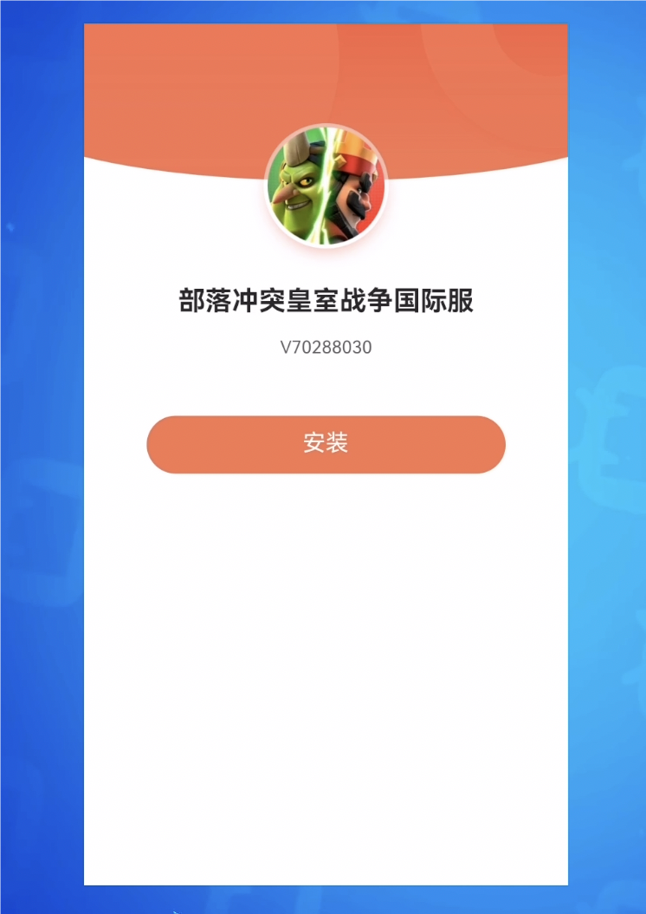

这种方式的优点是省步骤，适合不想处理 XAPK 的玩家。缺点也很明显：你拿到的是别人二次处理过的文件，如果来源不可靠，就不应该为了图方便去安装。

如果你决定使用这种方式，至少确认三件事：文件来源是否可信，文件大小是否明显异常，安装时有没有要求和游戏无关的敏感权限。

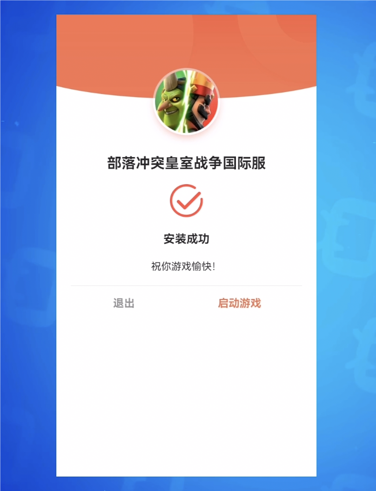

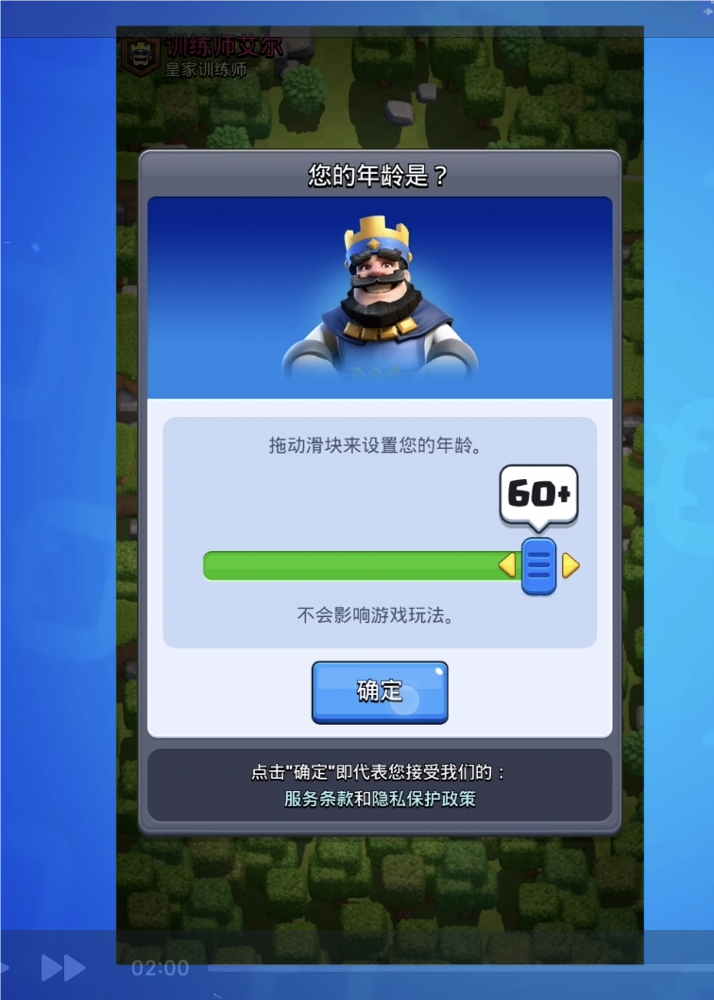

我们之前测试过的这类安装包，本质上是把原始 XAPK 和安装器整合到一个新的 APK 里，类似一个自解压文件。流程可行，但安全性取决于打包来源。

## 常见安装问题

### 安装包打不开

先看文件后缀。如果是 `.apk`，可以直接交给系统安装；如果是 `.xapk`，需要 XAPK 安装器；如果文件后缀被浏览器或网盘改乱了，先重新下载，不要随便改名硬装。

### 提示解析包失败

通常是安装包损坏、下载不完整、系统版本过低，或者设备架构不匹配。先重新下载一次，再确认手机系统版本和安装包版本是否适配。

### 提示无法安装未知应用

进入系统设置，给当前使用的文件管理器、浏览器或 XAPK 安装器开启“安装未知应用”权限。不同品牌入口不同，一般可以在“安全”“隐私”“应用权限”附近找到。

### 覆盖安装失败

常见原因是新旧安装包签名不同。比如你之前用 A 渠道安装，现在换成 B 渠道更新，就可能无法覆盖。最稳的办法是尽量沿用同一渠道更新；如果必须换渠道，先确认自己的 Supercell ID 已经绑定，再考虑卸载重装。

### 启动后闪退或卡加载

先检查网络连接、加速器节点和手机剩余空间。部分机型还会受到系统后台限制影响，可以把游戏和加速器加入后台白名单。若仍然闪退，再考虑换一个来源更可靠的安装包。

### 部分旧版 MIUI 安装失败

群内玩家曾反馈，部分旧版 MIUI 设备如果安装时报错，可以检查开发者选项中的系统优化设置。新版系统不一定还有同名选项，没有报错时也不建议主动修改。

### XAPK 安装器仍然装不上

Android 机型和系统改动非常多，个别设备确实会遇到 XAPK 安装器不兼容的情况。这时可以考虑 Google Play、QooApp、OurPlay、GamesToday 等其他渠道或容器方案，但仍然要把来源可靠性放在第一位。

## 总结

Android 安装皇室战争国际服，优先级很清楚：能用 Google Play 就用 Google Play；不能用商店，再选择可信来源的 XAPK 和安装器；二次封装包只适合你能确认来源的情况。

后续更新也按同样逻辑处理。不要今天用这个渠道，明天换另一个渠道，否则很容易遇到签名不一致、覆盖安装失败或者版本不匹配。只要已经绑定 Supercell ID，即使最后需要卸载重装，也能把账号风险降到最低。

## 安装包与工具获取

站内资源页会整理常用安装包、XAPK 安装器和相关工具。每次客户端更新后，资源页也会尽量同步维护；如果你发现版本失效，可以通过页面底部的联系方式反馈。

网盘链接：

[国际服资源下载](/resources/)

也可以关注“皇室小蜜”公众号，在后台发送“全家桶”获取常用资源入口。
