2022 年 3 月皇室战争国服与国际服分开运营后，两个版本在更新进度、账号体系和应用商店下载方式上逐渐产生差异。Android 玩家通常还能通过 APK 或 XAPK 解决，iPhone 和 iPad 就麻烦一些：你既要处理 App Store 地区，又要处理旧缓存和后续更新。

这篇文章只解决 iOS 设备的安装和维护问题。最后核验时间为 2026 年 8 月 9 日，具体界面可能会随 Apple、App Store 和游戏版本调整而变化，但判断顺序基本不变：先尝试官方商店下载，失败后再考虑旧版 IPA 方案。

## 适合谁

- 使用 iPhone 或 iPad，并希望安装皇室战争国际服。
- 已经准备了海外 Apple ID，但打开游戏后反复提示更新。
- 想在同一台设备上同时保留国服和国际服。
- 准备绑定 Supercell ID，避免后续换设备或重装时丢账号。

如果你使用的是 Android 手机，可以直接看《[皇室战争国际服 Android 安装指南](/posts/clashroyale/2025/03/how_to_install_clashroyale_android/)》。

## 先判断自己需不需要旧版 IPA

分服刚开始那段时间，iOS 安装国际服相对简单：准备一个海外 Apple ID，在 App Store 搜索 Clash Royale 下载即可。后来随着国际服多次更新，这个办法在部分设备上会失灵。

如果你是新设备，或者手机里从来没有安装过皇室战争，通常可以先走最简单的路线：

- 准备一个海外 Apple ID。
- 用这个 Apple ID 登录 App Store。
- 搜索 Clash Royale 并下载。
- 启动游戏，完成新手教程。
- 进入游戏设置，绑定 Supercell ID。

如果游戏能正常进入新手教程，后面的事情就简单了。以后国际服更新时，登录同一个海外 Apple ID，到 App Store 更新即可。

如果启动界面一直提示“你可以下载新版本了”，并且跳转后又回到国服或无法完成更新，就说明设备里可能残留了旧缓存，或者 App Store 地区没有正确对应国际服。这时再看下面的旧版 IPA 方案。

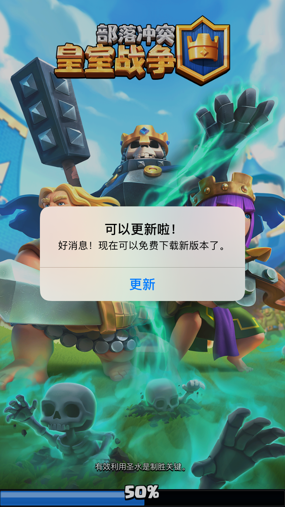

## 准备工作

旧版 IPA 方案的思路是：先通过旧版 iTunes 下载一个分服前可用的皇室战争安装包，再借助爱思助手安装到手机。这个版本启动后可以跳转到国际服更新，不会直接被国服商店流程卡住。

开始前需要准备：

- 一台 Windows 电脑，建议 Win 7 以上。
- 一根可以正常传输数据的数据线。
- 爱思助手。
- iTunes 12.6.5.3。
- iTunes 旧版本下载工具。
- 一个海外 Apple ID，本文以美区为例。
- 可用的网络加速方式。

这套流程涉及第三方工具和设备数据操作。开始前请备份重要数据，也不要把 Apple ID、验证码或 Supercell ID 登录信息交给陌生人。

## 安装旧版 iTunes

先确认电脑上没有安装其他版本的 iTunes。如果已经安装，建议彻底卸载后再继续，避免新版 iTunes 和旧版工具互相干扰。

下载并安装爱思助手。安装过程中如果提示是否自动安装或更新 iTunes，选择否。否则它可能会安装新版 iTunes，后面还要重新卸载。

进入爱思助手后，点击顶部的“智能刷机”，再进入左侧“其他工具”。这里通常能看到两个 iTunes 版本，选择安装 12.6.5.3。

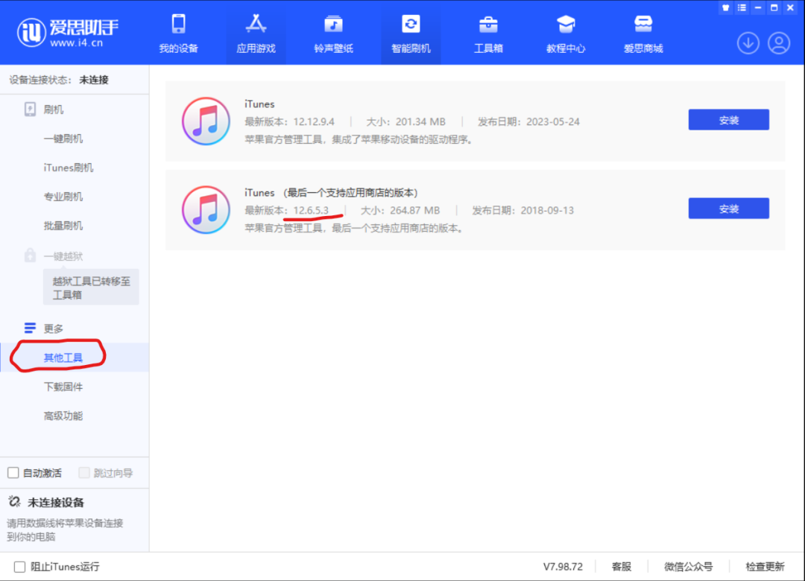

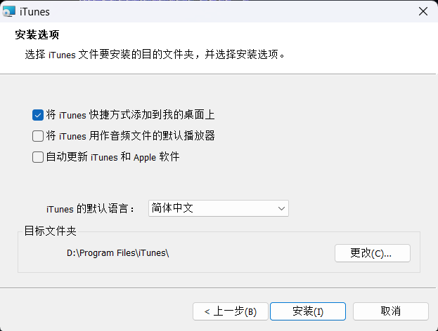

iTunes 安装完成后先启动一次，并使用美区 Apple ID 登录。注意，旧版本下载工具最好等 iTunes 登录成功后再打开，否则可能导致登录失败。

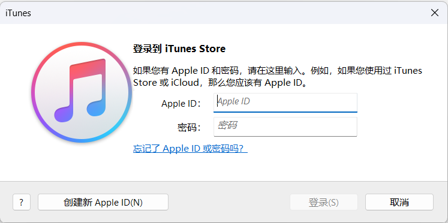

## 下载旧版 Clash Royale IPA

在 iTunes 主界面，左上角切换到“应用”，然后在右上角搜索 Clash Royale。

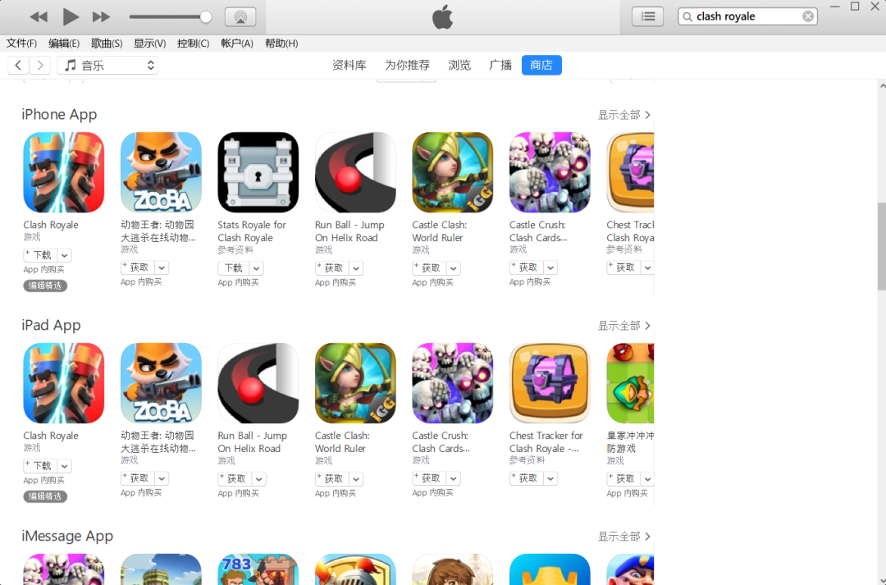

看到搜索结果后，先不要急着下载。此时打开 iTunes 旧版本下载工具。第三方工具必须从可信来源获取；如果安全软件提示风险，不建议靠关闭系统保护硬跑，先核对来源，无法确认就停下。

在旧版本下载工具中搜索 Clash Royale，并把搜索框后的地区切换到美国。

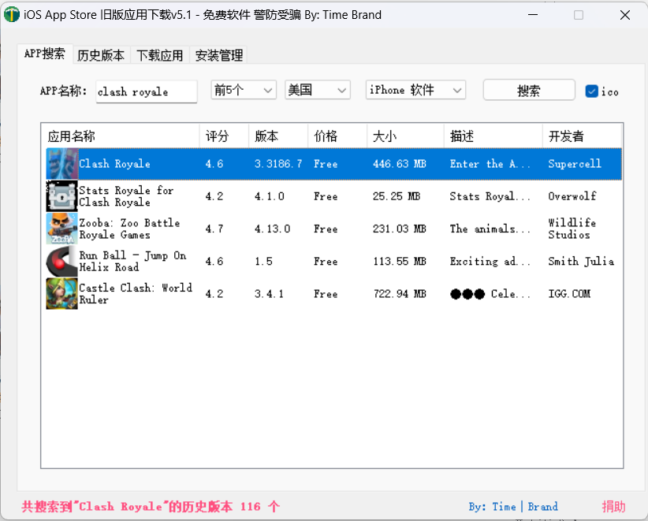

双击搜索结果里的 Clash Royale，进入“历史版本”页签，找到 3.1708.3。这个版本对应的版本 ID 是 830919677，双击锁定。

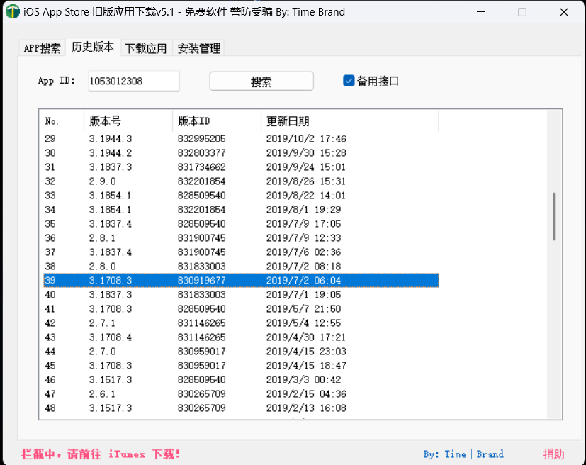

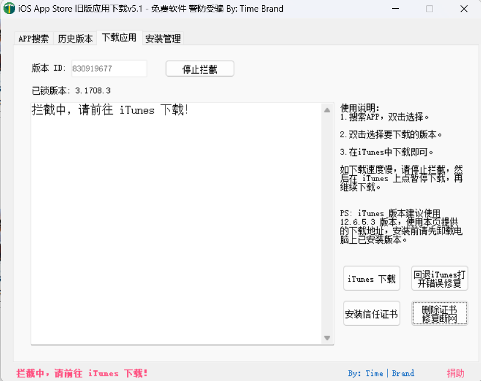

锁定版本后，回到 iTunes 的搜索结果页面，点击 Clash Royale 图标下的“下载”。右上角出现下载图标就表示开始下载了。如果失败，可以稍后重试。

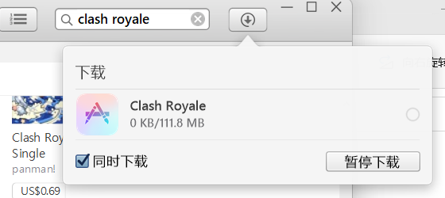

下载完成后，点击 iTunes 里的“资料库”，能看到已经下载好的皇室战争安装包。

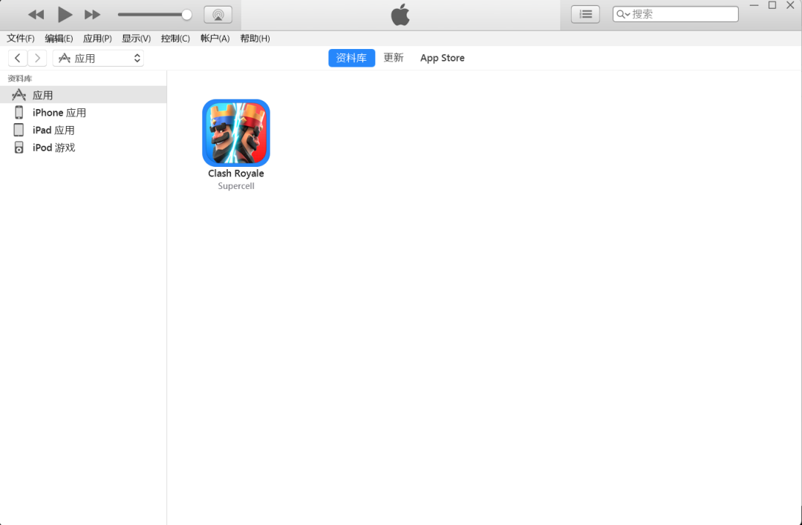

右键点击安装包，选择“在 Windows 资源管理器中显示”。这就是需要安装到手机里的 3.1708.3 版本 IPA。

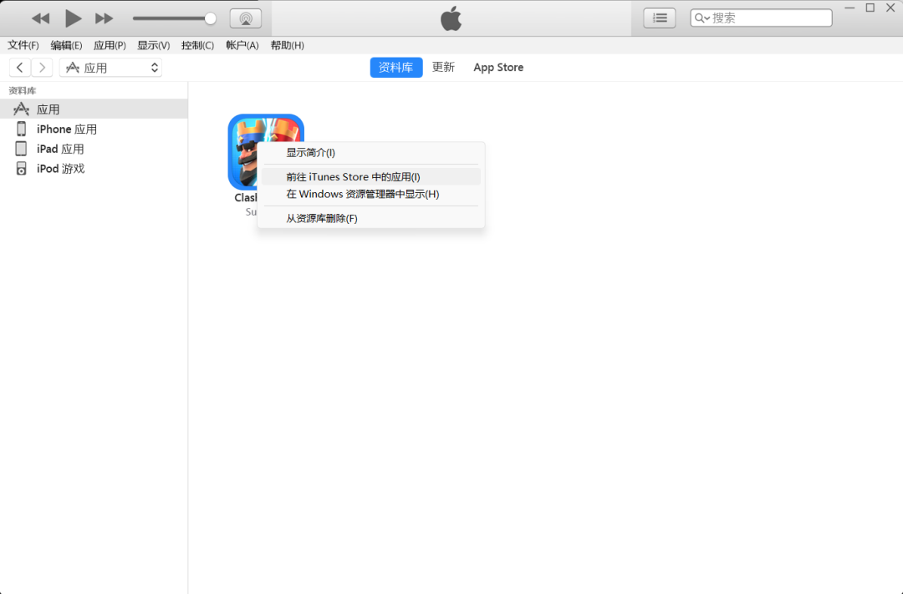

## 安装到 iPhone 或 iPad

用数据线连接手机和电脑，通过爱思助手安装刚才下载好的 IPA。

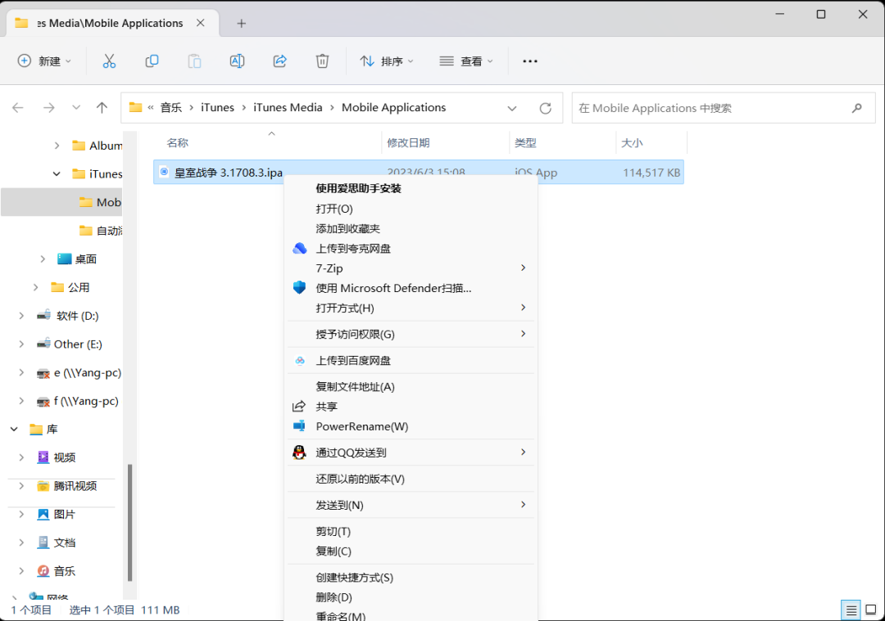

安装完成后先不要急着直接进游戏。建议先开启加速器，并在手机 App Store 登录前面使用的海外 Apple ID。

启动游戏后，主界面选择“游客登录”。这一步主要是为了让游戏走一次国际服更新流程。如果设备缓存问题还在，这里最容易暴露。

随后游戏会提示更新，点击后跳转到 App Store。完成更新后重新启动游戏，做完新手教程，再绑定 Supercell ID。

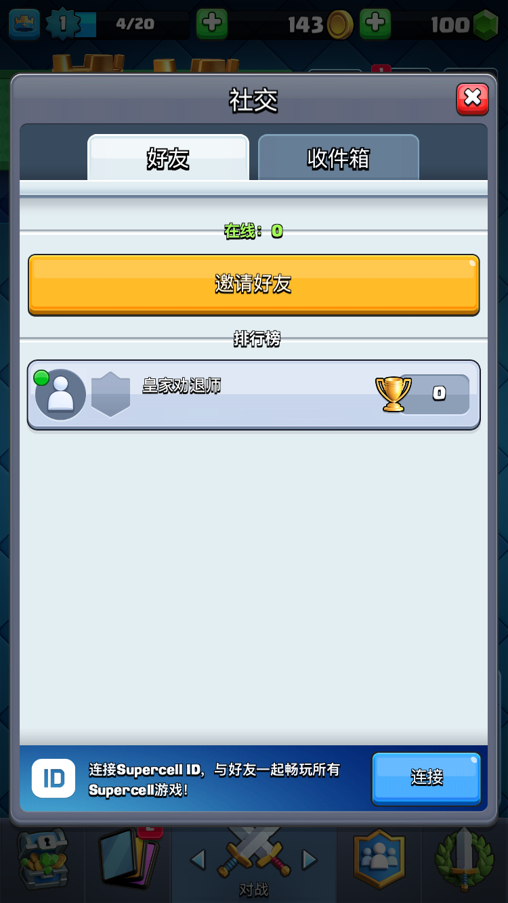

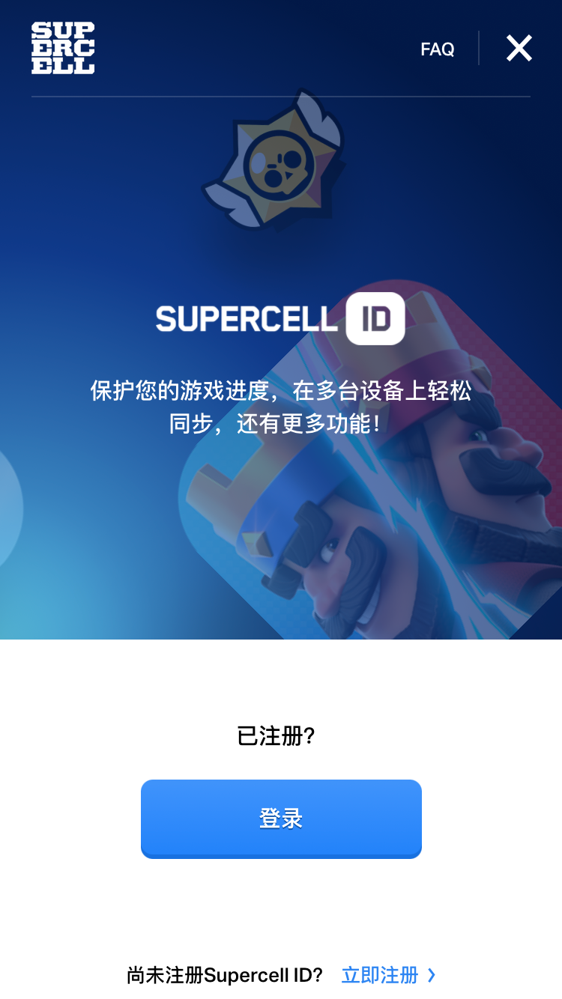

绑定 Supercell ID 很重要。只要账号绑定成功，以后更换设备、卸载重装或切换登录方式，风险都会小很多。

## 后续更新和日常使用

国际服和国服可以同时保留在同一台 iPhone 或 iPad 上。国服用国区 Apple ID 更新，国际服用下载它时的海外 Apple ID 更新。哪个版本提示更新，就切到对应 Apple ID 再进 App Store。

加速器不是每次都必须开。注册 Supercell ID、首次登录、网络波动或者匹配延迟明显时，通常需要用一下；如果日常对战稳定，就可以按自己的网络情况决定。

从国服切到国际服后，延迟手感可能会不同。尤其是下牌提前量、对局里的小延迟，刚开始需要适应一段时间。

## 常见问题

### 已经下载国际服，为什么还提示更新

通常是 App Store 地区、设备缓存或旧安装记录的问题。先确认当前 App Store 登录的是海外 Apple ID；如果仍然跳转异常，再考虑使用本文的旧版 IPA 过渡方案。

### 能不能不清除手机数据

可以先不清除。新设备或从未安装过皇室战争的设备，一般不需要清除数据。如果之前装过国服并且反复被更新提示卡住，才需要考虑更彻底的处理方式。清除设备数据风险较高，动手前一定要备份。

### 旧版 iTunes 和第三方工具安全吗

这类工具的风险主要来自下载来源和文件是否被篡改。尽量从可信来源获取，不要关闭安全软件强行运行，也不要在不明工具里输入账号密码。

### 国际服和国服账号互通吗

国服和国际服不是同一个运营环境。是否能找回、迁移或继续使用旧账号，取决于你的账号状态和 Supercell ID 绑定情况。新玩家应尽早绑定 Supercell ID。

## 相关资源

教程中用到的安装包和工具，会整理在站内资源页。页面维护时会尽量更新版本说明；如果链接失效，可以通过站内联系方式反馈。

[国际服资源下载](/resources/)
