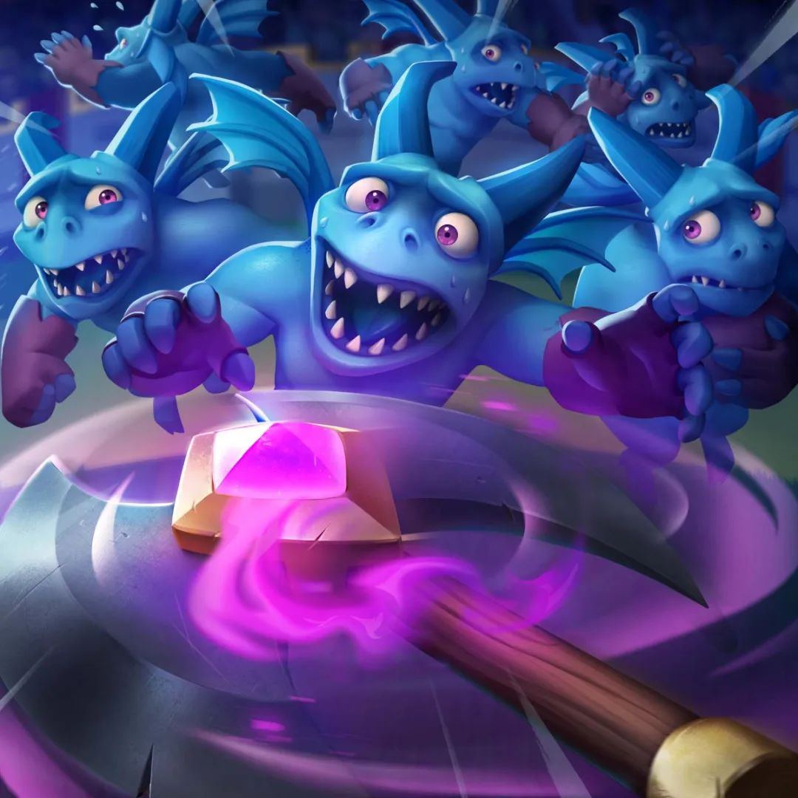

必下个月的新卡和觉醒卡牌对大家来说已经不是新鲜事了。  
  
官方仅仅放出了新卡的概念图片，结果没过多久，新卡与下个月的觉醒卡牌便被某位官方创作者泄露了出来。这种情况并非首次发生，之前的新卡小王子和觉醒武神瓦基里也遭到了不同程度的提前曝光。  
  
众所周知，一些 Supercell 认证的官方创作者能够提前在测试服务器中体验新卡，以便在正式发布时为玩家带来第一手的攻略和评测。按照规定，他们本应受到严格的保密协议约束。然而，无论是有意还是无心，这些新的内容还是以各种方式被流出，让官方的“神秘感”大打折扣。  
## 新卡  
  
关于新卡，上一篇文章有着详细的解读，可以参见：  
  
[又来新卡？棒球，球棍，还有炸弹~](/posts/clashroyale/2025/03/new-card-teaser)  
  
下面是更详细的卡牌情报：  
- • 卡牌类型：**英雄卡**  
  
- • 名称：Boss Bandit（中文译名暂未确定，可译作“刺客老大”或“刺客王”或者“首席刺客”。小tip，其实Bandit本意是土匪之意，中文版本做了一定的美化与和谐，不过到也挺信雅达）  
  
- • 英雄技能——逃脱炸弹：  
  
- • 触发时会隐身并向后传送 6 格，隐身持续 1 秒。  
  
- • 触发机制：不同于其他英雄的冷却时间触发机制，该技能的发动条件是当血量低于 50% 时自动触发，意味着 Boss Bandit 会是一个极具生存能力的英雄。  
  
此外，游戏内的技能演示视频也已经泄露，从整体的演示来看，准确度较高，比较保真，这次的新卡八九不离十了。  

[视频链接](https://mp.weixin.qq.com/s/VCnrGV5GA6TuOdg0dieOig)  
  
那么，Boss Bandit 在战场上究竟会如何影响环境？  
  
从技能来看，它的瞬间隐身和传送使得它在对战中具备极强的生存能力，并能在关键时刻撤退、规避伤害。这意味着它可能会成为一个极难针对的英雄单位，类似于当年刚推出的女皇，在控制类卡牌有限的情况下，能否克制住这张新卡可能会成为下赛季的热门话题。  
  
此外，由于该英雄技能的触发机制基于血量阈值而非固定冷却时间，这意味着它的生存策略将与现有英雄完全不同---Boss Bandit   
具备较高的机动性，在实战中，玩家可能会利用它的技能创造更多战术变化，比如在桥头打出一波进攻后，残血的她返场后压力十足，还可以快速触发技能完成撤退，避免被敌方关键单位锁定。  
同时，它的技能触发方式也可能导致对手在交出进攻手段时更加谨慎，增加操作难度。  
这张新卡是否会成为一种新的节奏核心？  
答案可能要等赛季更新后才能揭晓。  
## 觉醒屠夫  
  
是的，那个会吓小朋友的屠夫要觉醒了。  
  
  
  
首先，从官媒发布的图片来看，觉醒屠夫肯定是实锤的。  
  
  
  
而最早的泄露图片甚至让很多玩家误以为是玩家自制的 P 图，因为相比以往的觉醒卡牌，这次的卡面设计看起来并不算特别精良。  
  
但事实证明，这并不是愚人节玩笑，而是实打实的觉醒屠夫。泄露视频如下：  
  
[视频链接](https://mp.weixin.qq.com/s/VCnrGV5GA6TuOdg0dieOig)  
  
目前曝光的情报如下：  
- • 觉醒后，屠夫的飞斧将自带击退效果，这意味着它将成为一个更为恐怖的防守单位。  
  
- • 原本的屠夫就已经能有效对抗推进型卡组，觉醒后再加上击退效果，极有可能进一步加强它的防推进能力，特别是针对胖子、天狗、野猪这类核心单位，都会形成更大的压制力。  
  
那么，这张觉醒卡能带来多大影响？  
  
如果击退效果能对大部分单位生效，推测屠夫会成为许多卡组的必带防守核心，甚至可能会成为新一代的核心推进克星。毕竟，以前遇到野猪、攻城槌、皇家巨人之类的卡组，单靠屠夫的原始 DPS 还不足以完全遏制，但觉醒后增加了击退能力，或许将彻底改写推进卡组的对局策略。  
  
下赛季，大闪的含金量将继续提高，不，光一个大闪都不够了。  
## 愚人节玩笑？  
  
目前所有的信息虽然看起来十分真实，但在四月愚人节即将到来之际，也有不少玩家开始怀疑这是否是 Supercell 与创作者们联合策划的一场愚人节大戏。  
  
要知道，Supercell 一向都有愚人节玩梗的优良传统。  
  
那么，Boss Bandit 和觉醒屠夫，会不会也是一次愚人节的“预告”呢？  
  
如果不是，那目前来看，下个赛季已经可以确认的内容包括：  
- • Boss Bandit（刺客老大）：首个具备百分比血量触发技能的英雄单位，带有隐身+传送机制，或将成为极具威胁的生存型英雄。  
  
- • 觉醒屠夫：飞斧将带有击退效果，加强其防守推进的能力，可能会让推进卡组的生存环境进一步恶化。  
  
- • 宝箱钥匙的移除，切记要在赛季更新前全部用掉，这一点之前官方也早就发过通告。  
  
你怎么看这次的泄露事件？新卡和觉醒屠夫是否会带来新的环境变动？  
  
欢迎在评论区讨论你的看法，期待新赛季的到来！  