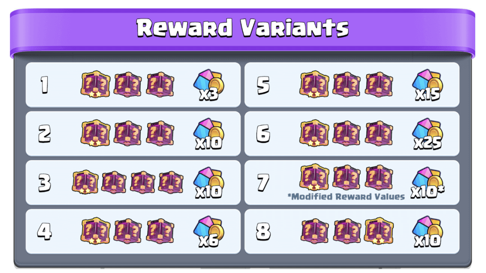
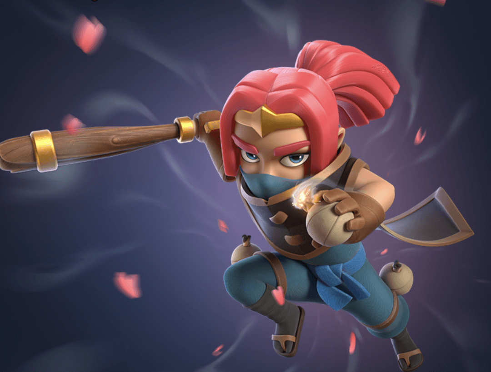

《皇室战争》即将迎来4月份的大型更新，本次更新对游戏的核心奖励机制进行了重大调整，取消了传统的宝箱队列系统，同时对对战奖励、主题季奖励、军队寻路系统等方面进行了优化。此外，还新增了一位全新英雄“刺客头领”以及全新觉醒卡牌“飞斧屠夫”。  
## 对战奖励机制大改  
  
本次更新对对战奖励系统进行了彻底革新，原有的宝箱队列、开箱时间以及宝箱钥匙被完全移除，取而代之的是即时领取奖励的机制。玩家在每场对战结束后，即可直接获得奖励，无需再等待宝箱开启。  
  
官方表示，此次改动的目标是让玩家能够更加自由地规划自己的游戏节奏，无需受限于宝箱开箱时间。全新的对战奖励系统还与每日获胜奖励进行了整合，所有奖励都能即时获取，大幅提升了游戏的流畅度和爽快感。  
### 全新对战奖励系统详解  
- • **每天前3次胜利**：可获得幸运惊喜、额外奖励和皇冠。  
  
- • **接下来的7次胜利**：可继续获得额外奖励和皇冠。  
  
- • **此后**：继续赢得皇冠。  
  
  
  
值得注意的是，官方计划在更新上线后的前4周进行不同奖励机制的测试，因此不同玩家可能会获得不同的奖励分配方案。  
  
此外，额外的每日胜场奖励也得到了调整，前3场对战可额外获得5个皇冠，每天最多可获得15个额外皇冠。  
### 宝箱队列和钥匙移除  
  
由于宝箱队列系统的移除，玩家当前拥有的未开启宝箱将在更新后自动开启，所有奖励将直接到账。此外，玩家手中的宝箱钥匙将被转化为金币进行补偿，兑换比例如下：  
- • **1把宝箱钥匙 = 5000金币**（最多兑换30把，即150000金币）。  
  
## 主题季奖励调整  
  
本次更新还对主题季奖励系统进行了调整，主题季商店将被移除，主题季代币也会同步取消，原本的奖励将分配到其他游戏系统中。  
  
官方表示，虽然主题季商店提供了丰富的奖励，但整体人气并不高，部分玩家甚至不知道该商店的存在。为了优化玩家体验，官方决定重新分配这些奖励，使所有玩家都能轻松获取。  
### 调整后的奖励获取方式  
- • **魔法碎片**：将被添加至免费令牌奖励路径中。  
  
- • **觉醒碎片与卡牌之书**：可通过达成游戏里程碑、社区活动等方式获取。  
  
### 战旗宝箱与战旗券移除  
  
战旗宝箱与战旗券也将在本次更新中被移除，相关奖励将调整至挑战模式、活动、幸运惊喜以及皇室令牌等系统中。  
  
战旗券的补偿方案如下：  
- • **100战旗券 = 2000金币**（最多兑换2000战旗券，即40000金币）。  
  
## 新英雄和觉醒卡牌  
  
本次更新带来了全新的6费英雄——**刺客头领**。  
  
刺客头领是一位高风险高回报型英雄，她拥有类似幻影刺客的突袭能力，并具备主动技能“逃生手榴弹”，可在战斗中快速撤退并重新发起攻击。  
  
  
  
更令人兴奋的是，当刺客头领的生命值降至50%以下时，她的技能冷却将被重置，使玩家有机会通过精妙操作扭转战局。  
  
  
  
此外，**觉醒飞斧屠夫**也将在本次更新中正式上线。升级后的飞斧屠夫可以对附近的单位造成额外伤害，并伴随击退效果，这使得他在近战对抗中更具威胁性，并进一步增强了竞技场的控制能力。  
  
**刺客头领与觉醒飞斧屠夫的上线时间为4月7日。**  
## 寻路系统优化  
  
本次更新对游戏中的寻路系统进行了大幅优化，主要调整点如下：  
1. 1. **建筑识别优化**：军队现在可以提前识别建筑物位置，并自动调整行进路线，而不是在撞上后才绕路。  
  
1. 2. **移动路径调整**：军队的行进方式更趋自然，不再依赖固定路径，水平移动的频率降低，改为更流畅的斜向移动。  
  
官方强调，这次优化不会影响游戏的平衡性，而是为了让单位的移动更加稳定、可预测，同时修复部分异常寻路问题。  
## 其他优化与修复  
### 幸运惊喜优化  
- • 幸运惊喜的开卡概率调整，2星、3星幸运惊喜更容易升级至4星，4星幸运惊喜有概率升级至5星。  
  
- • 3星幸运惊喜现在可以开出皇家塔部队。  
  
### 新增“再来一场”按钮  
- • 现在玩家在对战结束后，可点击该按钮直接进入下一场匹配，无需返回主界面（仅适用于普通对战模式，不适用于锦标赛和挑战模式）。  
  
### 更多优化和修复  
- • **猪猪存钱罐** 现已移至商店。  
  
- • **网络延迟优化**，改善部分玩家的连接体验。  
  
- • **装扮选择优化**，卡组收藏界面将显示当前皇家塔皮肤，并提供直接编辑选项。  
  
- • **狂暴法术调整**，现可提升飞斧屠夫和蛮羊骑士的攻击速度。  
  
- • **军队部署对称优化**，所有能召唤3个及以上单位的卡牌在竞技场两侧的排列方式将完全对称。  
  
- • **符文巨人调整**，被觉醒哥布林牢笼拉入后，不再提供附魔效果。  
  
- • **皇家大厨的煎饼** 现在可命中突进单位以及地下的威猛矿工。  
  
## 总结  
  
《皇室战争》4月更新带来了众多令人期待的改动，尤其是对战奖励的全面改革，使玩家可以更加自由地进行游戏，无需受限于宝箱开箱时间。同时，新英雄“刺客头领”和觉醒“飞斧屠夫”的加入，也将为竞技场带来更多战术选择。此外，寻路系统的优化以及大量Bug修复，让游戏体验更加顺畅。  
  
本次更新计划于**4月7日正式上线**，让我们拭目以待！  
