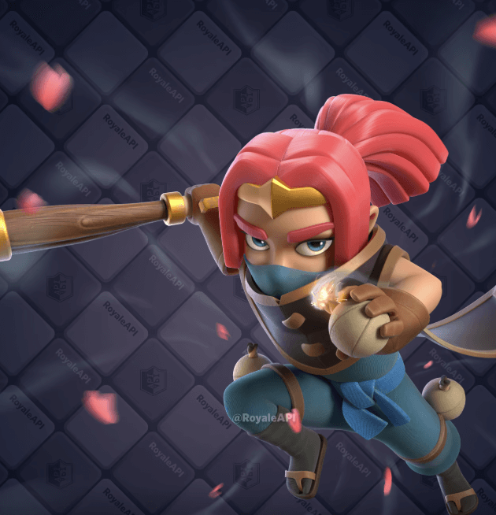
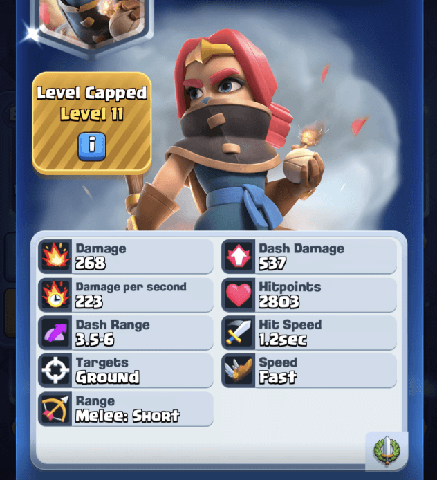
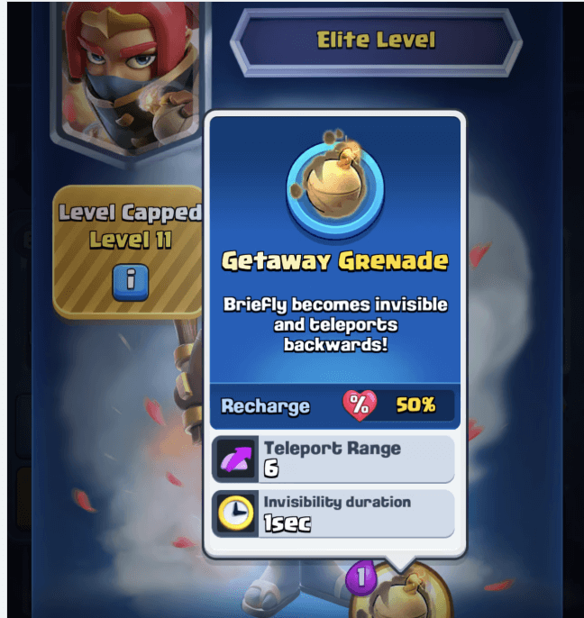

   
  
**刺客首领**将是游戏中第8张英雄卡牌，也是首个融合生命值触发机制与英雄技能的特殊角色。  
  
  
  
作为目前费用最高的英雄卡（6圣水），她的卡牌描述如下：  
> "森林帮派的首领终于现身...勉强算吧。刺客首领会冲刺攻击目标，冲刺期间无敌。当情况危急时，她随时准备掏出那对手雷。"  
  
## 卡牌数据  
  
  
### 基础属性  
- **生命值**：2,803（6费单位标准水平）  
  
- 定位介于中型近战单位与重型单位之间  
  
<table><thead style="border-width: 0px;border-style: solid;border-color: hsl(var(--border));line-height: 1.75;background: rgba(0, 0, 0, 0.05);font-weight: bold;color: rgb(63, 63, 63);"><tr style="border-width: 0px;border-style: solid;border-color: hsl(var(--border));"><td style="border-color: rgb(223, 223, 223);line-height: 1.75;padding: 0.25em 0.5em;word-break: keep-all;">卡牌</td><td style="border-color: rgb(223, 223, 223);line-height: 1.75;padding: 0.25em 0.5em;word-break: keep-all;">生命值</td><td style="border-color: rgb(223, 223, 223);line-height: 1.75;padding: 0.25em 0.5em;word-break: keep-all;">费用</td><td style="border-color: rgb(223, 223, 223);line-height: 1.75;padding: 0.25em 0.5em;word-break: keep-all;">生命值/费用比</td></tr></thead><tbody style="border-width: 0px;border-style: solid;border-color: hsl(var(--border));"><tr style="border-width: 0px;border-style: solid;border-color: hsl(var(--border));"><td style="border-color: rgb(223, 223, 223);line-height: 1.75;padding: 0.25em 0.5em;color: rgb(63, 63, 63);word-break: keep-all;">刺客</td><td style="border-color: rgb(223, 223, 223);line-height: 1.75;padding: 0.25em 0.5em;color: rgb(63, 63, 63);word-break: keep-all;">906</td><td style="border-color: rgb(223, 223, 223);line-height: 1.75;padding: 0.25em 0.5em;color: rgb(63, 63, 63);word-break: keep-all;">3</td><td style="border-color: rgb(223, 223, 223);line-height: 1.75;padding: 0.25em 0.5em;color: rgb(63, 63, 63);word-break: keep-all;">302</td></tr><tr style="border-width: 0px;border-style: solid;border-color: hsl(var(--border));"><td style="border-color: rgb(223, 223, 223);line-height: 1.75;padding: 0.25em 0.5em;color: rgb(63, 63, 63);word-break: keep-all;">骑士</td><td style="border-color: rgb(223, 223, 223);line-height: 1.75;padding: 0.25em 0.5em;color: rgb(63, 63, 63);word-break: keep-all;">1,766</td><td style="border-color: rgb(223, 223, 223);line-height: 1.75;padding: 0.25em 0.5em;color: rgb(63, 63, 63);word-break: keep-all;">3</td><td style="border-color: rgb(223, 223, 223);line-height: 1.75;padding: 0.25em 0.5em;color: rgb(63, 63, 63);word-break: keep-all;">589</td></tr><tr style="border-width: 0px;border-style: solid;border-color: hsl(var(--border));"><td style="border-color: rgb(223, 223, 223);line-height: 1.75;padding: 0.25em 0.5em;color: rgb(63, 63, 63);word-break: keep-all;">黄金圣骑</td><td style="border-color: rgb(223, 223, 223);line-height: 1.75;padding: 0.25em 0.5em;color: rgb(63, 63, 63);word-break: keep-all;">1,799</td><td style="border-color: rgb(223, 223, 223);line-height: 1.75;padding: 0.25em 0.5em;color: rgb(63, 63, 63);word-break: keep-all;">4</td><td style="border-color: rgb(223, 223, 223);line-height: 1.75;padding: 0.25em 0.5em;color: rgb(63, 63, 63);word-break: keep-all;">450</td></tr><tr style="border-width: 0px;border-style: solid;border-color: hsl(var(--border));"><td style="border-color: rgb(223, 223, 223);line-height: 1.75;padding: 0.25em 0.5em;color: rgb(63, 63, 63);word-break: keep-all;">王子</td><td style="border-color: rgb(223, 223, 223);line-height: 1.75;padding: 0.25em 0.5em;color: rgb(63, 63, 63);word-break: keep-all;">1,920</td><td style="border-color: rgb(223, 223, 223);line-height: 1.75;padding: 0.25em 0.5em;color: rgb(63, 63, 63);word-break: keep-all;">5</td><td style="border-color: rgb(223, 223, 223);line-height: 1.75;padding: 0.25em 0.5em;color: rgb(63, 63, 63);word-break: keep-all;">384</td></tr><tr style="border-width: 0px;border-style: solid;border-color: hsl(var(--border));"><td style="border-color: rgb(223, 223, 223);line-height: 1.75;padding: 0.25em 0.5em;color: rgb(63, 63, 63);word-break: keep-all;">武僧</td><td style="border-color: rgb(223, 223, 223);line-height: 1.75;padding: 0.25em 0.5em;color: rgb(63, 63, 63);word-break: keep-all;">2,150</td><td style="border-color: rgb(223, 223, 223);line-height: 1.75;padding: 0.25em 0.5em;color: rgb(63, 63, 63);word-break: keep-all;">5</td><td style="border-color: rgb(223, 223, 223);line-height: 1.75;padding: 0.25em 0.5em;color: rgb(63, 63, 63);word-break: keep-all;">430</td></tr><tr style="border-width: 0px;border-style: solid;border-color: hsl(var(--border));"><td style="border-color: rgb(223, 223, 223);line-height: 1.75;padding: 0.25em 0.5em;color: rgb(63, 63, 63);word-break: keep-all;"><strong style="border-width: 0px;border-style: solid;border-color: hsl(var(--border));line-height: 1.75;font-size: inherit;color: rgb(15, 76, 129);">刺客首领</strong></td><td style="border-color: rgb(223, 223, 223);line-height: 1.75;padding: 0.25em 0.5em;color: rgb(63, 63, 63);word-break: keep-all;"><strong style="border-width: 0px;border-style: solid;border-color: hsl(var(--border));line-height: 1.75;font-size: inherit;color: rgb(15, 76, 129);">2,803</strong></td><td style="border-color: rgb(223, 223, 223);line-height: 1.75;padding: 0.25em 0.5em;color: rgb(63, 63, 63);word-break: keep-all;"><strong style="border-width: 0px;border-style: solid;border-color: hsl(var(--border));line-height: 1.75;font-size: inherit;color: rgb(15, 76, 129);">6</strong></td><td style="border-color: rgb(223, 223, 223);line-height: 1.75;padding: 0.25em 0.5em;color: rgb(63, 63, 63);word-break: keep-all;"><strong style="border-width: 0px;border-style: solid;border-color: hsl(var(--border));line-height: 1.75;font-size: inherit;color: rgb(15, 76, 129);">467</strong></td></tr><tr style="border-width: 0px;border-style: solid;border-color: hsl(var(--border));"><td style="border-color: rgb(223, 223, 223);line-height: 1.75;padding: 0.25em 0.5em;color: rgb(63, 63, 63);word-break: keep-all;">大骷髅</td><td style="border-color: rgb(223, 223, 223);line-height: 1.75;padding: 0.25em 0.5em;color: rgb(63, 63, 63);word-break: keep-all;">3,617</td><td style="border-color: rgb(223, 223, 223);line-height: 1.75;padding: 0.25em 0.5em;color: rgb(63, 63, 63);word-break: keep-all;">6</td><td style="border-color: rgb(223, 223, 223);line-height: 1.75;padding: 0.25em 0.5em;color: rgb(63, 63, 63);word-break: keep-all;">603</td></tr><tr style="border-width: 0px;border-style: solid;border-color: hsl(var(--border));"><td style="border-color: rgb(223, 223, 223);line-height: 1.75;padding: 0.25em 0.5em;color: rgb(63, 63, 63);word-break: keep-all;">皮卡超人</td><td style="border-color: rgb(223, 223, 223);line-height: 1.75;padding: 0.25em 0.5em;color: rgb(63, 63, 63);word-break: keep-all;">3,760</td><td style="border-color: rgb(223, 223, 223);line-height: 1.75;padding: 0.25em 0.5em;color: rgb(63, 63, 63);word-break: keep-all;">7</td><td style="border-color: rgb(223, 223, 223);line-height: 1.75;padding: 0.25em 0.5em;color: rgb(63, 63, 63);word-break: keep-all;">537</td></tr><tr style="border-width: 0px;border-style: solid;border-color: hsl(var(--border));"><td style="border-color: rgb(223, 223, 223);line-height: 1.75;padding: 0.25em 0.5em;color: rgb(63, 63, 63);word-break: keep-all;">超级骑士</td><td style="border-color: rgb(223, 223, 223);line-height: 1.75;padding: 0.25em 0.5em;color: rgb(63, 63, 63);word-break: keep-all;">3,993</td><td style="border-color: rgb(223, 223, 223);line-height: 1.75;padding: 0.25em 0.5em;color: rgb(63, 63, 63);word-break: keep-all;">7</td><td style="border-color: rgb(223, 223, 223);line-height: 1.75;padding: 0.25em 0.5em;color: rgb(63, 63, 63);word-break: keep-all;">570</td></tr></tbody></table>  

### 伤害表现  
  
<table><thead style="border-width: 0px;border-style: solid;border-color: hsl(var(--border));line-height: 1.75;background: rgba(0, 0, 0, 0.05);font-weight: bold;color: rgb(63, 63, 63);"><tr style="border-width: 0px;border-style: solid;border-color: hsl(var(--border));"><td style="border-color: rgb(223, 223, 223);line-height: 1.75;padding: 0.25em 0.5em;word-break: keep-all;">卡牌</td><td style="border-color: rgb(223, 223, 223);line-height: 1.75;padding: 0.25em 0.5em;word-break: keep-all;">伤害值</td><td style="border-color: rgb(223, 223, 223);line-height: 1.75;padding: 0.25em 0.5em;word-break: keep-all;">攻击间隔</td><td style="border-color: rgb(223, 223, 223);line-height: 1.75;padding: 0.25em 0.5em;word-break: keep-all;">DPS</td><td style="border-color: rgb(223, 223, 223);line-height: 1.75;padding: 0.25em 0.5em;word-break: keep-all;">DPS/费用比</td></tr></thead><tbody style="border-width: 0px;border-style: solid;border-color: hsl(var(--border));"><tr style="border-width: 0px;border-style: solid;border-color: hsl(var(--border));"><td style="border-color: rgb(223, 223, 223);line-height: 1.75;padding: 0.25em 0.5em;color: rgb(63, 63, 63);word-break: keep-all;">超级骑士</td><td style="border-color: rgb(223, 223, 223);line-height: 1.75;padding: 0.25em 0.5em;color: rgb(63, 63, 63);word-break: keep-all;">268</td><td style="border-color: rgb(223, 223, 223);line-height: 1.75;padding: 0.25em 0.5em;color: rgb(63, 63, 63);word-break: keep-all;">1.7</td><td style="border-color: rgb(223, 223, 223);line-height: 1.75;padding: 0.25em 0.5em;color: rgb(63, 63, 63);word-break: keep-all;">158</td><td style="border-color: rgb(223, 223, 223);line-height: 1.75;padding: 0.25em 0.5em;color: rgb(63, 63, 63);word-break: keep-all;">23</td></tr><tr style="border-width: 0px;border-style: solid;border-color: hsl(var(--border));"><td style="border-color: rgb(223, 223, 223);line-height: 1.75;padding: 0.25em 0.5em;color: rgb(63, 63, 63);word-break: keep-all;">骑士</td><td style="border-color: rgb(223, 223, 223);line-height: 1.75;padding: 0.25em 0.5em;color: rgb(63, 63, 63);word-break: keep-all;">202</td><td style="border-color: rgb(223, 223, 223);line-height: 1.75;padding: 0.25em 0.5em;color: rgb(63, 63, 63);word-break: keep-all;">1.2</td><td style="border-color: rgb(223, 223, 223);line-height: 1.75;padding: 0.25em 0.5em;color: rgb(63, 63, 63);word-break: keep-all;">168</td><td style="border-color: rgb(223, 223, 223);line-height: 1.75;padding: 0.25em 0.5em;color: rgb(63, 63, 63);word-break: keep-all;">56</td></tr><tr style="border-width: 0px;border-style: solid;border-color: hsl(var(--border));"><td style="border-color: rgb(223, 223, 223);line-height: 1.75;padding: 0.25em 0.5em;color: rgb(63, 63, 63);word-break: keep-all;">武僧</td><td style="border-color: rgb(223, 223, 223);line-height: 1.75;padding: 0.25em 0.5em;color: rgb(63, 63, 63);word-break: keep-all;">140</td><td style="border-color: rgb(223, 223, 223);line-height: 1.75;padding: 0.25em 0.5em;color: rgb(63, 63, 63);word-break: keep-all;">0.8</td><td style="border-color: rgb(223, 223, 223);line-height: 1.75;padding: 0.25em 0.5em;color: rgb(63, 63, 63);word-break: keep-all;">175</td><td style="border-color: rgb(223, 223, 223);line-height: 1.75;padding: 0.25em 0.5em;color: rgb(63, 63, 63);word-break: keep-all;">35</td></tr><tr style="border-width: 0px;border-style: solid;border-color: hsl(var(--border));"><td style="border-color: rgb(223, 223, 223);line-height: 1.75;padding: 0.25em 0.5em;color: rgb(63, 63, 63);word-break: keep-all;">黄金圣骑</td><td style="border-color: rgb(223, 223, 223);line-height: 1.75;padding: 0.25em 0.5em;color: rgb(63, 63, 63);word-break: keep-all;">161</td><td style="border-color: rgb(223, 223, 223);line-height: 1.75;padding: 0.25em 0.5em;color: rgb(63, 63, 63);word-break: keep-all;">0.9</td><td style="border-color: rgb(223, 223, 223);line-height: 1.75;padding: 0.25em 0.5em;color: rgb(63, 63, 63);word-break: keep-all;">179</td><td style="border-color: rgb(223, 223, 223);line-height: 1.75;padding: 0.25em 0.5em;color: rgb(63, 63, 63);word-break: keep-all;">45</td></tr><tr style="border-width: 0px;border-style: solid;border-color: hsl(var(--border));"><td style="border-color: rgb(223, 223, 223);line-height: 1.75;padding: 0.25em 0.5em;color: rgb(63, 63, 63);word-break: keep-all;">大骷髅</td><td style="border-color: rgb(223, 223, 223);line-height: 1.75;padding: 0.25em 0.5em;color: rgb(63, 63, 63);word-break: keep-all;">266</td><td style="border-color: rgb(223, 223, 223);line-height: 1.75;padding: 0.25em 0.5em;color: rgb(63, 63, 63);word-break: keep-all;">1.4</td><td style="border-color: rgb(223, 223, 223);line-height: 1.75;padding: 0.25em 0.5em;color: rgb(63, 63, 63);word-break: keep-all;">190</td><td style="border-color: rgb(223, 223, 223);line-height: 1.75;padding: 0.25em 0.5em;color: rgb(63, 63, 63);word-break: keep-all;">32</td></tr><tr style="border-width: 0px;border-style: solid;border-color: hsl(var(--border));"><td style="border-color: rgb(223, 223, 223);line-height: 1.75;padding: 0.25em 0.5em;color: rgb(63, 63, 63);word-break: keep-all;">刺客</td><td style="border-color: rgb(223, 223, 223);line-height: 1.75;padding: 0.25em 0.5em;color: rgb(63, 63, 63);word-break: keep-all;">194</td><td style="border-color: rgb(223, 223, 223);line-height: 1.75;padding: 0.25em 0.5em;color: rgb(63, 63, 63);word-break: keep-all;">1.0</td><td style="border-color: rgb(223, 223, 223);line-height: 1.75;padding: 0.25em 0.5em;color: rgb(63, 63, 63);word-break: keep-all;">194</td><td style="border-color: rgb(223, 223, 223);line-height: 1.75;padding: 0.25em 0.5em;color: rgb(63, 63, 63);word-break: keep-all;">65</td></tr><tr style="border-width: 0px;border-style: solid;border-color: hsl(var(--border));"><td style="border-color: rgb(223, 223, 223);line-height: 1.75;padding: 0.25em 0.5em;color: rgb(63, 63, 63);word-break: keep-all;"><strong style="border-width: 0px;border-style: solid;border-color: hsl(var(--border));line-height: 1.75;font-size: inherit;color: rgb(15, 76, 129);">刺客首领</strong></td><td style="border-color: rgb(223, 223, 223);line-height: 1.75;padding: 0.25em 0.5em;color: rgb(63, 63, 63);word-break: keep-all;"><strong style="border-width: 0px;border-style: solid;border-color: hsl(var(--border));line-height: 1.75;font-size: inherit;color: rgb(15, 76, 129);">268</strong></td><td style="border-color: rgb(223, 223, 223);line-height: 1.75;padding: 0.25em 0.5em;color: rgb(63, 63, 63);word-break: keep-all;"><strong style="border-width: 0px;border-style: solid;border-color: hsl(var(--border));line-height: 1.75;font-size: inherit;color: rgb(15, 76, 129);">1.2</strong></td><td style="border-color: rgb(223, 223, 223);line-height: 1.75;padding: 0.25em 0.5em;color: rgb(63, 63, 63);word-break: keep-all;"><strong style="border-width: 0px;border-style: solid;border-color: hsl(var(--border));line-height: 1.75;font-size: inherit;color: rgb(15, 76, 129);">223</strong></td><td style="border-color: rgb(223, 223, 223);line-height: 1.75;padding: 0.25em 0.5em;color: rgb(63, 63, 63);word-break: keep-all;"><strong style="border-width: 0px;border-style: solid;border-color: hsl(var(--border));line-height: 1.75;font-size: inherit;color: rgb(15, 76, 129);">37</strong></td></tr><tr style="border-width: 0px;border-style: solid;border-color: hsl(var(--border));"><td style="border-color: rgb(223, 223, 223);line-height: 1.75;padding: 0.25em 0.5em;color: rgb(63, 63, 63);word-break: keep-all;">王子</td><td style="border-color: rgb(223, 223, 223);line-height: 1.75;padding: 0.25em 0.5em;color: rgb(63, 63, 63);word-break: keep-all;">391</td><td style="border-color: rgb(223, 223, 223);line-height: 1.75;padding: 0.25em 0.5em;color: rgb(63, 63, 63);word-break: keep-all;">1.4</td><td style="border-color: rgb(223, 223, 223);line-height: 1.75;padding: 0.25em 0.5em;color: rgb(63, 63, 63);word-break: keep-all;">279</td><td style="border-color: rgb(223, 223, 223);line-height: 1.75;padding: 0.25em 0.5em;color: rgb(63, 63, 63);word-break: keep-all;">56</td></tr><tr style="border-width: 0px;border-style: solid;border-color: hsl(var(--border));"><td style="border-color: rgb(223, 223, 223);line-height: 1.75;padding: 0.25em 0.5em;color: rgb(63, 63, 63);word-break: keep-all;">皮卡超人</td><td style="border-color: rgb(223, 223, 223);line-height: 1.75;padding: 0.25em 0.5em;color: rgb(63, 63, 63);word-break: keep-all;">816</td><td style="border-color: rgb(223, 223, 223);line-height: 1.75;padding: 0.25em 0.5em;color: rgb(63, 63, 63);word-break: keep-all;">1.8</td><td style="border-color: rgb(223, 223, 223);line-height: 1.75;padding: 0.25em 0.5em;color: rgb(63, 63, 63);word-break: keep-all;">453</td><td style="border-color: rgb(223, 223, 223);line-height: 1.75;padding: 0.25em 0.5em;color: rgb(63, 63, 63);word-break: keep-all;">65</td></tr></tbody></table>  

### 冲刺机制

- 冲刺触发距离：3.5-6格  
  
- 冲刺伤害为普通攻击两倍（但能秒杀的单位有限）  
  
<table><thead style="border-width: 0px;border-style: solid;border-color: hsl(var(--border));line-height: 1.75;background: rgba(0, 0, 0, 0.05);font-weight: bold;color: rgb(63, 63, 63);"><tr style="border-width: 0px;border-style: solid;border-color: hsl(var(--border));"><td style="border-color: rgb(223, 223, 223);line-height: 1.75;padding: 0.25em 0.5em;word-break: keep-all;">卡牌</td><td style="border-color: rgb(223, 223, 223);line-height: 1.75;padding: 0.25em 0.5em;word-break: keep-all;">伤害值</td><td style="border-color: rgb(223, 223, 223);line-height: 1.75;padding: 0.25em 0.5em;word-break: keep-all;">可秒杀单位生命值阈值</td></tr></thead><tbody style="border-width: 0px;border-style: solid;border-color: hsl(var(--border));"><tr style="border-width: 0px;border-style: solid;border-color: hsl(var(--border));"><td style="border-color: rgb(223, 223, 223);line-height: 1.75;padding: 0.25em 0.5em;color: rgb(63, 63, 63);word-break: keep-all;">黄金圣骑</td><td style="border-color: rgb(223, 223, 223);line-height: 1.75;padding: 0.25em 0.5em;color: rgb(63, 63, 63);word-break: keep-all;">161</td><td style="border-color: rgb(223, 223, 223);line-height: 1.75;padding: 0.25em 0.5em;color: rgb(63, 63, 63);word-break: keep-all;"> </td></tr><tr style="border-width: 0px;border-style: solid;border-color: hsl(var(--border));"><td style="border-color: rgb(223, 223, 223);line-height: 1.75;padding: 0.25em 0.5em;color: rgb(63, 63, 63);word-break: keep-all;">刺客</td><td style="border-color: rgb(223, 223, 223);line-height: 1.75;padding: 0.25em 0.5em;color: rgb(63, 63, 63);word-break: keep-all;">194</td><td style="border-color: rgb(223, 223, 223);line-height: 1.75;padding: 0.25em 0.5em;color: rgb(63, 63, 63);word-break: keep-all;"> </td></tr><tr style="border-width: 0px;border-style: solid;border-color: hsl(var(--border));"><td style="border-color: rgb(223, 223, 223);line-height: 1.75;padding: 0.25em 0.5em;color: rgb(63, 63, 63);word-break: keep-all;"><strong style="border-width: 0px;border-style: solid;border-color: hsl(var(--border));line-height: 1.75;font-size: inherit;color: rgb(15, 76, 129);">刺客首领</strong></td><td style="border-color: rgb(223, 223, 223);line-height: 1.75;padding: 0.25em 0.5em;color: rgb(63, 63, 63);word-break: keep-all;"><strong style="border-width: 0px;border-style: solid;border-color: hsl(var(--border));line-height: 1.75;font-size: inherit;color: rgb(15, 76, 129);">268</strong></td><td style="border-color: rgb(223, 223, 223);line-height: 1.75;padding: 0.25em 0.5em;color: rgb(63, 63, 63);word-break: keep-all;"> </td></tr><tr style="border-width: 0px;border-style: solid;border-color: hsl(var(--border));"><td style="border-color: rgb(223, 223, 223);line-height: 1.75;padding: 0.25em 0.5em;color: rgb(63, 63, 63);word-break: keep-all;">烟花炮手</td><td style="border-color: rgb(223, 223, 223);line-height: 1.75;padding: 0.25em 0.5em;color: rgb(63, 63, 63);word-break: keep-all;"> </td><td style="border-color: rgb(223, 223, 223);line-height: 1.75;padding: 0.25em 0.5em;color: rgb(63, 63, 63);word-break: keep-all;">304</td></tr><tr style="border-width: 0px;border-style: solid;border-color: hsl(var(--border));"><td style="border-color: rgb(223, 223, 223);line-height: 1.75;padding: 0.25em 0.5em;color: rgb(63, 63, 63);word-break: keep-all;">炸弹兵</td><td style="border-color: rgb(223, 223, 223);line-height: 1.75;padding: 0.25em 0.5em;color: rgb(63, 63, 63);word-break: keep-all;"> </td><td style="border-color: rgb(223, 223, 223);line-height: 1.75;padding: 0.25em 0.5em;color: rgb(63, 63, 63);word-break: keep-all;">332</td></tr><tr style="border-width: 0px;border-style: solid;border-color: hsl(var(--border));"><td style="border-color: rgb(223, 223, 223);line-height: 1.75;padding: 0.25em 0.5em;color: rgb(63, 63, 63);word-break: keep-all;">黄金圣骑冲刺</td><td style="border-color: rgb(223, 223, 223);line-height: 1.75;padding: 0.25em 0.5em;color: rgb(63, 63, 63);word-break: keep-all;">335</td><td style="border-color: rgb(223, 223, 223);line-height: 1.75;padding: 0.25em 0.5em;color: rgb(63, 63, 63);word-break: keep-all;"> </td></tr><tr style="border-width: 0px;border-style: solid;border-color: hsl(var(--border));"><td style="border-color: rgb(223, 223, 223);line-height: 1.75;padding: 0.25em 0.5em;color: rgb(63, 63, 63);word-break: keep-all;">刺客冲刺</td><td style="border-color: rgb(223, 223, 223);line-height: 1.75;padding: 0.25em 0.5em;color: rgb(63, 63, 63);word-break: keep-all;">389</td><td style="border-color: rgb(223, 223, 223);line-height: 1.75;padding: 0.25em 0.5em;color: rgb(63, 63, 63);word-break: keep-all;"> </td></tr><tr style="border-width: 0px;border-style: solid;border-color: hsl(var(--border));"><td style="border-color: rgb(223, 223, 223);line-height: 1.75;padding: 0.25em 0.5em;color: rgb(63, 63, 63);word-break: keep-all;">王子</td><td style="border-color: rgb(223, 223, 223);line-height: 1.75;padding: 0.25em 0.5em;color: rgb(63, 63, 63);word-break: keep-all;">391</td><td style="border-color: rgb(223, 223, 223);line-height: 1.75;padding: 0.25em 0.5em;color: rgb(63, 63, 63);word-break: keep-all;"> </td></tr><tr style="border-width: 0px;border-style: solid;border-color: hsl(var(--border));"><td style="border-color: rgb(223, 223, 223);line-height: 1.75;padding: 0.25em 0.5em;color: rgb(63, 63, 63);word-break: keep-all;">游侠</td><td style="border-color: rgb(223, 223, 223);line-height: 1.75;padding: 0.25em 0.5em;color: rgb(63, 63, 63);word-break: keep-all;"> </td><td style="border-color: rgb(223, 223, 223);line-height: 1.75;padding: 0.25em 0.5em;color: rgb(63, 63, 63);word-break: keep-all;">529</td></tr><tr style="border-width: 0px;border-style: solid;border-color: hsl(var(--border));"><td style="border-color: rgb(223, 223, 223);line-height: 1.75;padding: 0.25em 0.5em;color: rgb(63, 63, 63);word-break: keep-all;">女巫婆婆</td><td style="border-color: rgb(223, 223, 223);line-height: 1.75;padding: 0.25em 0.5em;color: rgb(63, 63, 63);word-break: keep-all;"> </td><td style="border-color: rgb(223, 223, 223);line-height: 1.75;padding: 0.25em 0.5em;color: rgb(63, 63, 63);word-break: keep-all;">529</td></tr><tr style="border-width: 0px;border-style: solid;border-color: hsl(var(--border));"><td style="border-color: rgb(223, 223, 223);line-height: 1.75;padding: 0.25em 0.5em;color: rgb(63, 63, 63);word-break: keep-all;"><strong style="border-width: 0px;border-style: solid;border-color: hsl(var(--border));line-height: 1.75;font-size: inherit;color: rgb(15, 76, 129);">刺客首领冲刺</strong></td><td style="border-color: rgb(223, 223, 223);line-height: 1.75;padding: 0.25em 0.5em;color: rgb(63, 63, 63);word-break: keep-all;"><strong style="border-width: 0px;border-style: solid;border-color: hsl(var(--border));line-height: 1.75;font-size: inherit;color: rgb(15, 76, 129);">537</strong></td><td style="border-color: rgb(223, 223, 223);line-height: 1.75;padding: 0.25em 0.5em;color: rgb(63, 63, 63);word-break: keep-all;"> </td></tr><tr style="border-width: 0px;border-style: solid;border-color: hsl(var(--border));"><td style="border-color: rgb(223, 223, 223);line-height: 1.75;padding: 0.25em 0.5em;color: rgb(63, 63, 63);word-break: keep-all;">寒冰法师</td><td style="border-color: rgb(223, 223, 223);line-height: 1.75;padding: 0.25em 0.5em;color: rgb(63, 63, 63);word-break: keep-all;"> </td><td style="border-color: rgb(223, 223, 223);line-height: 1.75;padding: 0.25em 0.5em;color: rgb(63, 63, 63);word-break: keep-all;">688</td></tr><tr style="border-width: 0px;border-style: solid;border-color: hsl(var(--border));"><td style="border-color: rgb(223, 223, 223);line-height: 1.75;padding: 0.25em 0.5em;color: rgb(63, 63, 63);word-break: keep-all;">火枪手</td><td style="border-color: rgb(223, 223, 223);line-height: 1.75;padding: 0.25em 0.5em;color: rgb(63, 63, 63);word-break: keep-all;"> </td><td style="border-color: rgb(223, 223, 223);line-height: 1.75;padding: 0.25em 0.5em;color: rgb(63, 63, 63);word-break: keep-all;">721</td></tr><tr style="border-width: 0px;border-style: solid;border-color: hsl(var(--border));"><td style="border-color: rgb(223, 223, 223);line-height: 1.75;padding: 0.25em 0.5em;color: rgb(63, 63, 63);word-break: keep-all;">王子冲锋</td><td style="border-color: rgb(223, 223, 223);line-height: 1.75;padding: 0.25em 0.5em;color: rgb(63, 63, 63);word-break: keep-all;">783</td><td style="border-color: rgb(223, 223, 223);line-height: 1.75;padding: 0.25em 0.5em;color: rgb(63, 63, 63);word-break: keep-all;"> </td></tr></tbody></table>  

## 英雄技能：逃脱手雷  
  
  
  
- **消耗**：1圣水  
  
- **效果**：短暂隐身并向后方传送6格  
  
- 无冷却时间（区别于其他英雄技能）  
  
- 生命值低于50%时自动充能（类似哥布林爆破手）  
  
## 精通任务  
### 系列1：伤害输出者  
- 造成30万伤害 → 获得1张刺客首领  
  
- 造成90万伤害 → 获得1万金币  
  
- 造成150万伤害 → 获得150宝石  
  
### 系列2：冲锋！！！  
- 冲刺命中280个敌人 → 获得1.5万金币  
  
- 冲刺命中800个敌人 → 获得300宝石  
  
- 刺命中1400个敌人 → 获得2.5万金币  
  
## 获取方式  
  
**发布日期**：4月7日新赛季开启时  
  
**获取途径**：  
- 里程碑社区活动（主界面入口）  
  
- 商店礼包  

观看下方视频获取更多信息： 

  

<iframe width="100%" width="100%" height="100%" style="position: absolute; top: 0; left: 0; border: 0;" src="//player.bilibili.com/player.html?isOutside=true&aid=114252002102124&bvid=BV1zAZrYNEk8&cid=29153757849&p=1" title="皇室战争新卡牌刺客首领登场" frameborder="0" allow="accelerometer; autoplay; clipboard-write; encrypted-media; gyroscope; picture-in-picture; web-share" referrerpolicy="strict-origin-when-cross-origin" allowfullscreen></iframe>
  

