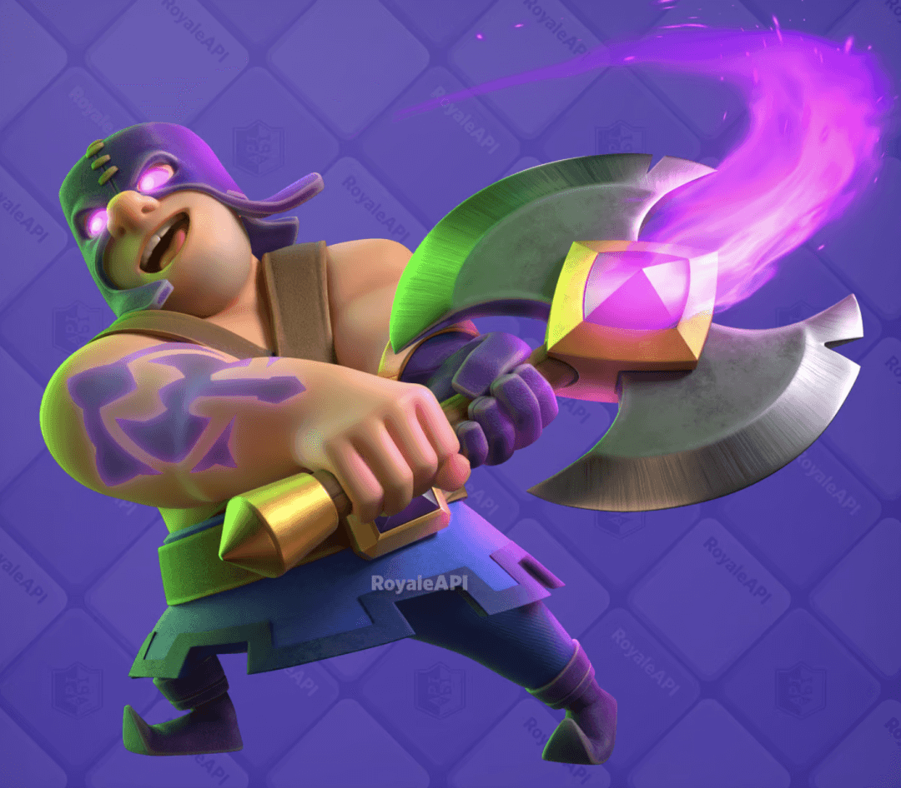
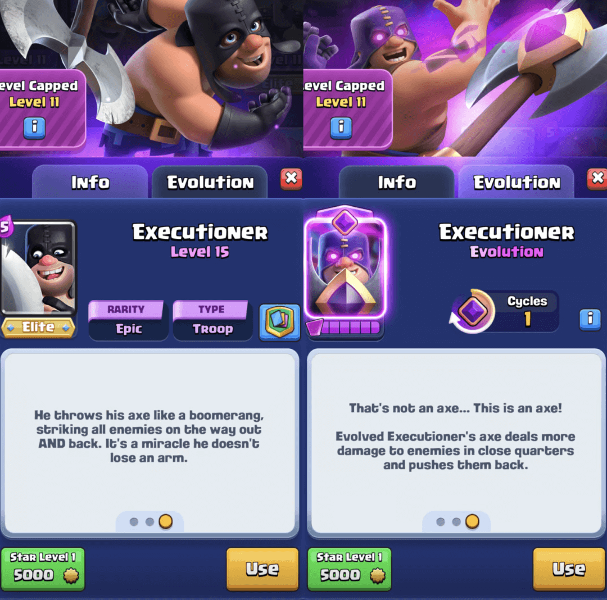
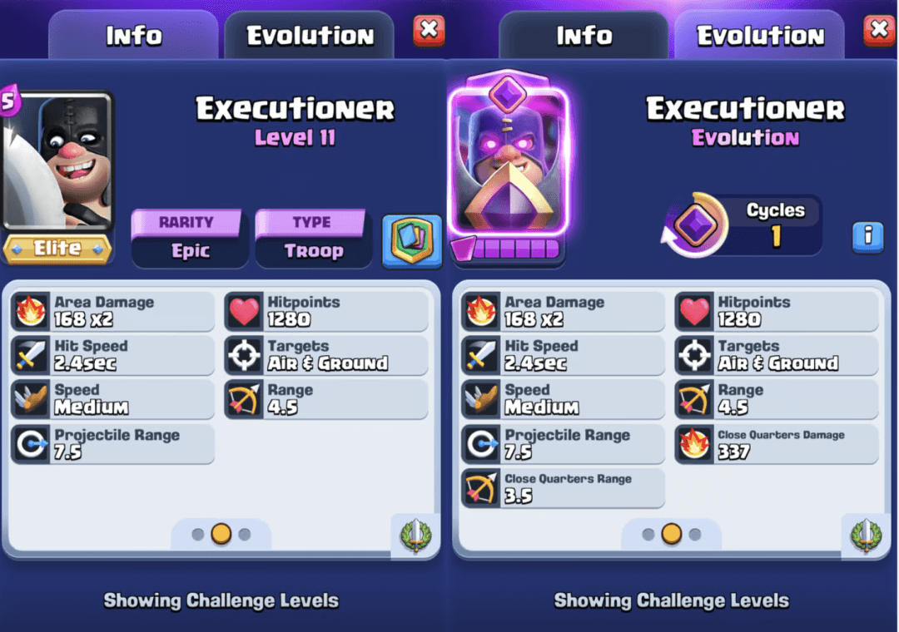

在最近几个月，《皇室战争》的更新模式逐渐形成了两种固定的规律：
1. 两张觉醒卡牌
2. 一张觉醒卡牌 + 一张新卡牌

本赛季，Supercell 已经发布了全新的传奇英雄“刺客头领”，意味着本赛季的唯一一张觉醒卡牌就是屠夫觉醒，并且你可以通过钻石令牌来解锁他。
  

## 觉醒屠夫介绍

> 这不是斧头……这才是斧头！进化后的屠夫能在近距离造成更高的伤害，并击退敌人！

  

觉醒屠夫将在2025年4月7日（第70赛季）正式上线。

 

### 进化技能：斧头重击！

当屠夫的攻击命中近距离目标时，他的斧头会爆发出更强的破坏力。

这个额外的强化效果包括：
- 更高的伤害
- 击退敌人
- 影响地面和空中单位

但需要注意的是，这种强化攻击仅在斧头飞出时生效，而回收时不会触发。

## 进化效果解析

### 触发范围  
- 近距离触发范围：3.5格  
- 屠夫攻击范围：4.5格  
- 斧头最大投掷距离：7.5格  

如果屠夫锁定了远距离目标并且不移动，他的斧头重击技能不会触发。主要的触发方式有：
1. 屠夫在3.5格范围内部署  
2. 目标主动靠近，进入3.5格范围内  

### 斧头重击 VS 普通攻击

| 普通斧头 | 斧头重击 |
|-------------|-------------|
| 飞出伤害：168 | 337 |
| 回收伤害：168 | 337 |
| 总伤害：336 | 674 |

这意味着屠夫在近战范围内的DPS直接翻倍（+100%）。

### 击退效果
- 斧头重击的击退距离为2格  
- 相比之下，火箭和巨型雪球的击退距离仅为1.8格  
- 可打断野猪骑士、攻城锤等单位的冲刺  
- 无法击退超重型单位（如熔岩猎犬、哥布林巨人、威猛矿工）  

## 进化循环机制

- 屠夫每两次部署中有一次会觉醒（进化循环1）。
- 这意味着如果你将其再次部署，他就会恢复普通形态，需要下一次部署才能再次进化。

## 上线时间

正式上线日期：2025年4月7日（第70赛季）

- 一般来说，觉醒卡牌会在赛季末（每月第一个周一）提前解锁。
- 解锁方式：
  - 购买钻石令牌可直接获得6片屠夫觉醒碎片，立即解锁。  
  - 通过万能碎片进行解锁（赛季末即可使用）。  
  - 未来赛季可能会在等级宝箱、限时活动、商店礼包以及传奇幸运掉落中获取更多觉醒碎片。  

## 结语

屠夫觉醒带来了全新的近战击退机制，这使得他的战术应用更加丰富。如何利用他的击退效果打断敌人节奏？如何在关键时刻让斧头重击生效？这一切都将在4月7日揭晓！

观看下方视频获取更多屠夫觉醒细节：  

  

<iframe width="100%" width="100%" height="100%" style="position: absolute; top: 0; left: 0; border: 0;" src="//player.bilibili.com/player.html?isOutside=true&aid=114268980710288&bvid=BV1HTfMY7Ei7&cid=29203694201&p=1" title="皇室战争新卡牌刺客首领登场" frameborder="0" allow="accelerometer; autoplay; clipboard-write; encrypted-media; gyroscope; picture-in-picture; web-share" referrerpolicy="strict-origin-when-cross-origin" allowfullscreen></iframe>
  

