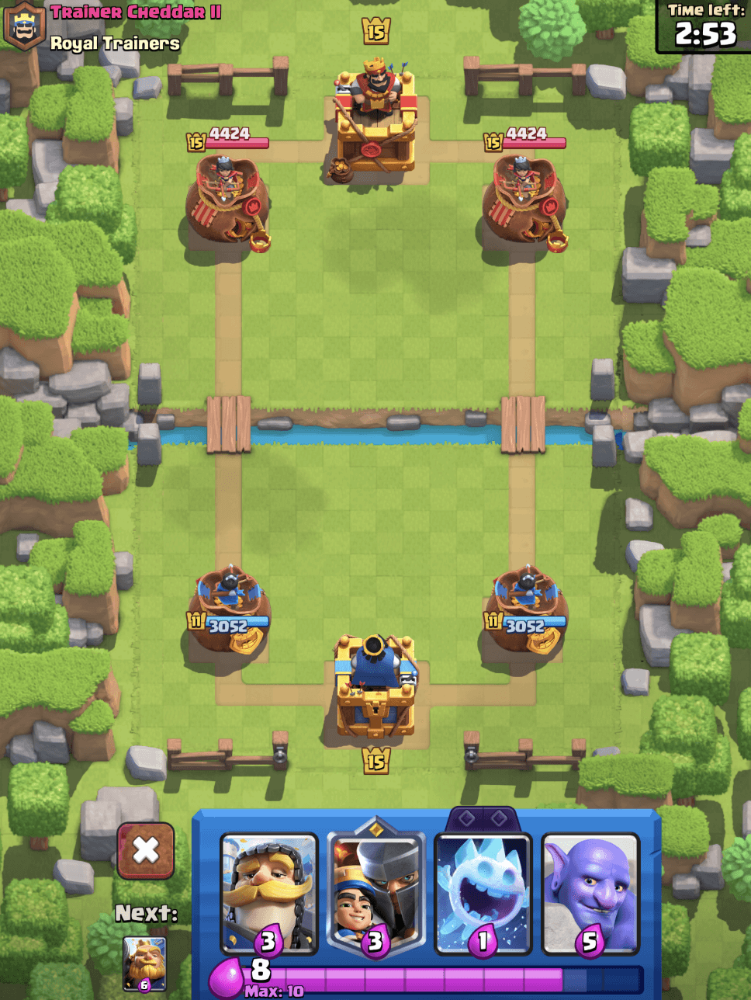
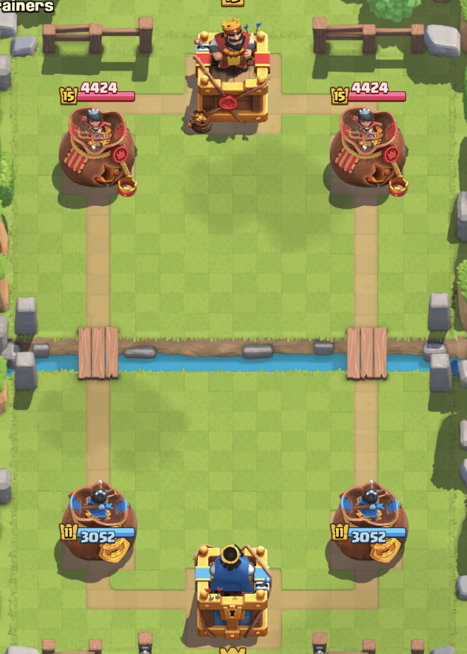
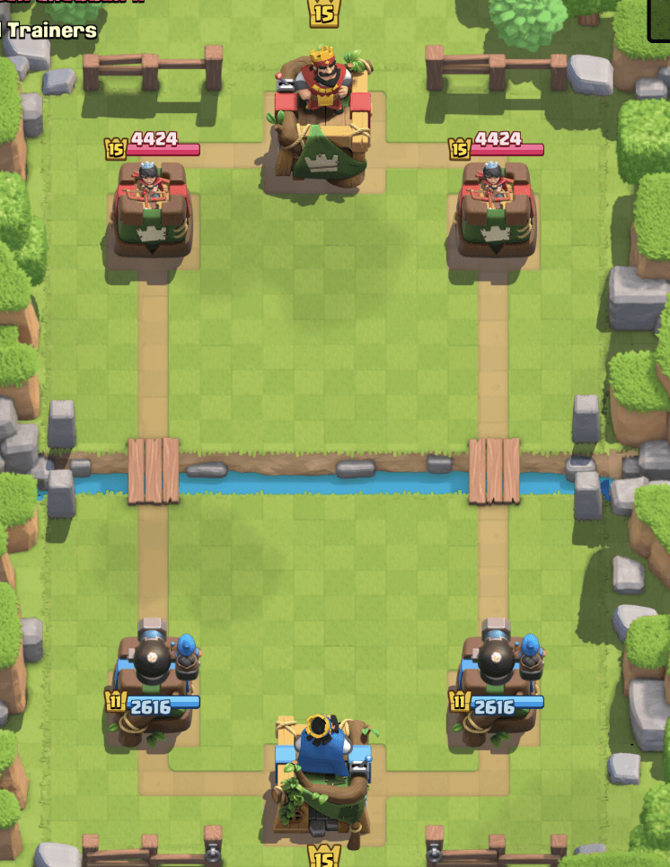
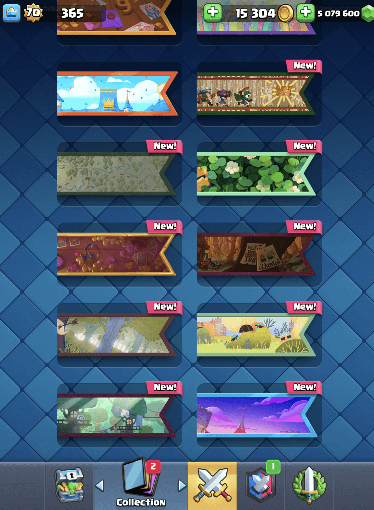
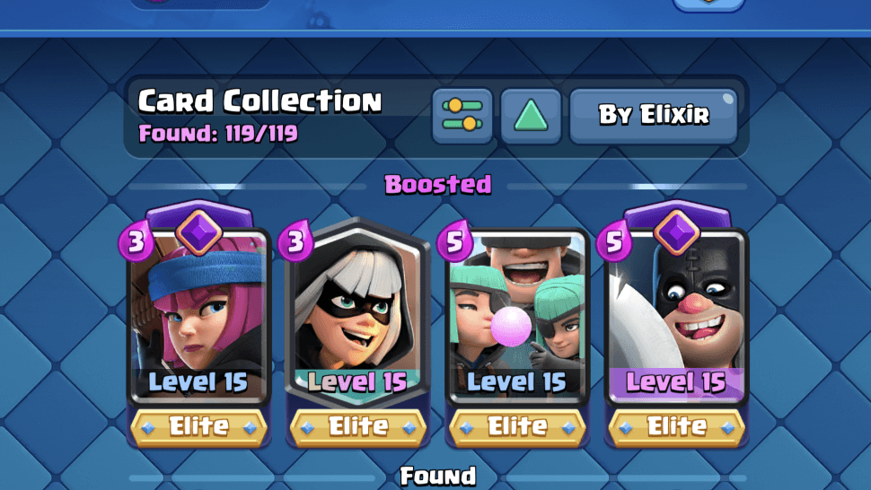

  
四月已至，皇室战争也迎来了全新的第 70 赛季。本赛季以“盗贼传说”为主题，灵感来源于强盗首领及其森林帮派。玩家将踏入全新竞技场，解锁独特塔皮肤，并参与一系列精彩的主题挑战！  

  
赛季时间：2025 年 4 月 7 日 - 2025 年 5 月 5 日。  
## 新赛季竞技场  
  
本赛季的战斗将在“失窃的皇冠”竞技场进行。竞技场受强盗首领藏身处启发，四周布满树木、长矛路障和陷阱，完美展现森林伏击的紧张氛围。  
  
  
  
## 赛季专属塔皮肤  
### 令牌皮肤：皇家速递（Royal Delivery）  
  
  
  
  
拥有令牌的玩家将解锁“皇家速递”塔皮肤。该皮肤设计以装满黄金的板条箱和袋子为主题，绑有绳索并加盖国王印章。  
### 商店限定皮肤：刺客塔（Bandit Tower）  
  
  
  
  
另一款皮肤将在商店限时出售，以刺客首领为灵感。塔身采用质朴的木制风格，点缀树叶和破旧布料，展现森林盗匪的独特风格。  
## 赛季全新表情  
  
本赛季新增多款表情，包括令牌专属表情和促销活动表情。  
  
  
- **屠夫进化 – 旋转巨斧**（令牌独占）  
  
- **刺客首领 – 棒球大满贯**（活动获取）  
  
- **公主要求沉默**（传奇之路获取）  
  
- **Nope Text**（4 月 1 日促销）  
  
## 赛季战旗  
  
本赛季将新增多款全新战旗。  
  
  
  
  
  
## 卡牌强化  
  
以下卡牌的锦标赛等级将在本赛季获得提升：  
  
  
  
- **屠夫**（Executioner）  
  
- **强盗**（Bandit）  
  
- **火枪手**（Firecracker）  
  
- **绿林小队**（Rascals）  
  
## 卡牌觉醒  
  
本赛季最受瞩目的更新之一，屠夫正式迎来进化！新版本的屠夫将获得强力的战斗属性优化，具体细节可参见往期文章：  
  
[皇室战争：觉醒屠夫登场~ 不仅仅是击退，还有100%近身伤害加成！](/posts/clashroyale/2025/04/executioner-evolution-2025-april/)  
  
## 赛季锦标赛  
- **4 月 11 日至 14 日** – 标准模式  
  
- **4 月 25 日至 28 日** – 卡牌三选一  
  
 
## 赛季活动与挑战  
  
本赛季将推出多项主题挑战，涵盖屠夫进化、刺客首领以及盗贼团伙的精彩玩法。  
  
  
  
- **4 月 7 日至 14 日** – 觉醒屠夫挑战（挑战赛：4 月 11 日至 14 日）  
  
- **4 月 14 日至 21 日** – 刺客首领挑战（挑战赛：4 月 18 日至 21 日）  
  
- **4 月 21 日至 28 日** – 刺客奇袭挑战（挑战赛：4 月 25 日至 28 日）  
  
- **4 月 28 日至 5 月 5 日** – 无限圣水挑战（挑战赛：5 月 2 日至 5 日）  
  
## 全新加载界面  
  
本赛季的加载界面完美展现了“盗贼传说”主题。画面中，刺客首领正伸手夺取皇冠，而她的森林帮派成员环绕四周，背景是茂密的森林与简陋的藏身建筑，营造出独特的盗贼气息。  
  
  