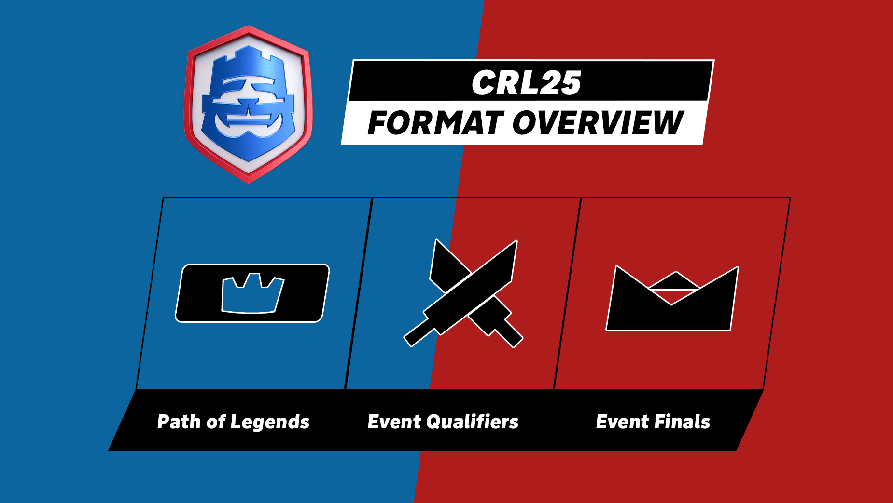
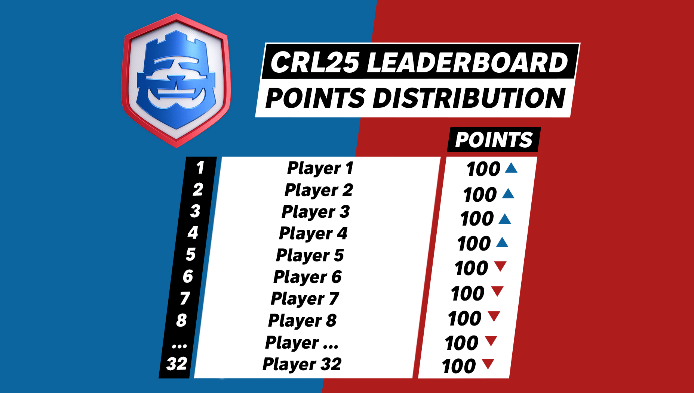

昨日，皇室战争官方公布了CRL 2025皇室战争全球联赛的规则白皮书。

今年，将会有 12 名玩家参加 CRL 2025 世界总决赛，其中只有一名玩家能够获得奖杯，并获得 2025 年 CRL 冠军的称号！

今年，四个一流的社区组织将举办四场活动，这些活动将颁发 4 张黄金门票 、4 张银票和 CRL 赛季排行榜积分！

CRL赛季排行榜积分前 6 的选手将获得黄金门票，排名7至14的8位玩家获得银票。

银票将带来另一场赛事， 即最后资格争夺赛（Last Chance Qualifier），4 场赛事的亚军将与排行榜中的 8 名玩家一起争夺一张金票。

最后一张黄金门票来自**中国大陆赛区**。

## 社区金票活动

今年的 CRL 2025 引入了来自社区的直接参与。如何参与？

四个一流的社区组织将举办四场活动，这些活动将颁发：

- 4 张金票  
- 4 张银票  
- CRL 赛季排行榜积分

  

从说明来看，四场活动相当于取代了原有的月赛（不过基本还是按月举行），将由第三方社区举办竞标赛的方式进行。在赛季（5 月至 8 月）中，在传奇之路中排名前 1000 名的玩家将能够参加活动资格赛 。 活动资格赛结束后，前 12 名玩家将晋级活动总决赛 ，冠军将加冕并获得金票，每场活动还附带 50,000 美元的奖池 ！

同时，每场活动的亚军获得银票。

## CRL 排行榜

社区金票活动不仅直接决出4张金票，选手在比赛中的表现同时还能为自己获得CRL积分。所有活动结束后，排行榜上前6位选手将直接获得总决赛金票。

  

积分榜上仅次于前6名获得金票选手积分的后8位选手，即第7名至第14名自动获得银票。

## 银票和最后资格赛

银票选手将通往另一场关键赛事：最后资格赛（Last Chance Qualifier）。

银牌来自于四场金票赛事的亚军，以及排行榜上积分第7名至第14名的选手，他们将争夺最后一张金票，赢得进入世界总决赛的资格。

## 最后一张金票
最后一张金票预留给了中国大陆赛区，目前尚未得知中国大陆赛区的金票获取方式，本蜜也将持续跟进消息。

## 世界总决赛

最终的 12 名顶尖选手——4名来自CRL社区活动赛，6名来自CRL积分榜，1名来自最后资格争夺赛，1名来自中国，  将在 CRL 2025 世界总决赛上争夺冠军！

至于具体时间和地点，相信官方很快会公布更多信息。

## 活动时间表

### 黄金门票活动 #1

- 传奇征程赛季：5 月 5 日至 6 月 1 日  
- 资格赛：6 月 7 日至 8 日  
- 决赛：6 月 14 日至 15 日

### 黄金门票活动 #2

- 传奇征程赛季：6 月 2 日至 7 月 6 日  
- 资格赛：7 月 12 日至 13 日  
- 决赛：7 月 19 日至 20 日

### 黄金门票活动 #3

- 传奇征程赛季：7 月 7 日至 8 月 3 日  
- 资格赛：8 月 9 日至 10 日  
- 决赛：8 月 16 日至 17 日

### 黄金门票活动 #4

- 传奇征程赛季：8 月 4 日至 8 月 31 日  
- 资格赛：9 月 6 日至 7 日  
- 决赛：9 月 13 日至 14 日

### 最后机会资格赛

- 决赛：9 月 20 日至 21 日

### 中国大陆赛程
- 未知

