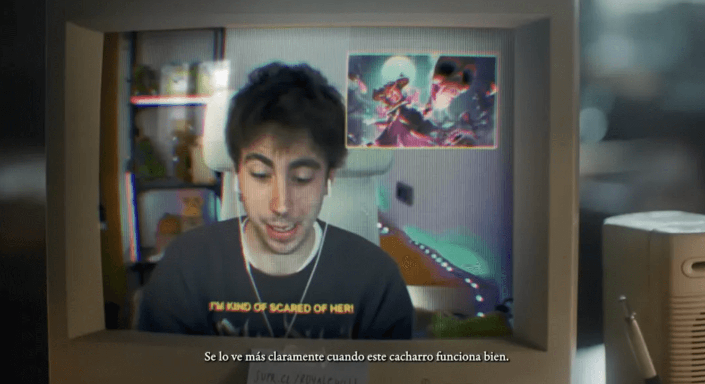
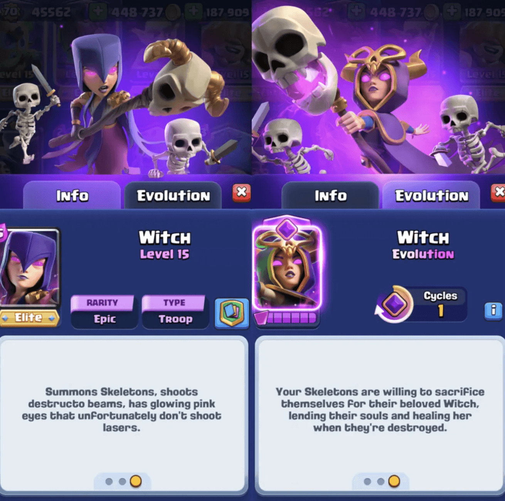
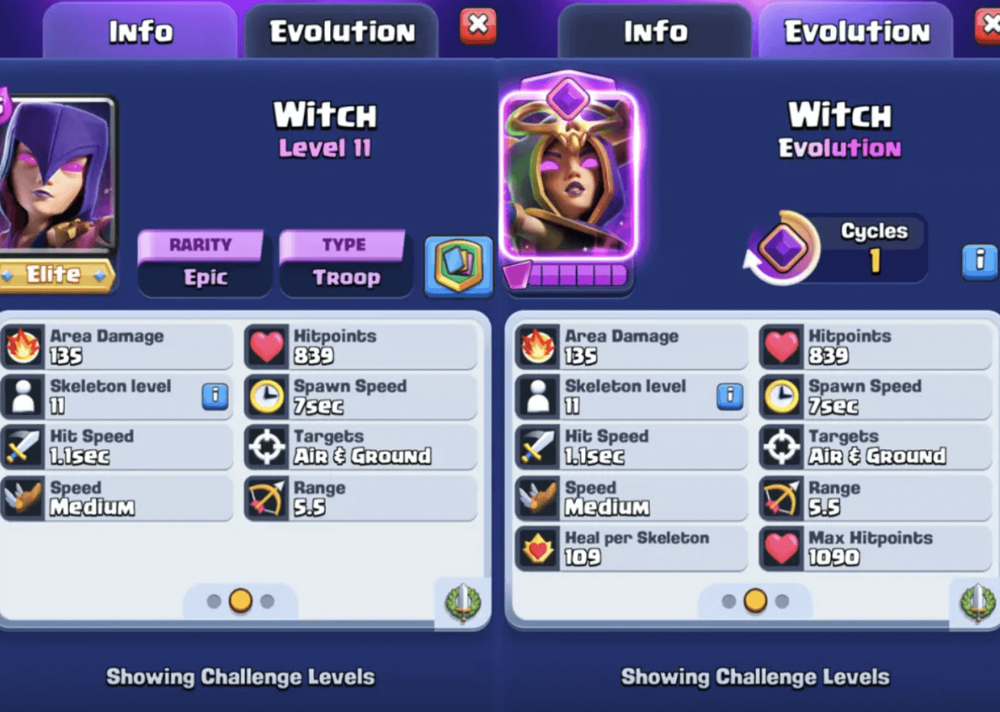
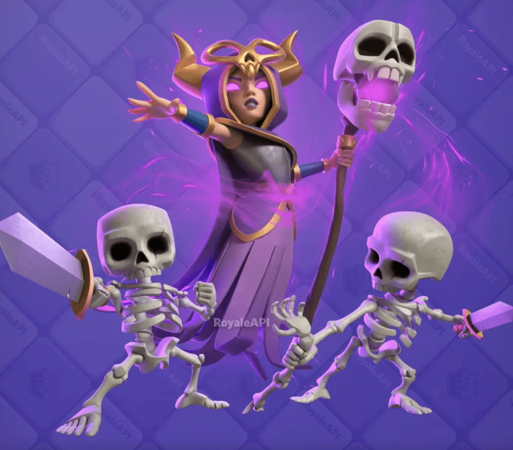

几周前，在宣传短片《皇室意志（The Royale Will）》中，有一帧画面展示了此前未公开的神秘图像。

  

由于与《部落冲突》中“超级女巫”极为相似，玩家纷纷猜测这张图可能预示着未来的觉醒卡。

结果大家猜对了！这张图正是进化女巫的关键图片。

## 女巫觉醒

近一年来，皇室战争每月的内容更新呈现两种规律：

- 发布2张觉醒卡  
- 或1张觉醒卡 + 1张新卡  

本赛季的主角就是——**女巫觉醒**，可通过「皇室令牌」解锁。目前尚不清楚本赛季是否还有其他新内容。

  

女巫觉醒卡的描述如下：

> **“你的骷髅们愿为亲爱的女巫献出生命，当他们阵亡时，会献出灵魂为她疗伤。”**

## 觉醒属性

和近期的觉醒卡一样  **觉醒女巫的基础属性与普通女巫一致。**

  

## 觉醒技能：治愈骸骨

觉醒女巫的核心机制是：

> **当己方骷髅类单位死亡时，女巫会被治疗！**

类似觉醒蝙蝠，女巫的生命值可以被治疗**超过基础生命值上限**，上限为基础的 130%。  
也就是说，在比赛标准下，她最多拥有 **1090 HP**——恰好能抗住一发雷电法术！

当骷髅死亡时，其“灵魂”会有一个朝女巫飞行的动画，类似骷髅之王的机制。这个过程持续 **1秒钟**，因此**不是即时治疗**。

每有一个灵魂飞到女巫身边，她就会恢复 **109 HP**（比赛标准下），相当于：

- 基础血量的 1/8（约13%）  
- 最大血量的 1/10（约10%）

例如，女巫第一次召唤出的4只骷髅全部死亡后，她将恢复 **50% 的基础血量**。

### 可以为女巫治疗的骷髅单位包括：

- 普通骷髅  
- 觉醒骷髅  
- 盾骷髅 
- 骷髅海
- 骷髅墓碑
- 骷髅气球

🚫 **不包括“复制”的骷髅**，如使用镜像法术或骷髅之王技能召唤的单位。

## 进化周期

女巫需要**1轮部署**来激活进化也就是说：**每2次出场，有1次是进化形态。**

## 上线时间

女巫觉醒将于 **2025年5月5日** 与新赛季一同上线。

  

通常，觉醒卡会在赛季末提前几天解锁（通常为每月第一个星期一）。  
此时你可以用 **万能碎片**解锁她。

若购买**钻石皇室令牌**，可直接获得 **6枚女巫碎片** 进行解锁。

### 其他获取女巫碎片的方式包括：

- 升级宝箱
- 未来赛季中的实时活动 
- 商店礼包
- 传奇幸运掉落
- 使用万能碎片

准备好迎接新一代治愈系女巫了吗？

观看下方视频获取更多女巫觉醒细节：  

  

<iframe width="100%" width="100%" height="100%" style="position: absolute; top: 0; left: 0; border: 0;" src="//player.bilibili.com/player.html?isOutside=true&aid=114421938520102&bvid=BV1LcGmz3Ed8&cid=29697050690&p=1" title="皇室战争新卡牌刺客首领登场" frameborder="0" allow="accelerometer; autoplay; clipboard-write; encrypted-media; gyroscope; picture-in-picture; web-share" referrerpolicy="strict-origin-when-cross-origin" allowfullscreen></iframe>
  

