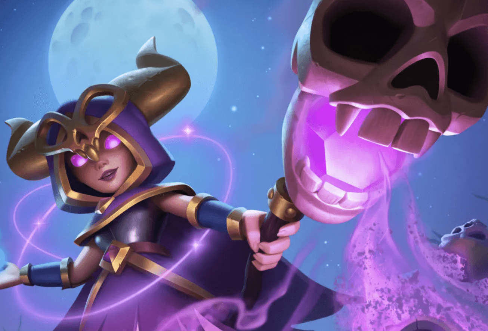

皇室战争第72赛季，亡灵进军——将于 5 月 5 日开启！

  

骷髅们躁动不安，它们正大举进军竞技场！

本篇文章将带你了解新赛季的全部内容：

- 女巫进化
- 亡灵行军阶梯
- 里程碑活动
- 模式与挑战

## 觉醒女巫

在灰烬中重生，女巫获得全新进化。

  

每当她召唤的骷髅倒下，女巫便恢复生命值，化失败为力量。

## 亡灵进军天梯

亡灵进军是一个限时天梯活动，你需要从一组恐怖的亡灵主题卡牌中组建自己的卡组进行战斗。

  

活动时间为 5 月 6 日至 13 日，开放给达到 11 阶竞技场及以上的玩家。

## 里程碑活动

本赛季将带来三场主要的里程碑活动，以及一场社区特别活动——骸骨之战（Boneheads' Brawl）。这些活动将提供丰厚奖励，包括：

- 炸弹人觉醒碎片 x6  
- 稀有卡牌之书  
- 吹箭哥布林进化碎片 x3  

  

### 活动时间表

- 5 月 5 日 - 13 日：骸骨之战  
- 5 月 14 日 - 19 日  
- 5 月 20 日 - 25 日  
- 5 月 26 日 - 6 月 1 日  

具体时间可能会有所调整，请关注官方更新。

**骸骨之战**社区活动期间，全球玩家击败的每一个骷髅都会计入全球总目标。全员协力达成里程碑即可解锁额外奖励！

社区活动和里程碑活动从 7 阶竞技场开始开放。

玩家可以在活动上线后，在主界面实时查看奖励进度。

## 活动与挑战

### 女巫觉醒挑战（Witch Evolution Draft）

时间：5 月 5 日 - 12 日  
玩法：经典选卡 + 卡牌觉醒 
挑战时间：5 月 9 日 - 12 日  
奖励：战旗（边框与装饰）+ 表情

  

### 骚动的墓地（Disturbed Graves）

时间：5 月 12 日 - 19 日  
挑战时间：5 月 16 日 - 19 日  
奖励：战旗（边框与装饰）+ 表情

  

### 诅咒之灾（Hexed Havoc）

时间：5 月 19 日 - 26 日  
挑战时间：5 月 23 日 - 26 日  
奖励：战旗（边框与装饰）+ 表情

  

### 黑暗圣水（Dark Elixir）

时间：5 月 26 日 - 6 月 2 日  
玩法：黑暗圣水涌入竞技场，失败三次即淘汰  
挑战时间：5 月 30 日 - 6 月 2 日  
奖励：战旗（边框与装饰）+ 表情

  