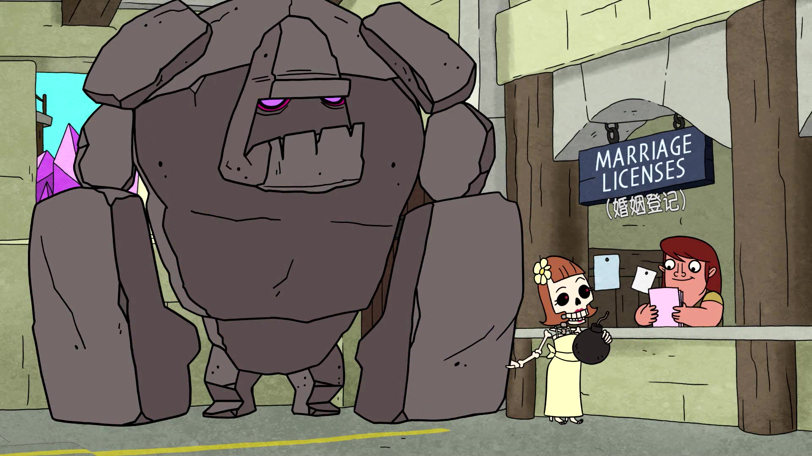
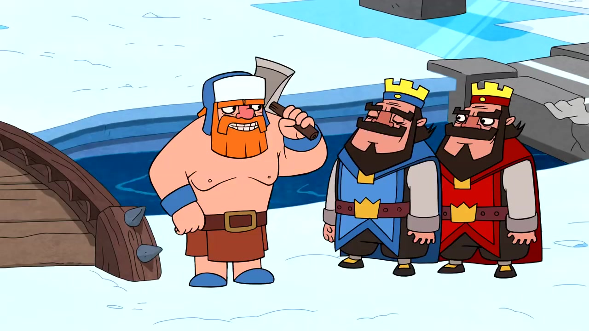
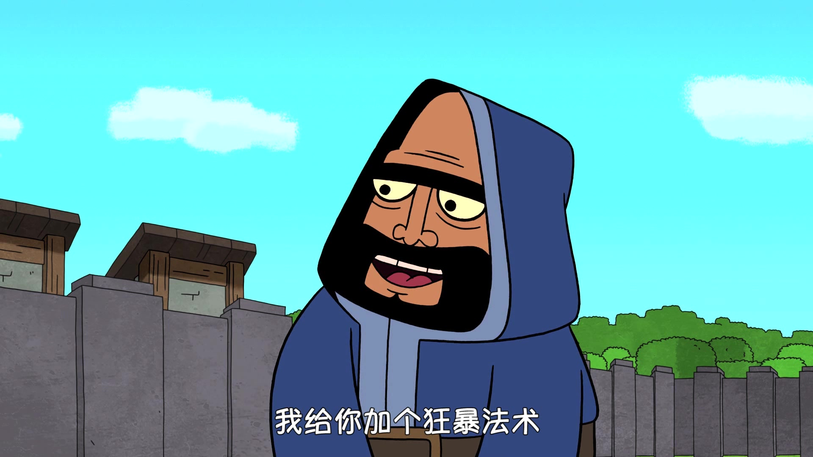

Netflix近日正式宣布，将与芬兰著名游戏公司Supercell携手，把旗下现象级手游《部落冲突》（Clash of Clans）改编为原创动画剧集。这一项目将围绕《部落冲突》及其衍生作品《皇室战争》的世界观展开，为全球玩家带来一次全新的视听体验。

Supercell 在社媒中表示：

> Supercell 今年迎来了 15 周年，这又是一个值得庆祝的重要时刻。因为在成立不久后，我们推出了一款游戏，讲述了大批留着小胡子的野蛮人和高亢的野猪骑士袭击中世纪村庄的故事。现在，这些互相冲突的角色将拥有自己的系列。我们很高兴地宣布**《CLAS​​H》即将在 Netflix 上推出全新动画剧集**，已获批准，目前处于前期制作阶段_._ 经过十多年的动画短片、电影制作以及网络连续剧《Clash-A-Rama》十亿次以上的观看，我们终于回答了数百名粉丝在 YouTube 评论中提出的问题：_“你能把它变成一场表演吗？”_  
>   
> 是的，我们可以。_@PirateWizard03_.   
>   
> 但这离不开我们的朋友弗莱彻·穆尔斯（Fletcher Moules，曾执导《特工之王》《Entergalactic》）的帮助。弗莱彻过去曾执导过多部《CLAS​​H》动画，他将与我们的娱乐与合作团队紧密合作，共同领导这个项目。  
>  
> 如果这个家族还不够令人印象深刻的话，我们还将与执行制片人罗恩·韦纳（《硅谷》、《我为喜剧狂》、《飞出个未来》、《发展受阻》）和温哥华的 ICON Creative Studios 联手，以前所未有的方式将 CLASH 的战争世界带入现实。  
> 
> 我们目前还不会透露完整的故事 - 但您可以期待 CLASH 系列的所有精彩内容：史诗般、搞笑，还有一点点疯狂。  
>   
> 我们很高兴很快与您分享有关我们的 CLASH 系列（以及我们正在为电影和电视制作的其他内容）的更多信息。  
>   
> 与此同时，看看我们的游戏团队对今天的新闻有何评论！
  

从官方介绍来看，这部剧集的主线将聚焦于一位信念坚定、却总是陷入困境的野蛮人角色。他必须集结一支风格迥异、个性鲜明的“临时战队”，共同守卫他们的家园，同时在充满荒诞和讽刺意味的战争政治中求生存、寻定位。整部作品预计延续游戏原本的幽默气质，同时引入更多戏剧化冲突与角色成长线。
  

虽然没有更多透露的信息，不过显然，该动画仍处于前期制作阶段。

事实上，Netflix近年来持续发力游戏改编动画市场，已先后推出《双城之战》《恶魔城》《鬼泣》《蓝眼武士》《刺猬索尼克》以及《侏罗纪世界：白垩纪营地》等多部佳作。值得一提的是，平台还计划于明年上线一部基于《怪奇物语》世界观的全新动画作品《Stranger Things: The First Shadow》。

而 Supercell 呢？这家芬兰的游戏公司除了旗下大家耳熟能详的游戏，还经常被大家戏称“一家被做游戏耽误了的动画公司”，足可见其游戏动画、CG 的精良程度还是得到了大家的一致好评。

老玩家其实都知道，Supercell 曾经推出过 Clash 系列的动画短篇集——《Clash A Rama》，共有 2 季外加一个番外篇，它是Supercell 授权、基于其热门手游《Clash of Clans》（部落冲突）与《Clash Royale》（皇室战争）世界观制作的 **官方动画短剧集**。这部系列动画最早于 2016 年上线，由 _YouTube_ 播出，受到了许多玩家的喜爱。它被视为“Clash 宇宙”的第一次正式动画化尝试，风格轻松幽默，广受粉丝好评。

《Clash-A-Rama!》采用 **讽刺喜剧的叙事风格**，每集讲述 Clash 世界中角色的日常故事，比如：

- 炮车考驾照失败
- 野蛮人努力学会说话
- 部落战准备期间发生内讧
- 皇室竞技场的幕后生活

它并不完全围绕战斗，而是更聚焦于角色性格、部落村庄的搞笑互动，以及对游戏机制的“人性化演绎”。

如果你还没看过《Clash A Rama》，这里强烈建议观看，非常下饭！！！

剧集网盘传送门：
+ [夸克网盘](https://pan.quark.cn/s/a1958db3c9c5)
+ [百度网盘](https://pan.baidu.com/s/1_GZBdd72GBcCDRgQTjCCcg?pwd=7vay)

这次 NetFlix 和 Supercell 联手推出剧集，能否延续游戏IP的全球影响力，并在内容维度上实现突破？

这一切有待作品正式上线后揭晓。