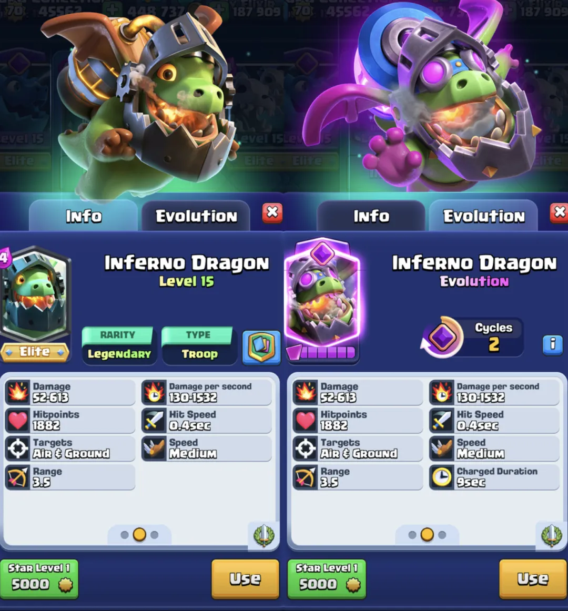

昨天，大家一定看到了地狱飞龙在事业后穷困潦倒的惨痛生活。

[皇室战争：经济下行，地狱龙也失业了...](https://mp.weixin.qq.com/s?__biz=MjM5Mzg4MDU5NA==&mid=2447810780&idx=1&sn=d7f19b27d1fd73c7c14e880a1be7359a&scene=21#wechat_redirect)

然而，正如许多玩家猜测的那样，地狱飞龙正是 6 月份的新觉醒卡牌，今天分享一下所有细节。

按之前的惯例，每月应该是 2 张卡牌推出的节奏（2 觉醒卡牌或者 1 觉醒卡牌+1 新卡），但是显然本月打破了这一惯例。目前还不清楚接下来会发生什么，皇室战争团队也没有透露内容发布计划。

地狱飞龙进化卡描述如下：

> 凭借全新升级的 InfernoTank2.0™，地狱龙进化即使在没有可熔化物的情况下也能保持光束的充能和致命性。但即使是最好的坦克也无法永远持久。

## 基础数据

与最近的进化版本一样，Supercell 避免提供基础属性增益。普通地狱飞龙的主要属性**与进化版本相同** 。

相同的生命值，相同的射程，相同的伤害（大部分）……所有基本属性看起来都和普通的地狱飞龙一样。但它的油箱似乎不一样。

## 觉醒能力：光束动量！

普通地狱飞龙每次重新瞄准目标时都必须重置其火焰光束，这使得它在面对一些中型单位和移动目标时显得较弱。

进化后的地狱飞龙已升级其燃料箱，现在可以将光束强度维持9秒。这意味着，如果它在此时间段内找到新的目标，就能恢复光束。这包括建筑和塔楼。

然而，光束动量并不免疫眩晕效果，其强度仍会像往常一样重置。

除了这项改动之外，进化版地狱飞龙还拥有一个与普通阶段不同的第四阶段。在造成49次伤害后，第50阶段将开始造成双倍伤害。就不间断攻击而言，这意味着需要20秒的光束才能激活最后一个阶段。

| **伤害类型** | **时间** | **DPS** |
| --- | --- | --- |
| **第一阶段** | 0 - 2 秒 | 88 |
| **第 2 阶段** | 2 - 4 秒 | 300 |
| **第 3 阶段** | 4 - 20 秒 | 1,055 |
| **第四阶段** | 20秒以上 | 2,110 |

2,110 DPS 几乎与地狱之塔的最大 DPS（即 11 级时的 2,117 DPS）一样强大。

在正常战斗中，伤害的最后阶段不太可能达到。

## 觉醒周期

地狱飞龙需要 2 个循环才能激活进化，因此每部署 3 次就会有 1 次进化。

地狱飞龙进化版将于 6 月 2 日发布，伴随新赛季的开始。

更多的对战及卡牌分析见：

  

<iframe width="100%" width="100%" height="100%" style="position: absolute; top: 0; left: 0; border: 0;" src="//player.bilibili.com/player.html?isOutside=true&aid=114591740725878&bvid=BV1Gu75zsExA&cid=30217342859&p=1"  frameborder="0" allow="accelerometer; clipboard-write; encrypted-media; gyroscope; picture-in-picture; web-share" referrerpolicy="strict-origin-when-cross-origin" allowfullscreen></iframe>
  

