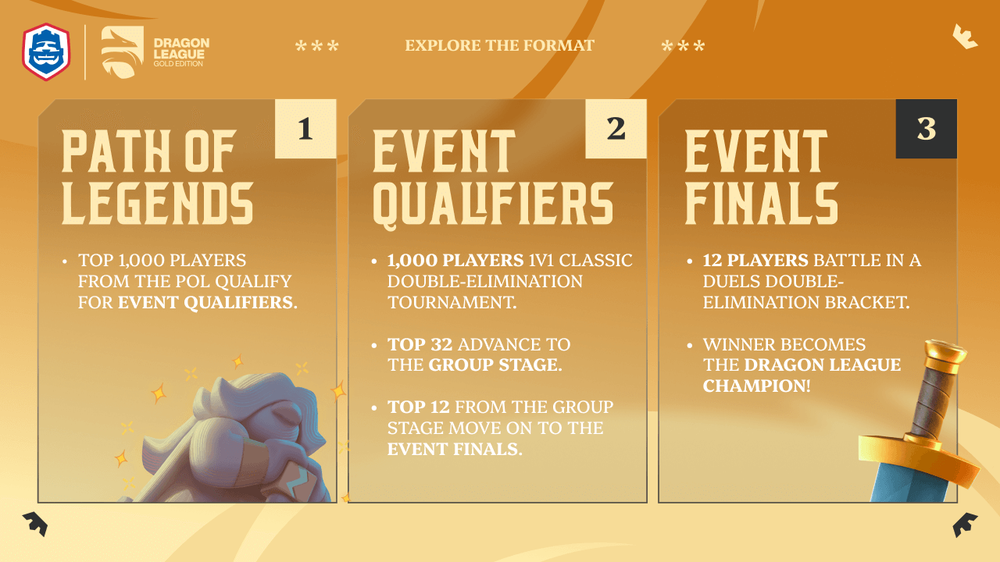
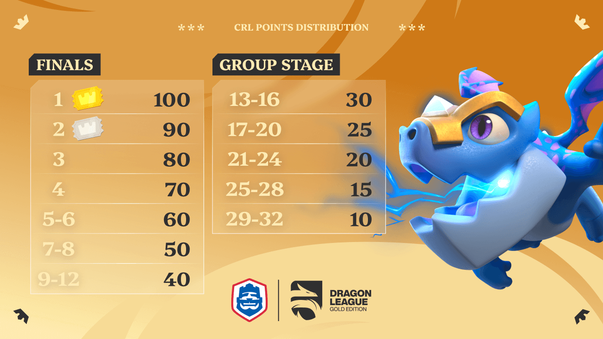
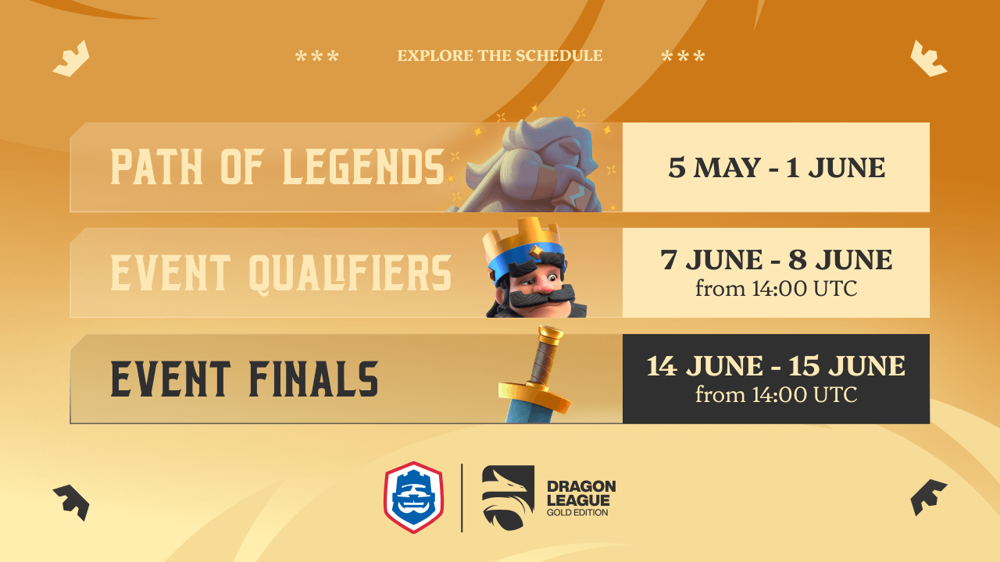
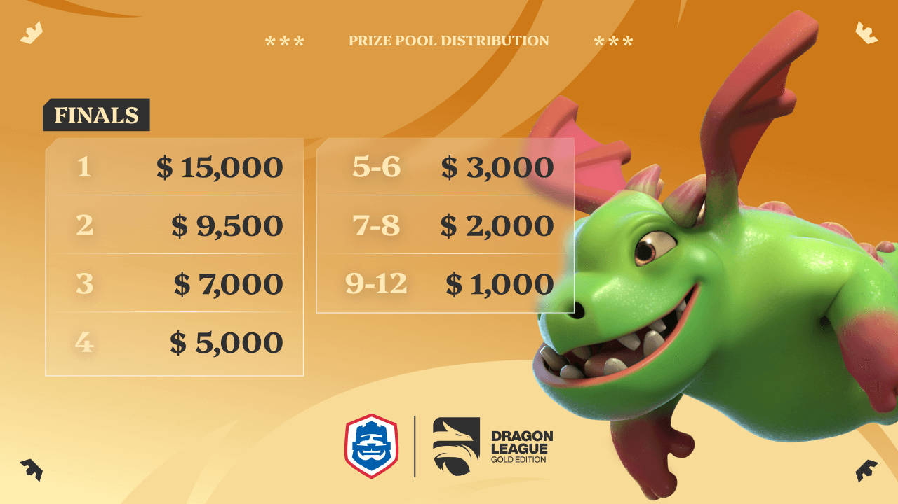

来了！

2025年CR首张黄金门票月度赛事现已公布，赛事名称为 QLASH 龙之联赛：黄金版。

本文将汇总所有有关该赛事的官方说明与参赛信息。

## 赛事形式

QLASH 龙之联赛：黄金版将决定首张黄金门票与白银门票归属。获得黄金门票的选手将直接晋级2025年CRL世界总决赛，而白银门票持有者则获得最后机会资格赛参赛资格。

比赛分为3个阶段：

### 传奇征程

本次活动期间，玩家在“传说之路”赛季结束时，排名前1000者将获得赛事资格赛的参赛资格。

符合条件的玩家将通过其Supercell ID所绑定的邮箱收到官方邮件，邮件中包含加入CRL Discord服务器的链接。

### 赛事资格赛

赛事资格赛为期两天：

第1天 - 双败淘汰赛

- 1000人参与的经典1v1双败淘汰赛
- 前32名玩家晋级下一阶段

第2天 - 小组赛阶段

- 选手将被分为4个小组，每组8人
- 每组前3名晋级最终决赛
- 每组第1名在决赛阶段将享有轮空优势

资格赛首日将在QLASH应用程序内进行。已加入CRL Discord的选手将收到该应用中双败淘汰赛的参赛链接，并参与比拼。

注：若玩家收到CRL Discord邮件邀请，建议预先下载安装QLASH App，以便及时参赛。

### 赛事决赛

决赛阶段将持续两天进行。赛事前期采用Duel BO3赛制，胜者组决赛、败者组决赛与总决赛则采用Duel BO5赛制。

## CRL 积分

进入小组赛与决赛阶段的32位选手将依据最终排名获得CRL积分。

积分分布如下：

## 日程安排

QLASH 龙之联赛：黄金版的重要时间节点如下：

- 传奇征程排名赛：5月5日至6月1日
- 资格赛：6月7日与8日（14:00 UTC）
- 决赛：6月14日与15日（14:00 UTC）

## 奖金池

本次黄金门票赛事的总奖金为50,000美元，奖金结构如下：

冠军选手不仅将获得最大比例奖金份额，同时获得黄金门票，直接晋级2025年CRL世界总决赛。

亚军选手将获得白银门票，有资格进入最后机会资格赛。若该选手之后获得黄金门票或通过CRL积分排行榜晋级，则该门票将遵循规则顺延。

## 观看渠道

本次赛事将在Clash Royale Esports官方YouTube频道与Twitch频道同步直播：

- [YouTube](https://www.youtube.com/@EsportsRoyale)
- [Twitch](https://www.twitch.tv/clashroyale)

此外，众多社区主播也将在其个人频道同步转播比赛。观众可关注常用平台以获取实时赛事进展。

有关赛事的详细规则，可参阅以下链接所列的官方规则手册：[QLASH 龙之联赛：黄金版官方规则手册](https://drive.google.com/file/d/14FW85RwmRBcjJ7SkIbhHPTBxpbyu14nv/view?usp=sharing)

有关赛事的最新动态与后续公告，亦可关注以下平台：

- [X（原推特）](https://x.com/EsportsRoyaleEN)
- [Instagram](https://www.instagram.com/esportsroyale/)
- [Clash Royale 电竞官网](https://esports.clashroyale.com/)

本次赛事为2025年CRL赛季的开局重点活动，具有极高关注度与竞技价值。
