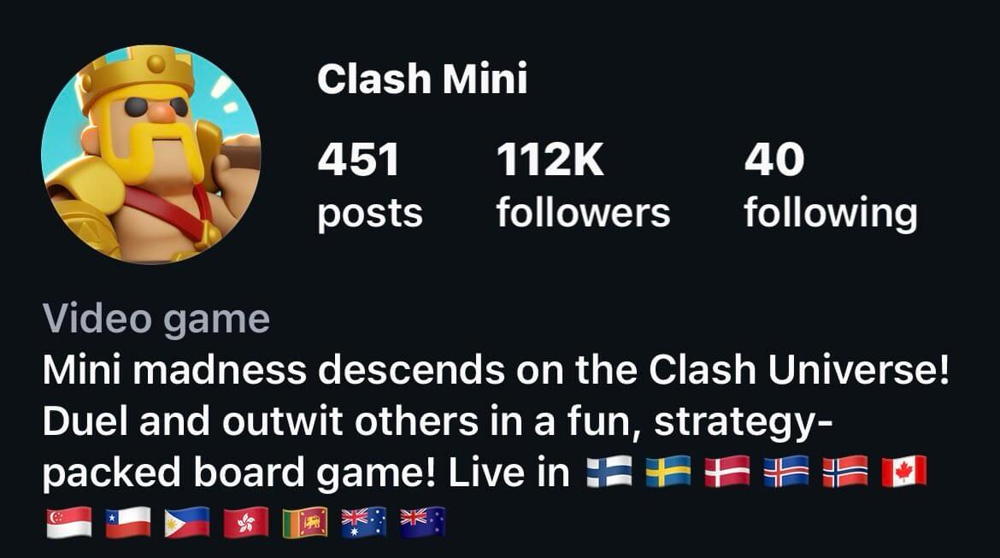
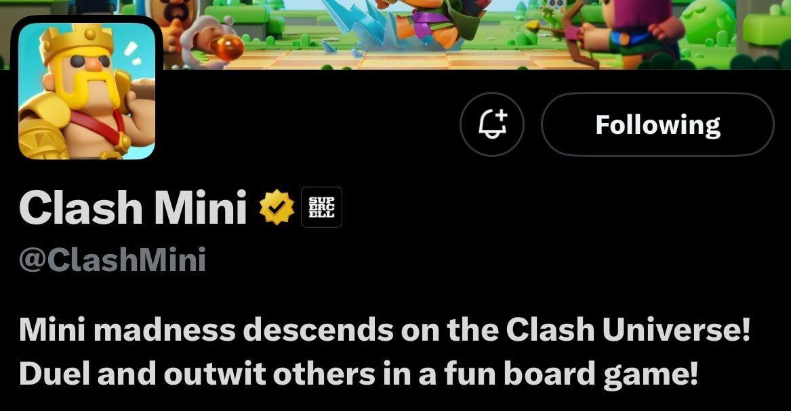
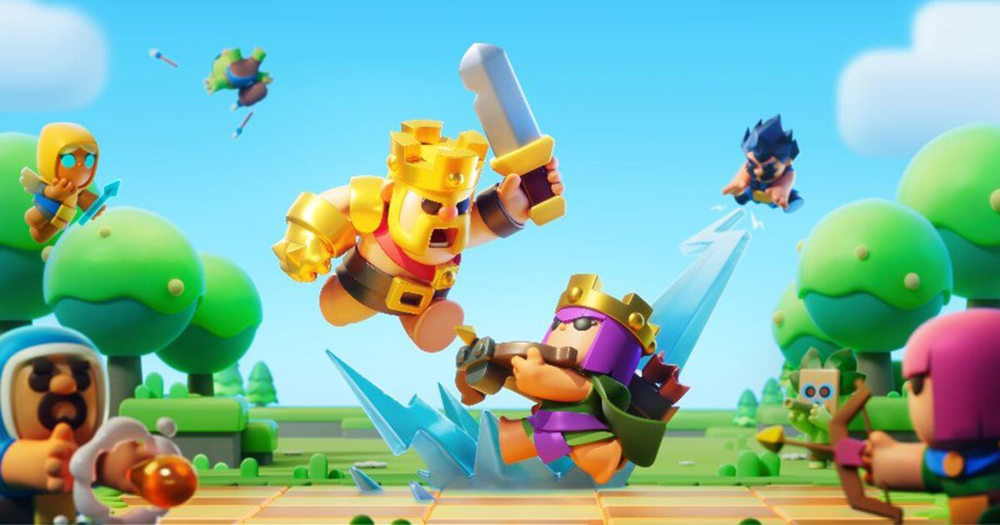

昨晚，几位Supercell内容创作者几乎同时发声：

> 皇室奇兵的官方账号…简介改了？？？

没有预告，没有声明，没有发动态，官方账号只是默默地改掉了很久没动过的简介。

以前的简介：

现在的简介：

瞬间，很多老玩家高潮了。皇室奇兵？真的要回归了吗？

## 皇室奇兵

皇室奇兵是谁？为啥我们还记得它？

时间回拨到 2022 年，Supercell 推出了一款清奇得有点魔性的战棋手游——**皇室奇兵**（Clash Mini）。

皇室奇兵由Supercell中国工作室研发，属于Supercell全球化测试项目。玩法上融合了皇室家族角色 + 自走棋机制，弓箭女皇、骷髅王、蛮王都能上棋盘。简单来说，它像是“皇室战争 + 云顶之弈”的平民版，操作门槛低，观赏性高，节奏也快得惊人，3分钟一把不是说说而已。

上线初期风评极佳，YouTube 和B站上到处是：

- “这才是最适合做电竞的皇室游戏！”
- “策略拉满！用爱发电！”
- “Supercell 又整活了！”

随后，皇室奇兵在部分国家进行了上线（更像是小范围公测）。

然而，随着测试版的几波拉跨的更新，造成玩家流失，皇室奇兵未能达到 Supercell 全面发布的高标准，再加上 Supercell 一贯的“宁砍不拖”风格，皇室奇兵最终在2024 年 3 月在推上黯然宣布停止皇室奇兵的开发。

## 起死回生？

就在大家差不多都接受了“皇室奇兵死了”的设定时，Clash Royale 总经理亚历山大·马尔科维奇 (Aleksandar Markovic) 在 RovioCon Google 2024 期间宣布了Supercell 打算将 Clash Royale 转变为一个受 Roblox、Fortnite 和英雄联盟启发的策略游戏平台。并表示，皇室奇兵这款游戏“ 潜力巨大 ”，同时宣布了将其整合到《皇室战争》的模糊计划，以“更好地服务更多玩家”。最后还明确的说——**皇室奇兵将在今年 6 月，以一种全新形式回归皇室战争之中。**

这话当时被很多人当作“情怀彩蛋”，没人太当真。因为大厂的“承诺”就像路边摊的奶茶菜单，画得很好看，喝到嘴里却是寡淡无味。

如今，6 月赛季已过半，依然没有皇室奇兵的任何信息。

谁能想到，皇室奇兵官方居然悄悄换了简介，直接写明了，**“Mini madness descends on the Clash Universe!”？**（ 注：大致应该翻译成“迷你风暴突袭皇室世界”？）

这就不仅仅是彩蛋了，这是要翻开新剧本啊各位！

## “皇室战棋”时代来临？

如果皇室奇兵真的作为玩法模块回归皇室战争，我能想到可能的方式是：

- 主界面可能增加“奇兵模式”入口
- 或者作为临时天梯模式进行
- 玩家用熟悉的卡牌角色参与自走棋对战
- 甚至可能引入多人对弈、联赛、锦标赛等新内容

## 写在最后

Supercell 向来不怕砍项目，但是复活项目这是刘姥姥进大观园——头一回。

从《部落冲突》到《荒野乱斗》，从《皇室战争》到《爆裂小队》，他们一直在用各种形态去探索“对战的乐趣”。

这次皇室奇兵要是真的“诈尸成功”，哪怕只是寄居在皇室战争的某个子玩法里，那也算是一种精神传承了。

而我们，只需要等它在 6 月份的哪一天，悄悄上线。

