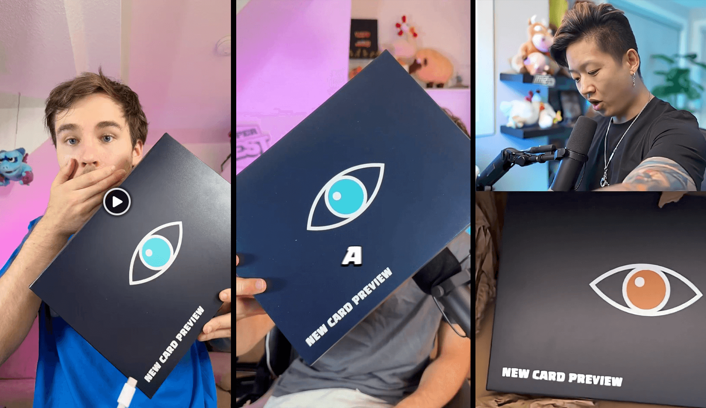
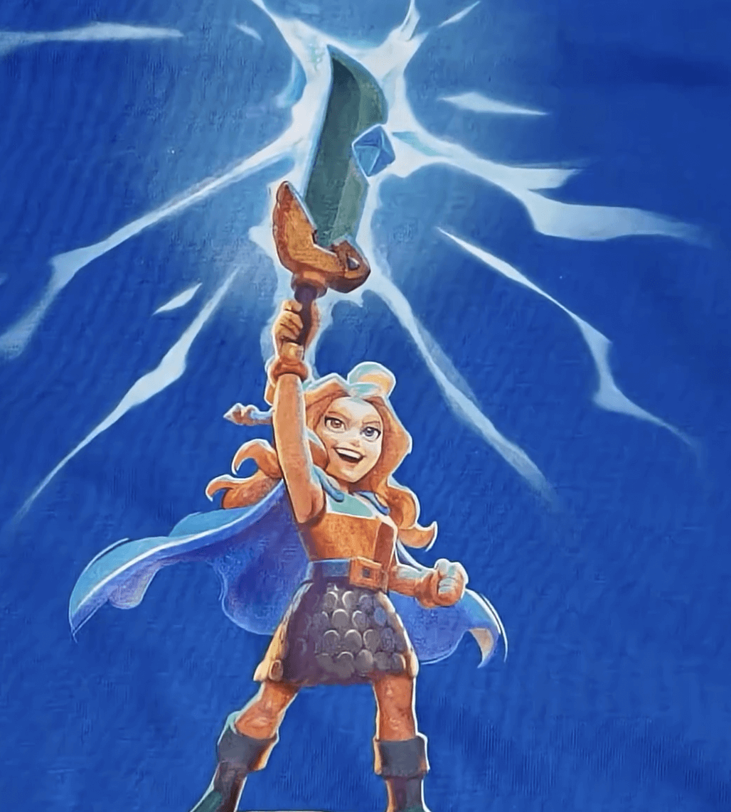
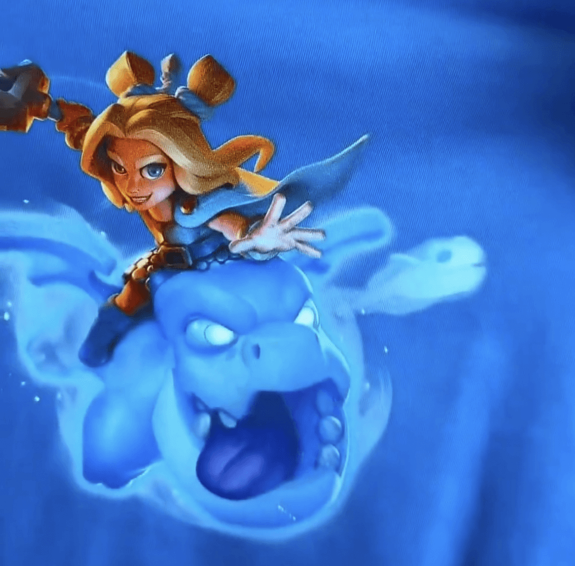
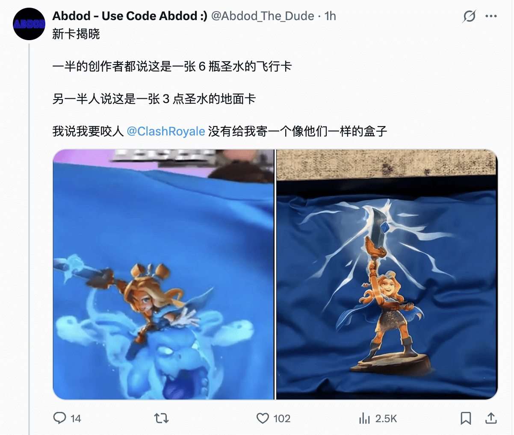

近日，Supercell 向部分内容创作者发送了一个神秘的盒子，其中预告了即将在第73赛季登场的一张全新英雄卡牌 。

然而，出乎所有人意料的是，这次曝光的卡牌在不同的创作者视频中竟有两种截然不同的形态，引发了社区的热烈讨论与猜测。

### 新的英雄？

在 @OJ 的视频中，OJ 表示这是一个**3 费英雄——形态为地面近战单位**，手持带有灵魂能量的魔法剑，与龙有很深的渊源，就像一位龙骑士。

而在@Trazaz Gaming的视频中，他又表示，这是一个名为**Spirit Empress(灵魂女王？)的6 费英雄卡**，是一个骑着龙的空中生物。同时他还展示了包裹中 Supercell 赠送的T 恤：

两张卡牌的名称、人物设定完全一致，仅费用和形态不同，均标注为“New Hero“（为什么不是 new  champion呢）？，或许这意味着 Spirit Empress 很可能是一个新的英雄？

### 社区推测：变形机制？

目前尚未确认 Spirit Empress 是两张独立卡牌，还是一张卡牌在战斗中具备“变形能力”。不过，根据目前流出的信息与现有冠军机制，玩家社区提出了三种合理推测：

1. **技能变形机制**：Spirit Empress 初始为三费地面单位，激活技能后骑上灵魂龙，变为六费飞行形态，费用由技能代价体现。
2. **双版本候选方案**：两种形态可能只是开发中的候选版本，最终只会实装其中之一，Supercell 正通过创作者试播收集反馈。
3. **召唤类技能设计**：类似“小王子”召唤守护者的机制，Spirit Empress 的技能可能召唤一条灵魂龙协助作战，形成临时双形态联动。

如果 Spirit Empress 真如猜测具备变形能力，那将成为《皇室战争》中首张拥有实时形态切换能力的单位，也标志着冠军设计进入新的复杂阶段。

### 与龙的关联
要知道，本赛季的主题是 How to Evolved Your Dragon(如何觉醒你的龙？国服译作”醒龙高手“，信雅达一个都不沾边)，Spirit Empress 的卡牌设定中提到她与“灵魂魔法”高度连接，攻击时剑刃会“激发灵魂力量”，她也被描述为与龙类单位“有深层联系”。

这一设定让不少玩家猜测，她的机制可能与现有的四个Spirit单位（冰 豆、电豆、火豆、治疗豆）形成联动，或是专属灵魂召唤系统。同时，也可能与骷髅龙、地狱龙等现有龙族单位产生组合机制，进一步扩展其战术适用面。

同时在@Trazaz Gaming的视频中，他提到了 **This means spirit evolutions in the next season**，这是否意味着下赛季我们会迎来其他豆子的觉醒？

### 更多信息即将公开

根据惯例，《皇室战争》第 73 赛季预计将在7 月的第一个星期一正式开启，抢先看的内容将从赛季前一周开始逐步释出。从目前各方透露的信息来看，Spirit Empress 大概率将成为本赛季的重点更新内容。

关于她的具体机制、技能效果与实战表现，仍需等待 Supercell 官方在未来几日内逐步公布。无论最终形式如何，Spirit Empress 的登场都可能为现有战术体系带来显著变化，甚至重塑部分主流卡组结构。

最后，或许，这又是 Sueprcell 搞的一个新的烟雾弹？

