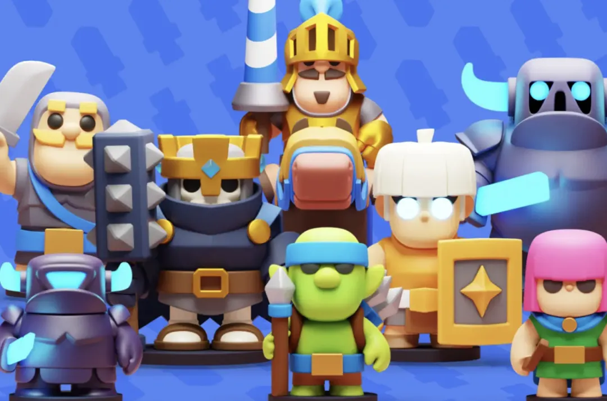

皇室奇兵（Clash Mini）的终止曾是是 2024 年最受关注的话题之一，不少玩家对这一决定感到失望。而当《皇室战争》宣布将引入 Clash Mini 模式时，无疑是给广大奇兵爱好者心里注入了一丝希望。现在来看，2025 年夏季更新很可能就是它正式回归的节点。

在 2024 年 4 月，Supercell 就确认停止开发策略类桌面游戏皇室奇兵。出于“质量标准未达预期”的考虑，开发商同时终止了《Clash Quest》和《Clash Heroes》的开发计划，结束了原定的 “Clash Universe” 三部曲（目前 Clash Heros 已经秽土重生为 Project Rise，具体可见往期文章，Clash Quest 是彻底死掉了）。

然而，皇室奇兵的游戏体验并未就此消失。2024 年 11 月，在 Roviocon Google 活动上，Supercell 宣布将把皇室奇兵融入《皇室战争》之中，目标是在 2025 年 6 月上线，并作为战略游戏平台计划的一部分。

然而自此之后就杳无音讯，就在大家都觉得这次又要放鸽子的时候。昨日，6 月月赛 QLASH 龙之联赛总决赛第二天，《皇室战争》游戏测试员 Marko 确认皇室奇兵将在“这个夏季”加入皇室战争，该模式的加入将带来全新体验，甚至可能成为一次“变革性”尝试。

我想，皇室奇兵的整合或许将为《皇室战争》注入新的活力。如果留意过过去一年的讨论，就不难发现玩家群体对游戏内容的期待值持续升高。

自 2025 年 3 月的更新以来，社区中关于游戏方向的讨论愈发频繁。此后赛季商店移除、奖励缩水各种各样的反玩家的调整，引发了不小的争议。

而如今，随着皇室奇兵加入的脚步愈发临近，想必游戏在玩法层面会出现明显变化。一方面这有可能有助于吸引曾经流失的玩家，也可能使《皇室战争》重新成为策略类手游的核心之一。

但同时也可以看到其中的风险，一款已经被放弃的游戏加入到一款当下被玩家口诛笔伐的游戏，**真的能够同时讨好两种群体吗？**在一个游戏里分流两种玩家，真的没有任何问题吗？

关于 2025 年夏季更新，目前已经公布的内容还包括新卡牌、以及一系列系统层面的调整。

官方即将发布新一期皇室 TV节目，届时将介绍所有更新细节。其中一个已确认的改动是，圣水费用将在观战中移除。团队还在重新调整产怪建筑，后续还将推出更多平衡性优化。

虽然皇室奇兵的具体呈现形式尚未完全明确，但它有可能是限时玩法，也可能作为子系统长期存在。根据目前消息，夏季更新预计将在暑期上线，届时这款模式将正式与玩家见面。

