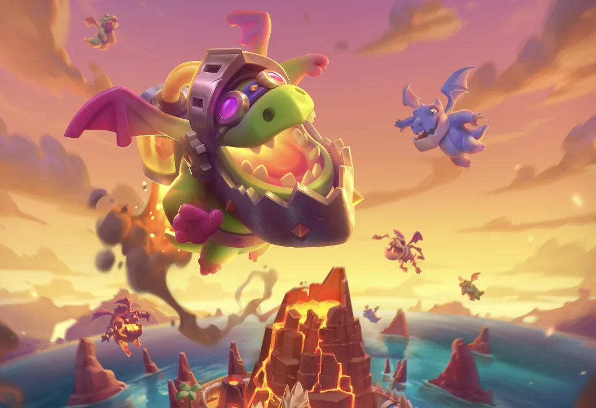

这，又是谁的玉足？

其实，这是近日皇室战争在社媒上发出的图片。

是的，临近月底，皇室战争各种更新消息慢慢地来了，又到了猜谜的固定环节了。

从整体配色来看显然这是和新的觉醒卡牌有关。首先，这肯定不是石头人。

其次很明显这是骷髅。那我们来汇总一下皇室战争目前骷髅现状：

- 炸弹兵：已觉醒  
- 攻城炸弹人：已觉醒  
- 骷髅大军  
- 骷髅守卫  
- 骷髅气球  
- 骷髅帝王：不知道英雄能不能觉醒  
- 骷髅飞龙  
- 气球兵  
- 骷髅召唤  
- 骷髅巨人  

然后仔细看细节，骷髅脚上面有个木板似的东西？基于这个，那其实骷髅气球和盾卫的可能性很大了。

不过本赛季是“醒龙高手”赛季，加之官方已经在社媒上多次发表龙的图片，包括最后一张骨龙的配图和配文，感觉骷髅龙的可能性也不是没有？

再看看本赛季的启动画面，这个骨龙的配色也属实是非常可疑！

不过临近月底了，相信很快会有更进一步的消息的。

今年暑期的更新，不出意外肯定也会是一次大更新——因为就在前几天，6 月月赛 QLASH 龙之联赛总决赛的解说中，《皇室战争》游戏测试员 Marko 确认皇室奇兵将在“这个夏季”加入皇室战争，该模式的加入将带来全新体验，甚至可能成为一次“变革性”尝试。

顺带一提，Marko 官宣完转头就跑去度假了，皇室这边的节奏是真的松弛。活没干完先躺平，也许这是 SC 独有的更新哲学。

所以这些，包括皇室奇兵在内，肯定也会很快和大家见面的。

不知道大家对此，有什么想法呢？
