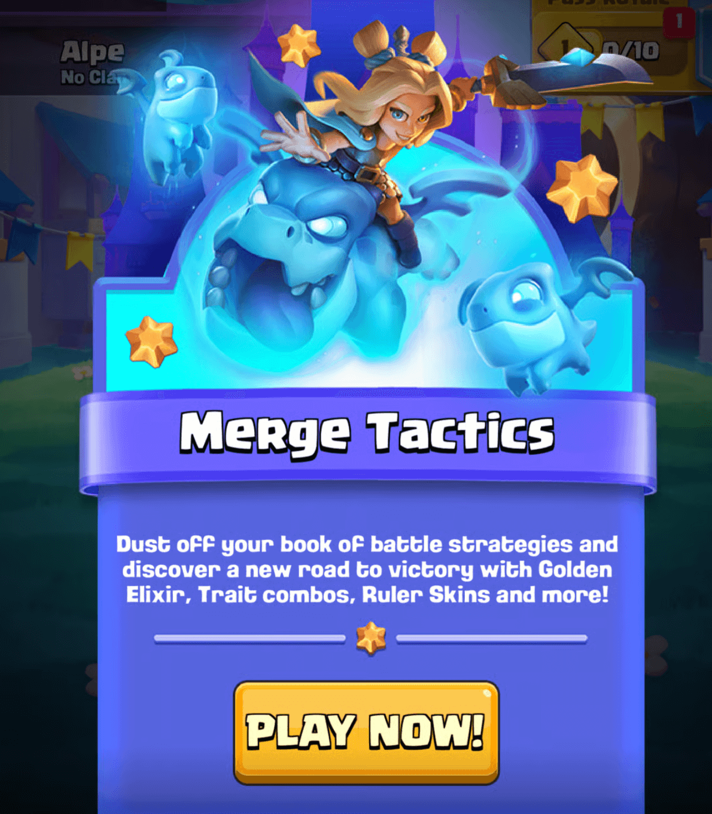
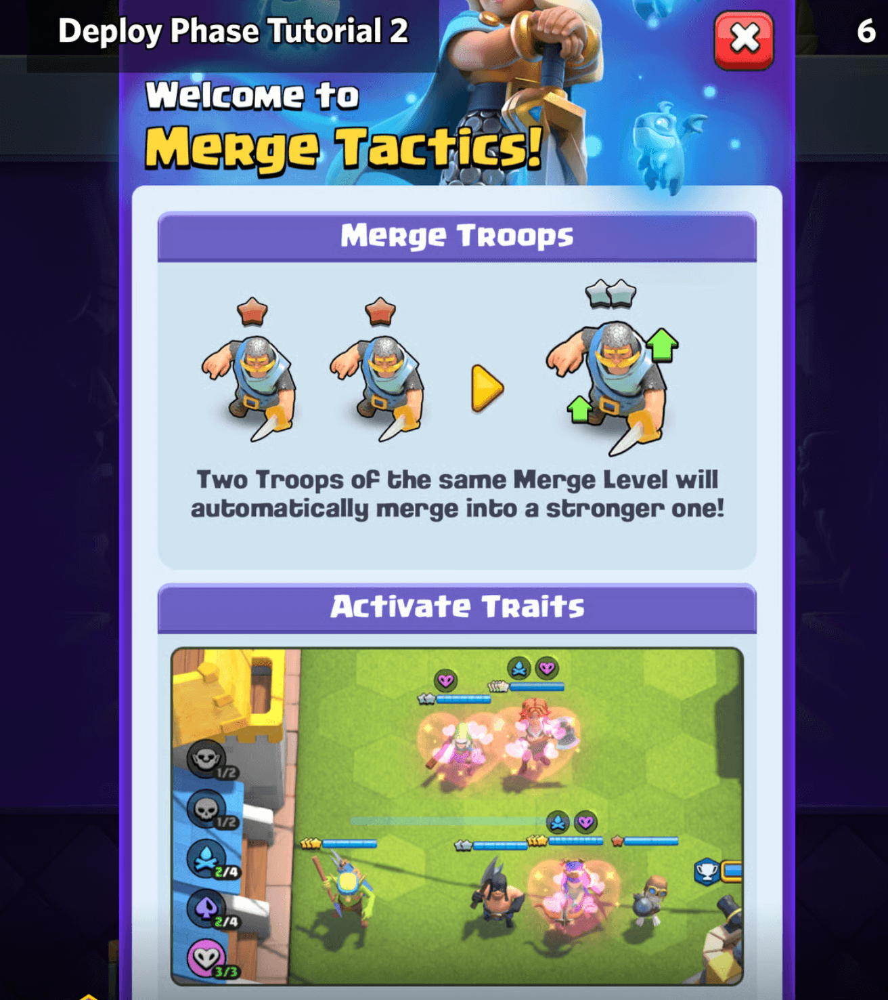

2021年4月，Supercell首次宣布为其Clash IP推出3款新游戏：Clash Quest、 Clash Mini（皇室奇兵）和Clash Heroes。几个月后，同年11月，皇室奇兵的测试在选定国家启动。

这款游戏是一款带有Clash角色的自动战斗游戏。在这种类型中，玩家选择并部署单位，这些单位随后会在多个回合中自动与对手战斗。

经过多年的大规模测试和更改，2024年3月，Supercell宣布"皇室奇兵终止开发"。这标志着该游戏测试阶段的结束。

在该公告中，Supercell还承诺"将皇室奇兵的体验带入皇室战争"。

改编的下一阶段是在公众视线之外进行的。我们知道的是这个想法没有被放弃，但除此之外知之甚少。

这个故事的下一个发展发生在年底的RovioCon 2024期间。在这次活动中，Aleksandar Markovic（皇室战争的总经理）分享了该游戏的一些未来计划，以及"将皇室战争作为策略游戏平台"的愿景。

这个中心将平台不同的游戏，而不仅仅皇室战争的传统战斗，添加皇室奇兵是朝着这个方向迈出的第一步。Aleksandar还表示，计划在2025年6月实现这一目标。

所以现在，6月的最后一天，合合奇兵，它来了！

## 合合奇兵不是皇室奇兵
合合奇兵是自动战斗类型的改编，以适应皇室战争。

它与皇室奇兵有一些相似之处，并且主要由同一团队开发，但它是一个新游戏。两者都有共同的核心目标，例如使这种类型更容易访问、更休闲，并吸引更广泛的受众。

从艺术风格到网格布局，有很多重大变化。但回顾过去已经足够了，让我们了解更多关于这个新模式的信息！

## 合合奇兵概述

在合合奇兵中，4名玩家相互竞争。他们选择皇室战争的部队，部署它们，然后让它们战斗。

战斗基于多个回合，每个回合都有：

- 部署阶段：购买/出售部队，合并它们并将它们放置在竞技场中。

- 战斗阶段：部队自动战斗，直到一队的所有部队都被击败。

当回合结束时，被击败的队伍会失去一些生命值，新的回合开始。如果玩家失去所有生命值，他们将被淘汰。

这个回合循环会重复，直到只剩下一名玩家，即战斗的获胜者。总体而言，这平均需要5-8分钟，比正常的皇室战争战斗稍长。

## 战斗阶段
> 强化你的团队，击败你的对手，并生存到最后！

### 部署阶段

> 每回合获得圣水，并通过点击或拖动三个部队之一将其召唤到竞技场来花费它。

> 将部队拖回商店出售。

当战斗开始时，你会看到一个几乎空无一人的竞技场。你有1个便宜的部队，已经部署，商店在底部。

商店总是有3个部队，每个都有自己的圣水成本。你可用的圣水显示在右侧的大黄色水滴中。

你可以通过点击或拖动部队到你的竞技场/替补席来购买部队。购买部队后，商店会刷新并显示3个新选项。

你可以通过将部队拖回商店，或从部队统计窗口中点击出售按钮来出售部队。出售价格是总购买价值减去1圣水。

部队的购买数量受到队伍规模+替补席规模的限制。替补席规模始终有5个位置，队伍规模随着回合的进行从2增加到6。

> 两个相同合并等级的部队会自动合并成一个更强的部队！

> 召唤具有相同羁绊的部队来激活强大的加成！

合并等级用星星表示，从1到4：

* 1星（青铜）：1倍基础伤害和生命值
* 2星（白银）：2倍基础伤害和生命值
* 3星（黄金）：4倍基础伤害和生命值
* 4星（彩色）：8倍基础伤害和生命值

考虑到每次合并需要2个部队，合并后的总力量相当于所有合并单位的总和。

合并部队会获得1圣水的奖励。这可以用来从糟糕的部队购买中获得一些收益，即使你不打算部署它们。

在战斗中，你可以点击部队查看他们的统计数据。这会打开一个窗口，显示：

- 部队名称、成本、收藏等级和合并等级
- 2个羁绊
- 基本统计数据，如生命值、伤害、攻击时间、暴击几率和范围
- 能力描述和能力等级
- 带有出售价格的出售按钮

### 战斗阶段

这是一个主要的被动阶段，你部署的团队与对手战斗。

当一名玩家的所有部队都被摧毁时，该玩家输掉回合，他们的统治者会受到伤害。这种伤害等于剩余部队的数量加1。

在这个阶段，玩家还可以进行有限的活动，例如：

- 从商店购买部队
- 从替补席出售部队

## 等级和模式进度
合合奇兵集成到皇室战争中，这意味着它没有完全独立的进度系统。

### 部队卡牌

游戏的核心进度，卡牌/部队等级，与你的主要CR收藏共享。然而，在这种模式下，等级的重要性要低得多，因为统计数据每级仅增加+2%；在正常的皇室战争中，它们每级增加+10%。

合合奇兵有一个20张卡牌的卡牌池，所以不是所有的CR收藏都可以在这里使用。如果该模式在新赛季回归，这个卡牌池可能会在未来发生变化。

### 统治者

合合奇兵进度的另一方面是统治者，在某些方面类似于塔部队。这些统治者有特殊的能力，是你在战斗中团队的永久部分。

合合奇兵推出时有2个统治者：

- 皇家国王：输掉一回合会给你+4圣水
- 幻影女皇：每次合并会给你+1奖励圣水

每个统治者都有等级、统治者皮肤和统治者彩纸。到目前为止，所有这些都是外观变化。基本上，升级解锁新的统治者皮肤和统治者彩纸来定制你的统治者。

## 联赛和排名

合合奇兵有10个联赛，玩家可以根据合并奖杯数攀升。这些联赛解锁徽章、随机事件和一些一次性奖励。

主要路径通常基于±30合并奖杯，最后一个联赛在3,500奖杯。完整的联赛分布是：

- 青铜I：0 - 199奖杯
- 青铜II：200 - 399奖杯
- 青铜III：400 - 699奖杯
- 白银I：700 - 999奖杯
- 白银II：1,000 - 1,399奖杯
- 白银III：1,400 - 1,799奖杯
- 黄金I：1,800 - 2,299奖杯
- 黄金II：2,300 - 2,799奖杯
- 黄金III：2,800 - 3,499奖杯
- 钻石：3,500+奖杯

达到最后一个联赛钻石后，玩家可以竞争登上排行榜榜首。

赛季结束时，最终排名不会显示在徽章上，但玩家会获得他们所达到联赛的徽章。

## 模式奖励
玩这个模式的激励措施并不是很强，主要是因为Supercell希望这个测试是有机的，而不是强迫玩家参与。除了玩得开心之外，这些是玩它的主要原因：

- 获得更高联赛的徽章。这个徽章不会有最终排名。
- 从合合奇兵历程中收集一次性奖励。这些主要是少量的随机卡牌。
- 活动和皇室令牌进度的皇冠。玩家每赢一轮就会获得一个皇冠。
- 玩合合奇兵也可以获得每日奖励。要被视为胜利，玩家必须在4名玩家中获得第1或第2名。

## 模式集成
尽管这个模式总体上相当复杂，但与皇室战争的集成并不完整。一旦对这个模式的吸引力有了更好的了解，未来可能会改变这种情况，但现在值得一提的是缺少的功能：

- 没有战斗日志或方法可以随着时间的推移查看你的结果
- 除了他们当前的联赛之外，无法找到其他玩家的合合奇兵统计数据
- 没有API集成，这意味着无法为这个模式提供实时内容和统计数据
- 没有友谊战，玩这个模式的唯一方法是通过主要的排名匹配

## 高级统计
你可以自己尝试这个模式，并慢慢发现这个模式的所有可用内容。但是如果你现在想快速看一下，这部分有所有部队、统治者、羁绊和随机事件的摘要。

### 部队
有20种不同的部队：

- 弓箭手
    - 圣水：2
    - 生命值：480
    - 每秒伤害：84
    - 羁绊：家族 & 游侠
    - 描述：当你有邪恶的射程和热粉色的头发时，谁需要所有的盔甲？

- 弓箭女皇
    - 圣水：5
    - 生命值：849
    - 每秒伤害：72
    - 羁绊：家族 & 复仇者
    - 描述：向最近的敌人发射多支箭。当她的生命值低于50%时，她会隐形并造成额外伤害

- 幻影刺客
    - 圣水：4
    - 生命值：828
    - 每秒伤害：72.0720720720721
    - 羁绊：王牌 & 复仇者
    - 描述：在一定次数的攻击后，冲向3个六边形内最远的敌人，造成额外伤害并眩晕她路径上的所有敌人1秒

- 野蛮人
    - 圣水：2
    - 生命值：840
    - 每秒伤害：96
    - 羁绊：家族 & 格斗家
    - 描述：一个留着刻薄胡子的全能近战攻击者

- 炸弹兵
    - 圣水：2
    - 生命值：480
    - 每秒伤害：67.6056338028169
    - 羁绊：亡灵 & 投掷者
    - 描述：向最近的敌人投掷炸弹，在2六边形半径内造成伤害

- 哥布林
    - 圣水：2
    - 生命值：540
    - 每秒伤害：135.211267605634
    - 羁绊：哥布林 & 刺客
    - 描述：哥布林的速度和近战技能消除了对讨厌的盔甲的需求

- 飞镖哥布林
    - 圣水：3
    - 生命值：634
    - 每秒伤害：96.3855421686747
    - 羁绊：哥布林 & 游侠
    - 描述：一个没有装甲的远程攻击者，跑得很快，射得很远，还嚼口香糖

- 屠夫
    - 圣水：3
    - 生命值：763
    - 每秒伤害：65
    - 羁绊：王牌 & 投掷者
    - 描述：向最近的目标投掷他的回旋镖斧头，穿过几个六边形

- 巨型骷髅
    - 圣水：3
    - 生命值：981
    - 每秒伤害：32.5301204819277
    - 羁绊：亡灵 & 格斗家
    - 描述：被击败后，他会掉落一个炸弹，1.5秒后爆炸，在他的六边形半径内造成伤害并眩晕敌人2秒

- 哥布林钻机
    - 圣水：4
    - 生命值：1137
    - 每秒伤害：82
    - 羁绊：哥布林 & 主宰者
    - 描述：在一定次数的攻击后，向最远的敌人发射火箭，造成50%额外伤害并眩晕他们1.5秒

- 黄金骑士
    - 圣水：5
    - 生命值：1200
    - 每秒伤害：112
    - 羁绊：贵族 & 刺客
    - 描述：击败敌人后冲向生命值最低的敌人并造成额外伤害

- 骑士
    - 圣水：2
    - 生命值：1200
    - 每秒伤害：42.2535211267606
    - 羁绊：贵族 & 主宰者
    - 描述：王国中最强硬的近战战士之一

- 超级骑士
    - 圣水：4
    - 生命值：1551
    - 每秒伤害：43.3734939759036
    - 羁绊：王牌 & 格斗家
    - 描述：每隔几秒跳跃并攻击最大的敌人群，造成伤害并眩晕其六边形半径内的敌人2秒

- 皮卡超人
    - 圣水：3
    - 生命值：1309
    - 每秒伤害：152.4
    - 羁绊：王牌 & 主宰者
    - 描述：一个缓慢但装甲厚重的近战战士。没有什么能超越她...

- 王子
    - 圣水：3
    - 生命值：872
    - 每秒伤害：96
    - 羁绊：贵族 & 格斗家
    - 描述：战斗开始：冲向最近的目标，造成双倍伤害，击退敌人并眩晕他们2秒

- 公主
    - 圣水：4
    - 生命值：620
    - 每秒伤害：82.5
    - 羁绊：贵族 & 游侠
    - 描述：向最远的敌人发射燃烧箭，在2六边形半径内造成伤害

- 皇家幽灵
    - 圣水：4
    - 生命值：879
    - 每秒伤害：134
    - 羁绊：亡灵 & 刺客
    - 描述：在3次攻击后短时间隐形

- 骷髅帝王
    - 圣水：5
    - 生命值：1400
    - 每秒伤害：84.3373493975904
    - 羁绊：亡灵 & 主宰者
    - 描述：对锥形半径内的敌人造成伤害，并为他击败的每个敌人召唤一个骷髅

- 投矛哥布林
    - 圣水：2
    - 生命值：360
    - 每秒伤害：79.5180722891566
    - 羁绊：哥布林 & 投掷者
    - 描述：矛以如此宽的范围划破风，他甚至不需要盔甲

- 武神
    - 圣水：3
    - 生命值：1269
    - 每秒伤害：80.9859154929578
    - 羁绊：家族 & 复仇者
    - 描述：一位将愤怒转化为区域伤害的近战大师

### 部队摘要

| 部队         | 圣水 | 生命值 | 每秒伤害 | 羁绊1 | 羁绊2   |
|--------------|------|--------|----------|-------|---------|
| 弓箭手       | 2    | 480    | 84       | 家族  | 游侠    |
| 野蛮人       | 2    | 840    | 96       | 家族  | 格斗家  |
| 炸弹兵       | 2    | 480    | 68       | 亡灵  | 投掷者  |
| 哥布林       | 2    | 540    | 135      | 哥布林| 刺客    |
| 骑士         | 2    | 1200   | 42       | 贵族  | 主宰者  |
| 投矛哥布林   | 2    | 360    | 80       | 哥布林| 投掷者  |
| 飞镖哥布林   | 3    | 634    | 96       | 哥布林| 游侠    |
| 刽子手       | 3    | 763    | 65       | 王牌  | 投掷者  |
| 巨型骷髅     | 3    | 981    | 33       | 亡灵  | 格斗家  |
| 皮卡超人     | 3    | 1309   | 152      | 王牌  | 主宰者  |
| 王子         | 3    | 872    | 96       | 贵族  | 格斗家  |
| 武神         | 3    | 1269   | 81       | 家族  | 复仇者  |
| 幻影刺客     | 4    | 828    | 72       | 王牌  | 复仇者  |
| 哥布林钻机   | 4    | 1137   | 82       | 哥布林| 主宰者  |
| 超级骑士     | 4    | 1551   | 43       | 王牌  | 格斗家  |
| 公主         | 4    | 620    | 83       | 贵族  | 游侠    |
| 皇家幽灵     | 4    | 879    | 134      | 亡灵  | 刺客    |
| 弓箭女皇     | 5    | 849    | 72       | 家族  | 复仇者  |
| 黄金骑士     | 5    | 1200   | 112      | 贵族  | 刺客    |
| 骷髅帝王     | 5    | 1400   | 84       | 亡灵  | 主宰者  |

### 羁绊

羁绊基本上是部队类型。创建一个在多个部队之间共享羁绊的团队将解锁特殊的提升和能力。

在战斗中，你可以在屏幕左侧轻松看到每个羁绊的部队数量。通过点击每个羁绊，你可以看到羁绊详细信息，以及属于该羁绊的部队。

发布时，部队共有11种不同的羁绊。每个部队有2种。

- 高手
    - 战斗开始：你最高合并等级的部队是队长。当队长击败敌方部队时，你的团队获得+20%攻击速度（4秒）
    - 2个部队：队长获得30% bonus伤害
    - 4个部队：队长获得60% bonus伤害，并获得所造成伤害的+30%生命值

- 刺客
    - 战斗开始：刺客将跃到敌人的后排部队
    - 3个部队：+35%暴击率和暴击伤害

- 复仇者
    - 复仇者获得bonus伤害，最后一个站立的女性获得双倍伤害
    - 3个部队：+30% bonus伤害

- 格斗家
    - 格斗家获得bonus最大生命值
    - 2个部队：+30% bonus生命值
    - 4个部队：格斗家+60%，团队+30%

- 家族
    - 每轮一次，家族在50%生命值时快速治疗并获得bonus攻击速度
    - 2个部队：+30%最大生命值和攻击速度
    - 4个部队：家族+60%最大生命值和攻击速度，团队+30%

- 哥布林
    - 下一轮你将免费获得一个额外的随机哥布林
    - 2个部队：获得一个2圣水哥布林
    - 4个部队：+60%几率获得3或4圣水哥布林

- 主宰者
    - 战斗开始：主宰者后面的部队获得8秒护盾
    - 2个部队：+15% bonus护盾，主宰者+30%
    - 4个部队：+30% bonus护盾，主宰者+60%

- 贵族
    - 前排部队承受更少的伤害，而后排部队获得bonus伤害
    - 2个部队：少20%伤害和bonus伤害
    - 4个部队：少40%伤害和bonus伤害

- 游侠
    - 游侠每次攻击获得攻击速度，最多叠加15次
    - 3个部队：+15%攻击速度

- 投掷者
    - 投掷者获得+1攻击范围，并对远处目标造成更多伤害
    - 3个部队：每六边形+10%伤害

- 亡灵
    - 战斗开始：生命值最高的敌人被诅咒，当该敌人被击败时，你的亡灵获得20% bonus伤害。
    - 2个部队：诅咒1个敌人，最大生命值减少25%
    - 4个部队：诅咒2个敌人，最大生命值减少50%

### 统治者
合合奇兵推出时有2个统治者。你可以在收藏选项卡中选择它，并且在战斗中无法更改。

每个统治者提供不同的能力：

- 皇家国王：输掉一回合会给你+4圣水
- 精灵女皇：每次合并会给你+1奖励圣水

### 随机事件

随机事件在每场战斗开始时随机选择，并应用于战斗的所有玩家，创造出玩家在构建团队时必须考虑的独特场景。

达到更高的联赛会解锁新的随机事件，每个联赛3个。你可以在收藏选项卡中看到所有已解锁的随机事件。

总共有27个随机事件：

- 青铜I
    - 没有随机事件

- 青铜II
    - 大笔资金：所有统治者开始时+5圣水
    - 更大的团队：团队规模+1
    - 遗产：当统治者被击倒时获得+5圣水

- 青铜III
    - 派对时间：团队规模始终为6
    - 稀有之星：开始时有一个2星2圣水部队
    - 史诗之星：开始时有一个2星3圣水部队

- 白银I
    - 传奇之星：开始时有一个2星4圣水部队
    - 冠军之星：开始时有一个随机5圣水部队
    - 越来越富有：每2圣水，下一轮你将获得+1圣水利息

- 白银II
    - 战斗狂热：部队击败敌人后获得+100%攻击速度6秒
    - 少即是多：战斗开始：如果你有更少的部队，你的团队将获得+20%生命值和攻击速度
    - 哎哟！战斗开始：前排部队将反射50%所受伤害

- 白银III
    - 圣水收集器：获得一个圣水收集器，每轮产生2圣水，将被存储直到你决定出售
    - 你是我的：你将获得你击败的第一个敌人部队的1星副本
    - 第一免费：每回合购买的第一个部队是免费的

- 黄金I
    - 四星：商店中的部队池翻倍，有更多可用
    - 回声替补席：每轮，在你最右边的替补席位置获得一个部队的1星副本
    - 潘多拉的替补席：每轮，你最右边的替补席位置的部队变成相同成本的随机部队

- 黄金II
    - 继续生存：开始时有一个假人，如果它在回合中幸存下来，获得+1圣水
    - 羁绊假人：开始时有一个具有2个随机羁绊的假人
    - 挤在一起！每轮，获得一个适合你团队的部队

- 黄金III
    - 幸运折扣：每次商店重置时，一个随机部队的成本将比正常低1圣水
    - 清醒的头脑：如果你的替补席是空的，下一轮获得+2圣水
    - 晋升：每轮，你最右边的替补席位置的部队转变为成本+1圣水的随机部队

- 钻石

    - 聪明的交易：每出售一个部队，下一轮获得+1圣水
    - 提升：在第3轮，你最右边的替补席位置的部队变成3星强者
    - 第一选择：每回合购买的第一个部队是2星

## 最后说明
合合奇兵背后的开发者分享了以下信息：

> 我们想给玩家新的游戏模式，感觉熟悉，但玩法完全不同！所以请继续关注你最喜欢的角色在未> 来以全新的风格战斗..合合奇兵仍处于实验阶段，其未来取决于你喜欢它的程度。我们正在探索新赛季的可能性，有不同的部队、随机事件和皮肤——所以投入其中，玩得开心，最重要的是，分享你的反馈！在接下来的几周里，我们将密切关注，以了解下一步该做什么：合合奇兵应该成为永久性的季节性模式吗？一个特殊活动？还是只是一次性体验？这在你的手中。

