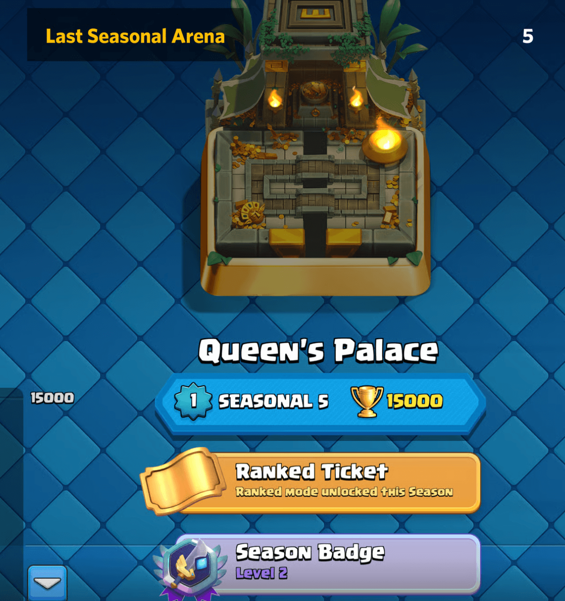
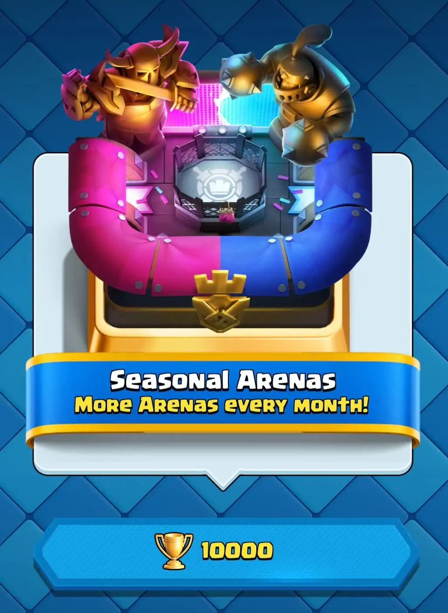
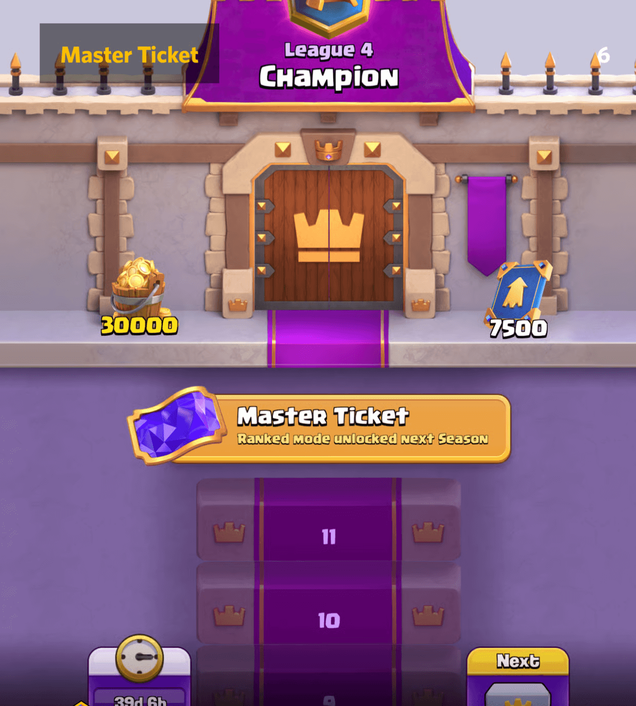
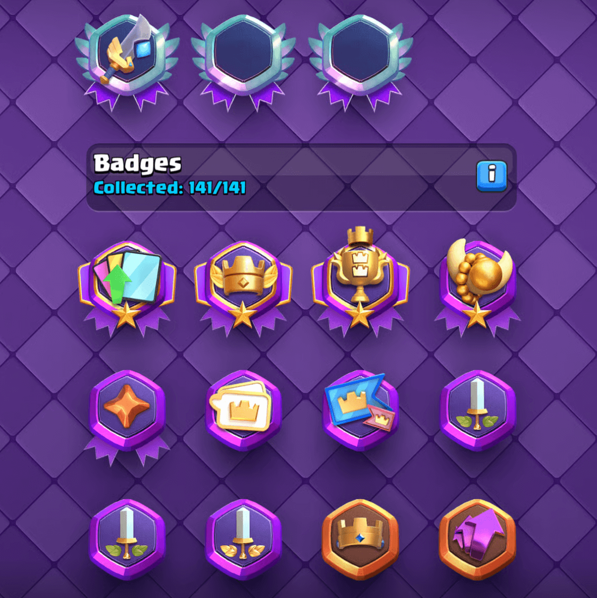
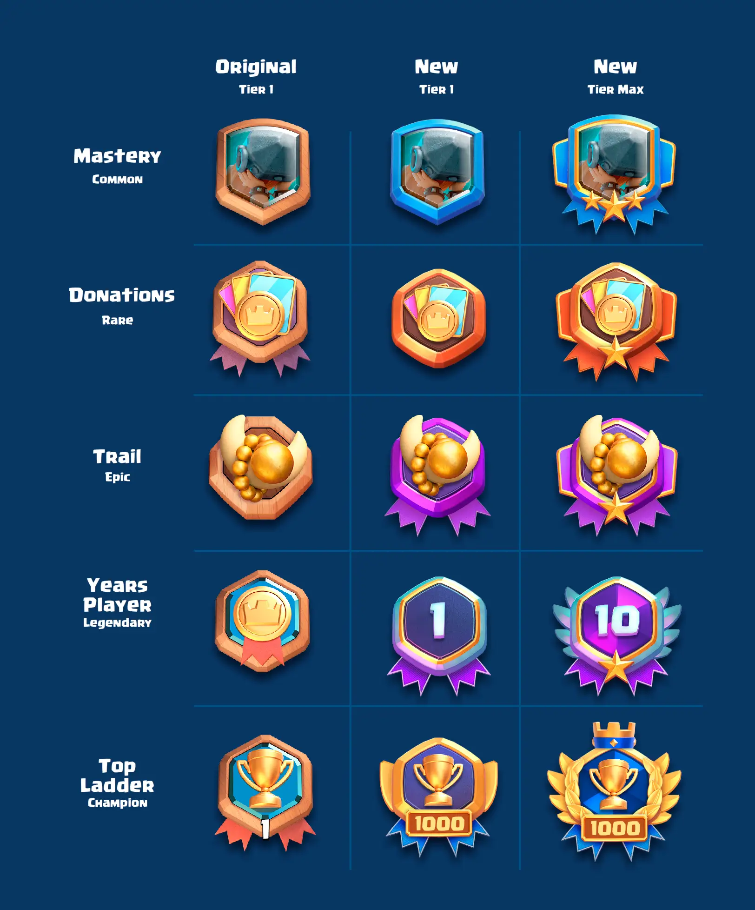
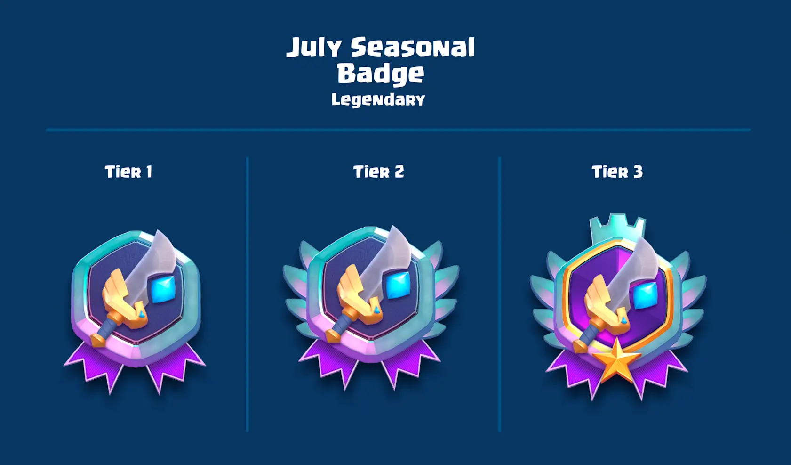
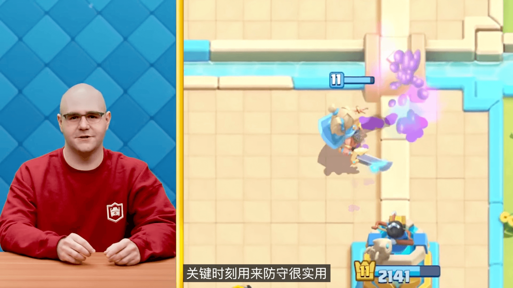
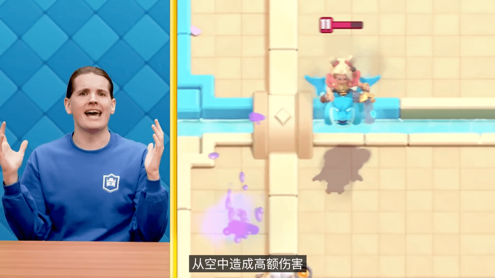

《皇室战争》即将迎来近年来最具颠覆性的一次更新！全新传奇卡牌、革命性进化机制、创新游戏模式以及全面重制的奖杯系统，将为玩家带来前所未有的竞技体验。无论你是久经沙场的老玩家，还是初入竞技场的新手，这次更新都将重塑你对这款游戏的认知。

## 奖杯之路全面升级：挑战 15000 杯新巅峰

### 奖杯上限延伸至 10000 杯，全新竞技场登场

本次更新最大的亮点之一，是奖杯之路将从原来的 9000 杯上限延伸至 10000 杯。开发团队注意到，大量玩家的奖杯数集中在 5000-8000 杯区间，导致匹配难度不断增加。新的奖杯上限将为高水平玩家提供更广阔的施展空间，带来更多史诗级的对战体验。

当玩家达到 9000 杯时，将解锁全新的 "瓦尔卡拉" 竞技场；而 9500 杯则对应传奇竞技场。值得一提的是，10000 杯将成为一个新的里程碑，解锁 "季节性竞技场"。

### 季节性竞技场：动态更新的竞技舞台

季节性竞技场是本次更新引入的全新概念。每个赛季，竞技场都会更新，一些经典的标志性竞技场将重新回归，保持游戏的新鲜感和挑战性。在季节性竞技场（10000-15000 杯）中，获胜将获得 150 杯的奖励，失利则扣除 150 杯，这一机制将加速玩家的奖杯提升速度，但也意味着更高的风险。

当玩家达到 15000 杯时，将解锁当前赛季的排名模式。超过 15000 杯后，获胜奖励将恢复为 30 杯，主要用于好友排行榜的炫耀。

### 奖杯重置机制：平衡竞技体验

为了保持游戏的新鲜感，同时不抹去玩家的进度，季节性竞技场中的玩家奖杯将部分重置，范围在 10000-12000 杯之间，具体取决于上一赛季的成绩。以下是详细的重置规则：

| 原奖杯数 | 重置后奖杯数 |
|----------|--------------|
| 10000    | 10000        |
| 10100    | 10100        |
| 10200    | 10200        |
| 10300    | 10300        |
| 10400    | 10400        |
| 10500    | 10400        |
| 10600    | 10500        |
| 10700    | 10500        |
| 10800    | 10600        |
| 10900    | 10600        |
| 11000    | 10700        |
| 11100    | 10700        |
| 11200    | 10700        |
| 11300    | 10800        |
| 11400    | 10800        |
| 11500    | 10800        |
| 11600    | 10900        |
| 11700    | 10900        |
| 11800    | 10900        |
| 11900    | 10900        |
| 12000    | 11000        |
| 12100    | 11000        |
| 12200    | 11000        |
| 12300    | 11100        |
| 12400    | 11100        |
| 12500    | 11100        |
| 12600    | 11200        |
| 12700    | 11200        |
| 12800    | 11200        |
| 12900    | 11300        |
| 13000    | 11300        |
| 13100    | 11300        |
| 13200    | 11400        |
| 13300    | 11400        |
| 13400    | 11400        |
| 13500    | 11500        |
| 13600    | 11500        |
| 13700    | 11500        |
| 13800    | 11600        |
| 13900    | 11600        |
| 14000    | 11600        |
| 14100    | 11700        |
| 14200    | 11700        |
| 14300    | 11700        |
| 14400    | 11800        |
| 14500    | 11800        |
| 14600    | 11800        |
| 14700    | 11900        |
| 14800    | 11900        |
| 14900    | 11900        |
| 15000    | 12000        |

## 排名模式革新：更纯粹的竞技体验

原 "传奇之路" 现已更名为 "排名模式"，并在每个赛季开始时锁定。解锁排名模式需要满足以下条件之一：

- 在本赛季的季节性竞技场中达到 15000 杯  
- 在本赛季的传奇之路中达到大师 I 或更高级别

从八月开始，解锁条件将调整为上赛季进入冠军联赛。此外，挑战者 I、II 和 III 将被移除，排名从大师 I 开始，让玩家更接近终极冠军的竞争舞台。

## 徽章系统重做：更直观的成就展示

徽章系统经过重新设计，外观更加精美，分类和等级也更加直观，类似于卡牌和化妆品的展示方式。具体变化包括：

- 季节性和年度徽章将更加突出，旧徽章以更整洁的布局分组  
- 达到 13500 杯可获得新的季节性徽章，15000 杯可升级至 2 级  
- 在排名赛中达到终极冠军可获得 3 级赛季徽章  

## 全新游戏模式 "合合奇兵"：回合制策略新体验

合合奇兵是本次更新引入的最具创新性的游戏模式，具有以下特点：

- 完全回合制：融合统治者、玩家喜爱的角色、特质、战斗修饰符和丰富策略元素  
- 零门槛参与：从竞技场 3 开始即可在游戏模式切换器中使用，无需提前搭建卡组  
- 公平竞技机制：玩家和对手从同一个卡池中抽牌，需观察对手选择并智取对手  

开发团队表示，这是体验《皇室战争》的全新大胆方式，希望玩家提供反馈以不断完善该模式。更多信息将于明天发布，敬请期待。

## 全新传奇卡与进化卡牌：颠覆传统玩法

### 传奇卡 "精神女皇"：双形态战斗单位

全新传奇卡 "精神女皇" 带来前所未有的游戏机制，可在两种形态间自由切换：

- 飞行形态：消耗 6 点圣水，可从上方和远处造成伤害  
- 近战形态：消耗 3 点圣水，为竞技场带来疯狂的近战输出  

这种双形态切换机制将为战术选择带来更多可能性。

### 进化卡牌 "骷髅桶"：双倍麻烦来袭

骷髅桶进化后将具备以下特性：

- 受伤害时先掉落第一个桶，紧接着掉落第二个桶  
- 满血到达防御塔时，会在塔上同时掉落两个桶  
- 每个桶均能像原版卡牌一样造成伤害并生成骷髅  

精神女皇和骷髅桶进化将于 7 月 7 日正式进入竞技场。

## 奖励系统重新分配：更公平的获取机制

### 精英外卡：惠及更多玩家

- 25000 张精英外卡保留在排名赛中  
- 10000 张精英外卡移至季节性竞技场  
- 活动中开放 15000 张精英外卡  

### 金币与宝石：优化奖励结构

- 排名赛金币奖励从 75000 降至 25000，剩余 50000 通过季节性竞技场发放  
- 2525 颗宝石从 "卡牌大师" 移至 "奖杯之路"  
- 卡牌精通奖励宝石调整：普通卡 150→100，冠军卡 300→100  

### 宝箱与战斗奖励调整：更明确的用途

#### 宝箱系统优化

- 巨型宝箱：专注提供大量金币 + 史诗卡 / 传奇卡 / 冠军卡组合，移除万能卡  
- 魔法宝箱：更多卡牌和金币，减少史诗卡 / 传奇卡 / 冠军卡数量  
- 闪电宝箱：卡牌和金币数量几乎翻倍，移除万能卡，保留 "强袭" 功能  

#### 战斗奖励调整

- 额外奖励仅提供金币  
- 被移除卡牌将以不同格式回归  
- 计划暑假结束后测试新的战斗奖励格式  

## 其他改进与变化

### 游戏模式切换器优化

- 事件和挑战移至显眼位置，卡组在各模式间保持同步  
- 本赛季可体验模式：奖杯之路、排名、合并策略、限时模式、挑战  
- 全球锦标赛和 2v2 经典模式将在未来更新中回归  

### 经典挑战调整

- 奖励以里程碑形式发放，不再结束时发放单个宝箱  
- 12 胜卡牌书奖励暂时移除  
- 输 3 场后可重新开始，赢 12 场后不可重新开始  

### 圣水可见性调整

禁用圣水观战功能的场景：

- 排名赛、全球锦标赛  
- 好友列表友谊赛  
- 部落友谊赛（领袖 / 副领袖 / 长老除外）  

### 其他细节改进

- 卡片支持按字母顺序排序  
- 进化过滤器显示进化卡片艺术  
- 骷髅桶添加弹跳动画和命中特效  
- 烈火精灵更新视觉特效和信息屏幕艺术  

### 错误修复

- 渔夫可在跳跃中抓住超级骑士  
- 加农炮车切换形态时不再重新瞄准  
- 哥布林小屋在附近有隐身部队时停止生成  
- 龙卷风预览显示正确统计数据  
- 修复敌方地精小屋星级视觉效果  
- 哥布林巨人的长矛哥布林不再获得错误增益  
- 其他稳定性修复和小崩溃补丁  

这次《皇室战争》的重大更新，从奖杯系统到游戏模式，从新卡牌到奖励机制，都进行了全面而深入的调整和优化。无论是追求更高竞技水平的硬核玩家，还是喜欢新鲜玩法的休闲玩家，都能在这次更新中找到属于自己的乐趣。7 月 7 日，让我们一起踏上这场全新的皇室战争之旅！

