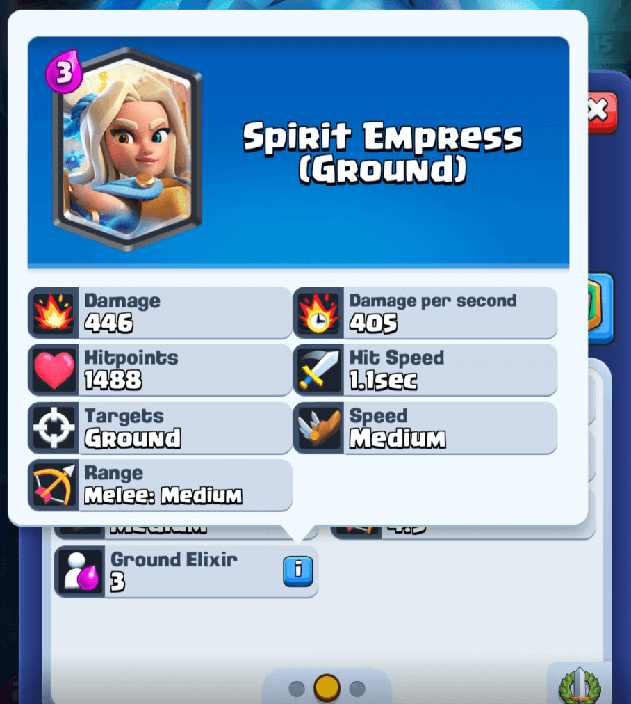

如果你觉得一次大更新还不够过瘾，那么《皇室战争》将在下个赛季推出一张全新卡牌，为你带来更多新鲜体验！

### 精灵女皇：一张卡牌，两种形态

精灵女皇是一张传奇卡牌，她带来了游戏中全新的机制——**一卡双形态**！

她可以以两种不同形态部署：
- 3费地面部队
- 6费空中部队

不过，你无法主动选择形态，她会根据当前可用的 elixir 自动转换：
- 少于3费：无法使用
- 3至5.9费：地面形态
- 6费及以上：空中形态

在了解卡牌数据前，先看看官方描述：
> 见证精灵女皇的风采——她是万灵之始、灵体守护者、巨龙骑手。消耗3费可召唤她作为强力地面部队，或消耗6费让她骑上威严的灵龙登场。

#### 卡牌数据对比

两种形态的核心数据对比如下：

| 属性       | 地面形态 | 空中形态 |
|------------|----------|----------|
| 费用       | 3        | 6        |
| 生命值     | 1,024    | 1,239    |
| 伤害值     | 307      | 307      |
| 攻击间隔   | 1.1秒    | 1.6秒    |
| 每秒伤害   | 279      | 192      |
| 移动速度   | 中等     | 中等     |
| 攻击范围   | 近战     | 4.5      |
| 攻击目标   | 地面     | 任意     |

### 地面形态解析

将地面形态与2-4费区间的单体近战卡牌对比：

| 卡牌       | 生命值 | 每秒伤害 |
|------------|--------|----------|
| 皇家幽灵   | 1,210  | 145      |
| 骑士       | 1,766  | 168      |
| 侠客       | 906    | 194      |
| 狂战士     | 896    | 204      |
| 精灵女皇   | 1,024  | 279      |
| 迷你皮卡   | 1,361  | 471      |

可以看出，她的生命值并不突出，但每秒伤害相当高。其定位更接近迷你皮卡，而非骑士。

了解她的单次攻击伤害也很重要，看看她能一击秒杀哪些部队：

| 卡牌       | 生命值 | 精灵女皇伤害 |
|------------|--------|--------------|
| 哥布林     | 202    | 307          |
| 公主       | 261    | 307          |
| 弓箭手     | 304    | 307          |
| 烟花炮手   | 304    | 307          |
| 投弹手     | 332    | 307          |

### 空中形态解析

尽管费用是地面形态的两倍，但空中形态的生命值仅略高，且每秒伤害更低。不过这并不奇怪，空中部队通常会牺牲部分属性以换取飞行的固有优势。

与其他空中部队的对比：

| 卡牌       | 生命值 | 每秒伤害 |
|------------|--------|----------|
| 幼龙       | 1,152  | 107      |
| 飞行器     | 614    | 155      |
| 精灵女皇   | 1,239  | 192      |
| 巨型投矛手 | 837    | 208      |
| 凤凰       | 1,052  | 217      |
| 地狱龙     | 1,295  | 1,055    |

她的射程与单体伤害结合，在某些方面类似飞行器。

单从费用对应的生命值和每秒伤害来看，与凤凰、巨型投矛手等 cheaper 卡牌相比，她似乎没那么有吸引力。但这些替代卡牌的射程远小于她，因此她可能会找到自己的独特定位。

较高的生命值让她对法术有不错的抵抗力，类似地狱龙：

| 卡牌/法术  | 生命值 | 伤害值   |
|------------|--------|----------|
| 火球       | -      | 688      |
| 闪电       | -      | 1,057    |
| 精灵女皇   | 1,239  | -        |
| 火箭       | -      | 1,484    |

空中形态的单次攻击伤害与地面形态相同，较低的每秒伤害是由较慢的攻击间隔导致的。因此，上述对小型部队的秒杀表同样适用于空中形态。

### 其他细节

#### 女皇与镜像法术

镜像法术只能复制精灵女皇部署时的形态，且不会根据当前 elixir 变化：
- 若部署的是地面形态，镜像会提供4费的地面形态
- 若部署的是空中形态，镜像会提供7费的空中形态

#### 部队还是法术？

尽管卡牌数据将她标记为部队，但有趣的是，在游戏文件中她实际上被列为法术。推测这只是为了实现根据条件部署相应形态部队的中间设置。

#### 精通任务

精灵女皇将随2套精通任务一同推出：

**第一套：伤害输出者**
- 造成205,000点伤害（奖励：2张精灵女皇卡牌）
- 造成610,000点伤害（奖励：8,000金币）
- 造成1,020,000点伤害（奖励：100宝石）

**第二套：部队毁灭者**
- 消灭700个敌方部队（奖励：12,000金币）
- 消灭2,000个敌方部队（奖励：2张传奇万能牌）
- 消灭3,500个敌方部队（奖励：18,000金币）

精通任务进度可在奖杯之路、排名赛、部落战和活动中获取。

### 卡牌获取

新赛季（7月7日）开始后，精灵女皇将在Supercell商店免费领取。

这是Supercell的官方网店，可通过 [store.supercell.com](https://store.supercell.com) 访问。

精灵女皇礼包仅对已达到11阶竞技场的玩家开放，可在赛季前两周内领取。
