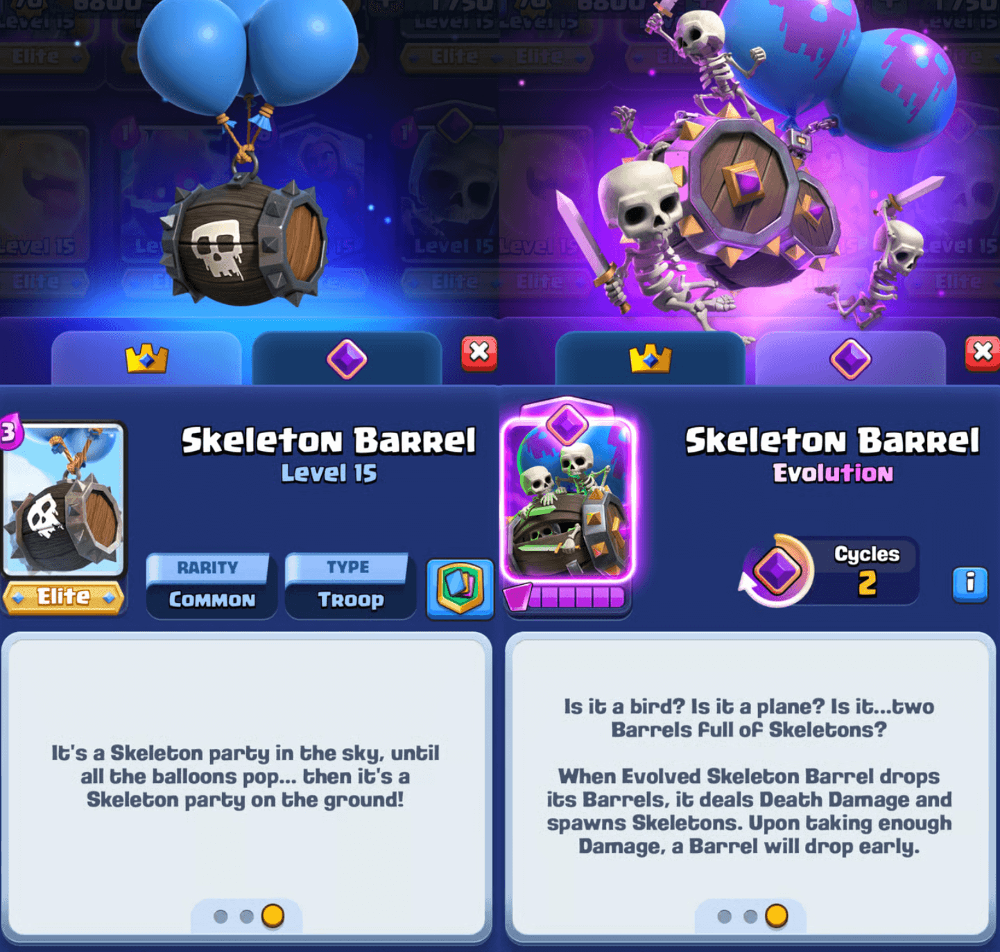
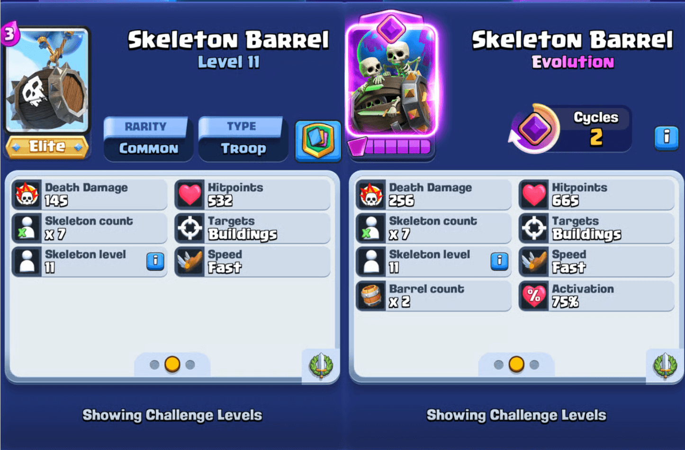
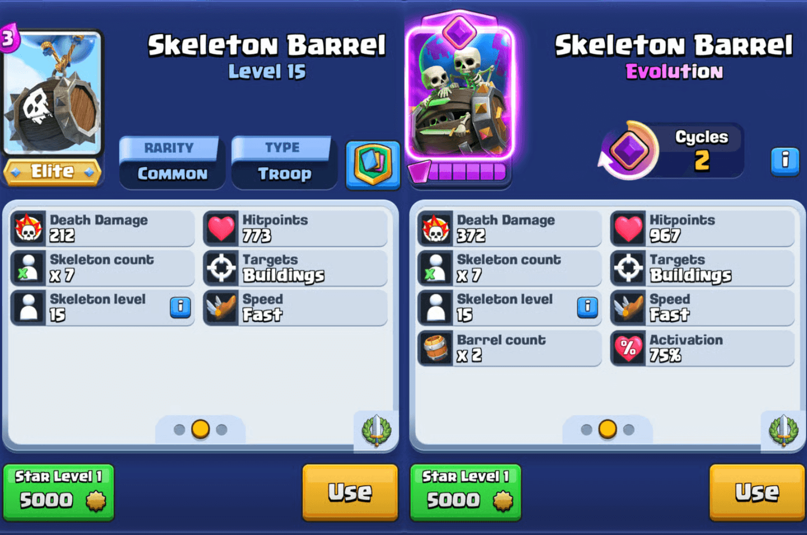
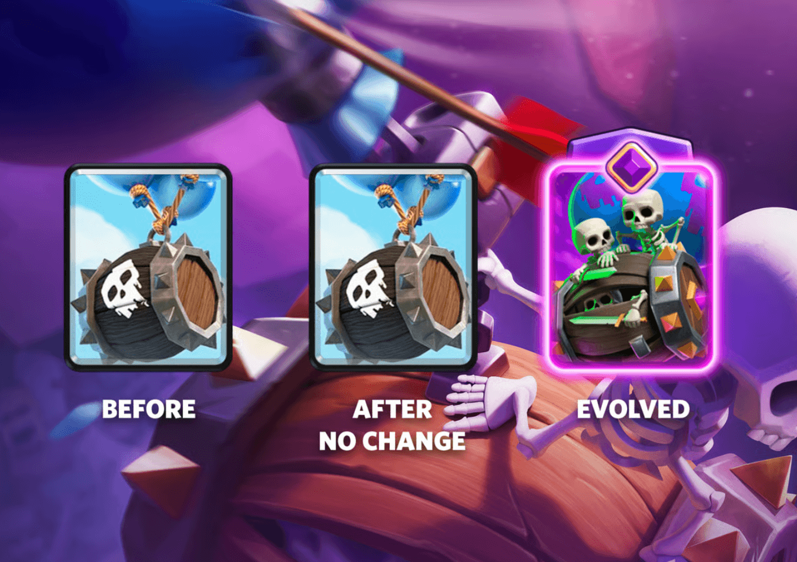
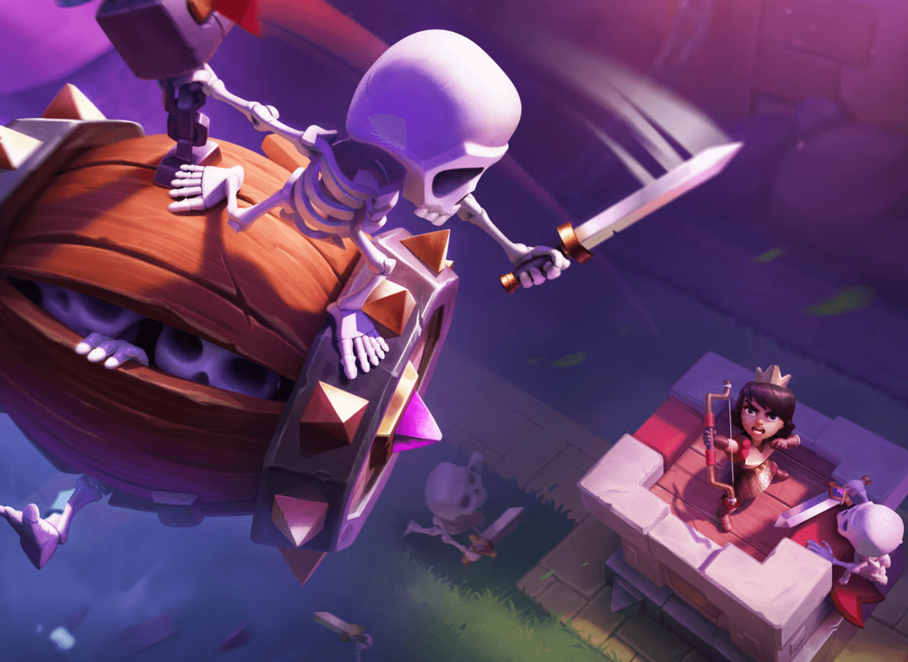

《皇室战争》刚刚经历了一次重大更新，但这并不妨碍季节性内容的推出！骨球将成为7月的主打进化卡牌，可通过皇室钻石通行证解锁。

骷髅气球进化卡描述如下：

> 它是一只鸟？是一架飞机？还是……两个装满骷髅兵的木桶？觉醒骨球投放木桶时，会造成死亡伤害并生成骷髅兵。当受到足够伤害时，其中一个木桶会提前掉落。

## 进化属性

进化卡牌的属性加成再次回归。与普通骨球相比，觉醒骨球的属性如下：

- 生命值：532 → 665（+25%）  
- 死亡伤害：145 → 2×256（+253%）  
- 木桶数量：1 → 2（+100%）  
- 每桶骷髅兵数量：7个（保持不变）

觉醒骨球采用了新卡牌设计中常见的生命值触发机制。

当生命值剩余75%时，触发机制会激活，导致第一个木桶提前掉落。这意味着当觉醒骨球失去25%的生命值时，两个木桶中的一个会提前投放。

如果在到达建筑或防御塔前未触发该生命值机制，那么两个木桶会在抵达目标时同时投放。

两个木桶的伤害均比普通木桶高出77%，即使其中一个提前掉落也是如此。如果能通过坦克抗伤让两个木桶都命中公主塔，其投放伤害将是普通骨球的3倍以上。

这对防御塔的伤害相当可观！作为参考，以下是不同来源的防御塔伤害对比：

| 来源 | 防御塔伤害 |
|------|------------|
| 普通骨球 | 145 |
| 火球 | 207 |
| 1个觉醒骨球木桶 | 256 |
| 火箭 | 371 |
| 2个觉醒骨球木桶 | 512 |

## 进化周期
骨球需要2个进化周期才能激活觉醒效果，也就是说每部署3次会出现1次觉醒形态。

## 上线时间
觉醒骨球将于7月7日新赛季开启时正式上线。

通常，卡牌进化会在赛季末（每月第一个周一）稍早时候推出。一旦上线，玩家可使用万能碎片解锁。新赛季开始后，购买皇室钻石通行证的玩家将获得6个骨球碎片用于解锁。

获取骨球碎片的其他方式：
- 升级宝箱  
- 限时活动（未来赛季）  
- 商店特惠（未来赛季）  
- 5星幸运掉落  
- 使用万能碎片

