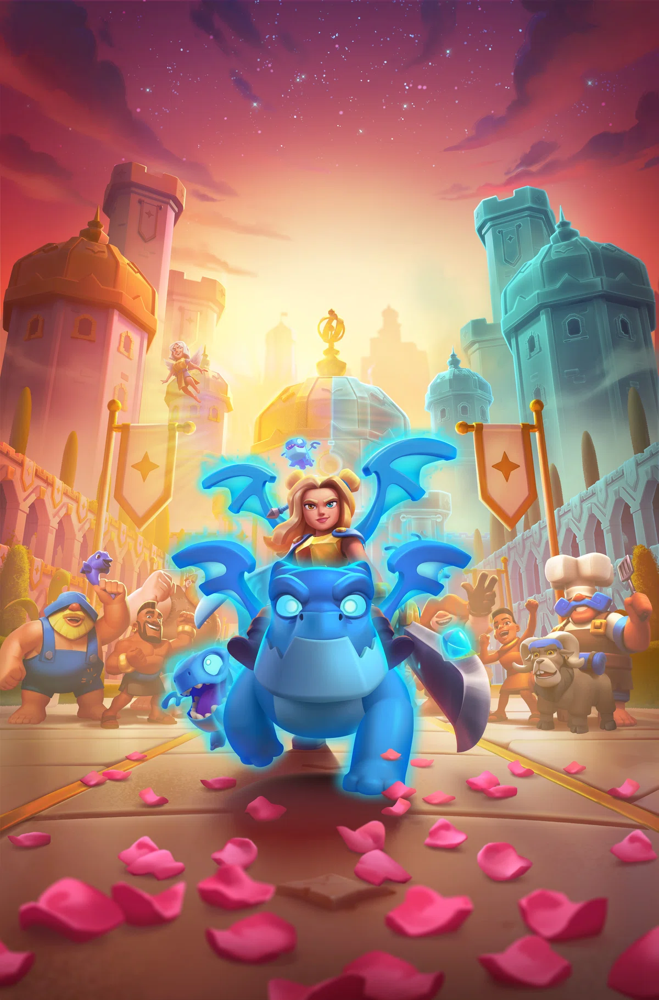
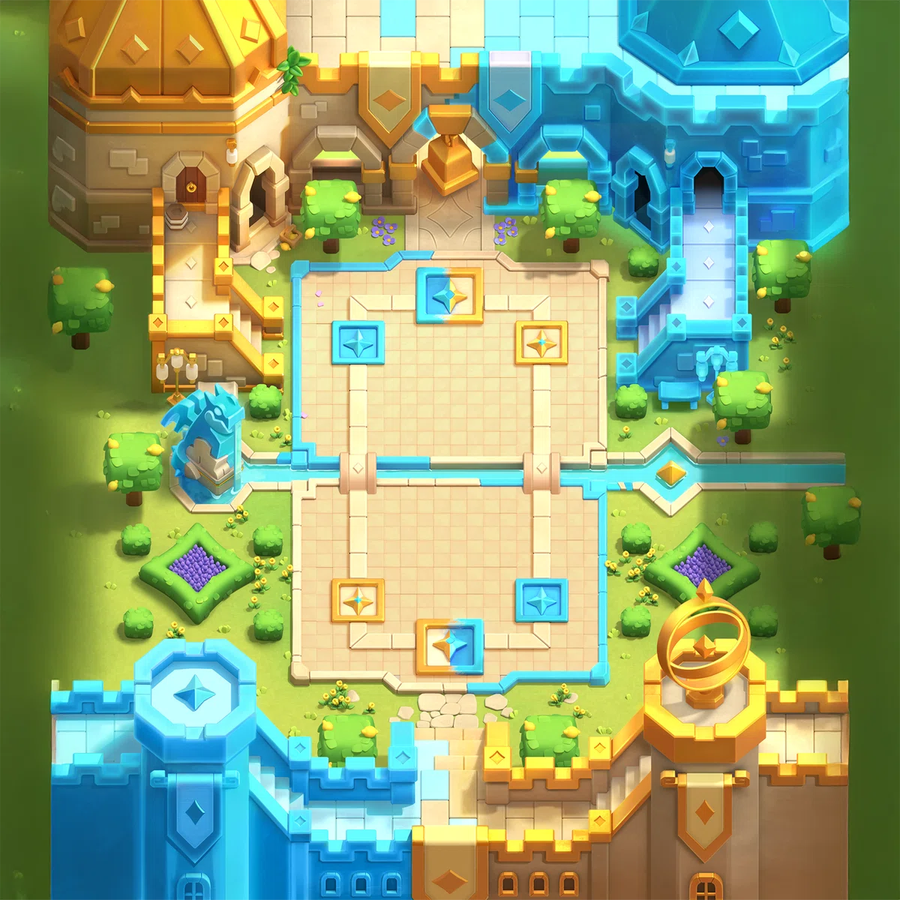
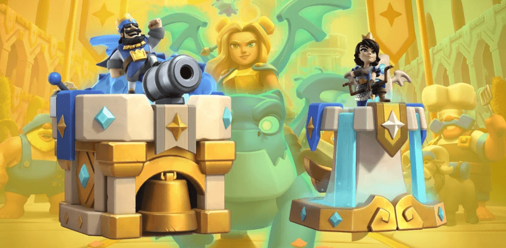
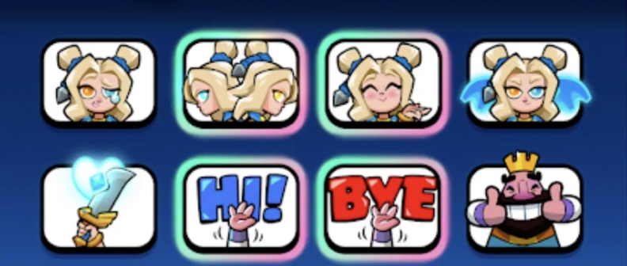
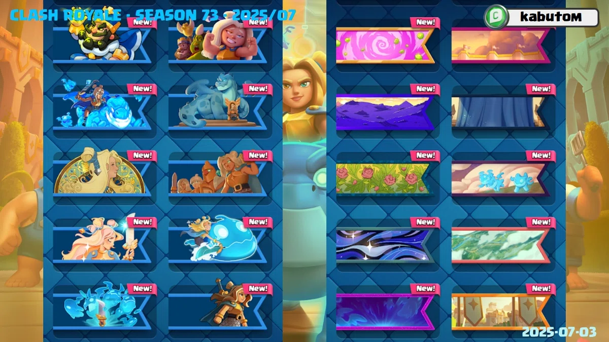
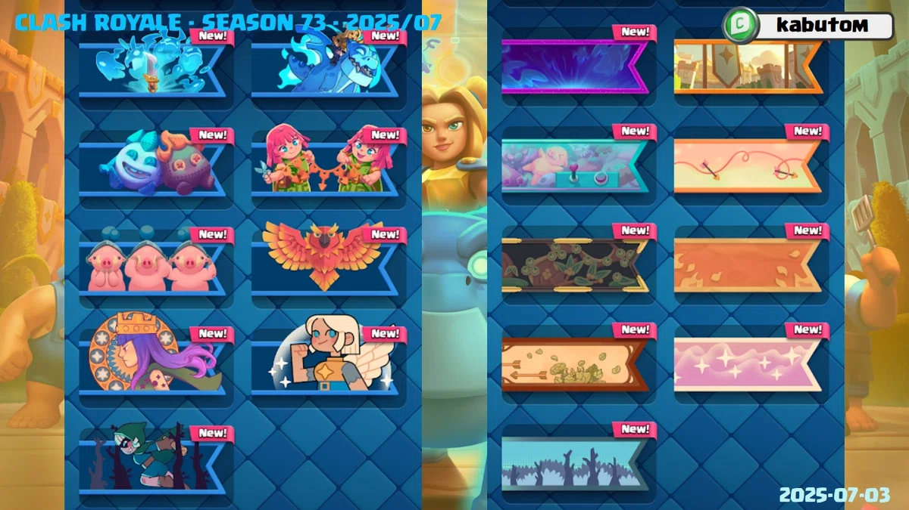
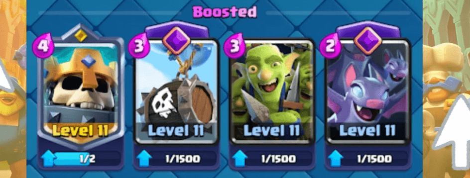
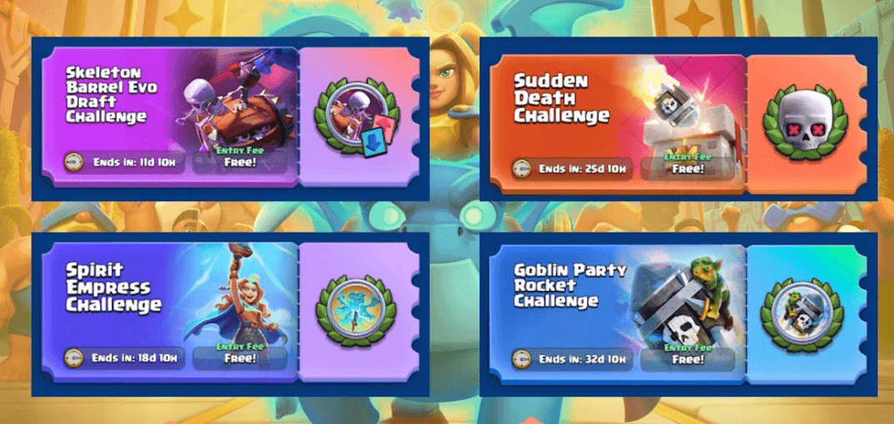
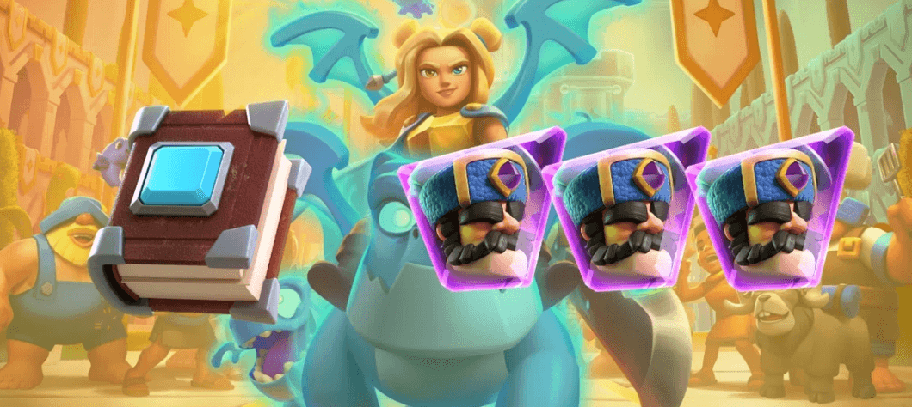

准备好你的卡牌吧，挑战者们！

《皇室战争》第73赛季即将于7月7日开启，届时将带来一系列秉承“帝国时尚”主题的全新内容。亮点包括：全新主题竞技场、专属塔皮肤、全新表情、全新卡牌进化，以及传奇角色“精灵女皇”的到来！

## 七月赛季新加载界面
新的加载画面突出了精灵女皇凯旋归来的场景，她受到了王国军队和民众的热烈欢迎。视觉效果强化了本季主题，画面生动活泼且极具魅力。

## 全新竞技场
本赛季的全新竞技场风格独特！“精灵女皇”竞技场拥有独特的布景：竞技场一半为金色，象征着力量与皇室威严；另一半为蓝色，唤起精神的宁静。巨龙雕像、精致的建筑以及震撼的视觉效果，让战场焕然一新。

## 塔楼皮肤
本赛季购买钻石通行证的玩家将解锁一款以女皇为灵感的精美塔楼皮肤。其设计令人联想起精神圣殿，点缀着金色装饰和神秘的蓝色能量特效。

## 第73赛季表情
本季将推出多款全新表情——包括精灵女皇的表情和全新文字表情！以下是各表情的获取方式：

- “嗨！”表情：皇室通行证中获取
- “再见！”表情：商店礼包购买
- “女皇之剑”表情：挑战赛中获取
- “情绪矛盾的女皇”表情：排名赛中获取
- “精神力量”表情：（暂未公布获取方式）
- “皇后心情波动”表情：商店礼包
- “人格分裂皇后”表情：商店礼包

## 全新战旗

本赛季还将推出多达 17 套全新战旗供玩家收集，可根据季节气氛定制个人资料！目前还不知道具体有多少会实装，所以本月并非所有战旗都能实装。

## 强化卡牌
在本月，以下卡牌将暂时获得强化

- 骷髅王
- 骷髅气球
- 哥布林团伙
- 蝙蝠

## 新传奇卡牌：精灵女皇
皇室战争中首张双形态卡牌，而且，她还是传奇卡牌！它最大的特点在于，它是**皇室战争史上第一张拥有两张卡牌性能的卡牌** ！花费 3 费即可成为地面不对，花费 6 费即可成为空军！

- 发售日期： **7 月 7 日星期一** 
    
- 解锁： **竞技场 15** （5000 个奖杯）
    
- 获取方式： [**Supercell 商店**](https://store.supercell.com/ja/clashroyale?boost=kabutom)

  

<iframe width="100%" width="100%" height="100%" style="position: absolute; top: 0; left: 0; border: 0;" src="//player.bilibili.com/player.html?isOutside=true&aid=114778722863651&bvid=BV1r53HzkEtE&cid=30797988610&p=1" scrolling="no" border="0" frameborder="no" framespacing="0" allowfullscreen="true"></iframe>
  

## 新觉醒：骨球
说到桶……全新的卡牌进化将是骷髅桶，正如大家最近所了解的。它拥有一个全新机制：现在会发射两个桶！没错——一个在激活时发射，另一个在碰撞时发射！

  

<iframe width="100%" width="100%" height="100%" style="position: absolute; top: 0; left: 0; border: 0;" src="//player.bilibili.com/player.html?isOutside=true&aid=114784393498279&bvid=BV1YP38zHEXK&cid=30816339138&p=1"  frameborder="0" allow="accelerometer; clipboard-write; encrypted-media; gyroscope; picture-in-picture; web-share" referrerpolicy="strict-origin-when-cross-origin" allowfullscreen></iframe>
  

## 赛季活动和挑战

7月的活动安排已经确定！请留意以下日期，做好准备：

- 7月7日至14日：骷髅气球觉醒挑战  

- 7月14日至21日：精灵女皇挑战  

- 7月21日至28日：突然死亡锦标赛 

- 7月28日至8月4日：哥布林派对火箭活动  

## 赛季里程碑活动

**里程碑活动**是限时活动，玩家可以单独或集体完成任务。要参加，玩家必须达到竞技场 7 级或以上。

7 月份的具体活动细节尚不清楚，但我们已经获悉**主要奖励**是什么。

- 本月卡牌之书： **普通卡牌之书** x1
    
- 本月觉醒碎片：**觉醒猎人碎片**x3
    

不要错过主屏幕上突然出现的特殊图标！

