没有人会想到，皇室战争会走到今天这一步。

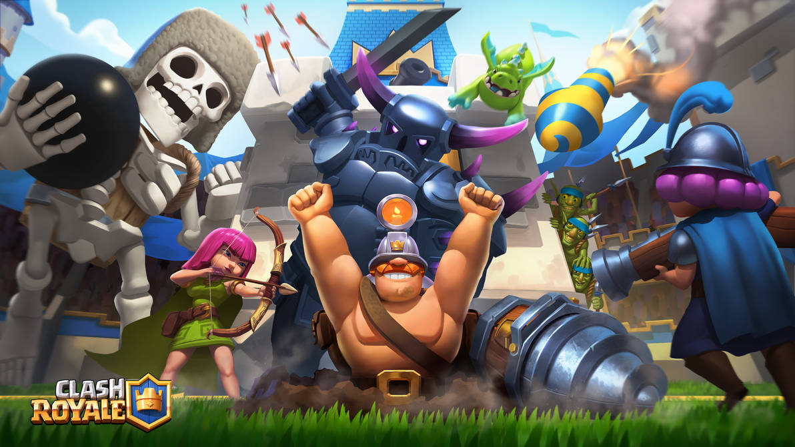

它原本只是部落冲突的衍生游戏，近年来早已在部落冲突和更潮的亲儿子荒野乱斗面前退居二线。但现在，皇室战争的表现超越了 Supercell 的所有其他游戏——播放量、热度、活跃玩家数，乃至收入。

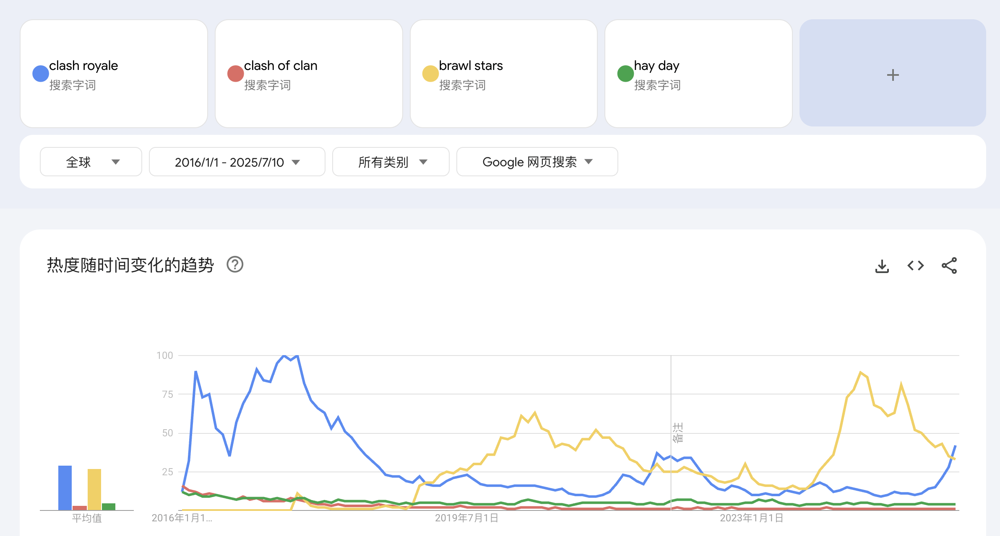

怎么会这样？一个 2016 年的卡牌游戏，为什么突然变成了 Supercell 的顶流？

这是一个很有趣、很值得深究的话题。今天让我们来说道说道～

2025 年 6 月，发生了一件没人预料到的事——皇室战争的收入超过了所有 Supercell 的游戏，
不是略胜一筹，而是大幅领先。

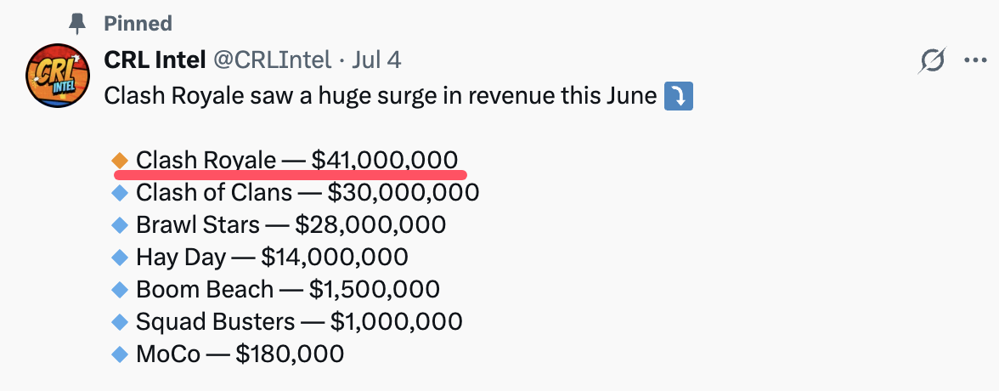

今年 1 至4 月，皇室战争的营收依然保持着以往的平均水平，1500万美元左右，偶有波动，但是基本持平。

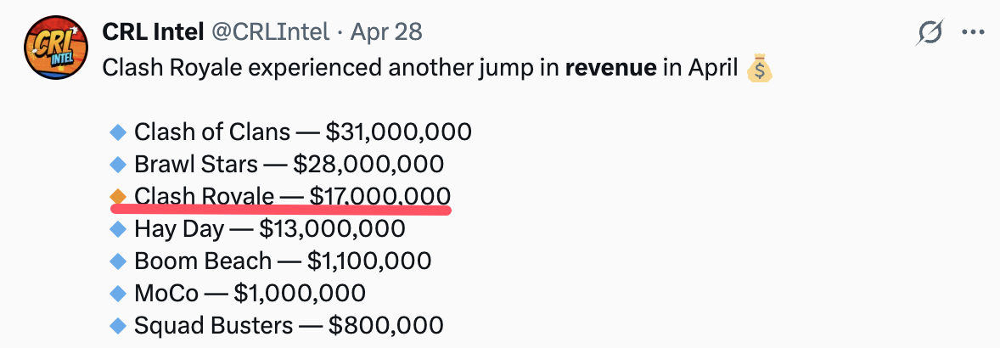

到了5 月份，皇室战争营收为 2800 万美元，当时荒野乱斗是冠军，3900 万，Clash of Clans 稍高一点，2900 万。

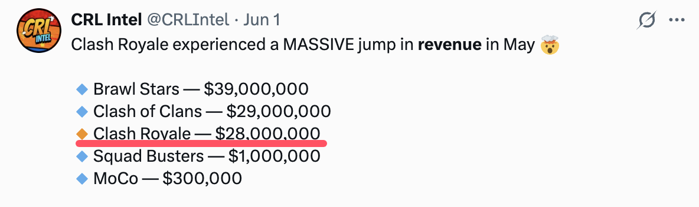

  
结果 6 月，皇室战争直接爆发，收入冲到 4100 万美元，比部落冲突高出 38%，比荒野乱斗多了将近 47%。而且这个数字还不包括 Supercell 商店里的销售收入，也就是说，实际数额可能更高。这也是有史以来，皇室战争首次正式超越部落冲突和荒野乱斗的月营收。而整个 6 月，Supercell 全系产品总营收突破了 1.12 亿美元。这对一家移动游戏公司来说是个疯狂的数字，比很多公司一整年的收入都多。

我们来换个角度感受一下这个数字。按照近几年的估算，在特斯拉市值高涨期，特斯拉 CEO 马斯克每天大概能赚 2.73 亿美元，也就是每小时超过 1100 万美元。也就是说，他大概 10 个小时就能赚到 Supercell 全月的营收，这听起来相当夸张。不过对于 Supercell ，尤其是皇室战争来说，这已经是一次重大的翻身，几乎是靠它一个游戏扛起了半壁江山。

而且这次不只是收入问题。 在美国，搜索热度和活跃玩家数已经回到了 2017 年的巅峰期水平。 整整 8 年前的那个 CR 黄金时代。

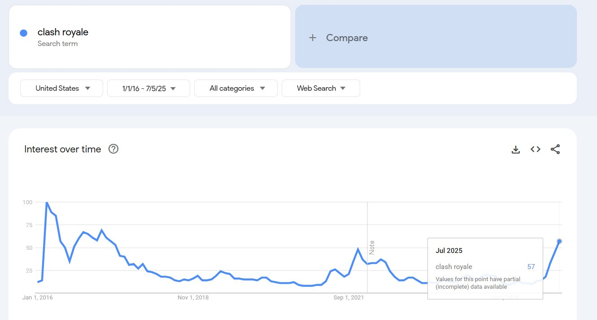

而最离谱的是，现在游戏里连 2v2 模式都还没回归，而这个数据还在持续冲高。不只是美国。 德国、土耳其、拉丁美洲，全球玩家都在重新登录皇室战争。

皇室战争不光赢了同门兄弟，它还重新找回了自己最重要的一项数据，真金白银的营收。

说实话，皇室战争近些年的更新历史可以说是移动游戏界最差的那一档，常被国内玩家戏称芬兰三国杀。 各种更新和操作不仅令人失望，有时候还让人生气。 贪婪、游戏 bug、对游戏毫无理解，Supercell 基本占全了。

想想当年的部落战 2 吧，一个漏洞百出的系统，开发了老半天，结果上线体验却像是赶工做的， 彻底毁了原本好好的部落玩法。多年后，曾经的策划 Seth 在一部回顾皇室战争历史的影片中，终于也承认了部落战 2 的更新是皇室战争历史上最失败的一次更新。

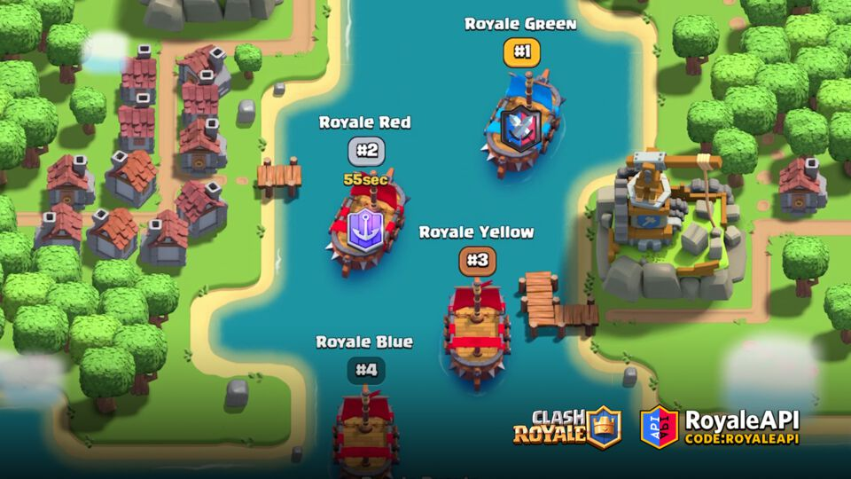

再看看第一次皇室狠惠，一个宣传得像是打折优惠的活动，结果变成皇室战争历史上最大的坑之一。 那些听信 Supercell 鼓励、花了金币升半价升级卡牌的玩家，起初还以为Supercell 真的良心发现给了这么大的优惠。结果没过几周就被 14 级卡牌系统当头一棒，所有溢出的卡全都浪费了，反倒是没升的玩家，手里多了上千张卡和几十万金币的优势。背刺积极玩家，永远都是Supercell 的传统艺能。

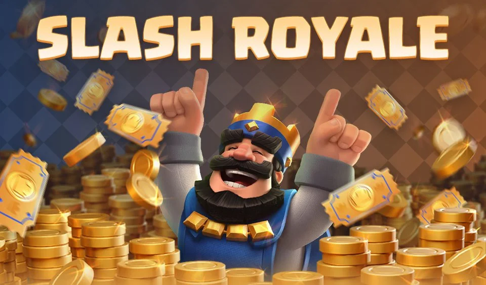

然后 Supercell 还在继续作妖， 15 级来了，带着臭名昭著的精英万能卡，那肝度简直离谱，连满级老玩家都觉得像是重新开局。

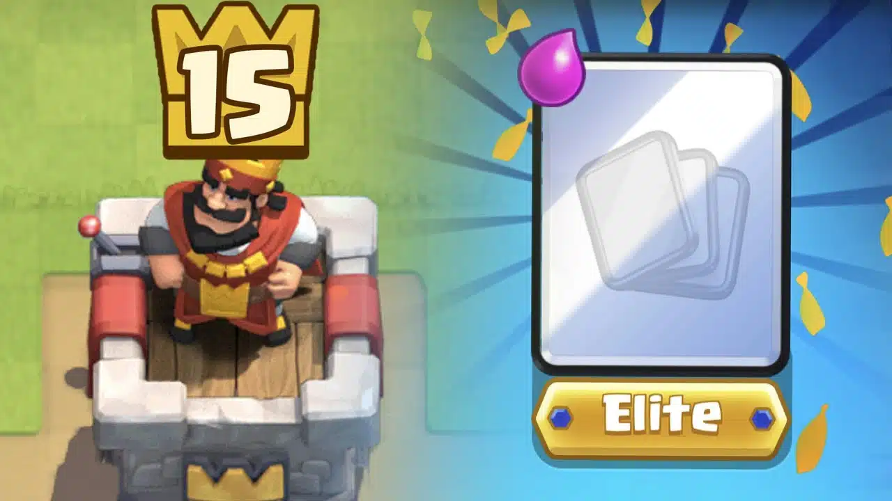

接下来几年的更新继续把这些 Buff 叠满： 通行证削弱、宝石缩水、成就系统改废、2v2 没奖励、全盘削弱惊喜宝箱的奖励……整个皇室战争的系统几近崩溃。

更糟的是，皇室战争的官方创作者在各种社媒上发声，Supercell 表面上表示听取意见，结果根本没改。 玩家们一次又一次的感觉被骗，被无视，彻底失望。Reddit 上全是讽刺贴，说皇室战争成了圈钱机器。 退坑潮一波接一波，YouTuber 集体呼吁官方觉醒，社区的声音那么大，Supercell 却始终像没听见一样。

所以，皇室战争是怎么从这个局面走到今天，玩家竟然又开始玩得挺开心了？这部分就有点复杂了。不是某个爆点促成的，这是一切共同作用的结果。

  
让我们把目光投回 2025 年 5 月，一位昵称为@Jynxzi的用户，在 Twitch 开启了皇室战争的直播，并在5 月 22 日在 X 上发推，宣布了将在 5 月 24 日举办总奖金 1 万美元的 Clash Royal World Cup（皇室战争世界杯）。

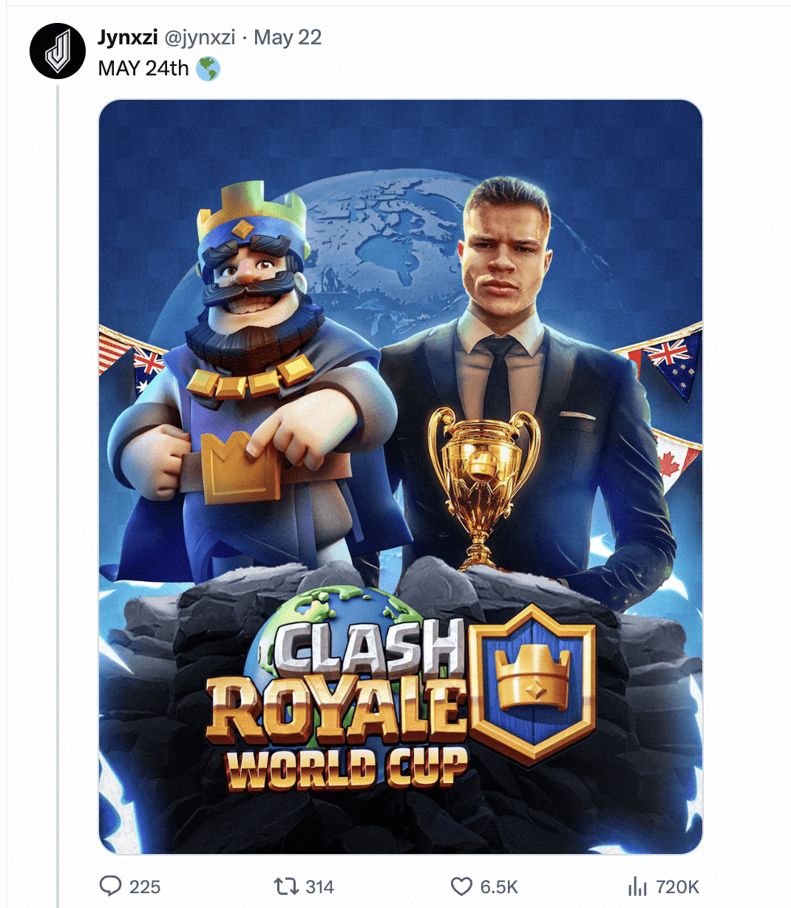

@Jynxzi 是何许人？

他是一位在Twitch直播游戏的主播。2019年入行做直播的他，曾经还是一位流量低到一年365天，每次直播都只有一个人观看的小主播。如今已是有着757.5万粉丝关注，订阅量还曾经一度排名全Twitch第一的大主播。他以直播《彩虹六号：围攻》而闻名，他在Twitch上的人气也带动了《彩虹六号：围攻》这款游戏，使其在一定程度上被更多人所熟知。

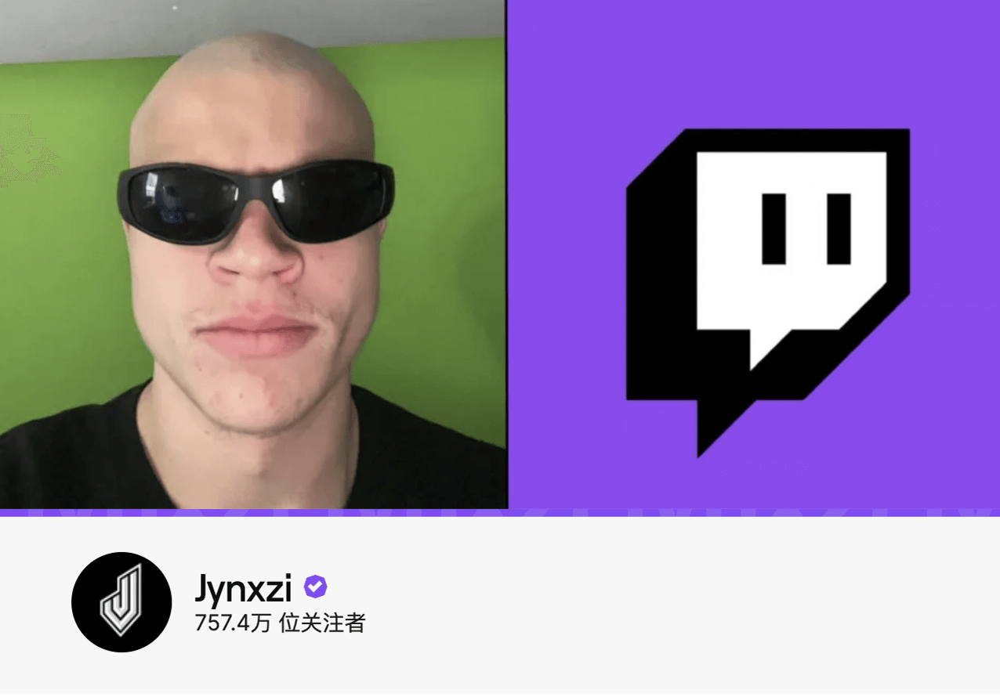

Jynxzi 在油管也有接近 500万的订阅。

直播中的Jynxzi主打一个抽象，直播风格非常类似大网红甲亢哥，搞节目效果是其直播间的基本操作，包括但不限于拍桌、无能狂怒、鬼叫等等。2024年的Streamer Awards上，他击败了Shroud和Tarik等知名主播，获得了最佳突破性 Streamer奖和年度游戏玩家奖。

从任何角度来讲，@Jynxzi都是一位真正意义上的“大网红”。因此，该消息一出，迅速引爆了社交媒体。皇室战争圈内外的玩家，纷纷又把注意力集中到了这款已经“过气”的老游戏上。最终，这场杯赛吸引了 31 个国家和地区的选手参赛，并于5 月 25 日圆满结束，Lucas、Pedro领衔的巴西队最终获得了冠军。

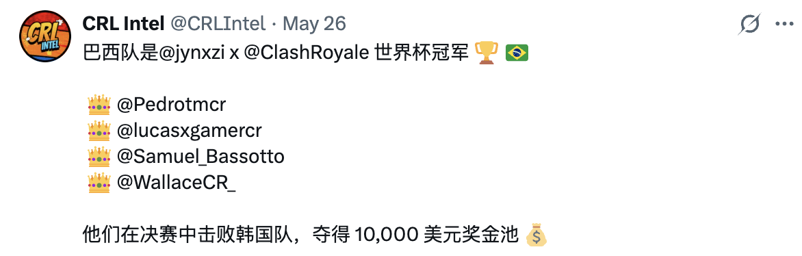

现在我们无从得知，Jynxzi在 Twitch 的直播以及发起的世界杯比赛背后，是否有 Supercell 官方的影子，是否是一场精心策划的商业行为。但这不重要，顶流就是顶流，很快，Jynxzi 就被 Supercell 招安，成为了 Supercell 的 Supercell 的超级创作者。他的 Twtich 直播日程中，也开始更多的安排皇室战争的内容。

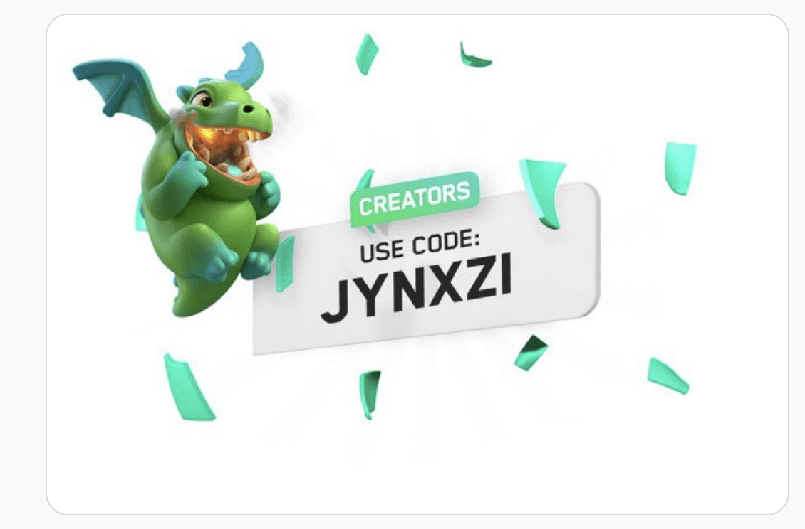

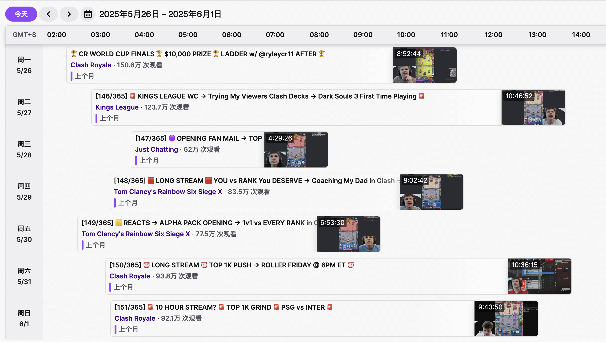

总之，这一次，皇室战争是真的出圈了。

时间来到 6 月，Jynxzi 的 Twitch 皇室战争直播还在继续，他和法老、Morten 等职业选手还进行了一系列的联动比赛，进一步又提高了皇室战争的人气。

与此同时，皇室战争迎来了 2025 年最大的一次更新。

出乎意料的是，这是一次不那么拉跨的更新。不是神级更新，也称不上革命性，但在过去几年，见识过太多Supercell 对于皇室战争的阴间操作后，这次“还行”的更新也对于玩家堪称奇迹，确实比以前强多了。

而这，就足以引爆一场多年未见的正向连锁反应。

比如他们第一次认真处理了奖杯路和排位系统。奖杯路现在能一路冲到 10000 杯，中段玩家终于不那么憋屈了。排位也改了，不再只是传说之路，而是有重置机制、有独特奖励、有良性成长体系的真实竞技。

更关键的是，皇室战争不再只是皇室战争。Supercell 正式把它做成了一个平台游戏，有点像堡垒之夜，但是是皇室战争风格。第一个全新的游戏模式——合合奇兵，被正式引入皇室战争。你可以在首页的游戏模式切换中找到它。

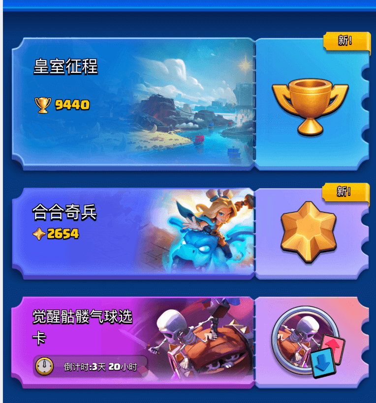

合合奇兵不是一个简单的临时游戏模式，而是个完整的自走棋游戏，使用皇室战争的兵种，但有自己的 3D 画面、经济系统、成长线、装扮系统。

  

一开始你要选一个统领角色，每个都有不同被动。然后从共享商店买兵，合并相同兵种升级，站位战术也有讲究，类似自走棋或战棋生存赛。不过这次你不是打一个对手，而是同时面对四个人。有点混乱，有点靠运气，但节奏快、策略性高，确实上头。

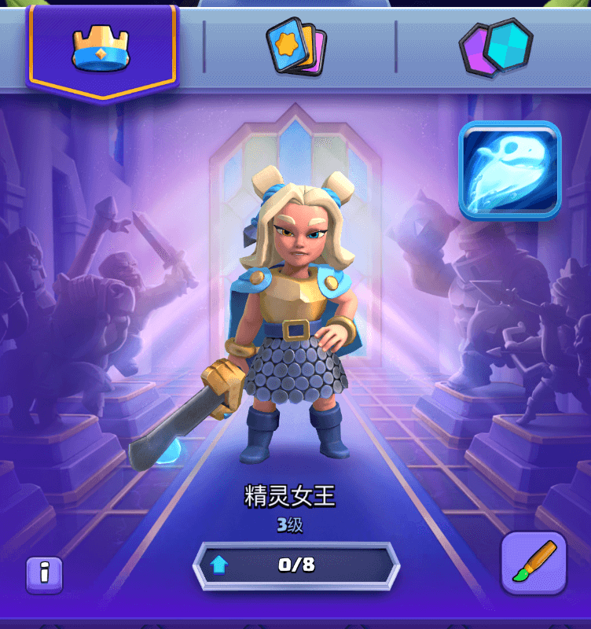

机制也很直观：两个一星合并成二星，两个二星变三星，四星则需要特殊事件加上相当的运气才整得出来。还有种族/羁绊效果，比如亡灵单位会诅咒敌人并在击杀时强化彼此，哥布林则会每轮送一个白嫖兵。

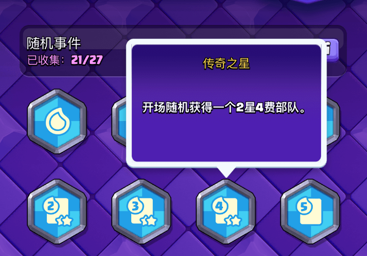

这里面是真有内容、真能搭配出思路，尤其是熟悉了那 27 个羁绊和特性之后。

不过并非人人满意。

这个模式虽好，但代价也相当的大。因为合合奇兵的灵感来源并不只是皇室战争，更像是直接替代了皇室奇兵。而那些花了数年时间支持皇室奇兵的玩家，现在觉得自己被忽悠了。他们本以为皇室奇兵 会在皇室战争中涅槃重生，会更好玩、更好上手，或者至少，还是皇室奇兵。

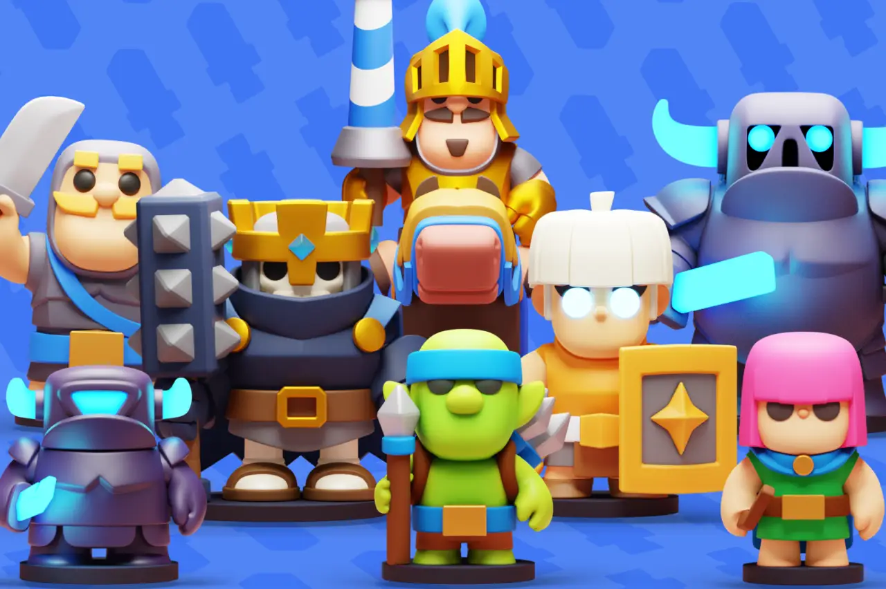

结果看到的是完全不一样的游戏。

没有 1v1 模式，没有站位策略，甚至艺术风格大变，很难再看到皇室奇兵的影子。

 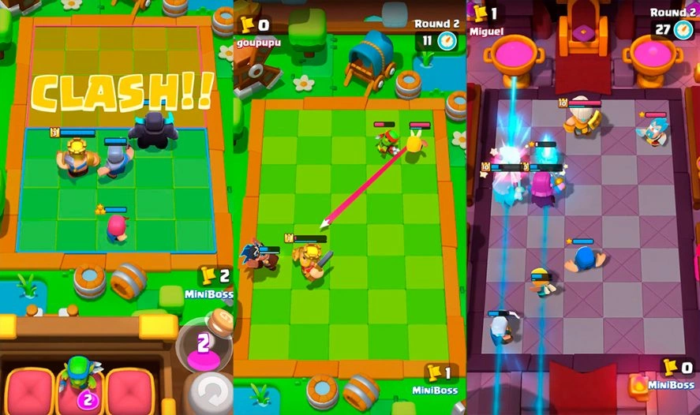 

更讽刺的是，合合奇兵本身其实挺不错的——很有创意，也适合休闲轻松的玩，是一个从紧张的天梯对战中脱身的好出口。从商业角度讲，它也合理：提高活跃度、在线时长和留存率，而且不会把玩家引导去别的游戏。但就算它再好，也无法替代皇室奇兵玩家心中的白月光，也无法弥补皇室奇兵退场留下的空缺。

不过合合奇兵至少说明了一个很重要的事实：皇室战争不需要一成不变。只要不破坏天梯、不打乱排位、不逼玩家爆肝，大家其实很乐意接受新模式、新花样。

而且说实话，玩家社区中早就想出了很多这样的点子。官方创作者 Memet SK，提出的很多模式创意，其中不乏可称为神作的创意。

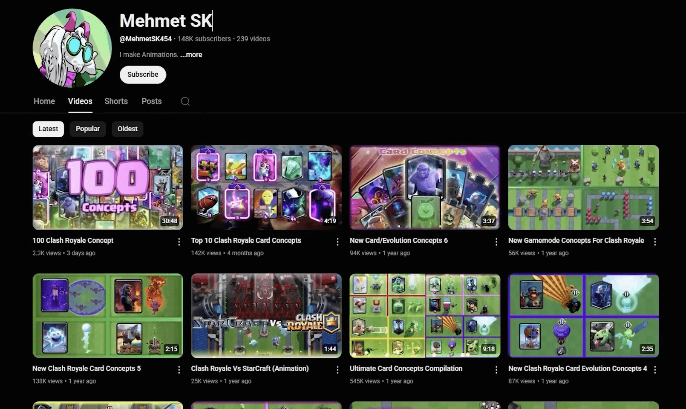

我们来一个一个盘点一下。
  

第一个：坚果保龄球模式。想象一下植物大战僵尸的快节奏玩法，你要靠原木、龙卷风等法术阻挡不断进攻的敌军。没有塔楼、没有友方兵种，只有法术和混乱。彻底打破皇战常规，变成一款休闲防守类游戏，完美适配手机。

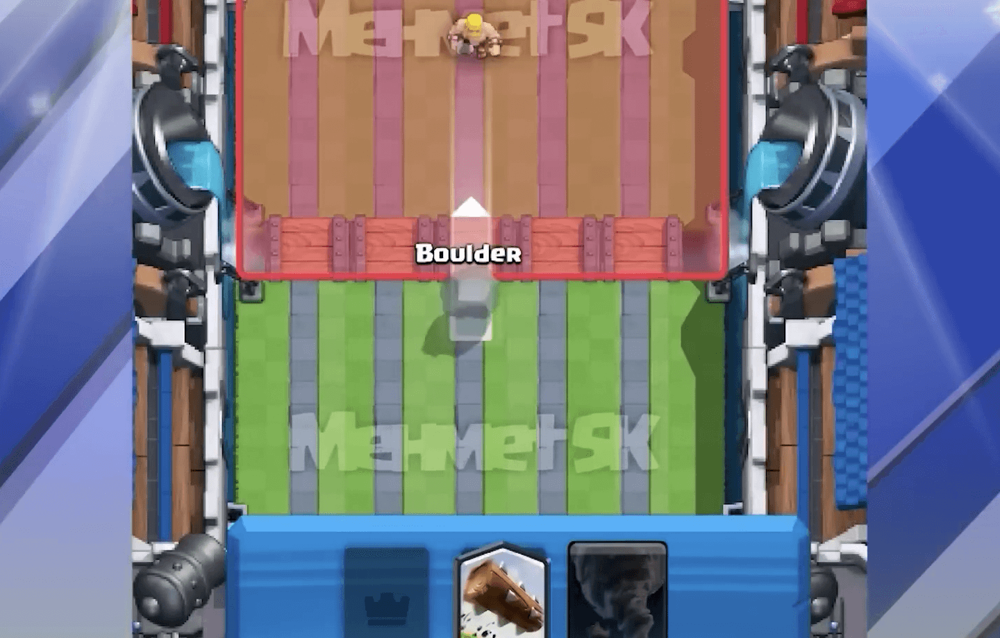

第二个：塔防模式。这个比较无脑，但是相当的契合皇室战争。你可以布置弓箭手、游侠、电法，甚至是建筑譬如连弩、炸弹塔等单位到预设地块，抵挡不断涌来的敌人。有点像传统塔防游戏，譬如王国保卫战，但每个兵种都是皇室战争中的兵种。Supercell 会喜欢这个模式吗？我不知道，但是我知道玩家一定会喜欢。完全 PVE，没有排名压力，可重复挑战，完美缓解冲杯焦虑。

 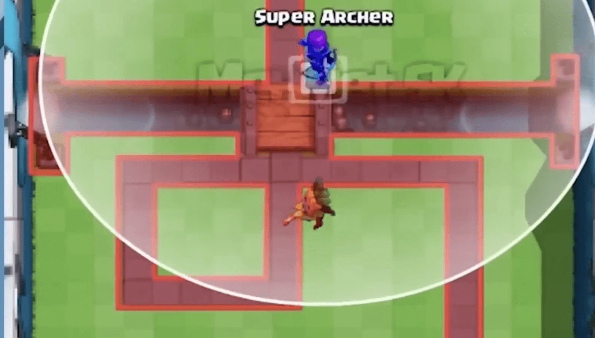 

第三个：生存模式。有点像《吸血鬼幸存者》，但主角是皇室战争的英雄。比如开局选女皇或圣骑，单兵作战，对抗无尽敌潮。每波升级技能，AOE、攻速、召唤小兵、各种强化不断堆叠。Supercell 不是担心日活么？我打赌，这会是让玩家每天上线的原因之一。

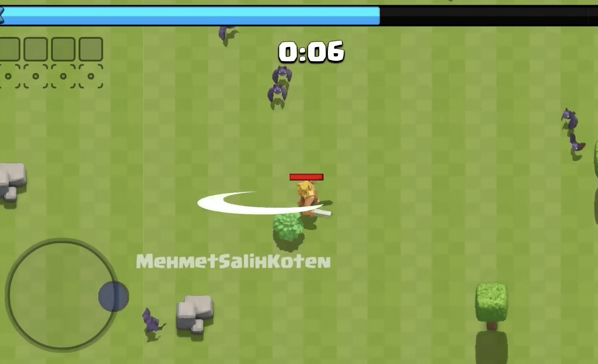

还有其他很多富有创意，轻松休闲的游戏模式。它们不会影响平衡，却能极大提高玩家黏性、社交媒体的内容创作和轻度用户覆盖率。与其让这些创意只能在粉丝动画里活着，为什么不真的做出来？
  

当然，吸引玩家回归的也不只是新模式。多年未见的现象出现了——新卡，不再一上线就极度超标。这次推出的新卡是皇室战争中第一张双形态卡牌精灵女王，有变形机制，但是不再像往年的武僧、凤凰、小王子等新卡牌，推出的时候极度超标，引发对战环境巨变。

还有进化骷髅桶，也强，但还不至于破坏环境。

在经历了一整年的氪金觉醒必须强大、首发新卡必须超标、新功能上线连续三天热修复之后，这已经是进步了。  

游戏现在完美了吗？肯定没有。

但跟 2021 到 2023 年那些地狱版本比，现在简直像复苏了。真实的成长路径、带着诚意，哪怕只是些许诚意的创新尝试、不再激怒社区的内容更新。或许，这才是玩家回来的原因。

这并不是单纯是老玩家的怀旧，而是玩家觉得，皇室战争，或许又想好好做游戏了？

但接下来该更进一步了。

皇室战争现在过于专注觉醒机制了，这可以理解，因为目前的觉醒机制和游戏营收 KPI 密不可分。但它只是创新的一种方向，其实还有更多方向近在眼前。皇室战争只有 120 张卡，但看看市场上的游戏，宝可梦有 1000 多只怪，万智牌有几千张卡牌，撸啊撸有几百件装备，这些会造成玩家的困扰吗？不会。反而极大的丰富了游戏的世界观、内容以及玩法。

所以为什么不增加卡池？更多卡牌等于更多策略、更多组合和更多的创意。皇室战争的核心机制很简单，但靠卡池扩展以及不断推陈出新的新卡牌，它还可以进化成我们从没见过的新样子。

再比如上面提到的各种脑洞大开的游戏模式，甚至包括已经上线的合合奇兵。这些不是取代主玩法，而是作为支线内容、活动模式、限时赛季，与核心玩法并存。这才是吸引老玩家持续回归、拉新用户入坑的内容形态。

当一个游戏敢于挑战旧规则，它才可能进化成自己最好的样子。

