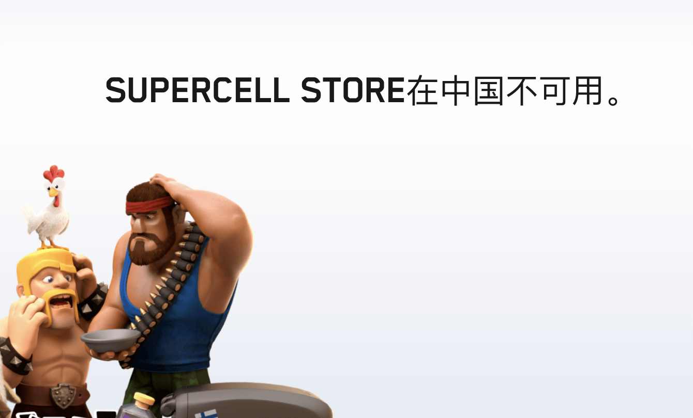
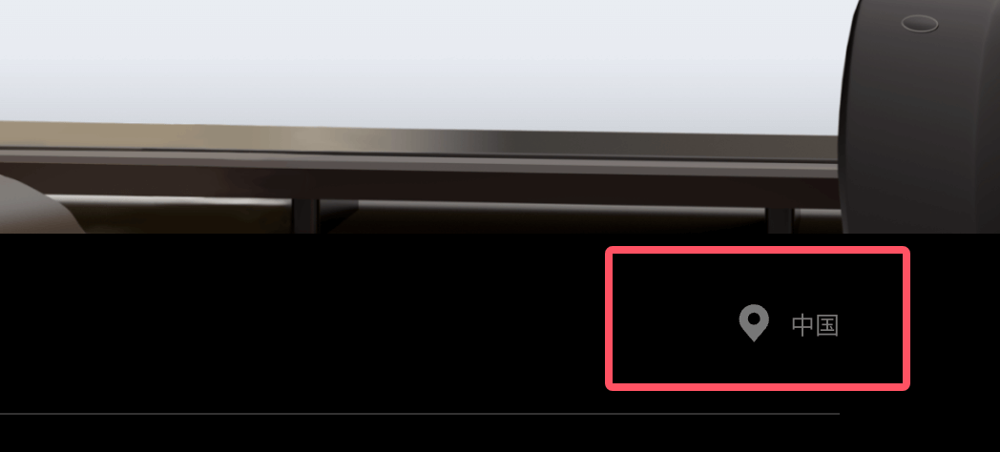
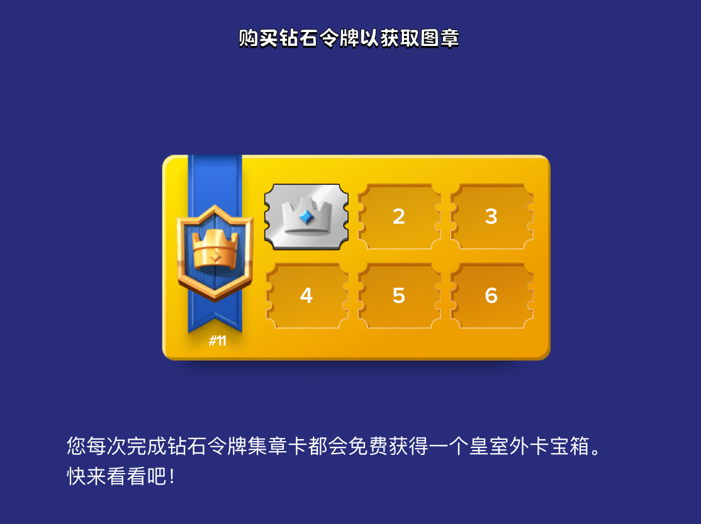
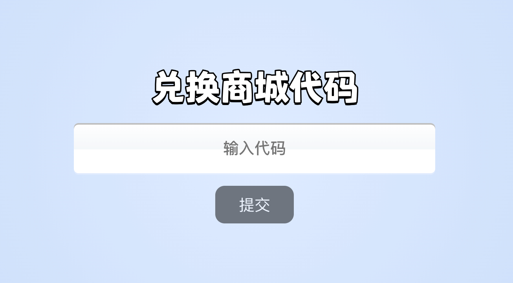
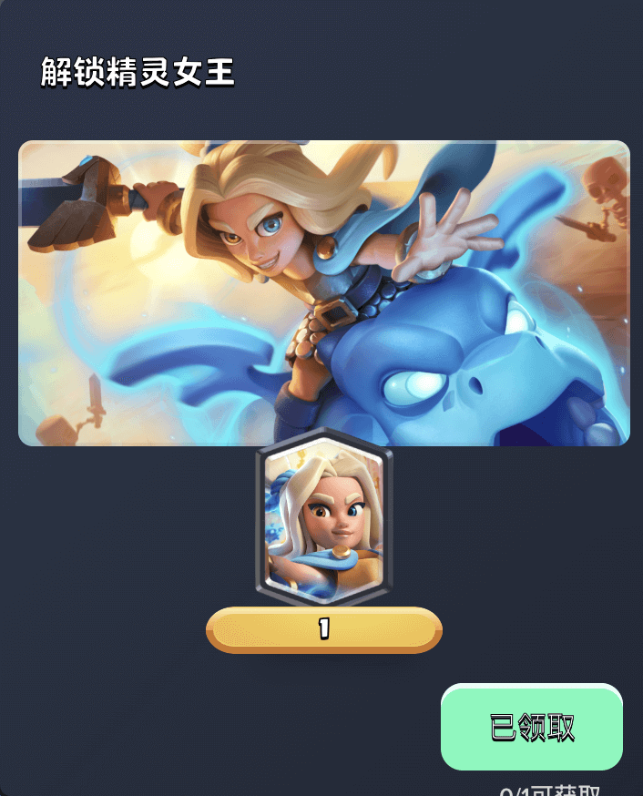

 一觉醒来，很多 Supercell 玩家天都塌了。

以往通过魔法或者科学上网的方式能够访问的 Supercell 官方商城，直接显示“Supercell Store 在中国不可用”，不管你如何切换节点，都是一样。

这不是Supercell 第一次对中国大陆地区 IP 做出限制了，只不过这次有点不一样，他们似乎要来真的了。

目前大陆玩家使用 Supercell id 登录 Supercell 商城，基本都有三种结果：
- 登录直接显示“Supercell Store 在中国不可用”，不管你如何切换上网节点都是一样，而且在屏幕底部的区域显示固定为“中国”，不随魔法节点的变化而变化。

- 登录后可以正常显示商城内容，底部区域显示某一非中国大陆区域，譬如“美国”。不管你如何切换魔法节点，底部区域显示保持不变，同时商城中所有商品价格始终以该地区价格显示（通俗点说就是支付锁定该地区了，类似 google play）；
- 登录后可以正常显示商城内容，底部区域显示和你的魔法节点当前区域一致，切换节点后，底部区域同样会变化，且商城中商品结算货币和底部区域保持一致。这种实际就是这次未调整之前的状况了；

从目前Supercell ID 账号登录商城后的表现来看，基本就这三种情况：**锁定 CN 区无法使用、锁定某国家或者地区同时只能使用该区域货币结算、和以前一样未锁区**。

现在就很容易得出结论了，Supercell 目前是在对 Supercell ID 逐步进行商城锁区处理，最终会类似 google play 一样，把你限定在某个国家或者地区，未来不管你如何切换 IP，即时是肉身出国，依然会是使用锁定的国家和地区进行购买结算。如果锁定到了 CN 区，则是因为以前商城就直接不对 CN 区提供服务，所以就连购买都不能。至于目前还没有锁区的，我想，也会慢慢逐步的实施。

目前尚不清楚锁区的机制是如何进行的，但是我猜无外乎根据常登录 ip或者定位、supercell ID 创建时候的地区等方式来进行综合判定。至于现在越传越远的什么会对游戏内进行二次分区，我个人认为就是纯属扯淡。

**Supercell 为什么会这么做？**

此举应该是和之前Supercell 声称的要搞全球定价策略有关系。以往，Supercell 商城的价格仅仅和当时登录的 ip 有关，很多玩家通过切换魔法节点，在低价区/低汇率区购入游戏内物品或者通行证令牌等在高价区赠送以赚取差价。虽然 Supercell 也会根据国际汇率的变化经常调整部分国家和地区的定价，甚至直接把某些低价区改为统一美元结算，但是薅羊毛的现象依然无法杜绝。

另一方面，应该也和目前泛滥的信用卡黑卡支付后赠送令牌/通行证有关。

今年以来，国外一些支付平台包括国内某鱼等平台的令牌/通行证赠送价格持续走低。以皇室战争为例，Supercell Store 原价 80 多的令牌在某鱼的价格已经低到了 40/50，这是任何走汇率差或者薅羊毛的方式都无法实现的价格。究其根本，依然是通过盗刷或者其他方式实现的 0 元购之后再通过 Supercell 好友赠送。这些对于 Sueprcell 来说是真金白银的损失，还需要花大精力去对这部分买家进行令牌溯源、倒扣、甚至封号的操作。所以我猜测，Supercell 也是想通过锁定玩家支付区域，限制跨区赠送来打击这些黑灰产（**这里再次提醒，这类黑灰低价令牌是有风险的，不管是商城代买还是赠送，都可能导致账号倒扣，短暂的 Ban 甚至永久封禁**）。

对于普通玩家，有什么损失呢？其实相对游戏内购，Supercell Store 的价格本来就是偏高的。但是商城提供了一些游戏内没有的东西，譬如：
- Supercell Store 的奖励之路奖励，类似于买赠，达到一定的购买次数会有外卡、魔法书、惊喜宝箱等赠品；

- Supercell Store 的 ID 积分奖励，这部分积分可以在 Supercell ID 奖励网站中兑换旗下游戏的表情、塔皮等奖励；
- 有一些游戏的奖励物品是通过兑换码发放，然后需要登录 Supercell Store 使用此兑换码兑换奖励；

- Supercell Store 的一些直接领取的活动奖励。比如皇室战争最新的传奇卡龙妈的免费领取、荒野乱斗时不时的免费宝石等等；

目前，对于已经锁 CN 的 Supercell ID，暂时没有其他的办法访问商城。当然，Supercell Store 的政策仍处于测试阶段，未来的调整情况尚未可知。

如有进一步调整，本蜜也会持续跟进，记得关注获取最新动态！