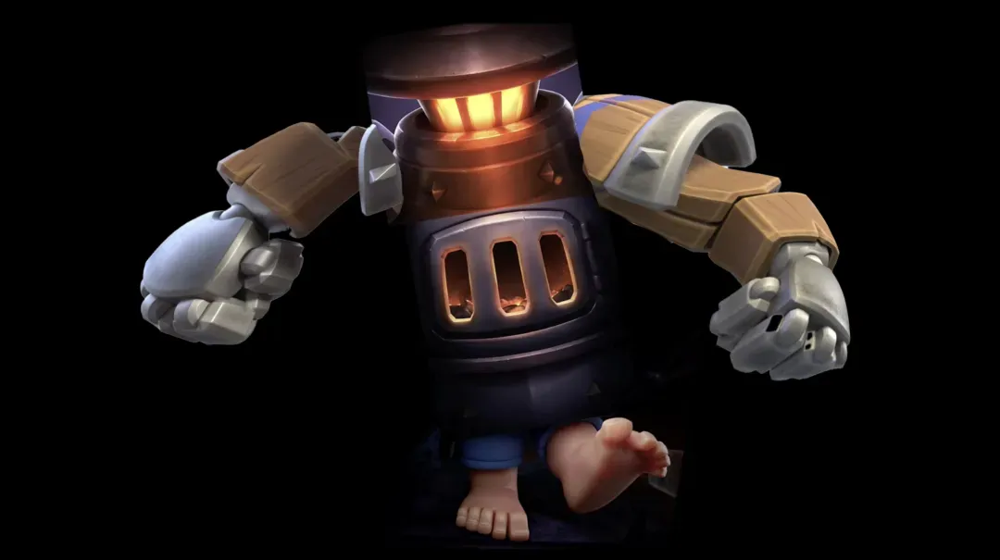

就在昨天，皇室战争官方又放出了一张全新的剧透图片。引起大家注意的不是画面内容，而是它，又是一张玉足特写。

是的，没错，又是“脚”。

熟悉皇室战争的小伙伴应该有印象，这已经不是第一次出现玉足了。从觉醒弓箭手、觉醒小骷髅，再到觉醒雪球等觉醒卡牌，官方总喜欢故弄玄虚的放出玉足的图片。不得不说，这次的新图也延续了这种足控画风。

这次的脚到底是谁的？很难一眼断定，从体型来看，像是胖子、蓝胖，也有人猜是渔夫。看起来都是有可能的。

但我觉得，这不太像是一张全新卡牌的预告。

因为在不久前官方发布的觉醒卡牌预告视频中，细心的玩家可能已经发现了彩蛋。在其中一个画面中，那只脚其实早就出现过了。从角度、姿态到细节看，几乎一模一样。这说明，很有可能它正是某张已有卡牌的觉醒版本。

然而这还不是全部。

紧接着，皇室官方又放出了一段新的短视频。这次主角是？似乎是熔炉。视频中我们看到火豆子在炉子中跳跃，最后居然合体成为了一个人形熔炉机器人？乍一看有点离谱，但你仔细观察那机器人胸前的炉门，是不是和上一张玉足图里的也完全一样？三道横杠的炉门特征直接对上了。

当你把这两条线索结合在一起，很难不让人产生联想。如果这是同一张卡，那这极有可能是一张觉醒熔炉的新形态，一种机械化、人形化的熔炉单位。

与此同时，几个皇室战争的大型内容创作者也纷纷收到了来自官方的宣传海报。从他们发布的视频来看，海报中提到了 Furance Evolution 这一关键词，海报上的视觉风格也和预告片中的人型熔炉形象极其相似。更重要的是，他们统一使用了同一个标签：#熔炉觉醒。

基于这些线索，现在的推测大致分为两种思路：

第一种可能是，这只脚属于某张全新的觉醒卡牌，而熔炉也将单独进行重做或觉醒，脚和熔炉是两个独立剧透。

第二种（也是目前主流的看法）认为，所有的剧透都在指向同一件事：熔炉的觉醒。而觉醒后的熔炉，不再是一个静态建筑，而是拥有移动能力、攻击力甚至可能拥有“双形态”的人型卡牌。就像精灵女王那样，可在战斗中切换状态。

如果我们把目光投向官方历史废案，其实早年曾有一张卡牌的设计叫做 “Fire Knight（烈焰骑士）”。当时并未实装，但如今看起来似乎形象对得上，难道这就是那张卡的重生？

如果真是这样，那这一次的觉醒，可能不仅是一次视觉上的重做，而是一场对熔炉这个老建筑的彻底翻篇。

那么问题来了：你觉得这次的觉醒剧透，更可能是哪一种？

你支持机械熔炉，还是隐藏觉醒新卡？

