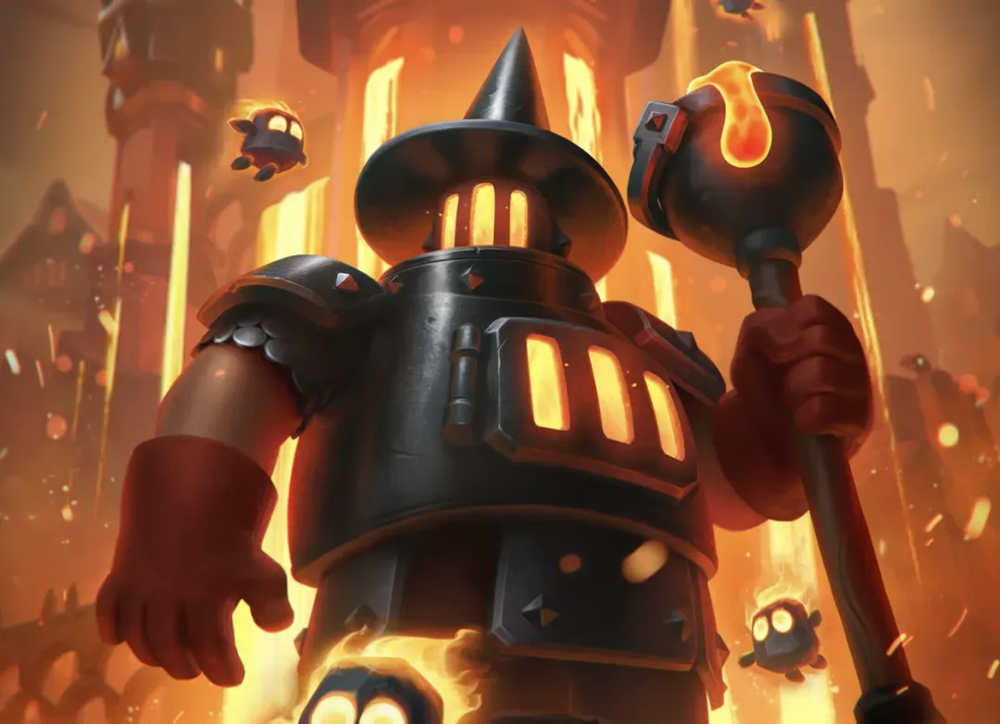
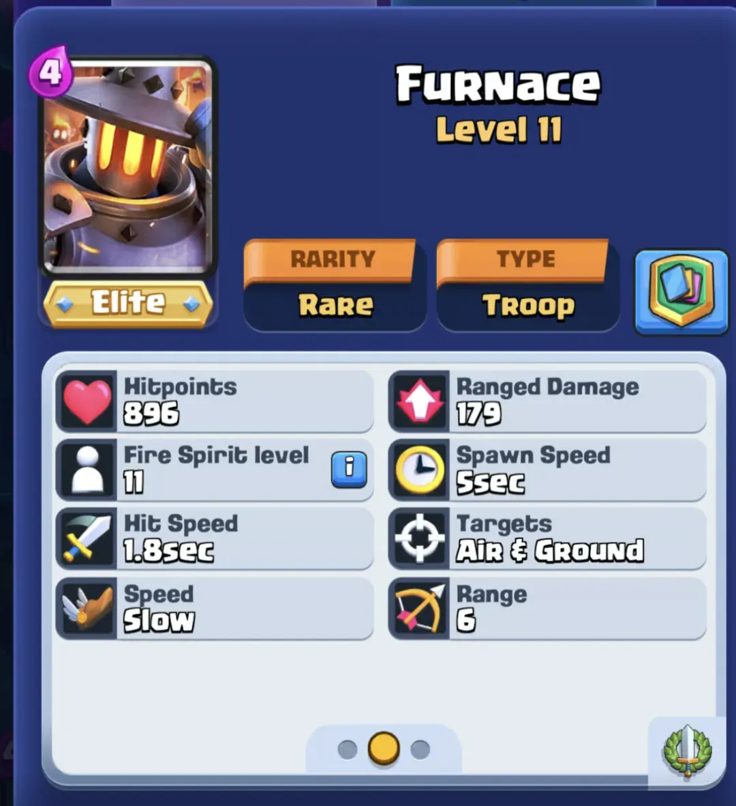

皇室战争带来了一次全新的卡牌重做，主角是大家熟悉的熔炉。这张卡牌不再是一座刷怪建筑，而是彻底变身为一支地面远程部队。它仍旧保留火豆子，但整体玩法与体验将焕然一新。

几个赛季前，皇室战争开始尝试重制低人气建筑卡，比如哥布林小屋。而烈焰熔炉，作为刷怪笼建筑的代表之一，也长期因被动、难以交互、缺乏趣味而被玩家忽视。数据上也显示，它与野蛮人小屋是上赛季 1000 套高分卡组中**使用率最低的两张建筑卡**。

于是，我们迎来了这次焕然一新的重做。

## 熔炉的身份转换：从建筑到部队

在 8 月份的第 74 赛季中，烈焰熔炉将作为新版本的“主角卡”登场，出现在加载画面，并拥有全新的边框设计与角色形象。

它不再是部署后等待火豆子自动刷出的建筑，而是会**直接作为一支部队进入战场**，并且拥有主动攻击能力。这种转变意味着它可以更灵活地应对各种战局，而不再局限于防守或压迫的固定套路。

## 卡牌描述

> 熔炉每次会召唤一个火豆子，同时用其特殊的熔炉酿造物造成伤害。  
> 它还可以制作美味的砖炉煎饼。

虽然这句描述略显轻松幽默，但新熔炉确实有了实质变化：

- 攻击方式：远程攻击
- 攻击对象：空中与地面单位
- 攻击类型：单体伤害（无溅射）
- 射程：6 格

## 新旧对比数据

| **属性** | **旧版熔炉** | **重做后熔炉** |
| ------ | -------- | --------- |
| HP     | 847      | 896       |
| 寿命     | 28秒      | 无         |
| 速度     | 无        | 缓慢（45）    |
| 生成时间   | 5秒       | 5秒        |
| DPS    | 41（火豆子）  | 99        |
| 总 DPS  | —        | 140（含火豆子） |

新的熔炉拥有接近猎人的血量（885），这意味着它可以承受火球（688）或火球+电击（880）组合攻击，但会被闪电术（1057）或火球+滚木（954）击倒。

火豆子的刷新频率没有变化，仍然每 5 秒生成一个，提供额外爆发。

## 与其他卡的输出对比

| **部队**   | **伤害** | **命中间隔** | **DPS** | **射程** |
| -------- | ------ | -------- | ------- | ------ |
| 熔炉       | 179    | 1.8      | 99      | 6      |
| 熔炉 + 火豆子 | —      | —        | 140     | —      |
| 飞行器      | 171    | 1.1      | 155     | 6      |
| 飞镖哥布林    | 148    | 0.8      | 185     | 6.5    |
| 火枪手      | 217    | 1        | 217     | 6      |

| **部队**   | **伤害** | **命中间隔** | **DPS** |
| -------- | ------ | -------- | ------- |
| 火豆子      | 207    | 5        | 41      |
| 冰法       | 89     | 1.7      | 52      |
| 熔炉       | 179    | 1.8      | 99      |
| 龙宝宝      | 161    | 1.5      | 107     |
| 女巫       | 135    | 1.1      | 123     |
| 熔炉 + 火豆子 | —      | —        | 140     |
| 法师       | 281    | 1.4      | 201     |

可以看出，在**纯输出角度**，熔炉并不突出，其优势更多体现在召唤机制带来的**持续性骚扰**和**火豆子配合**。它或许更适合作为推进组件，而不是独立的防守核心。

## 卡牌大师

原版熔炉的精通任务将继续保留，玩家的进度不会丢失。具体包括：

- 生成 X 个火精灵  
- 用火精灵造成 X 点伤害

第三组精通任务目前仍未上线。

## 结语

熔炉的重制无疑是 Supercell 再次对低热度卡牌进行系统性调整的尝试。从建筑转型为远程部队，它不再只是一个刷怪装置，而有望成为卡组中多面手的存在。

而下一个“候选人”——野蛮人小屋，或许已经在路上了。
