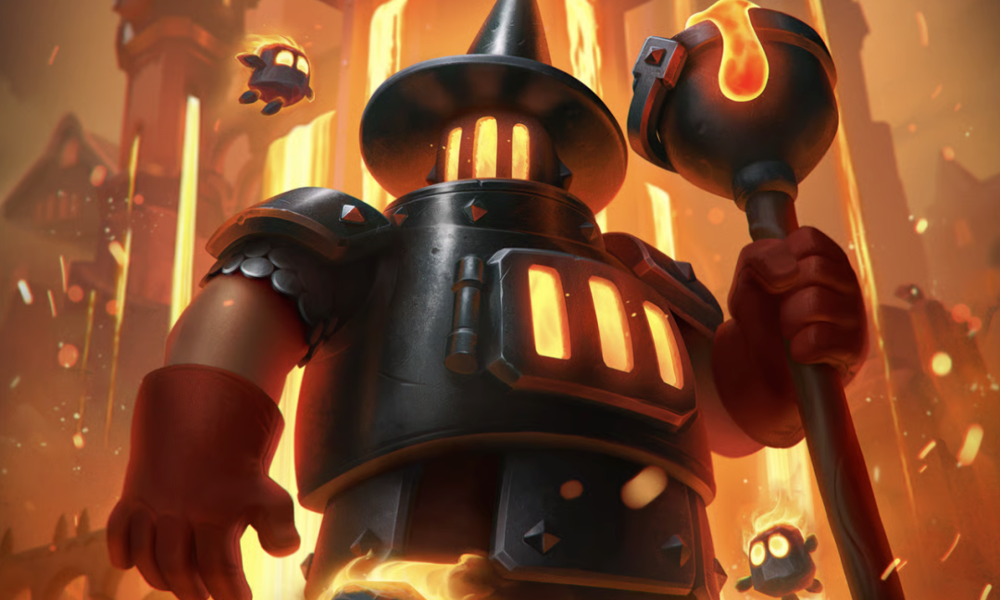
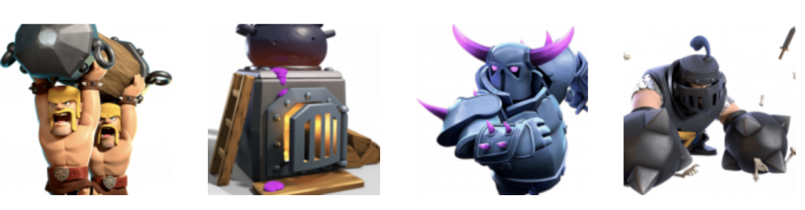

皇室战争第74赛季将于 **2025年8月4日星期一** 正式开启。本期赛季围绕“觉醒熔炉”展开，整体主题以岩浆、火焰为核心元素，场景设计与用户界面均充满炽热氛围，塑造出浓烈的“火焰纪元”风格。

## 赛季加载界面

随版本上线的还有新设计的加载画面：背景为岩浆环绕的古堡，中央展示的是进化后的熔炉卡牌形象，整体视觉风格更具冲击力，带来沉浸式战斗氛围。

## 全新竞技场

本次赛季推出的主题竞技场融合熔岩峡谷与砖炉熔炉意象，中央是汹涌的岩浆河，四周不断喷涌火焰，火柱直冲云霄。整体风格不仅与“熔炉”这一核心卡牌呼应，也让人身临其境地感受到地心炙热。

## 令牌塔皮

购买 **钻石令牌** 的玩家将可获得本期专属塔皮肤“炽焰熔炉”。皮肤以钢铁结构与熔火流光为设计主轴，塔顶坐着一只火灵，视觉效果既充满未来感，也不失烈焰的威严气势。

## 全新赛季表情

新赛季将带来五款风格各异的主题表情，涵盖多个玩法场景：

无论你是收集控还是实战玩家，本赛季的表情都值得入手。以下表情将在商店和活动中返场～

## 全新赛季战旗

延续传统，每个赛季都会带来全新战争旗帜图案，本次的设计也围绕“炽焰”主题展开。无论是用于战斗房间展示，还是装点你的玩家资料卡，都能体现独特个性。

## 强化卡牌

本赛季强化卡牌为：

- • 攻城锤
- • 熔炉
- • 大皮卡
- • 超骑

进入天梯或战斗时，上述卡牌将自动同步为你的国王塔等级，无需额外投入资源。

天地双雄！启动！

## 觉醒熔炉

作为本赛季核心改动，熔炉卡牌将正式完成重做，从原本的建筑类型变身为可移动部队单位，并拥有全新攻击方式与设定。该重做为游戏带来更丰富的战术选择与视觉表现，完整详情可参考此前的深度解析文章。

[皇室战争：觉醒熔炉登场！不用杀怪也能无限下蛋的新刑具～](/posts/clashroyale/2025/07/clash-royale-furnace-evo/)

## 赛季活动日历

两大阶段性挑战将贯穿整个赛季：

- • **觉醒熔炉挑**

- • 第1阶段：8月8日至8月11日
- • 第2阶段：8月15日至8月18日

- • 释放火豆子**挑战活动**

- • 第1阶段：8月22日至8月25日
- • 第2阶段：8月29日至9月1日

目前收到的消息，确实是挑战持续两周，未来或许可能调整！每轮挑战都设有专属奖励，请务必按时参与。

## 里程碑活动

里程碑活动是限时活动，个人可在此完成任务。要参与，您的竞技场等级必须达到 7 级或以上。

8 月份首先推出的是觉醒狂潮活动的后半部分。

- • 觉醒雷龙龙活动  
  时间：8/4～8/11  
  主要奖励：觉醒雷龙碎片 x6  
  主要奖励：战旗

- • 觉醒弓箭手活动  
  时间：8/11～8/18  
  主要奖励：觉醒弓箭手碎片 x6  
  主要奖励：战旗

此外，虽然细节尚未确定，但将会举办一场活动，您可以赢得下面的奖品。

## 本月全球锦标赛

继上个月之后， 锦标赛 （全球锦标赛）本月也不会举行。不是停服，而是暂停。原因是更新，有计划恢复，但具体时间尚未确定。

## 其他调整

另外，可以确定的是，下赛季 **2v2 即将回归**，具体日期和时间将稍后公布。

最后，除传奇征程模式外，其他模式（包括旧天梯以及限时游戏模式）的**等级上限已恢复**。这算是个好消息！
