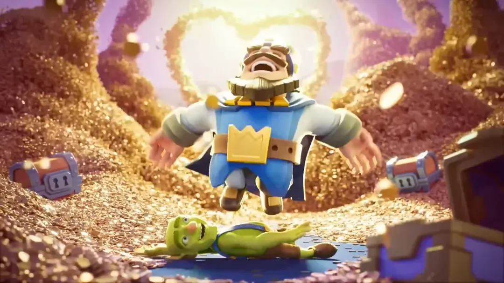

最近收到无数私信，问的最多的就是这句话，哥，皇室狠惠什么时候再来？

看来大家是真等它盼它，恨不得天天有啊！

然而，对于老玩家来说，每当听见“皇室狠惠”这四个字，第一反应不是狂喜，而是一个字，怕。

不是因为这活动不香，而是因为，每次皇室狠惠的背后，总藏着一把背刺的利刃。

在皇室战争的更新史上，狠惠出现过三次。每次都是满满金币半价升级的好事，却也几乎都与一场大地震联动，或者说，毫无预警地，为一次彻头彻尾的资源收割埋下伏笔。

今天我们就来聊聊，历史上的皇室狠惠那些事儿，还有我对它会不会回归的看法。

### 什么是皇室狠惠？

皇室狠惠（Slash Royale）是皇室战争历史上极少数的全民级活动之一，最突出的特色就是优惠。

具体来说，活动期间所有卡牌升级所需的金币全部减半，还有可能搭配上限时金币活动、或者天梯的 Gold Rush，等于玩家可以在极短时间内，快速推高自己主力卡组的卡等。

听起来是福利？没错。但问题在于，它从来都不是单独存在的。

### 第一次狠惠：升级半价，却迎来等级上限更新

时间回到 2021 年 10 月，皇室战争第一次推出皇室狠惠。当时玩家欣喜若狂，纷纷拿出攒了几个月的金币，全力升级主力卡组，升级完了还不够，接着升级不常用的卡牌。当时，几乎每个玩家都恨啊，恨自己的金币太少了。

然而，谁也没想到，就在这次全民升级狂欢结束后，官方立刻上线了全新的国王等级与卡牌等级上限：卡等14。

什么意思？你刚刚砸下去几十万金币，把大部分卡升到13，正要用起来，结果告诉你还有14级等着你继续冲。这时，你已经没有多余的金币和卡牌资源来升级自己主力卡组中的卡牌了。

那一刻，社区几乎炸锅。有人说官方早有预谋，有人说这是一次精准的金币清仓，更有人戏称这是史上最狠的一次背刺。

你可以说它给了你优惠，但也确实掏空了你的钱包，只为一场早就注定好的卡等升级大洗牌。

### 第二次狠惠：卡牌觉醒前的扫荡

2023 年 6 月，皇室狠惠第二次上线，熟悉的升级半价活动再度归来。

这次狠惠看似风平浪静，大家照旧消耗金币升级卡牌。然而就在 6 月月底，官方突然放出了**卡牌觉醒**系统，这又是一场对游戏节奏的重大改写。

初看上去觉醒系统还算友好，因为觉醒卡不需要消耗金币，也不再占用普通升级资源。觉醒卡槽达到要求的国王等级即可解锁，感觉不像是在抢你金币。

但真正的门槛在于：**觉醒卡牌的获取方式几乎全靠氪金**。

每个赛季的通行证只能送出一个指定的觉醒卡，另一个热门觉醒卡牌则大多出现在商店礼包中。想要靠觉醒碎片去换？可以，但你得花上几个月不停刷任务、清活动，才能攒够碎片去兑换一张觉醒卡牌。

这也意味着：你在狠惠期间用金币升满的那些卡，可能根本打不过别人觉醒过的弓箭手或小骷髅。

卡牌觉醒上线后，决定卡组强度的因素从单纯的卡等，扩展成了“觉醒+卡等”。狠狠割了一刀付费玩家之外的平民玩家。

可以说，觉醒系统的上线，卡组强度从此不再单看卡等，还得看觉醒卡牌。这一下，付费玩家和非付费玩家差距更大了。皇室战争，也自此正式进了 **Pay To Win** 的时代。

### 第三次狠惠：通行证重做前的陷阱

第三次皇室狠惠则发生在 2024 年 8 月，以“Gold Festival 黄金盛典”的活动出现。

活动节奏几乎是满分：升级半价、金币金矿、宝箱狂欢，新卡、塔皮、主题表情齐上线，玩家热情高涨，金币再次在短时间内被彻底清空。

然而，仅仅两个月后，2024 年 10 月，皇室战争迎来了近年来最大的一次系统改动——通行证重做。

在这次更新中，原本黄金令牌取消，所拥有的大量福利（如万能书等额外奖励）被砍掉，玩家需要付出更高的价格去购买钻石令牌以解锁以前原本属于黄金令牌的奖励。

可以说，这次狠惠就是给通行证大改动提前清场，让所有玩家先“用掉”自己积攒的资源，再等到你想升级新卡需要资源的时候，已经回头无路，只能被迫接受新的氪金路径。

这次背刺，不仅精准，还极具操作系统性的恶意。

### 附加彩蛋

除了全球统一的三次狠惠，皇室战争国服还曾因某次 620“技术”问题，单独补偿过一次类似的半价升级折扣活动。

此外，还有一种可能触发出现的狠惠：长期未登录的账号在回归时，有概率触发一次小型的个人狠惠，包括持续几天的特定半价升级优惠、金币以及卡牌等等。但是触发机制不明，可能有，可能没有。

这些也足够说明：狠惠不止是一种活动，更是一种官方在运营节奏上的资源调控工具。

### 狠惠还会来吗？

其实，通货膨胀、货币贬值，从来都是老游戏的通病。《皇室战争》中金币有上限，而且并没有交易系统，所以稍微好一些。但精明的玩家往往只玩少数卡组，囤着大量金币以备未来之需，这终究是官方不愿看到的。

因此，皇室狠惠不仅是一次活动，更是官方用来收割金币、调控游戏资源的利器。先给个枣吃，再打一大棍，也是官方的常用手法。

然而自今年五月起，官方的手段开始发生变化。稀有表情和旧塔皮的商店返场金币购买，还有挑战中奖励的表情和塔皮，可在商店中 50、100w万金币高价购买等手段，逐步建立起一个持续控制金币流的新体系。

与此同时，在今年 7 月上线的大版本更新“合合奇兵”，融合了自走棋的新机制，让游戏热度持续上升。但从经济角度来看，这次更新也更大程度地刺激了玩家花金币去升级卡牌。毕竟“合合奇兵”存在等压机制——嗯，自走棋有等压，现在《皇室战争》也算是首创了。

说到底，官方已经找到了替代“狠惠”的新工具。不再依赖一次性的全民半价活动，而是通过持续的小额消耗，让整体经济保持长期健康。

所以，今年还会不会有狠惠？

我个人不负责任、也不具备任何指导意义地预测一下——大概率，不会。

除非出现大更新、等级突破，或者新的稀缺资源体系上线，否则，“狠惠”大概已经成了过去式。

不过，谁又说得准呢？我也真心希望自己这次猜错了。

### 写在最后

回顾我们曾经历的三次狠惠，三波节奏，三刀背刺，现在我们都懂了：这真的不是单纯的福利，而是官方的一盘大棋。

如果下次“狠惠”真的再来，我只希望，这次我们能被背刺得轻一些。
