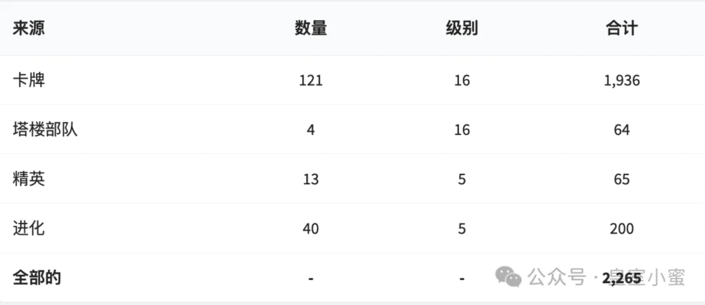
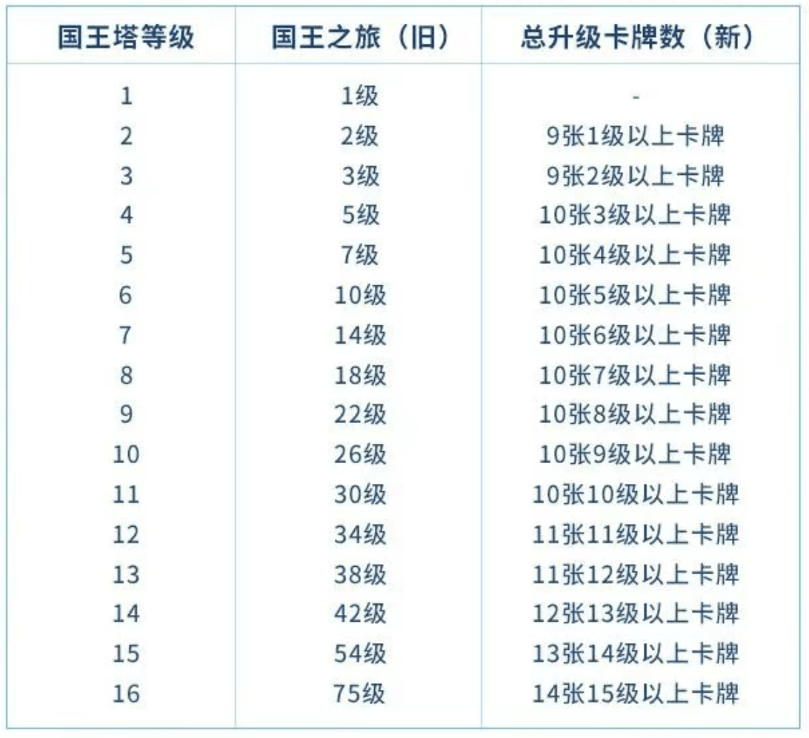
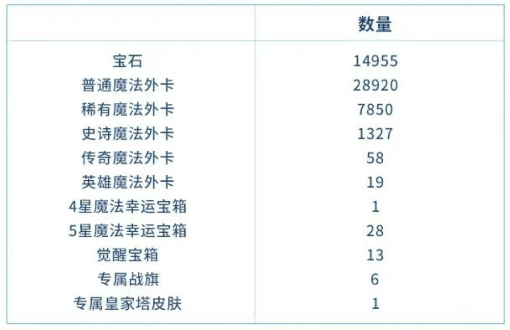
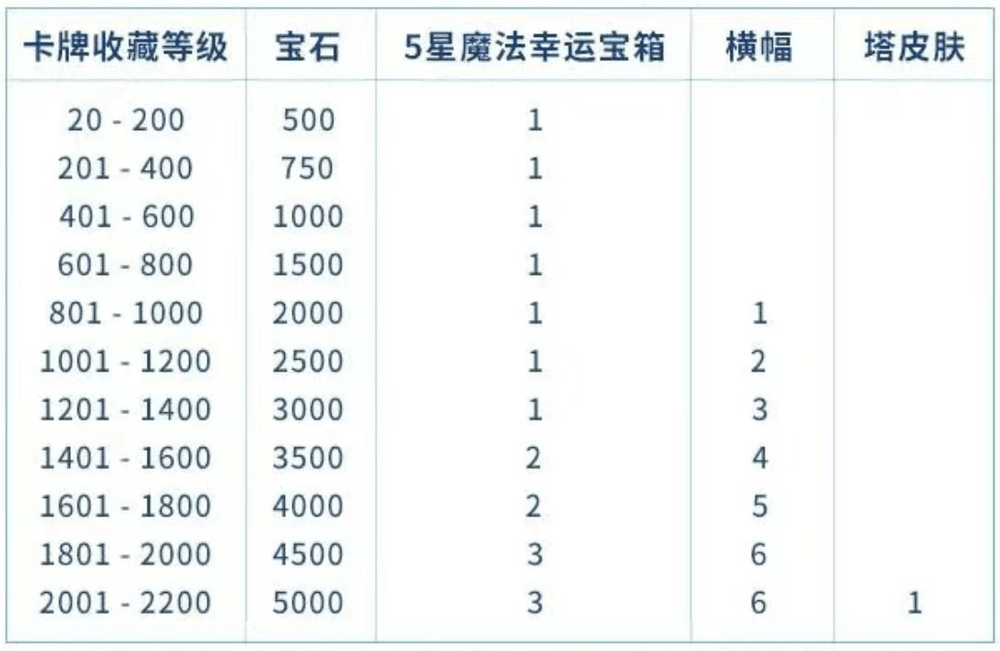
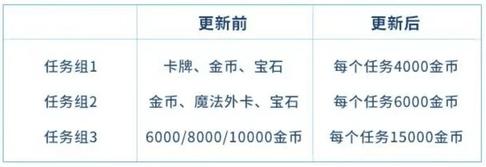
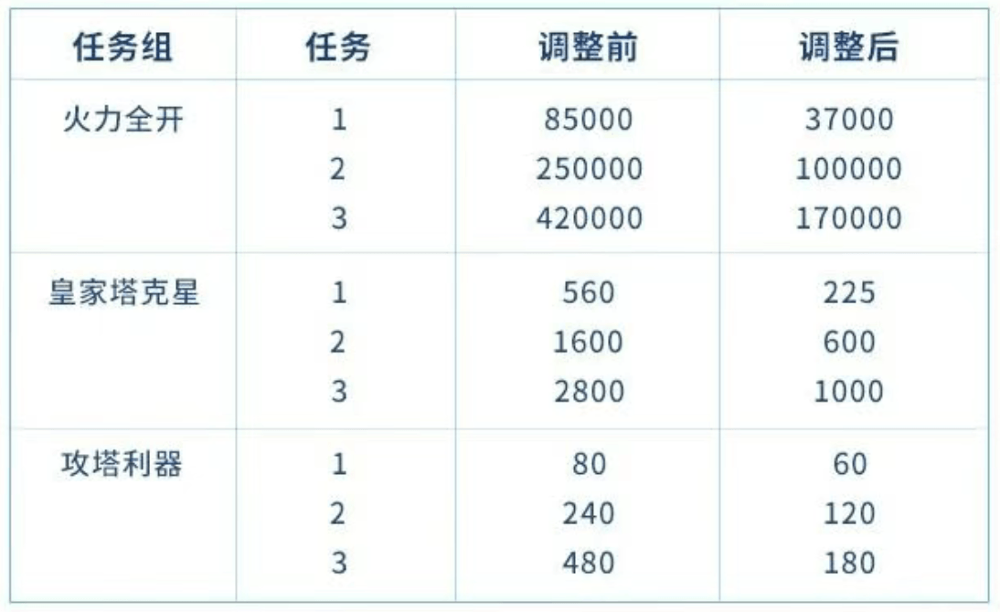

5月26日，皇室战争即将迎来一次大更新，简单来说，移除国王之旅和现有的经验体系，转用单独的一个收藏等级来替代，同时对于卡牌大师也有调整。详细的介绍可以看这里：[皇室战争｜成长系统重做！国王之旅结束，收藏等级接班～还有新的卡牌大师！](https://mp.weixin.qq.com/s?__biz=MjM5Mzg4MDU5NA==&mid=2447817499&idx=1&sn=04f3d172a9258d1e490b11d9f569079c&scene=21#wechat_redirect)。

但是惯例，我知道你们太长不读。

本文就尽可能大白话总结，并给出更新前大家该干什么。当然，这是基于目前官方第一波预告来解读的，后续还会有预告，可能会有变化。

所以，记得关注，不要错过接下来的情报！

### 为什么要改国王之旅？

官方这次的思路很直接——不要围绕经验值转了，改成围绕你真实拥有的卡牌来计算账号进度，毕竟皇室战争，一开始就是一个收集养成游戏。简单来说，就是用卡牌总等级代替经验值。

| 项目         | 之前        | 之后         |
| ---------- | --------- | ---------- |
| **账号进度**   | 经验值→国王之旅  | 卡牌收藏等级     |
| **升级判断**   | 看经验条      | 看所有卡总等级    |
| **进度感受**   | 打了很多但感觉没变 | 升一张卡立刻看到变化 |
| **国王塔**    | 经验值决定     | 卡牌等级达成度决定  |
| **新手功能解锁** | 国王塔等级卡关   | 竞技场等级推进    |

### 新的成长体系

新系统叫"收藏等级"，算法很直白。把你拥有的所有卡牌等级加起来，然后把每张进化卡和英雄卡额外加5级，得出来的总数就是你的收藏等级。

**计算公式：**

`收藏等级 = 所有卡牌等级总和 + 进化卡额外+5级 + 英雄卡额外+5级`

举个例子，骑士升到12级就贡献12级，如果你解锁了骑士的进化，那就额外再加5级。骑士的进化继续升级到13级，又加1级。然后你又解锁了精英骑士，那就再加 5 级。简单来说，卡牌越多、等级越高，收藏等级就越高。

**具体例子：**

- • 骑士升到12级 → +12级
    
- • 骑士解锁进化 → 再+5级
    
- • 骑士升到13级 → 再+1级
    
- • 骑士解锁精英 -> 再加5级
    

下图是不同卡牌带来的收藏等级总览：

这套系统最大的改变是，冷门卡现在也有价值了。以前很多玩家升卡只看主力卡组和版本强势卡，仓库里的冷门卡可能放了好久都不动。新系统上线后，这些卡也会计入你的账号进度，整个卡池的深度变得更重要。对长期玩家来说，这相当于把过去的积累重新整理了一遍，让那些之前看似"浪费"的升级投入现在有了意义。

### 国王等级

新的成长体系，国王等级依然算在其中，但是算法就很简单了，根据你拥有的卡牌来计算。

方式如下：

### 里程碑奖励怎么领

新系统配套了新的奖励机制。当你的收藏等级到达20级时，可以领第一份里程碑奖励。之后每提升10级就能领一次，一直到1500级。到了1500级以后，奖励频率会提高，变成每提升5级就能领一次。

`• 收藏等级20时 → 领取第1份奖励   • 每提升10级 → 领取1份奖励（到1500级）   • 1500级后 → 每提升5级领1份奖励`

这里并没有每个里程的奖励，因为确实里程也太多了，但是从下表也大致能看出所有里程碑的总奖励。

### 最关键的过渡问题

更新当天最让玩家担心的是——我过去的投入会不会缩水？官方给出的答案是不会，但是这里需要打一个问号。

**更新当天系统会自动：**

1. 1. 根据你现有卡牌计算收藏等级
    
2. 2. 补发国王之旅未领取奖励（弹窗发放）
    
3. 3. 调整国王塔等级（只升不降）
    

你升过的卡、解锁过的进化和英雄，全部保留下来并计入收藏等级。不仅如此，系统还会补发你在国王之旅里未领取的奖励，通过弹窗自动发放给你。

接下来就要说官方不厚道的地方，根据目前 ROYALEAPI 给到的情报。更新后会自动换算出你在新体系下的收藏等级。上面也说过，收藏等级的提升会逐步解锁里程碑奖励，但是换算过后的收藏等级，你只能获取比这个等级更高的里程奖励，之前的里程奖励也就全部被吞掉了。

这意味着什么？这意味着你的收藏等级越高，你获得的里程奖励也就越少。最极端的情况，就是满级玩家换算到满收藏等级后，所有的里程奖励全部泡汤。

当然，考虑到这点，官方还是给了那么一点点的系统变更奖励，叫做“庆祝奖励”，大致如下，基本也算是蚊子肉了。

无疑，这又是对于老玩家的一次背刺。

不过皇室战争的背刺也不是一次两次了，相信大家也都见怪不怪了。

不过话说回来，这对于新手或者养成度不够的玩家，无疑是一个非常好的消息。老游戏确实需要新鲜血液的注入，需要鼓励新玩家。但是，老玩家尤其是氪金老玩家还是需要给到一定的情绪价值嘛不是？

不胜唏嘘啊不胜唏嘘。

### 精通系统的变化

精通系统(其实就是卡牌大师）也跟着改了。官方降低了所有精通任务的难度，部分卡牌的目标要求明显下调。如果你当前任务进度已经达到新要求，更新后会直接完成并拿奖励。如果还没达到，新版本会保留你的原进度，让你比之前更接近完成。

**精通系统的三大调整：**

|变化|影响|
|---|---|
|**任务难度**|达成条件难度降低|
|**宝石外卡移出**|移到收藏等级里程里|
|**改为金币为主**|金币奖励提高不少|

精通系统更新前后的奖励对比：

以野猪骑士为例，可以看出更新前后达成的难度大大降低。

### 更新前该做什么

更新前不要盲目花光金币。现在最应该做的是清点账号，看看哪些卡是主力，哪些卡只差一点就能升满，哪些进化和英雄已经拿到手。等更新上线后，先确认自己的收藏等级和自动补发的奖励，再决定要不要集中火力升一批卡冲到下一个里程碑。这样比现在凭感觉乱升要聪明得多。

**✅ 可以做（推荐）**

- • 清点账号：哪些卡是主力，哪些差一点就满级
    
- • 确认已有的进化卡和英雄（这些额外算5级）
    
- • 继续正常冲杯
    

**❌ 不要做（浪费）**

- • 不要急着花光金币升卡
    

******✅**** 自行决定**

- • 对于卡牌大师，如果确实考虑拿外卡和宝石，可以考虑在更新前集中刷一下
    

另外，这里本蜜也加急给大家做了一个升级后的查询工具，可以查到自己能到什么收藏等级，可以获得哪些庆祝奖励。

注意，只支持国际服，国服由于数据不开放，无法使用。

文末点击“查看原文”访问，或者直接访问：[传送门](https://www.scbase.cn/kl)

### 常见问题速答

|问题|答案|
|---|---|
|星点和星级会消失吗？|❌ 保留，内容不清空|
|经验值呢？|❌ 彻底移除|
|国王塔会降级吗？|❌ 只升不降|
|旧奖励怎么处理？|✅ 自动弹窗补发|
|新手会更友好吗？|✅ 功能解锁改竞技场推进|

### 总结

这次更新的核心其实很简单——国王之旅退场，收藏等级上场，经验值消失，卡牌等级成为账号进度的唯一衡量标准。国王塔和星级都会保留，精通任务会变简单，宝石的来源改到了里程碑奖励。整体方向是把账号成长、卡牌升级、精通任务和奖励领取重新串起来，让玩家的成长过程更透明、更有反馈感。

**更新在5月26日到来，做好准备。先看清楚自己的新等级和补发奖励，再决定资源怎么花。**

后续还有新觉醒卡、新精英模式、混沌模式回归等内容，敬请期待，记得关注获取更新动向！
