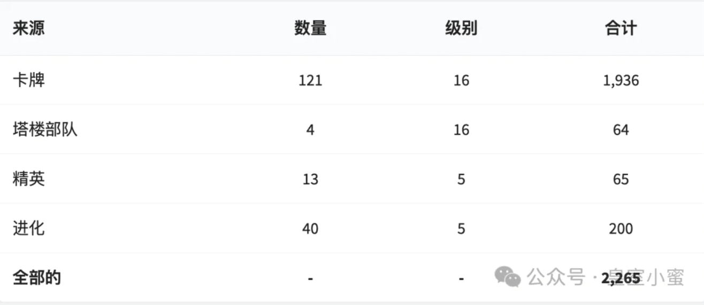
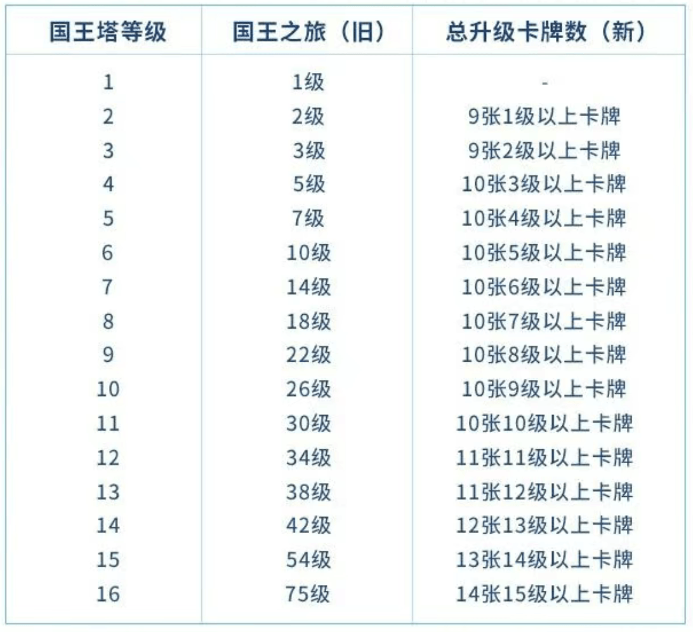
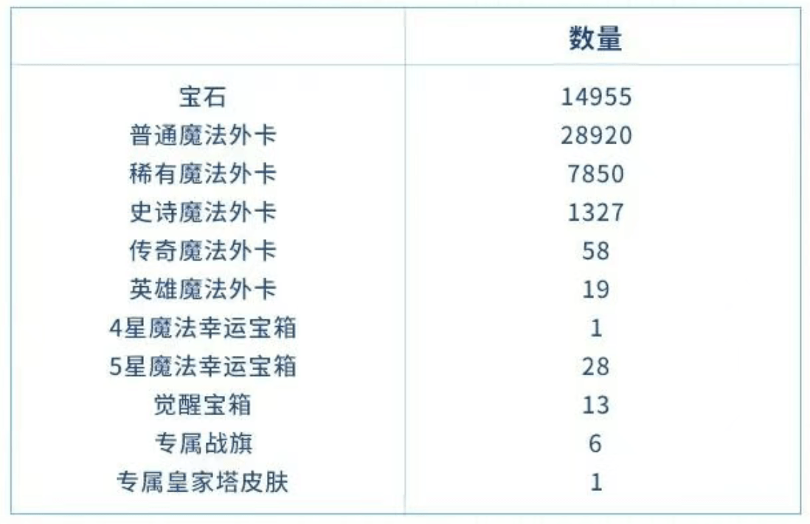
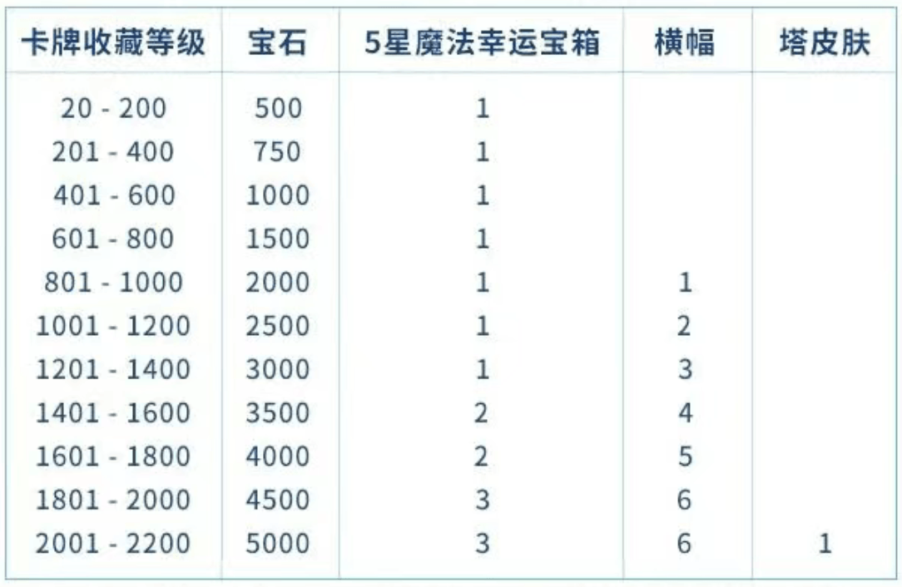
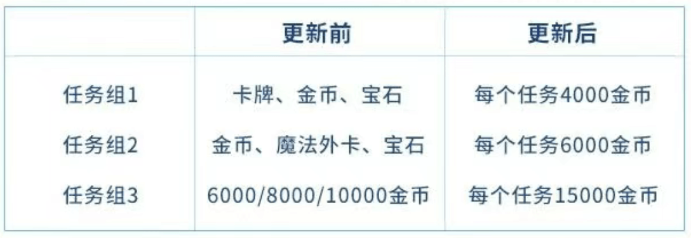
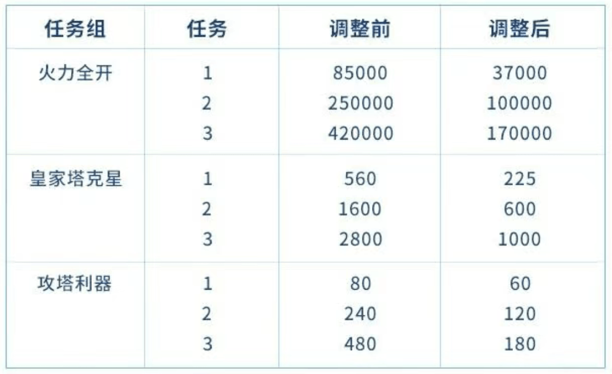

皇室战争这次成长系统重做，最重要的一句话是：**账号进度不再主要看经验值，而是看你的卡牌收藏。**

旧的国王之旅和经验体系退场后，收藏等级接管了账号成长。你升过多少卡、解锁了多少觉醒和英雄，都会被重新算进账号进度里。对新玩家来说，这套系统更直观；对老玩家来说，它则有点复杂，因为大家最关心的不是概念，而是过去攒下来的等级、奖励和金币到底怎么算。

最后核验时间为 2026 年 8 月 9 日。本文保留当时更新前后的说明，但阅读重点已经调整为“理解新成长体系”和“以后资源怎么花”。

## 国王之旅为什么要改？

旧体系的问题在于，经验值和账号实际卡池之间隔了一层。

你可能打了很多局、捐了很多卡、升了不少东西，但账号进度的反馈并不总是清楚。新体系把逻辑改得更直接：卡牌越多、等级越高，账号进度越高。

可以粗略理解成下面这样：

| 项目 | 旧体系 | 新体系 |
| --- | --- | --- |
| 账号进度 | 经验值和国王之旅 | 收藏等级 |
| 升级判断 | 看经验条 | 看卡牌总等级 |
| 国王塔 | 经验值推动 | 收藏等级换算 |
| 新手解锁 | 国王塔等级影响较大 | 更依赖竞技场推进 |
| 玩家感受 | 做了很多事但反馈不明显 | 升卡后更容易看到进度变化 |

这个方向本身是合理的。皇室战争本来就是收集和养成驱动的游戏，如果账号进度完全不反映卡池深度，玩家很容易觉得自己在做无效劳动。

## 收藏等级怎么算？

收藏等级的算法不难。简单说，就是把你拥有的卡牌等级加起来，再给觉醒卡和英雄卡额外加等级。

```text
收藏等级 = 所有卡牌等级总和 + 觉醒卡额外等级 + 英雄卡额外等级
```

举个例子：

- 骑士升到 12 级，贡献 12 点收藏等级。
- 解锁骑士觉醒，额外增加 5 点。
- 骑士继续升到 13 级，再增加 1 点。
- 如果某张卡拥有英雄形态，也会额外计算对应加成。

下图是不同卡牌状态带来的收藏等级总览：



这套系统最大的影响，是冷门卡也开始有了账号进度价值。以前很多玩家只升主力卡组，仓库里一堆卡常年放着不动。现在这些卡虽然不一定能直接帮你赢对局，但至少会被算进成长进度里。

不过这不代表要乱升卡。收藏等级是长期进度，不是让你把金币一口气砸空的理由。

## 国王塔等级怎么处理？

国王塔没有消失，但它不再像以前那样由经验值一路推动。

新体系会根据你的卡牌收藏重新计算账号进度，再对应到国王塔等级。官方当时给出的核心原则是：**只升不降**。



也就是说，如果系统换算后你的进度更高，国王塔会跟着提升；如果换算结果不如旧等级，也不会把你降回去。这个设计至少避免了最糟糕的情况：玩家更新后打开游戏，发现自己被系统倒扣进度。

## 里程碑奖励怎么领？

收藏等级配套了新的里程碑奖励。

基础规则是：收藏等级到达 20 级后开始领取奖励，之后每提升一定等级就会解锁下一档。高等级之后，奖励间隔会变短。



这里要注意一个容易被忽略的问题：旧账号更新后，会直接换算到新的收藏等级，但你通常只能继续领取当前位置之后的里程碑奖励。

换句话说，如果一个账号已经很高，系统不会让你从 20 级开始把所有新里程碑重新领一遍。官方额外给过“庆祝奖励”，但它更像补偿，不等于完整补发。



这也是老玩家当时争议最大的地方。新体系确实让账号进度更清楚，但对于已经投入很多资源的玩家来说，情绪上很难不觉得：我过去那些进度，好像没有被充分兑现。

## 卡牌大师有什么变化？

卡牌大师，也就是精通系统，也跟着调整。

主要变化有三点：

| 变化 | 影响 |
| --- | --- |
| 任务难度降低 | 老任务更容易完成，新玩家压力小一些 |
| 奖励结构调整 | 部分外卡和宝石被挪到收藏等级里程碑 |
| 金币权重提高 | 卡牌大师更适合当作长期金币来源 |

更新前后的奖励对比如下：



以野猪骑士为例，部分任务要求明显降低：



如果你的某个任务进度已经超过新要求，系统会直接判定完成；如果还没完成，旧进度也会保留。这一点对普通玩家比较友好，至少不会让之前刷过的任务白费。

## 现在应该怎么分配资源？

新成长体系上线后，最稳妥的资源思路不是“所有卡都升”，而是分层处理。

优先级可以这样看：

| 优先级 | 建议 |
| --- | --- |
| 第一档 | 主力卡组、常用防守卡、版本长期稳定卡 |
| 第二档 | 只差一点到关键等级的卡，比如 14 级到 15 级 |
| 第三档 | 已经拥有觉醒或英雄形态、未来可能常用的卡 |
| 暂缓 | 很少使用、当前环境不适合、只是为了凑收藏等级的卡 |

收藏等级会奖励更深的卡池，但金币仍然是稀缺资源。为了几级收藏等级乱升一堆冷门卡，最后主力卡组卡在关键等级，反而会影响对局体验。

如果你想找仍在维护的站内工具、安装包和常用资源入口，可以查看资源中心：

[超级细胞营地资源中心](/resources/)

注意：这类查询依赖国际服公开数据，国服账号通常无法使用。

## 常见问题

| 问题 | 答案 |
| --- | --- |
| 星点和星级会消失吗？ | 不会，旧内容保留 |
| 经验值还存在吗？ | 旧经验体系已经退出账号成长核心 |
| 国王塔会降级吗？ | 不会，系统按只升不降处理 |
| 旧奖励怎么处理？ | 国王之旅未领取奖励会按规则补发，新里程碑通常从换算后位置继续 |
| 新手会更友好吗？ | 会更直观，功能解锁也更依赖竞技场推进 |

## 结论

这次成长系统重做的方向，是把账号进度从“经验值”拉回“卡牌收藏”。

对新玩家来说，它更容易理解：升卡、解锁觉醒、获得英雄，都会变成看得见的成长。对老玩家来说，它的争议点也很明确：旧投入被承认了，但未必以大家期待的方式完整返还。

所以后续资源使用的关键不是一口气冲收藏等级，而是先稳住主力卡组，再慢慢补齐卡池。收藏等级是长期进度，别把它当成短期冲刺任务。
