你是不是经常被各种卡组名词搞得一头雾水？

什么是所谓的真卡组、假卡组？为什么自己组的卡组发给别人，就被别人说是发明家、假卡组？

小费流、速转、三冲、推进卡组... 这些术语听起来很专业，但到底是什么意思？更重要的是，它们之间有什么区别，为什么有的卡组对你的卡组特别克制？

今天，我们就来深入探讨一下皇室战争组卡的基本逻辑。掌握这个，你就能更快地理解合理卡组的基本构成，也能更准确地判断对面卡组的问题所在，从而做出更好的防守决策。在新的精英卡、觉醒卡推出后，你也能够根据自己的喜好，来尝试一些相对“合理”且有趣的卡组。

当然，如果你比较懒，倒是也可以关注小蜜，每次抄一些流行卡组，不过，这样不也就失去了皇室战争的一大探索乐趣，不是么？

### 还是从卡组原型说起

之前的文章我们深入探索了皇室战争的卡组原型历史以及当前环境的现状，强烈建议没看过的还是先看一下：[皇室战争｜终极对战指南之一，卡组原型介绍、类型及策略～](https://mp.weixin.qq.com/s/9Vp4IWFgPKLcELGNcho7BA)。我们也知道了皇室战争的卡组原型从最初的攻城、控制、推进逐步演化到后来的循环、控制、推进，也理解了现在更习惯用节奏来给卡组原型分类：

- 循环（速转）卡组是快节奏卡组，它们会尽快循环到核心卡牌
    
- 控制卡组是中节奏卡组，它们擅长防守和反击
    
- 推进卡组是慢节奏卡组，它们防御较弱，但能发起强力进攻

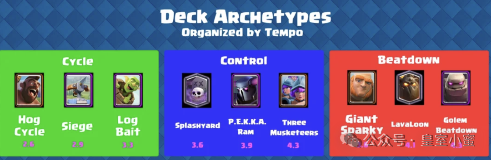
但是知道分类，不代表你真的会组卡。

很多玩家的问题不是不会操作，而是在组卡阶段，卡组本身就已经出现了结构问题。最典型的情况就是节奏冲突。明明想速转，却塞进高费推进单位；明明想玩反打，但又没有稳定防守核心；又或者一套卡组里全是强度卡牌，但彼此之间完全不在一个节奏上。结果就是玩起来总觉得别扭，速转转不起来，对面推过来又防不住。

所以其实现在真正的组卡逻辑，其实已经从“卡牌配合”逐渐变成了：

> 节奏 + 圣水费用 + 特殊卡槽分配

### 第一步：先决定自己的节奏

这是最核心的部分。

你必须先明确，自己喜欢或者说擅长哪一类原型，自己的的卡组又属于哪一种节奏。

循环流的核心，是低费、高频率、持续施压，所以它需要大量便宜组件来保证循环顺畅，需要稳定的小法术和低费防守卡来维持节奏，同时还要保证核心卡牌能够不断过出来，这里的代表自然是速猪、飞桶桶等小费卡组。

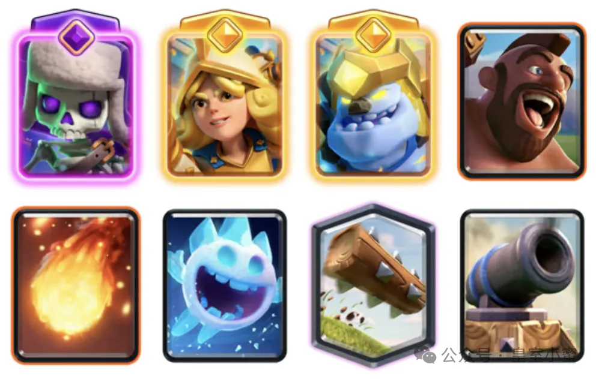

控制流则完全不同，它更依赖中费交换和防守反击，需要高质量解场卡，需要稳定赚费能力，需要在防守结束后立刻组织反打。这类卡组占据了常见卡组的大部分，譬如各种三冲、皮卡锤、甚至墓园也能归到本体系。

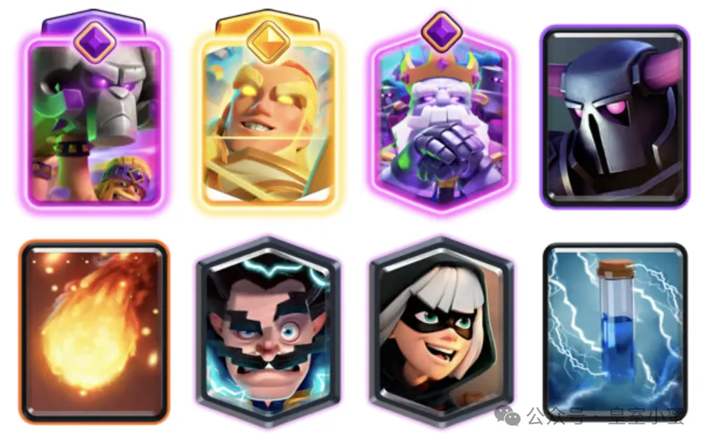

推进流需要你统筹圣水，前期可以适当卖血，核心目标是在双倍三倍圣水阶段形成一波大推进。因此它需要高质量前排、高伤害后排以及合理的法术支援。大家熟悉的石头人、电胖、电磁炮等卡组，就经常是你看不见啊看不见，最后一波推。

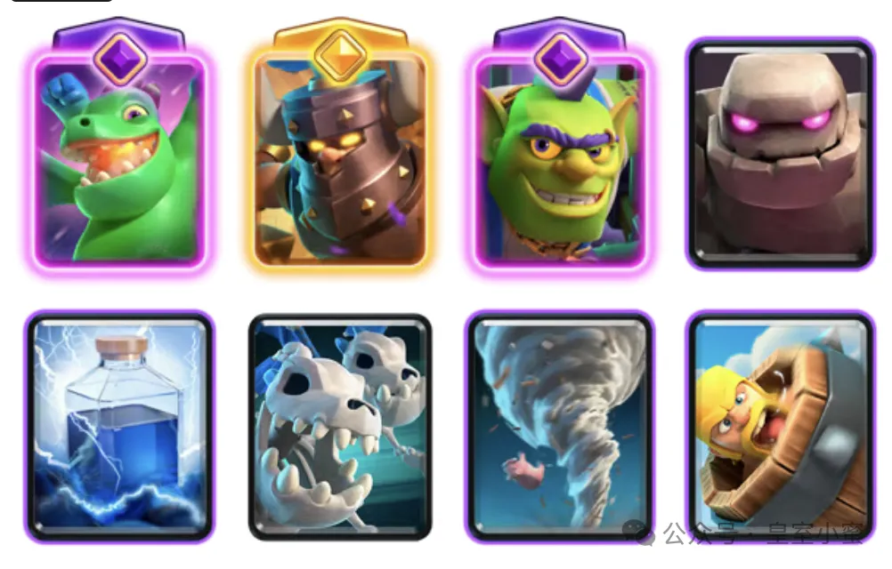

节奏一旦确定，后面的你的组卡方向才会稳定。

### 第二步：确定核心卡牌

每一套“正常”卡组，都必须带或者说基本都会带上明确的核心卡牌。

皇室战争中的核心卡牌，通常是指直接攻击建筑的卡牌（矿工基本来说算半个核心，或者二核心）。常见进攻核心包括野猪骑士、蛮羊骑士、墓园、气球兵、矿工、皇家巨人、巨人、石头人、攻城槌等。

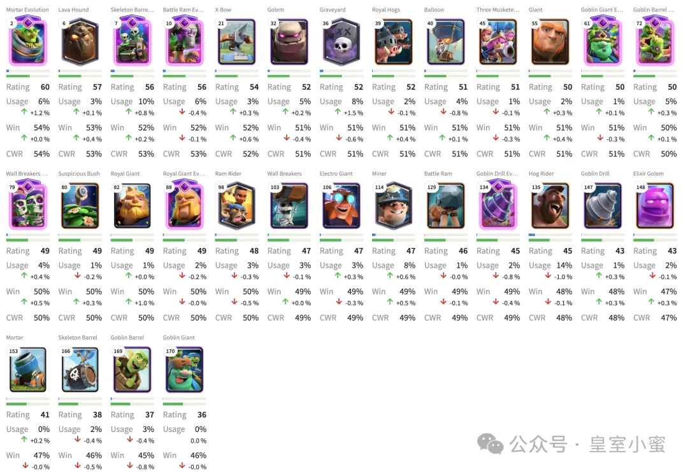
它们决定了你整套卡组最终怎样拆塔，也决定了其他七张卡应该围绕谁服务。如果一套卡组没有明确核心，那么最后通常会进攻乏力，演化成好像能打，但怎么都打不进去的局面。

很多所谓的发明家卡组，问题其实就在这里。

根本不不带核心，卡组里面卡很多，对空对地建筑法术杂毛皮卡什么都带一个，好像什么都能应对，但是不成体系；或者索性带上很多核心，结果防守稀松，一推就没。

### 第三步：组卡

#### 卡组类型

确定节奏和核心之后，就来到了卡组类型环节。

首先要根据你的核心卡牌，确定你想玩的类型。

卡组类型其实指的就是围绕某张核心卡牌或某个获胜条件构建的卡组。比如速猪、自闭桶就是卡组类型，因为它的核心就是用野猪骑士或者飞桶这样的核心卡牌来频繁发起进攻。卡组里的其他卡牌（比如冰雪精灵、骷髅兵等）都是为了让核心卡牌能用得更频繁而存在的。

譬如速猪，显然是围绕着野猪核心来进行速转的卡组。

那么地震猪呢？这里虽然核心仍然是野猪，但是考虑到地震这个强绑定的支援法术，我们通常认为是另一种相近的卡组类型。

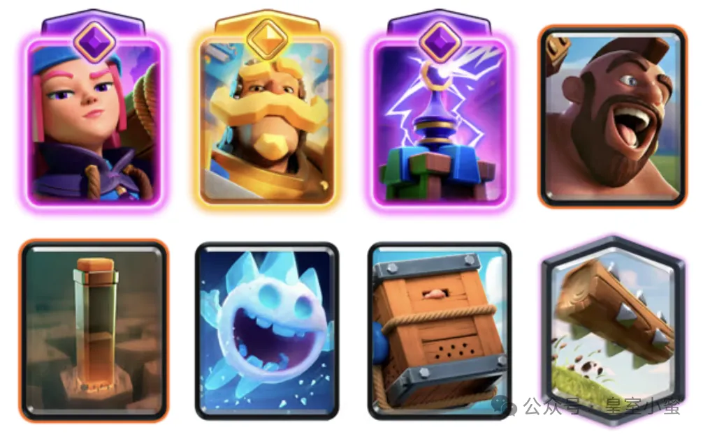

不管是速转的速猪、飞桶，还是主打反击的皮卡锤、墓园，又或者是石头人电胖，根据你自己的喜好和操作手法，选择一种或多种适合自己的卡组类型。

#### 构建合理的卡组就是真卡组

皇室战争有 8 张卡牌，确立了进攻核心后，接下来就要考虑其他 7 张卡牌的合理分配——现代环境里，只会进攻的卡组很难活。

因为现在的卡牌强度越来越高，觉醒和精英体系又进一步提高了单卡质量，所以防守已经不只是对牌这么简单，而是要考虑圣水交换、后续反击、过觉醒以及特殊槽位资源。一个合理的卡组，通常都需要具备地面防守、空中处理、小法术清场以及快速解对面核心的能力，否则只要遇到某一种极端体系，就会瞬间崩盘。

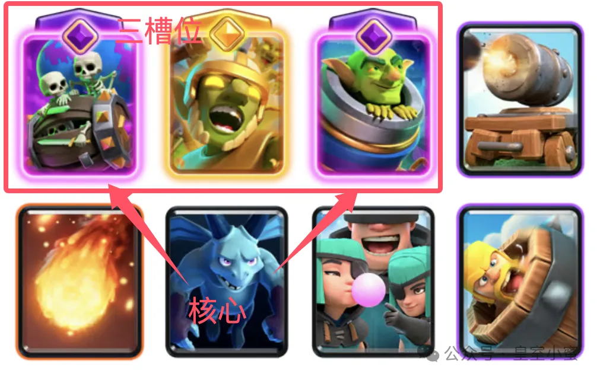

因此，一套正常合理的卡组里，通常都会有：**进攻核心、一个或多个地面支援部队、稳定防守核心、对空、小法术、大法术、小费过牌，还有可选的建筑和其他。**

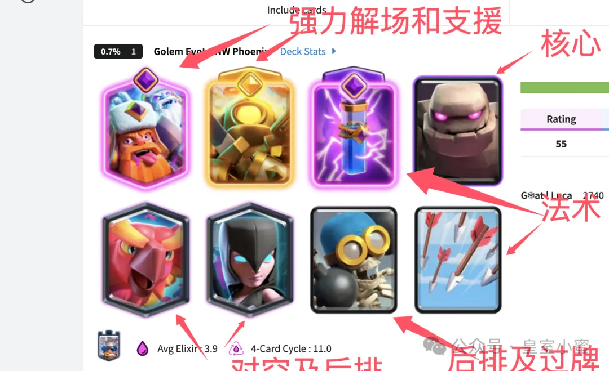
当然，随着你对游戏的理解的提升，你会发现这些并不绝对，但是这是游戏组卡逻辑的基本框架。

这种构建合理、能适合主流环境的卡组，也就是通常意义上的“真卡组”。

如果你比较关注外服主播或者玩家，那么 Meta Deck 这个名词肯定会比较熟悉。在皇室战争里，meta deck 的 meta 其实不是某个官方缩写名词，而是来自“Most Effective Tactics Available”，也就是“当前环境下最有效的战术”。不过有意思的是，游戏圈后来很多人已经不把它严格当缩写用了，而是把 meta 当成一个独立词。更多是在表达“当前版本环境主流、强势、胜率高的卡组”，这也就是中文环境下大家常说的“真卡组”（但是窃以为，这里中文表达成“环境卡组”或者“主流卡组”更为合适）。

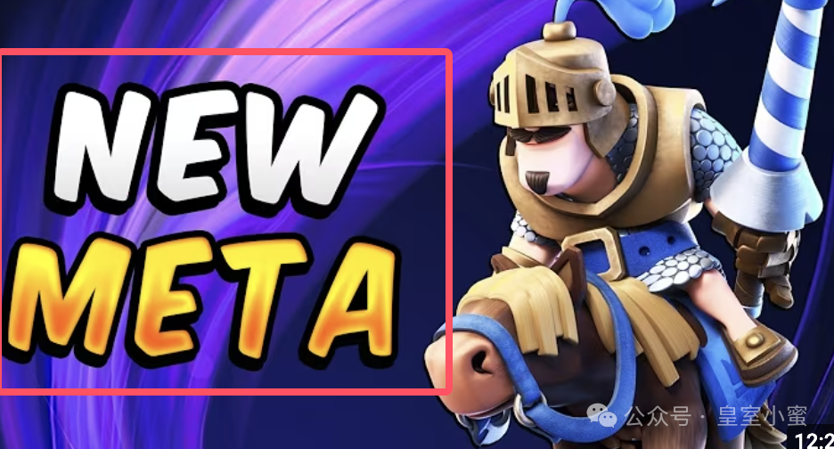

其实Meta卡组无非就是合理真卡组的子集，在每个版本中，随着新卡牌或者觉醒精英的推出，平衡性调整的变化，都会出现一套或多套特定的卡组，成为当前环境的真卡组。这些卡组的共同之处就是同样的核心、大致相同的进攻思路和战术，无非就是其他卡牌会有一些不同的变化。甚至比赛中，很多选手也会根据卡池或者对手，调整某套真卡组里的卡牌，来达到出其不意的效果。

譬如本赛季的锅炉墓园长这样：

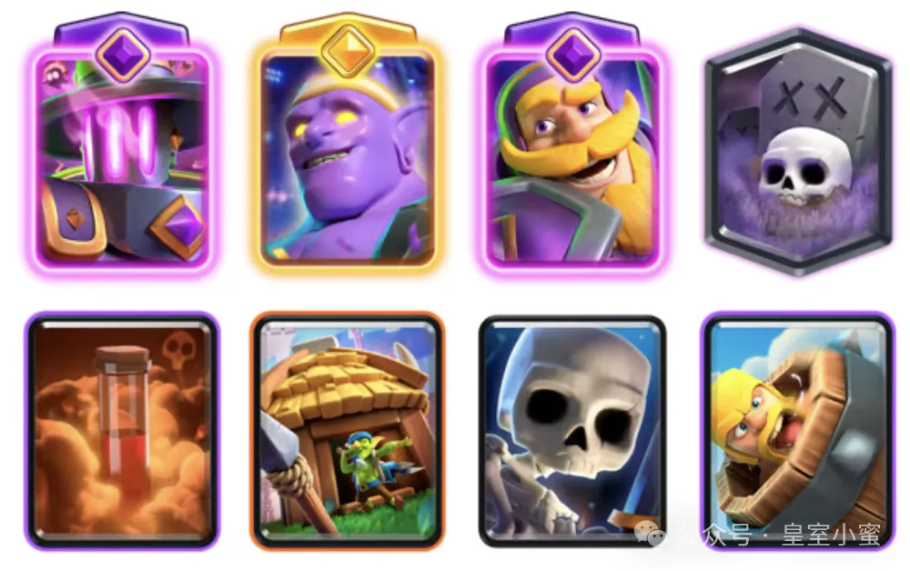

上赛季的锅炉墓园：

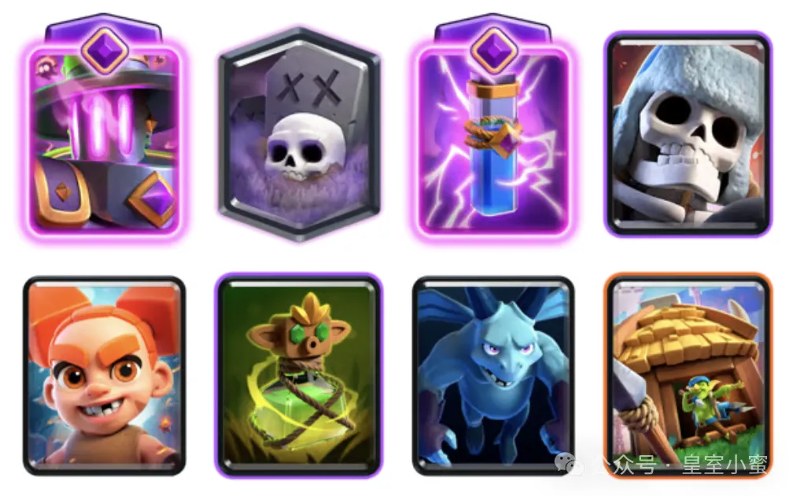

但是细看，基本也不会脱离基本框架，只不过更适应环境罢了。

#### 特殊槽位

皇室战争中的特殊槽位目前有 3 个，可以放二精英一觉醒，或者二觉醒一精英。

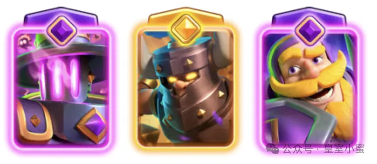

现在很多玩家组卡时最大的误区，就是把特殊槽位当成哪里强塞哪里。

其实不是。

精英卡和觉醒卡，本质上是是卡牌的强化，需要根据其特点，进行合理的分配——觉醒卡牌基于循环，精英卡牌基于主动技能，需要消耗圣水。

循环流通常更适合“2觉醒+1精英”。

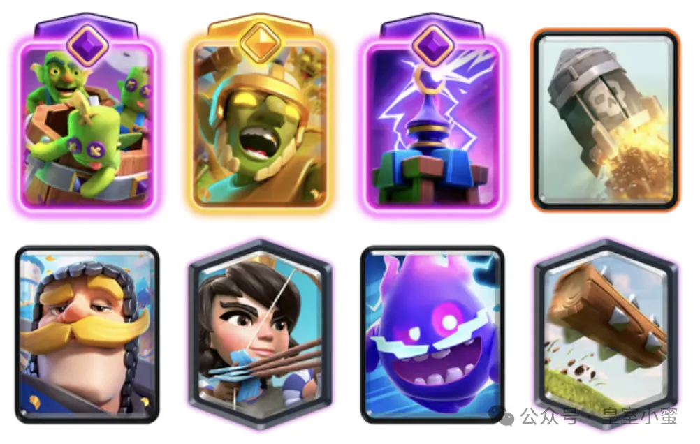

因为循环流最大的优势，本来就是速转，而卡牌觉醒恰恰需要卡牌过牌轮次。像冰人、加农炮、火枪、哥布林这种低费高频单位，在循环体系里会非常容易触发觉醒，因此收益会特别夸张。

而控制流和推进流，则通常更适合“2精英+1觉醒”。

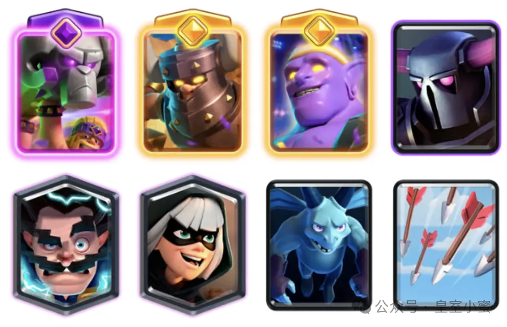

因为它们过牌稍慢，精英卡每次都有的高单卡质量显然更加合适。

控制流需要高质量交换，需要防守赚费，所以精英小皮卡、精英游侠，往往能直接改变对牌结果达到赚费的效果。推进流则更依赖前排硬度和后排输出，一个精英胖子或者精英后排，往往就意味着整波推进的强度提升。

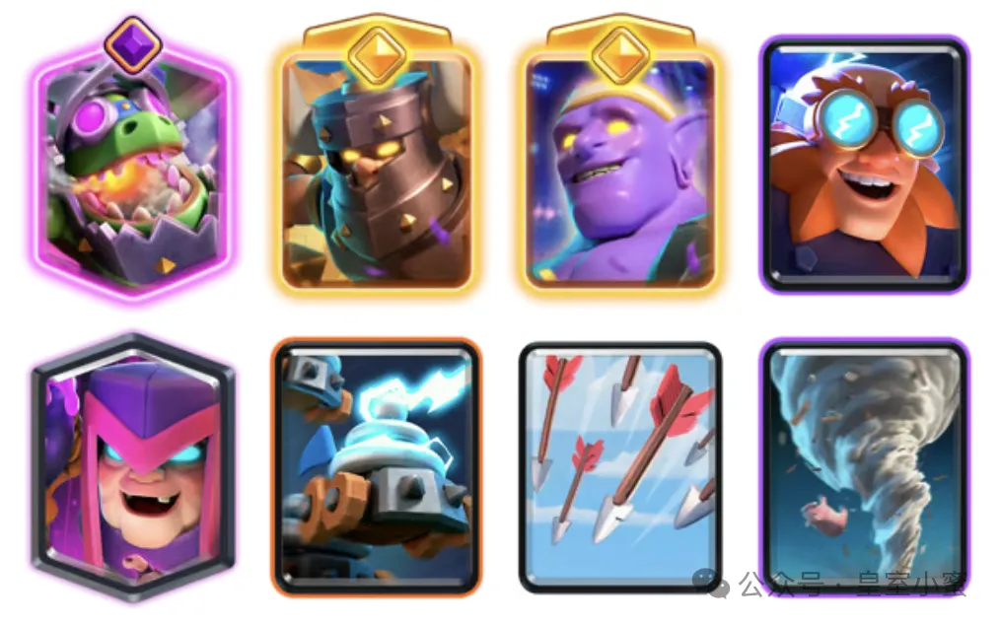

简单来说就是，循环流强化“频率”，控制流强化“交换”，推进流强化“质量”。

### 避免假卡组

真正毁掉一套卡组的，通常不是卡不强，而是结构畸形。

最常见的问题有几个。

首先，就是无核心或者多核心。没有核心意味着缺乏主要进攻手段，战术思想不明确；多核心，则往往会导致防守无力（当然，卡组进化到现在，现在骨球迫击炮、矿机等，都是有主副核的，相对合理）。

第二种，是节奏冲突。比如飞桶配石头，三冲配迫击炮，这些卡单独都不弱，但彼此根本不属于一个游戏速度，真玩起来要多别扭有多别扭。

第三种，是圣水费用不合理。整套卡组全是四费五费，没有小费，没有过牌单位，结果就是总觉得卡手。

第四种，则是特殊槽位乱塞。觉醒和精英和卡组搭配不合理，即使精英和觉醒是版本之子，但如果不适配自己的卡组，带着也是浪费。

### 最后

皇室战争发展到今天，推出了越来越多的新卡，引入了精英体系以及觉醒体系，各种新的卡组层出不穷，各种体系也都在发生变化。

然而，卡组核心还是哪些核心，卡组了行和原型还是那些，基本的逻辑不会变。但是，觉醒和精英也确实肉眼可见的改变了组卡的方向，很多时候也不得不屈从精英和觉醒的强度，包括环境中一些平衡性做的稀烂的个别卡牌，虽然它们可能并不适配你的卡组。

但是靠着单卡强度和其他原因，它们在环境中也确实不讲道理。

譬如上赛季的这套卡组：

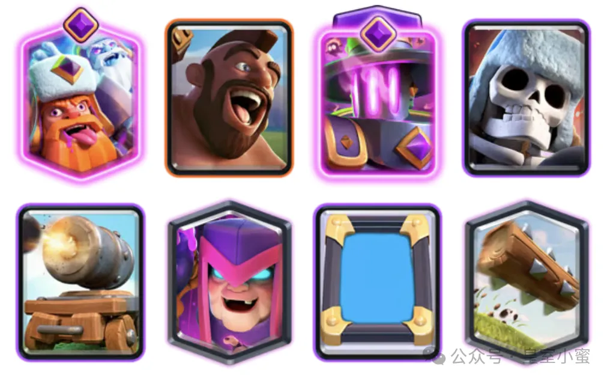

再譬如带着石头和水人的卡组，从组卡角度看根本都不合理：

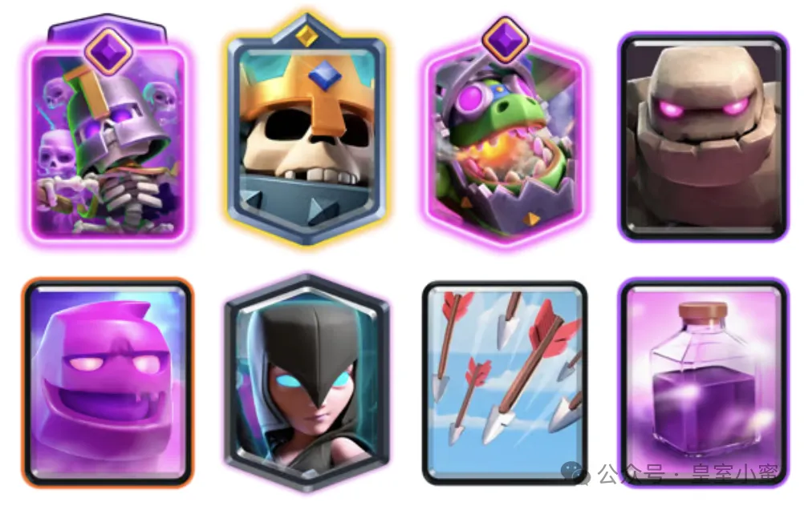

然而万变不离其宗，不管怎样，现代组卡最核心的问题，最终只有一句话：你的节奏是否统一。

因为一旦节奏统一，很多问题都会自然解决。

而一旦节奏混乱，再强的卡也救不了整套卡组。

如果觉得内容有帮助，请绑定我的创作者代码 **xiaomi** 支持一下。