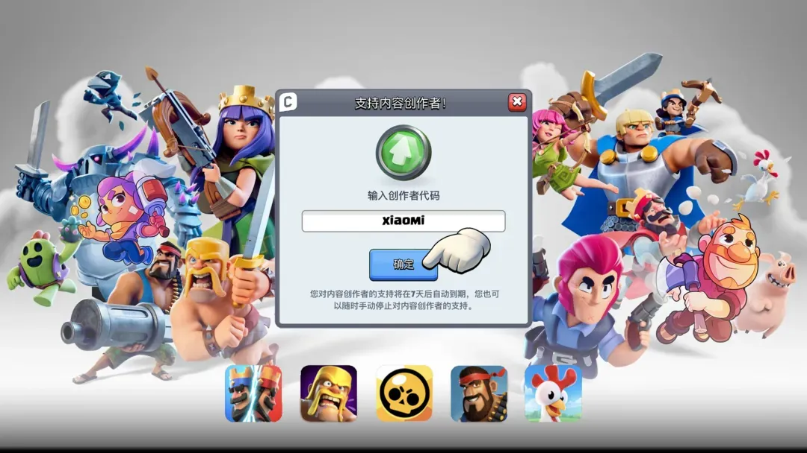

新卡 **浪人** 登陆后，从 Royaleapi 的数据来看，天梯和紫水晶使用率目前都相当偏低，并未开始明显影响当前环境。

一方面是浪人需要解锁和升级，一方面是其自身的特点决定。

这张牌的特点很鲜明：面对近战单位时非常强，尤其适合处理迷你皮卡、皮卡、超骑、骑士这类贴脸威胁；但它不是万能解，面对胖子、石头类推进、远程单位或节奏压制时，仍然需要配合其他防守牌一起处理。

今天本蜜给大家整理 5 套浪人卡组，覆盖皇家巨人、墓园、X弩、迫击炮和速转飞桶，想尝试新卡的玩家可以直接抄作业。

## 浪人怎么用？

### 浪人很强，但费用不低

浪人需要 **5 点圣水** 。

所以不要把它当成骑士那样随手丢的低费小坦。它更接近女武神、幽灵这类中费核心单位，一旦乱交，很容易导致后续防守费用不够。

### 解浪人时，小单位要先下

如果你准备用小皮卡加骷髅兵处理浪人，建议先下骷髅兵，再下迷你皮卡。

原因很简单：浪人的反击机制很容易让高伤单位先吃亏。先用小单位骗出节奏，再用主力输出单位收掉，会稳定很多。

## 卡组一：浪人家驹

### 卡组思路

这套速转家驹原本就很成熟，浪人的加入主要是补强近战对抗能力。

以前皇家巨人卡组常用骑士、幽灵、僧侣这类小坦来抗线，现在浪人可以直接顶到这个位置。面对小皮卡、皮卡、超级骑士、进化骑士等防守核心时，浪人能帮皇家巨人打开突破口。

### 对局要点

皇家巨人不一定要硬顶进塔。

如果对手用大单位卡住桥头，可以先用渔夫拉扯，再用浪人处理前排，随后皇家巨人反打。觉醒猎人负责近距离爆发，火球和滚筒补伤害、清后排。

这套牌节奏不算特别快，但稳定性很高，适合喜欢皇家巨人体系的玩家。

## 卡组二：浪人墓园

### 卡组思路

这套墓园的主要变化，是把原本骑士或黑王的位置换成浪人。

浪人的作用是帮助墓园卡组稳住地面防守，同时在防守成功后形成反打。墓园本身需要前排吸引火力，浪人虽然费用更高，但处理近战单位的能力更强。

### 锅炉能不能换女巫？

可以。

熔炉和女巫的共同点是都能提供持续干扰和范围压力。熔炉靠火精灵持续消耗，女巫则靠骷髅和远程输出辅助防守。

不过从稳定性来看，熔炉更适合慢慢磨血和拉扯节奏；女巫更偏防反。具体选择可以看个人习惯。

### 对局要点

这套牌防守资源比较扎实：特斯拉、骷髅兵、冰雪精灵、滚筒、熔炉都能拖节奏。

进攻端不要急着裸墓园，最好等浪人或熔炉残血过桥，再配合墓园和毒药打消耗。

## 卡组三：浪人连弩

### 卡组思路

这是一套改良版 X 连弩。

传统 X 连弩常用骑士作为前排，但骑士被削弱后，浪人可以成为新的地面核心。虽然费用从常见的 3.0 左右提升到了 3.4，但浪人能解决 X 连弩最怕的一类问题：大型近战坦克。

面对皮卡、超级骑士、进化骑士这类单位时，普通骑士往往只能拖时间，很难快速拆掉；浪人则可以更快处理这些前排，让 X 连弩更容易锁塔。

### 对局要点

这套牌不能无脑桥头连弩。

前期以防守和过牌为主，用特斯拉、弓箭手、电击精灵稳住场面。等对手交掉关键大单位后，再用 X 连弩压桥。

浪人最好留给关键防守，不要随便沉底。只要防守成功，残血浪人配合连弩反打，会给对手很大压力。

## 卡组四：浪人迫击炮

### 卡组思路

这套迫击炮卡组里，浪人主要替代炮车的位置。

两者同样是 5 费，但浪人的近战处理能力更突出。迫击炮想要锁塔，最怕对手用超级骑士、皮卡、女武神这类单位强行顶住。浪人能帮迫击炮更快清掉这些前排，从而创造锁塔机会。

### 对局要点

这套牌有两个进攻点：迫击炮和骨球。

迫击炮可以防守，也可以作为对塔核心；骨球则负责分路施压和逼法术。绿林和亡灵提供空地防守，火球、滚筒补充解场能力。

如果遇到大型单位推进，不要急着把迫击炮当进攻牌下掉。先防守，等浪人处理掉核心单位后，再用迫击炮反架。

## 卡组五：速转浪人桶

### 卡组思路

这是一套非常快的飞桶卡组。

浪人在这里通常可以理解为女武神位置的替代品。它负责处理对手的中大型近战单位，同时给飞桶体系争取更多进攻回合。

这套牌的核心不是纯防守，而是不断打断对手节奏。飞桶、吹箭哥布林、豆子、哥布林都能快速轮转，让对手一直处在解牌压力里。

### 对局要点

玩这种速转卡组，不能太被动。

如果只想着防守，对手很容易攒出一波大推进，到时候 2.5 费用再低也未必守得住。正确打法是不断分路骚扰：飞桶消耗，吹箭哥布林蹭血，精灵过牌，浪人留着处理对方的关键近战单位。

只要节奏不断，对手就很难组织完整进攻。

## 浪人适合放进哪些卡组？

从这 5 套卡组可以看出，浪人最适合替代以下位置：骑士、女武神、黑暗王子、幽灵、部分炮车或小坦位置。

它的优势是近战对抗强、反打能力好，尤其适合需要解决皮卡、小皮卡、超级骑士、进化骑士的卡组。

但浪人也有明显缺点：费用偏高，不能乱交；面对远程单位和大推进时，需要其他卡牌配合。

如果你刚拿到浪人，可以优先尝试这 5 套。

当然，新卡上线初期环境变化会很快，大家可以先从自己熟悉的体系入手，把原来的骑士、女武神、幽灵等位置换成浪人测试。

你还有哪些浪人卡组用起来不错？

欢迎在评论区聊聊。

如果觉得内容有帮助，请绑定我的国服创作者代码 xiaomi 支持一下。

_小蜜也会一如既往的为大家输出更多的资讯、攻略、以及各种白嫖福利～_

