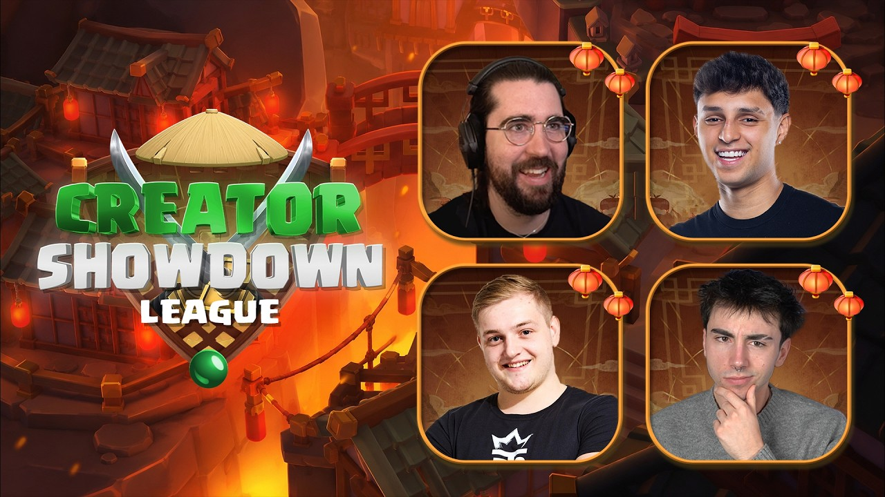
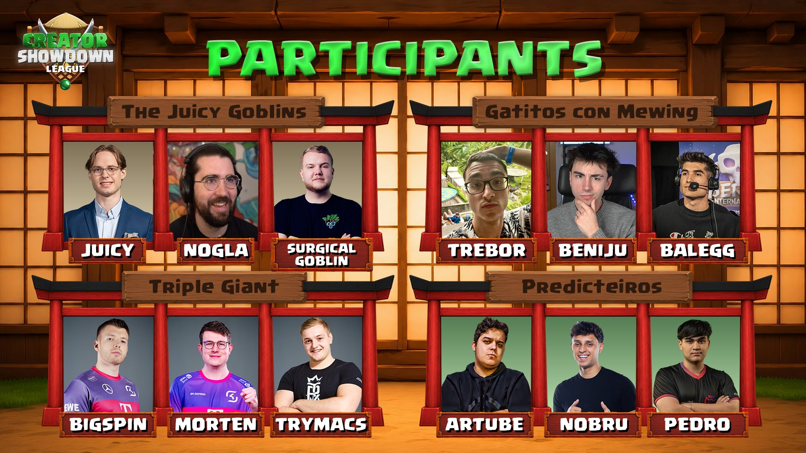
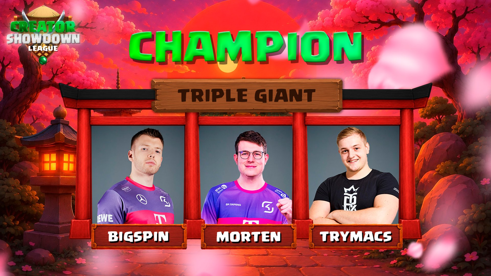
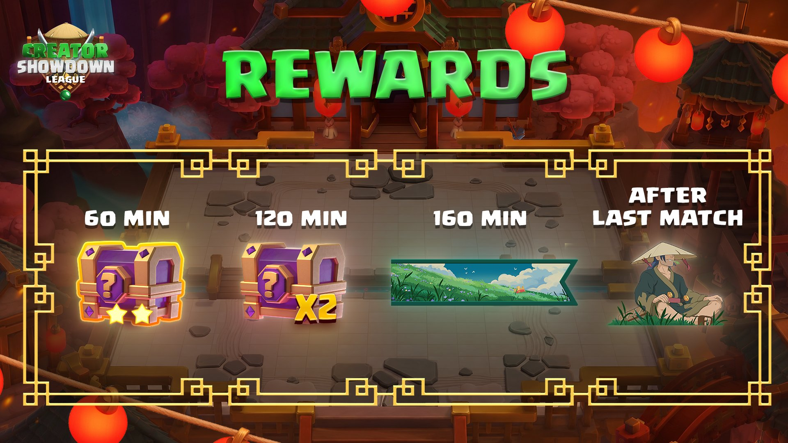

**Creator Showdown League** 是皇室战争官方在 2026 年 7 月推出的一场创作者赛事活动。本次活动结合了内容创作者、职业选手、新卡 **Ronin（浪人）** 和 **C.H.A.O.S Mode（混沌模式）**，同时还设置了直播观赛奖励。

本文整理本次 Creator Showdown League 的活动时间、赛制、参赛队伍、冠军结果、奖金池和观赛奖励，方便后续查询。

---

## 活动基本信息

| 项目 | 内容 |
|---|---|
| 活动名称 | Creator Showdown League |
| 游戏 | Clash Royale / 皇室战争 |
| 举办时间 | 2026 年 7 月 12 日 |
| 官方开播时间 | 17:00 UTC |
| 活动形式 | 创作者赛事 / 表演赛 / 社区赛事 |
| 主要模式 | C.H.A.O.S Mode、Standard Mode |
| 冠军队伍 | Team Triple Giant |
| 总奖金池 | 50,000 美元 |

Creator Showdown League 并不是传统 CRL 职业联赛，而是更偏社区互动和内容展示的官方赛事。它的核心看点在于：让创作者和职业选手组队，在娱乐性更强的规则下进行比赛，同时通过直播奖励吸引玩家观看。

---

## Creator Showdown League 是什么？

Creator Showdown League 是一场由皇室战争官方组织的创作者赛事。

本次比赛共有 **4 支队伍、12 名参赛者**，每支队伍由：

- 2 位内容创作者
- 1 位职业选手

组成。

官方将本次活动设计成循环赛形式，每支队伍都需要与其他队伍交手。比赛中同时包含 **C.H.A.O.S Mode（混沌模式）** 和 **Standard Mode（标准模式）**，因此整体观赏性比普通天梯或正式职业赛更强。

简单来说，这场活动的定位是：

> 用创作者和职业选手的组合，展示新卡浪人、新模式混沌模式，以及皇室战争社区赛事的娱乐效果。

---

## 比赛赛制

根据官方介绍，Creator Showdown League 采用 **4 队循环赛制**。

### 核心规则

- 4 支队伍参加
- 每支队伍与其他队伍各交手一次
- 每支队伍共进行 3 场比赛
- 全部赛事共 6 场比赛
- 每场比赛由 3 个回合组成
- 比赛模式包含 C.H.A.O.S Mode 和 Standard Mode
- 每个回合的每一小局都会产生积分
- 赢下回合的队伍获得 3 个联赛积分
- 全部比赛结束后，积分最高的队伍成为冠军

这种赛制的好处是节奏比较紧凑，同时每一场比赛都对最终排名有影响。对于观众来说，不需要像长期联赛一样追很多天，一场直播就能看完整个活动的主要过程。

---

## 参赛队伍名单

本次 Creator Showdown League 一共有 4 支队伍。

### Team Triple Giant

- Trymacs
- Morten
- BigSpin

### Gatitos con Mewing

- Trebor
- Beniju
- BaleGG

### The Juicy Goblins

- Nogla
- Juicy
- Surgical Goblin

### Predicteiros

- NoBru
- Artube
- Pedro

其中 Team Triple Giant 最终获得冠军。

---

## 冠军结果

本次 Creator Showdown League 的冠军是：

## Team Triple Giant

冠军成员：

- BigSpin
- Morten
- Trymacs

官方在赛后公告中确认，Team Triple Giant 成为本次 Creator Showdown League 冠军队伍。

从阵容来看，Team Triple Giant 的关注度本身就很高。Morten 和 BigSpin 都是皇室战争玩家比较熟悉的名字，Trymacs 也有很强的内容影响力。因此这支队伍最终夺冠，兼具竞技性和传播效果。

---

## 奖金池分配

本次 Creator Showdown League 总奖金池为 **50,000 美元**。

官方公布的奖金分配如下：

| 名次 | 奖金 |
|---|---:|
| 第 1 名 | 17,000 美元 |
| 第 2 名 | 13,000 美元 |
| 第 3 名 | 11,000 美元 |
| 第 4 名 | 9,000 美元 |

虽然 Creator Showdown League 是创作者赛事，但 50,000 美元的奖金池说明官方对这类社区赛事仍然投入了较高资源。

这类赛事的价值不只是比赛本身，还包括：

- 推广新卡 Ronin（浪人）
- 推广 C.H.A.O.S Mode（混沌模式）
- 增加创作者内容曝光
- 提高直播观看和玩家互动
- 通过奖励机制拉动社区参与

---

## 本次活动的核心看点

### 1. Ronin（浪人）成为活动主角

本次活动与新卡 **Ronin（浪人）** 的推广关系非常密切。

官方宣传中多次提到 Ronin，并把活动观赛奖励也设计成浪人主题。对于玩家来说，这场活动不仅是看比赛，也是在观察新卡上线后官方希望塑造的玩法方向。

Ronin 的出现让本次活动具有更强的版本意义。它不只是单纯的赛事内容，而是新赛季内容推广的一部分。

### 2. C.H.A.O.S Mode 提高了比赛不确定性

C.H.A.O.S Mode 是本次活动的重要组成部分。

相比标准模式，混沌模式更容易出现反转、特殊组合和意外局面。对于职业选手来说，它考验的是临场应变；对于内容创作者来说，它更容易制造直播效果。

这也是 Creator Showdown League 和传统职业比赛最大的区别之一。

传统比赛更强调稳定性和高水平操作，而 Creator Showdown League 更强调：

- 节目效果
- 观众参与感
- 新内容展示
- 创作者之间的互动

### 3. 职业选手和创作者混合组队

每支队伍由 2 位内容创作者和 1 位职业选手组成。

这种组队方式让比赛不会过于娱乐化，也不会像职业联赛那样门槛太高。职业选手保证比赛质量，创作者负责带动氛围和传播。

对于普通玩家来说，这种赛事比纯职业赛更容易观看，也更适合作为新内容宣传活动。

---

## 观赛奖励汇总

本次 Creator Showdown League 设置了 4 个观赛奖励节点。

以下为活动期间官方公布的奖励记录。由于活动已经结束，当前是否仍可领取，需要以官方链接或游戏内实际状态为准。

| 解锁条件 | 奖励 |
|---|---|
| 观看 60 分钟 | 2 星幸运宝箱 |
| 观看 120 分钟 | 2 个 2 星幸运宝箱 |
| 观看 160 分钟 | 浪人主题战旗装饰 |
| 最后一场比赛结束后 | 浪人主题表情 |

这些奖励的重点并不只是资源数量，而是包含了浪人主题的收藏内容。对于喜欢收集表情、战旗装饰的玩家来说，后两个奖励更值得关注。

---

## 奖励还能领取吗？

由于 Creator Showdown League 已经结束，观赛奖励是否还能领取取决于官方链接是否仍然有效。下面是所有奖励。

一般来说，这类直播奖励可能会有领取期限。即使玩家拿到了二维码或链接，也可能在活动结束后失效。

如果后续仍有玩家想尝试领取，可以注意以下几点：

- 只使用官方直播、官方社媒或可信社区来源提供的链接
- 不要输入 Supercell ID 以外的敏感账号信息
- 遇到可疑网页不要登录
- 领取结果以游戏内到账为准

如果奖励已经过期，则只能作为本次活动的奖励记录保留。

---

## 活动回顾：这次 Creator Showdown League 值得关注吗？

从活动设计来看，这次 Creator Showdown League 的作用非常明确。

它不是一场单纯的职业赛事，而是一场围绕新卡和新模式展开的社区内容活动。

### 对官方来说

这次活动帮助官方完成了几件事：

- 给 Ronin（浪人）制造曝光
- 让玩家看到 C.H.A.O.S Mode 的直播效果
- 让创作者和职业选手一起参与内容传播
- 用观赛奖励提升直播热度

### 对玩家来说

这次活动的价值主要体现在：

- 可以通过直播了解新卡浪人
- 可以看到不同地区创作者和职业选手组队
- 可以领取限时观赛奖励
- 可以观察混沌模式中的强势思路

### 对内容创作者来说

Creator Showdown League 也提供了一个很好的内容素材。

无论是赛事回顾、浪人卡组分析、混沌模式玩法讨论，还是观赛奖励整理，都可以延伸出后续内容。

---

## 小结

Creator Showdown League 2026 是一次典型的皇室战争社区赛事活动。

它结合了：

- 新卡 Ronin（浪人）
- C.H.A.O.S Mode（混沌模式）
- 创作者赛事
- 职业选手参与
- 直播观赛奖励
- 50,000 美元奖金池

最终，**Team Triple Giant** 击败其他队伍，成为本次活动冠军。

如果只看结果，可以记住两点：

1. **冠军：Team Triple Giant**
2. **核心奖励：浪人主题战旗装饰和浪人主题表情**

如果从版本内容角度看，这次活动更像是皇室战争围绕浪人推出的一次大型社区宣传节点。后续浪人在天梯、活动模式和卡组环境中的表现，仍然值得继续观察。

---

## FAQ

### Creator Showdown League 是 CRL 吗？

不是。

Creator Showdown League 是皇室战争官方创作者赛事，不是传统意义上的 Clash Royale League 职业联赛。它更偏娱乐赛和社区活动。

### Creator Showdown League 2026 冠军是谁？

冠军是 **Team Triple Giant**。

队伍成员包括 BigSpin、Morten 和 Trymacs。

### Creator Showdown League 有哪些模式？

本次活动包含 **C.H.A.O.S Mode** 和 **Standard Mode**。

其中 C.H.A.O.S Mode 是本次活动的重要看点之一。

### 本次活动有多少奖金？

总奖金池为 **50,000 美元**。

冠军队伍奖金为 **17,000 美元**。

### Creator Showdown League 观赛奖励有哪些？

本次活动公布了 4 个观赛奖励：

- 观看 60 分钟：2 星幸运宝箱
- 观看 120 分钟：2 个 2 星幸运宝箱
- 观看 160 分钟：浪人主题战旗装饰
- 最后一场比赛结束后：浪人主题表情

### 活动结束后还能领取奖励吗？

不一定。

这类直播奖励通常有时间限制。活动结束后是否还能领取，需要以官方链接和游戏内实际状态为准。

---

## 资料来源

- Clash Royale Esports 官方 X 长文：<https://x.com/EsportsRoyaleEN/article/2074887940291936267>
- Clash Royale Esports 冠军公告：<https://x.com/EsportsRoyaleEN/status/2076401319871438982>
- Clash Royale 官方直播：<https://www.youtube.com/watch?v=lRkh0_aRJmg>
