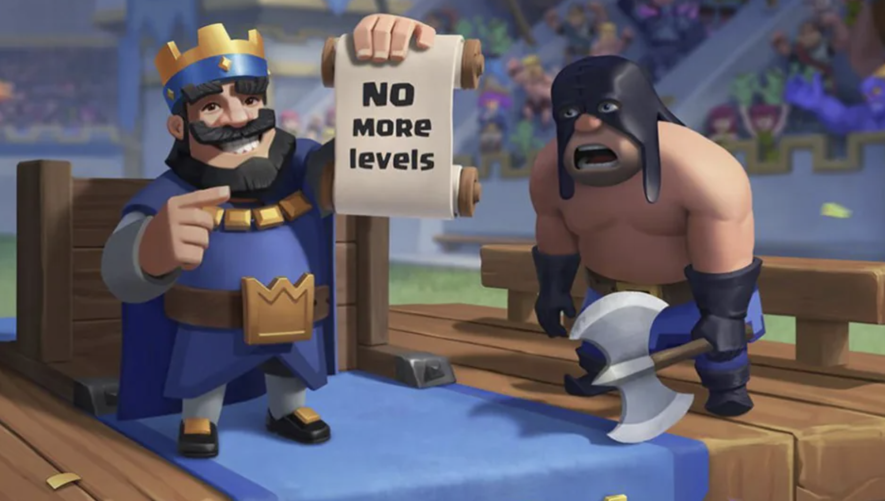
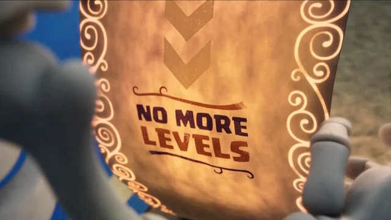
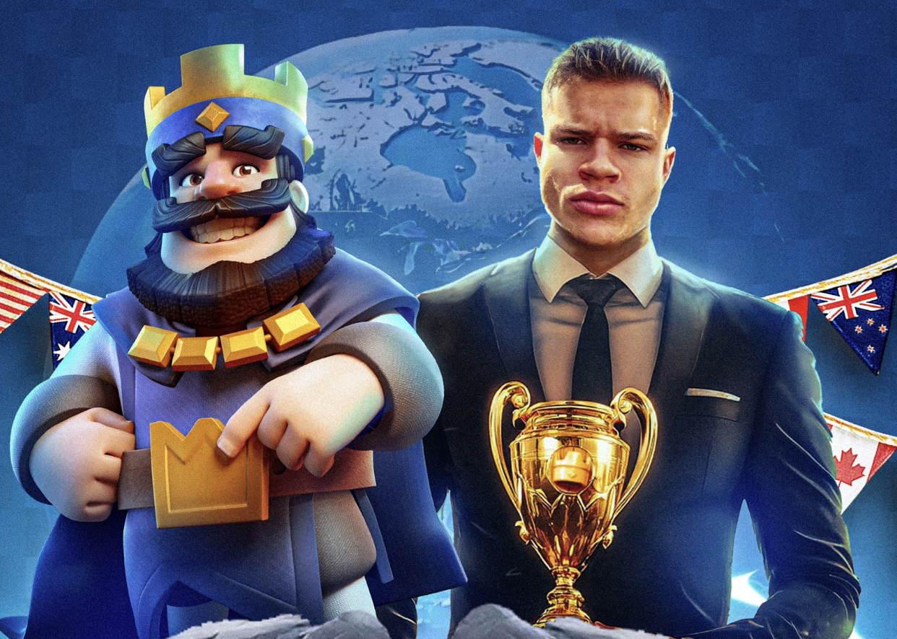
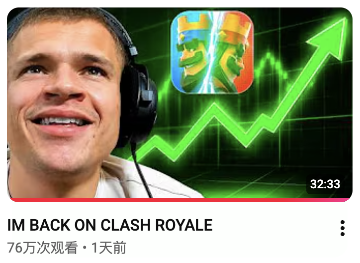
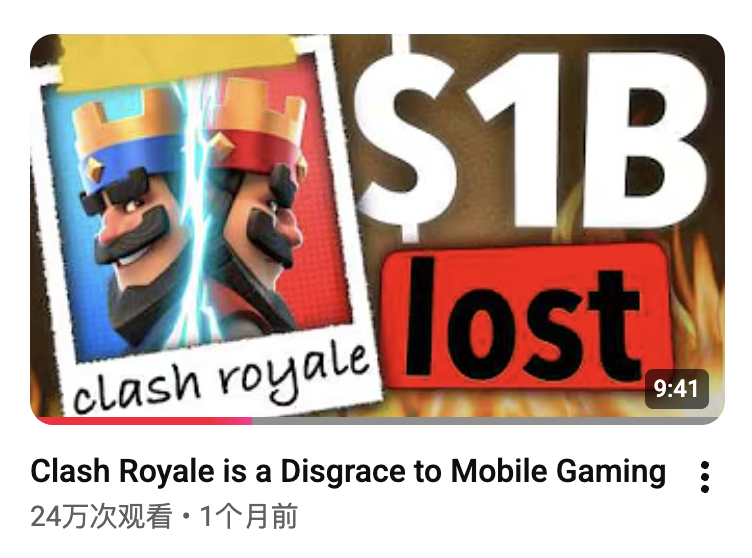
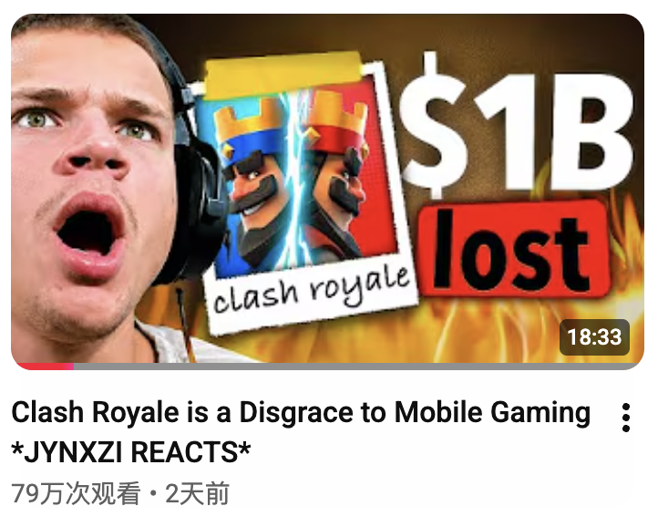
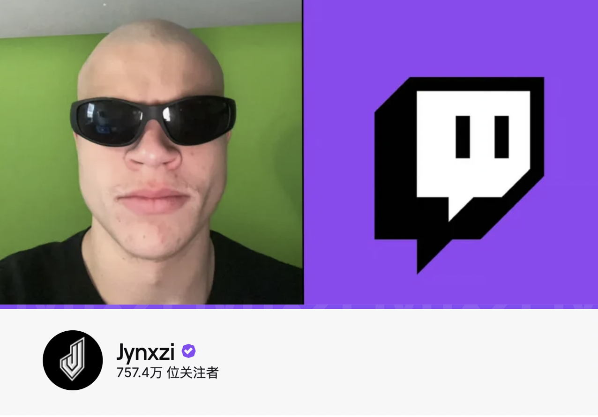
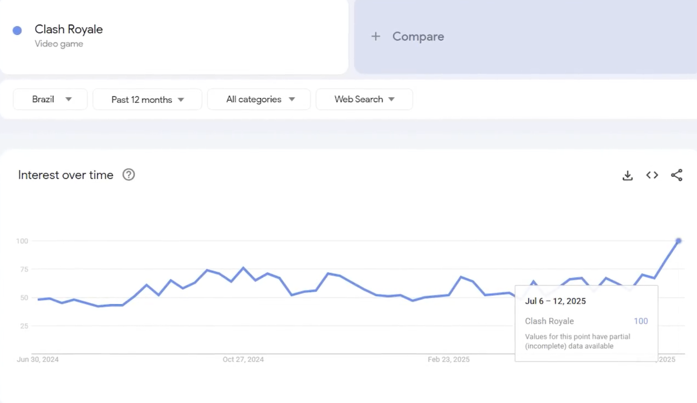
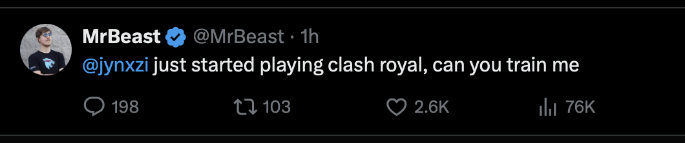
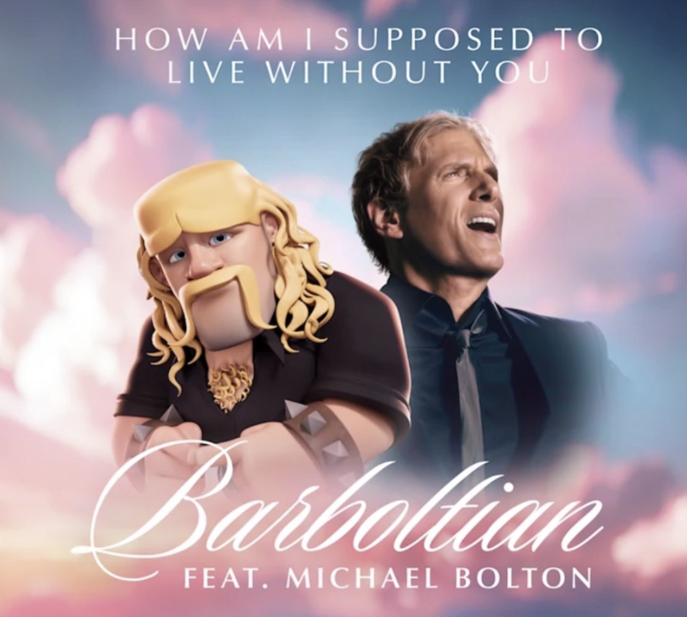

最近皇室战争的风评，又一次来到很微妙的位置。

官方刚刚做完号称“史上最大福利”的国王人头落地活动。活动奖池看起来非常夸张，从满级账号、皇室令牌、五星宝箱，到百万金币，各种奖励都足够吸引眼球。但实际体验下来，大多数普通玩家每天能拿到的，往往只是一些很小的奖励，比如250宝石。

这件事之所以让玩家不舒服，并不是大家真的觉得每天送一点福利不好，而是因为官方把它包装成了“史上最大”。当宣传给了玩家很高的期待，实际体验却更像是少数人中大奖、多数人陪跑，落差自然就会被放大。更何况，对于这种全服参与的活动来说，玩家最敏感的往往不是“我拿得少”，而是“为什么别人拿那么多，而我像是在凑热闹”。

不患寡而患不均。

活动结束后，官方又宣布 16 级会是最终等级，以后不会再有 17 级或更高等级。按理说，这应该算是一个正面信号，至少说明官方知道玩家最怕什么：等级没有尽头，养成没有终点。但很多玩家听到这个消息时，第一反应却是——信官方不如信我是秦始皇。

信任已经透支到了此等地步。

就在这样的背景下，那个男人，Jynxzi，他，回来了。

他先是回应了最近很火的视频《Clash Royale is a Disgrace to Mobile Gaming》，随后又重新开播玩皇室战争，并表示自己回来了。

于是一个老问题又被摆上台面：那个男人回来了，但这一次，他还能拯救皇室战争吗？

### 皇室战争是移动游戏界的耻辱

让我们把时针拨回到一个月前。

油管上有玩家发布了这样一个视频——《Clash Royale is a Disgrace to Mobile Gaming》，翻译过来就是“**皇室战争是移动游戏界的耻辱**”，这简直就是贴脸开大。

这个视频总结的非常到位，复盘了皇室战争这些年是如何一步步把口碑做坏。视频从皇室战争早期的辉煌讲起，一路说到英雄卡、15级、觉醒、精英、16 级、经济系统、匹配机制争议，以及2025年创作者带来的意外复兴。它的态度很明确：皇室战争本来拥有一副非常好的底牌，却在一次次商业化更新中把自己的第二次机会浪费掉了。

而在前几天，Jynxzi罕有的发布了一个视频，视频本身就是在观看上面的视频并给出回应。

原视频固然一针见血的精彩，而Jynxzi看这个视频时的反应更有意思。因为他不是坐在那里简单附和，也不是每一句都照单全收。相反，他一边看，一边在某些地方点头，在某些地方反驳，在某些细节上还会直接纠正原视频的说法。

比如原视频把觉醒也放进了皇室战争“逼氪更新”的链条里，认为它和后来的英雄、16级一样，都是游戏逐渐走向付费压力的代表。但Jynxzi明显不完全同意这个判断。他的态度大概是：觉醒确实有问题，尤其是刚上线时强度和获取方式都不太好看，但进化本身并不一定伤害游戏。相反，他认为进化至少让老卡牌有了新的玩法，让游戏重新出现了一些新鲜感（这一点其实我也是认同 Jynxzi 的）。

这个分歧其实很重要。很多人在评价皇室战争这些年的更新时，很容易把所有新系统都归为一类：都是逼氪，都是坏更新。但 Jynxzi 的反应更接近普通玩家真实的复杂感受。玩家并不是讨厌所有新内容，玩家讨厌的是官方用“新内容”的名义不断制造新的收费门槛。

换句话说，觉醒至少可以被理解为一种内容更新。它可能不平衡，可能上线时卖得难看，但它确实改变了卡牌的玩法。16级就完全不同。16级没有给玩家带来的新机制、新内容、更没有新策略，也没有新的操作空间，你需要付出更多的时间甚至金钱，只是为了追赶一层信的数字。

### 16级的问题是它创建了新的收费墙

Jynxzi 在回应里对 16 级的态度非常明确：它没有意义。这个说法听起来直接，但确实说中了很多玩家最不满的地方。

一张卡从 15 级升到 16 级，玩家获得的并不是新的体验。你不会因为它变成 16 级，就突然多出一个操作选择，也不会因此改变卡组思路。它只是让原本已经追到终点的玩家，发现终点又被往后挪了一段。对于免费玩家和轻氪玩家来说，这种感觉尤其糟糕，因为它不是在邀请你体验新内容，而是在提醒你：你又落伍了。

这也是为什么官方后来宣布 16 级会是最终等级时，很多玩家虽然觉得这是好事，但并没有立刻买账。因为玩家真正害怕的不是一个单独的 16 级，而是这种逻辑会无休止地重复。今天是 16 级，明天会不会是 17 级？今天是英雄，明天会不会是更强的新系统？当玩家不再相信终点存在，所有成长系统都会变成压力。

Jynxzi 对进化和 16 级的区分，正好把皇室战争的问题讲清楚了。玩家可以接受新内容，甚至可以接受某些新内容带有商业化设计。但如果一次大更新最终只是在旧系统上加一层成本，那玩家就很难再把它当成“更新”，而会把它理解成“收费墙”。

### 皇室战争史上最大的复兴

皇室战争 2025 年的回暖，很难绕开 Jynxzi 的作用。他原本并不是皇室战争主播，而是以彩虹六号等内容出圈的 Twitch 头部主播。后来他开始直播皇室战争，起初更像是一个带有节目效果的选择，但直播反响很快起来，观众跟着看，其他主播跟进，更多玩家也被带回了游戏。

这个瓜可以翻看我去年的文章：[震惊！皇室战争居然成了 2025 年Supercell最赚钱的游戏？它是如何逆风翻盘的？](https://mp.weixin.qq.com/s/KVl5ZTjQFLAE73UsaM9x-w?token=499049087&lang=zh_CN)。

这件事最有意思的地方在于，它并不是一次传统意义上的官方营销成功。皇室战争并没有靠一场精心设计的版本宣传突然翻红，也不是靠大规模买量让老玩家回流。更准确地说，那更像是一场意外：一个大主播突然把一款老游戏重新扔回大众视野，观众发现它仍然好看，仍然有节目效果，仍然能让人上头，于是游戏就这样获得了第二次机会。

对一款运营多年的手游来说，这种机会非常罕见。更难得的是，它几乎是社区和创作者主动送到官方面前的。只要官方后续不犯大错，皇室战争本来有机会把这波热度慢慢沉淀下来，让老玩家回流，也让新玩家重新认识这款游戏。

但后来发生的事情，大家也都知道了。16 级和英雄系统相继成为争议焦点，玩家重新感受到熟悉的压力：刚刚被拉回来，就又要开始补课。对很多人来说，这种体验非常败好感。你可以因为主播重新下载游戏，但如果游戏本身让你觉得累，你最后还是会离开。

### 创作者风波真正刺痛的是——谁带来了这次机会

原视频里还提到了 Supercell CEO 年度报告引发的创作者争议。那篇报告总结皇室战争过去一年的成绩，但在最初版本的年度报告中，对 Jynxzi 和其他创作者在游戏回暖中的作用没有给出足够承认。后来 ceo 发布了新一版的报告，虽然有补充和道歉，但很多创作者当时已经感到不满。

相关的回顾也可以参见我去年的文章：[最好的游戏尚未诞生？聊聊 Supercell CEO 的公开信～](https://mp.weixin.qq.com/s/kZnf4fJtx6Pu9WZXhIla3A?token=499049087&lang=zh_CN)

Jynxzi 在回应视频里看到这一段时，反应非常明显。不过他也纠正了原视频里的一个细节：视频中有一句话被归到他名下，但他说自己没有这么说过。他真正表达过的意思更接近于：官方把功劳给了那个把游戏做死的团队，却没有看到创作者在复兴中的作用。

这件事之所以让人不舒服，不只是因为“有没有提到某个主播名字”。真正的问题在于，官方似乎没有准确理解 2025 年那波复兴到底是怎么来的。从玩家和社区视角看，很多人重新关注皇室战争，是因为 Jynxzi、MrBeast、AMP 和其他创作者把它重新带进了大众视野。 而 CEO 似乎把主要功劳归到了情人节觉醒卡牌的赠送以及迈克尔波顿老爷为皇室战争带来的献唱，come on，以后做营销也拜托请点年轻的、能被众多玩家熟知认识的明星。

如果官方以为热度是自己设计出来的，那官方就可能相信，只要继续推系统、继续做活动、继续加门槛，玩家也会继续留下。但如果热度本质上来自社区和创作者，那官方最应该做的其实是维护这份信任，而不是马上把它转化成新的付费压力。

这也是 Jynxzi 后来停播皇室战争的原因之一。它不只是一个主播对游戏更新不满，也是一种关系破裂：创作者把玩家带回来，却发现官方既没有真正理解他们的作用，也没有珍惜这波回流。

### 这次回归是好消息吗？

Jynxzi 再次开播皇室战争，当然是一个好消息。对现在的皇室战争来说，任何正向话题都很珍贵。一个头部主播愿意重新直播，愿意重新制造内容，愿意让观众再次看到这款游戏，本身就会带来关注。

但这不等于皇室战争已经复兴。主播能带来热度，却不能替游戏解决问题。Jynxzi 可以让很多人重新打开皇室战争，但他不能替官方修复经济系统，不能替官方平衡英雄，也不能替官方决定未来更新到底是围绕玩法，还是继续围绕收费门槛。

所以我更愿意把这次回归看成一个观察窗口。官方已经宣布 16 级会是最终等级，这确实是一个值得肯定的信号。至少它回应了玩家最长期、也最核心的一种焦虑：等级会不会永远没有尽头。但这个承诺只是开始，不是结束。接下来玩家真正要看的，是官方会不会把更新重心放回玩法、平衡、福利和社区关系上。

如果未来的新内容更多是有趣的新机制、合理的平衡调整、普通玩家能真实感受到的福利，以及对创作者生态的尊重，那么 Jynxzi 的回归可能会成为一个新的起点。但如果官方只是把这次回归当成又一次免费流量，然后继续用更强的新系统、更贵的新门槛去吃热度，那结果大概率还是重复过去的循环：主播点火，玩家回坑，官方收割，社区破防，然后热度再次冷却。

## 皇室战争的问题到底是什么？

皇室战争最讽刺的地方在于，它不是一款没人关心的游戏。如果它真的没人爱了，就不会有这么多人骂它，也不会有视频专门复盘它怎么从巅峰走到今天，更不会有主播反复回来又离开。

玩家之所以还愿意讨论皇室战争，是因为它的底子真的太好。三分钟一局、卡组博弈、费用计算、拉扯、预判、反制、偷塔、斩杀，这些东西到今天依然很难被替代。很多玩家不是讨厌皇室战争，而是讨厌它一次次把自己变得更难喜欢。

所以回到最开始的问题：那个男人回来了，这次他还能拯救皇室战争吗？

我的答案是，他一个人，真的救不了。但他可以再给皇室战争一次被看见的机会。Jynxzi 能带来流量，能带来节目效果，也能让很多已经离开的玩家重新想起这款游戏曾经有多好玩。但真正决定皇室战争能不能回来的人，仍然是官方自己。

16 级最终等级，是一个开始。接下来玩家要看的，是官方能不能少一点数字门槛，多一点真正的内容；少一点大奖池式的福利噱头，多一点普通玩家能感受到的实惠；少一点把创作者当背景板，多一点对社区的尊重。

那个男人回来了。但皇室战争能不能回来，不能只靠他。

要看官方这一次，能不能接住流量，能不能认识到本质的问题。是真的想把游戏救回来，还是只想再把热度收一遍。

## FAQ

### Jynxzi 这次真的回归皇室战争了吗？

从近期动态看，Jynxzi 已经再次直播皇室战争，并表达了“回来了”的态度。不过这是否意味着长期稳定回归，还要看后续直播频率和游戏环境变化。

### 《Clash Royale is a Disgrace to Mobile Gaming》主要讲了什么？

这个视频主要复盘皇室战争从巅峰到口碑下滑的过程，内容涉及等级系统、进化、英雄、经济系统、匹配争议、2025 年复兴以及创作者风波等。

### Jynxzi 是否完全同意原视频观点？

不是。他赞同很多对皇室战争商业化和等级系统的批评，但也明确表示自己不认为进化本身一定是坏系统。他更反感的是 16 级和英雄这类缺乏新内容感、却增加付费压力的更新。

### Jynxzi 能让皇室战争再次复兴吗？

他可以带来热度和关注，但不能单独解决皇室战争的问题。游戏能不能真正复兴，关键还是官方后续是否改善经济系统、平衡体验、创作者关系和玩家信任。

### 16 级是最终等级这件事重要吗？

重要。因为玩家最担心的是等级永远没有终点。如果 16 级真的成为最终等级，至少能减少一部分长期焦虑。但这只是修复信任的第一步。
