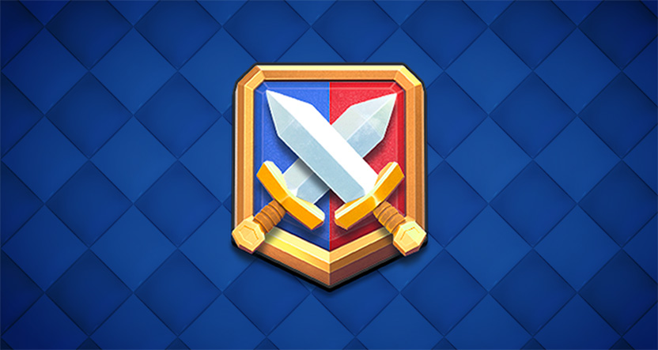

皇室战争官方突然把 Ranked 天梯的解锁门槛往下调了一档。

简单说，原本让不少玩家卡得很难受的奖杯要求，现在从 7 月开始降到了 **13000 杯**。如果你之前一直在 12500 到 13500 杯之间反复横跳，这次改动对你来说应该算是近期最直接的好消息。

这次不是一篇很长的更新公告，但信息量其实不小。它说明官方已经意识到：后期竞技入口如果推得太快，会让追赶中的玩家产生很强的挫败感。

## 这次到底改了什么？

根据皇室战争官方 2026 年 7 月 15 日发布的简体中文公告，新的 Ranked 天梯奖杯要求已经生效，后续节奏如下：

| 时间 | Ranked 解锁门槛 |
|---|---:|
| 2026 年 7 月和 8 月 | 13000 杯 |
| 2026 年 9 月和 10 月 | 13500 杯 |
| 2026 年 11 月起 | 14000 杯 |

也就是说，官方并不是直接取消高杯门槛，而是把上调节奏放慢：先让更多玩家在 13000 杯阶段进入 Ranked，再用两个月一个台阶的方式逐步回到 14000 杯。

## 为什么要下调？

官方给出的理由很明确：很多玩家已经快要解锁天梯，却因为掉杯，或者新赛季开始时门槛又增加 500 杯，导致一直卡在门口。

这个体验其实很多人都懂。你以为自己快摸到 Ranked 了，结果赛季一刷新，门槛又往前挪一点；你再冲一波，中途又可能连败掉杯。最后不是不想打，而是感觉自己永远在追一个不断移动的终点。

所以这次调整的重点不是“送福利”，而是降低后期竞技入口的追赶压力。尤其是 13000 杯附近的玩家，这两个月会明显舒服一些。

## 哪些玩家最受影响？

最受益的是 **12500 到 13500 杯** 左右的玩家。

如果你已经在 13000 杯附近，现在不需要再等到 14000 杯才能接触 Ranked。对于想打更正式对局、拿天梯奖励，或者只是想体验后期竞技环境的玩家来说，门槛降低会让目标更现实。

其次是回坑玩家。皇室战争最近一年围绕等级、英雄、进化和后期系统做了很多调整，老玩家回来的时候，最怕的就是发现自己离新内容越来越远。Ranked 入口短期下调，至少给了回坑玩家一个比较清晰的追赶窗口。

但如果你已经稳定高杯，这次变化对你的直接影响不大。它更多是在扩大 Ranked 的入口人数，而不是改变高段位本身的规则。

## 现在应该怎么打？

如果你距离 13000 杯不远，建议这段时间先把目标定得简单一点：不要急着换太多新卡组，先用自己最熟的一套稳定冲进 Ranked。

13000 杯附近的对局，很多时候输赢不完全取决于卡组强度，而是取决于失误率。比起临时抄一套不熟悉的环境卡组，用你已经知道怎么防守、怎么反打、怎么斩杀的卡组，成功率往往更高。

另外，尽量避开自己状态不好的连打。冲杯最怕的不是输一局，而是因为不服气连续开，最后一口气把前面打出来的奖杯全部送回去。Ranked 门槛已经降了，现在更需要稳一点把窗口期吃到手。

## 这背后释放了什么信号？

我觉得这次调整有一个值得注意的点：官方在公告里提到，今年晚些时候还会针对后期竞技体验推出更多更新。

这句话说明 Ranked 和后期竞技并不是一次性调整。现在降低奖杯门槛，可能只是先处理“进不去”的问题；后面更重要的是，进入 Ranked 之后，匹配、奖励、段位压力和长期目标能不能继续优化。

皇室战争现在最需要修复的，其实是玩家对后期系统的信任。玩家并不是不愿意冲杯，也不是不愿意打更有强度的模式，而是不想每次刚追上进度，就发现门槛又被抬高了。

所以这次 13000 杯门槛下调，至少是一个比较务实的动作。它没有解决所有问题，但确实让一部分卡在门口的玩家，可以先进去打起来。

## 一句话总结

7 月和 8 月，皇室战争 Ranked 天梯门槛降到 **13000 杯**。这不是永久降门槛，而是官方给追赶玩家留出的两个月窗口。

如果你正好卡在 13000 杯附近，现在就是冲 Ranked 的好时机。

资料来源：[皇室战争官方公告：天梯奖杯要求调整](https://supercell.com/en/games/clashroyale/zh-hans/blog/news/%E5%A4%A9%E6%A2%AF-%E5%A5%96%E6%9D%AF-%E8%A6%81%E6%B1%82-%E8%B0%83%E6%95%B4/)
