皇室战争 8 月平衡性调整来了。

这次官方公告很长，但真正已经确认会随 8 月赛季上线的内容，主要就三块：**四种 1 费精灵要削弱、英雄和英雄卡技能要改成一次性使用、浪人和连弩修复一些异常交互**。

后面那一大串卡牌改动，官方明确写的是 **Work in Progress**，也就是还在测试中的调整预案。它们很有参考价值，但不等于最终实装。大家看这篇的时候可以先记住一句话：**前半段看作 8 月正式方向，后半段先当成官方放出来试水的草案。**

## 先说结论

这次最重要是官方终于开始处理现在环境里几个很明显的问题。

第一，四精灵太泛用了。火精灵、冰精灵、治疗精灵、电击精灵本来是低费循环和功能卡，但现在很多卡组带一堆精灵，甚至少带法术和支援单位。1 费能过牌、能骗费、能控场、还能蹭塔血，这种性价比确实有点离谱。

第二，英雄和英雄卡的技能冷却要被砍掉。除了刺客首领之外，技能都要改成一次性使用。这个改动很大，尤其是对骷髅帝王、小王子、威猛矿工、哥布林斯坦这类依赖技能节奏的卡，玩法会变得更直接，也会少很多后期反复刷技能的压迫感。

第三，官方已经在考虑把一些老问题卡做重做，比如战斗天使、女巫觉醒、虚空、哥布林机器、迫击炮和觉醒迫击炮。这部分目前还不是最终版，但能看出官方想把一些“要么太恶心，要么被削废”的卡重新拉回可用状态。

## 8 月确认上线的调整

### 四精灵削弱，二选一

涉及卡牌：

- 火精灵
- 冰精灵
- 治疗精灵
- 电击精灵

官方目前给了两个方案，8 月正式上线时会从里面选一个。

| 方案 | 调整内容 | 变化 |
|---|---|---|
| 方案一 | 生命值 230 -> 217 | -6% |
| 方案二 | 移动速度 极快 -> 快 | -25% |

这两个方案的共同点，是都想解决一个问题：**精灵不能再随便裸下就白嫖公主塔。**

如果削生命值，四精灵会被弓箭手、弓箭女皇、投弹兵、火枪手、特斯拉电磁塔一发解决。这样它们在面对很多后排和建筑时，不再能稳定换到费用。

如果削速度，精灵同样更难自己跳到塔上，而且会更容易被巨石投手、烟花炮手、猎人、神箭游侠这些卡的攻击命中。不过削速度也有一个微妙影响：它们用来拉扯和拖时间时，可能会多吸引一点火力。

我个人更倾向于官方最后会选削生命值。原因很简单，削速度会改变精灵的手感，很多拉扯、防守、卡位的细节都要重新适应；削血量更像是直接砍掉白嫖价值，保留原本作为循环和功能卡的定位。

但不管选哪一个，四精灵环境肯定会降温。现在很多卡组带双精灵甚至多精灵，本质上就是在用 1 费卡不断把卡组刷到觉醒和英雄形态。这个节奏如果不动，后面不管削哪张核心卡，问题都会绕回来。

### 英雄和英雄卡技能改为一次性使用

| 调整项 | 调整前 | 调整后 |
|---|---|---|
| 技能机制 | 有冷却，可以重复使用 | 单局每张卡只用一次 |

这个改动很关键。

官方的说法是，技能冷却没有带来足够有意义的玩法，反而增加了复杂度。所以除了刺客首领这种本来就围绕连续技能设计的卡，其他英雄和英雄卡都改成一次性技能。

说人话就是：以前你要防对面“下一次技能什么时候又好了”，以后更多变成“这一下技能交在哪里”。这会让对局更好读，也会让很多卡的上限降低。

为了补偿这个改动，官方给了几张偏弱英雄卡一点数值补强。

### 哥布林斯坦

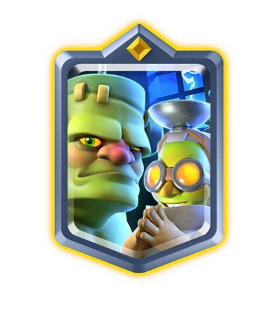

| 调整项 | 调整前 | 调整后 |
|---|---|---|
| 博士伤害 | 92 | 135 |

哥布林斯坦这个加强很直白，就是提高博士输出。考虑到技能变成一次性，如果本体和博士没有一点补偿，它的存在感会掉得很快。

不过这个加强能不能救回来，还要看一次性技能对它影响有多大。哥布林斯坦很多时候强在技能能打乱进攻节奏，只加博士伤害，未必能完全补回来。

### 小王子

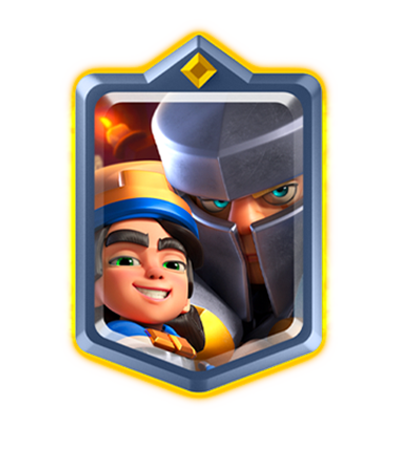

| 调整项 | 调整前 | 调整后 |
|---|---|---|
| 攻速蓄力保留时间 | 0 秒 | 0.3 秒 |
| 护卫伤害 | 217 | 232 |

小王子现在移动时会保留 0.3 秒蓄力攻速，简单说就是手感会顺一点，不至于刚刚叠起来又因为移动完全断掉。

护卫伤害小幅提高，也是在弥补技能只能用一次之后的强度损失。

但小王子现在最大的问题不是“数值一点点不够”，而是他的强势期早就过去了。这个加强会让他好用一些，但想回到当年那种人手一张的版本，应该不现实。

### 威猛矿工

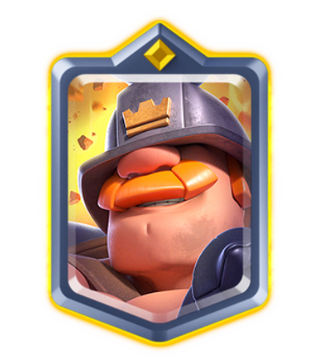

| 调整项 | 调整前 | 调整后 |
|---|---|---|
| 基础伤害 | 40 | 43 |

威猛矿工基础伤害小幅提高，官方特别提到，现在他在所有等级下都能两下打掉骷髅。

这是很典型的交互修正。幅度不大，但会让一些细碎防守更稳定。只是技能变一次性之后，威猛矿工的核心压迫感也会下降，所以这点加强更像是保底补偿。

### 浪人修复

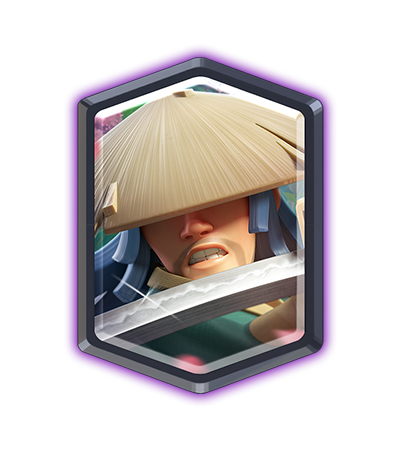

| 调整项 | 调整前 | 调整后 |
|---|---|---|
| 首次攻击时间 | 0.3 秒 | 0.4 秒 |

浪人这里不是普通削弱，而是修 bug。

官方提到，浪人面对冲锋中的黑暗王子时，会在同一个时间点打出招架伤害和近战伤害，导致黑王护盾交互不稳定。调整首次攻击时间后，这个异常应该会被修掉。

另外，浪人的招架也不再打断金甲骑士冲刺。

这对浪人来说是一次手感和交互修正。数值上看像变慢了，但重点是避免某些对局出现不合理的“双重判定”。

### 连弩修复

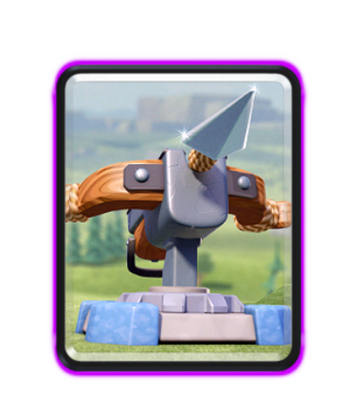

| 调整项 | 调整前 | 调整后 |
|---|---|---|
| 攻击速度 | 0.3 秒 | 0.4 秒 |
| 伤害 | 43 | 58 |
| 弹道速度 | 1400 | 1600 |

连弩这个也不是传统意义上的削弱或加强，而是重新分配数值。

官方说连弩在极限射程攻击单位时，经常会出现目标已经死了，但连弩还浪费一发攻击的情况。所以他们降低攻击频率，提高单发伤害和弹道速度，来修这个交互。

最终结果是连弩整体 DPS 反而提高了 1.4%。

对普通玩家来说，这个改动最直观的影响是：连弩射得没那么密，但单发更疼，极限距离下的浪费攻击应该少一些。连弩玩家可以关注一下实装后的手感，如果锁塔和解场更稳定，可能算是小加强。

## 还在测试中的 WIP 调整

下面这些目前都还不是最终版。官方放出来的目的，很明显是想听社区反馈。

### 重做方向

这里面最值得看的，是战斗天使、女巫觉醒和虚空。官方这次不是简单把数字往上加，而是想把一些过去很难平衡的机制重新拆开。

#### 精英寒冰戈仑

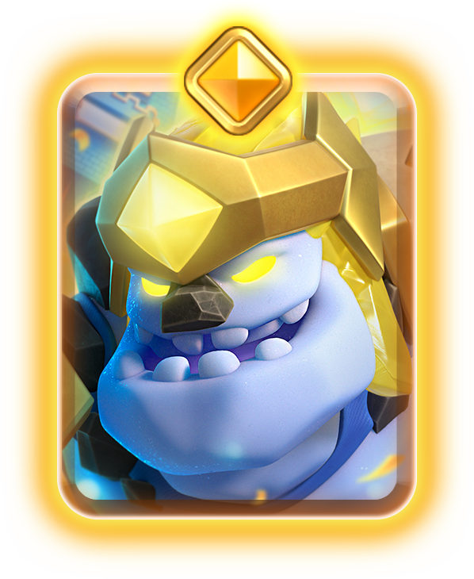

| 调整项目 | 调整前 | 调整后 |
|---|---|---|
| 第三次爆炸效果 | 冰冻 | 减速 |
| 每次爆炸伤害 | 38 | 69 |

精英寒冰戈仑的思路是削控制、加伤害。冰冻效果太容易让防守方突然断节奏，改成减速之后会没那么恶心，但伤害提高后，它清杂毛和补伤害的能力会更稳定。

#### 女巫觉醒

| 调整项目 | 调整前 | 调整后 |
|---|---|---|
| 每个骷髅治疗量 | 53 | 122 |
| 最大生命值 | 1040 | 1326 |
| 治疗触发 | 每波骷髅都能治疗 | 只从第一波骷髅获得治疗 |

女巫觉醒不是简单削弱治疗量，而是只允许第一波骷髅触发治疗。这样她仍然有爆发式回血，但不会一路召骷髅一路回血，打起来没完没了。

#### 战斗天使

| 调整项目 | 调整前 | 调整后 |
|---|---|---|
| 伤害 | 148 | 204 |
| 攻击速度 | 1.5 秒 | 1.6 秒 |
| 治疗半径 | 4000 | 3000 |
| 自我治疗 | 可以治疗自己 | 不再治疗自己 |

战斗天使如果不再治疗自己，玩法会完全变。以前她最烦人的地方就是能边打边奶自己，拖得你很难受。新方案是提高伤害，但砍掉自奶，官方显然想把她从“赖场治疗单位”改成“带治疗能力的近战输出”。这个方向我觉得是对的，因为反复自奶在皇室战争里一直都不好平衡。

#### 哥布林诅咒

| 调整项目 | 调整前 | 调整后 |
|---|---|---|
| 敌方减速 | 0% | 15% |

哥布林诅咒加减速，是想让它在移除增伤之后重新找到定位。现在它不再是“万物增伤器”，如果能靠减速稳定处理杂毛和辅助防守，可能会变成一张更纯粹的控制法术。

#### 哥布林机甲

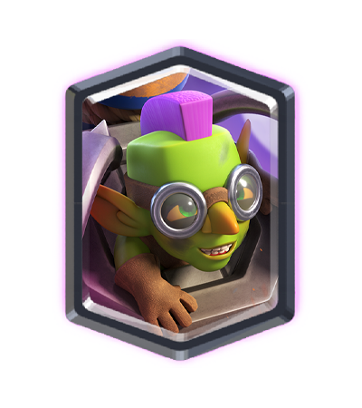

| 调整项目 | 调整前 | 调整后 |
|---|---|---|
| 火箭飞行速度 | 250 | 350 |
| 火箭攻击速度 | 3.5 秒 | 5 秒 |
| 近战伤害 | 212 | 232 |

哥布林机器这组调整看起来像是把远程火箭从“频繁骚扰”改成“少打但更准一点”，同时补一点近战伤害。它如果还想回环境，最需要解决的不是单次伤害，而是到底该当肉盾、远程消耗，还是半个进攻核心。

#### 符文巨人

| 调整项目 | 调整前 | 调整后 |
|---|---|---|
| 生命值 | 2662 | 2816 |
| 附魔释放时间 | 1 秒 | 0 秒 |
| 自爆类单位附魔 | 可以附魔 | 不再附魔 |

符文巨人加强生命值和释放速度，明显是想让她的节奏更顺。不能再附魔自爆类单位，也是在避免一些奇怪组合把机制玩歪。

#### 虚空

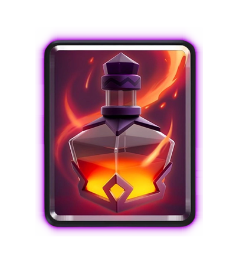

| 调整项目 | 调整前 | 调整后 |
|---|---|---|
| 圣水花费 | 3 | 5 |
| 攻击频率 | 1 秒 | 1.2 秒 |
| 单目标伤害 | 340 | 696 |
| 2-4 个目标伤害 | 161 | 294 |
| 5 个及以上目标伤害 | 76 | 153 |
| 单目标对塔伤害 | 48 | 97 |
| 2-4 个目标对塔伤害 | 25 | 51 |
| 5 个及以上目标对塔伤害 | 17 | 35 |

虚空就更大胆了。3 费变 5 费，伤害几乎翻倍，目标是做成第一张 5 费伤害法术，专门处理巨石投手、飞斧屠夫、猎人这种高血量远程单位。如果这个方案真上线，法术体系会多一个很怪的新选择。但 5 费法术不好用也是真的，费用一高，容错率会低很多。

#### 精英重甲亡灵

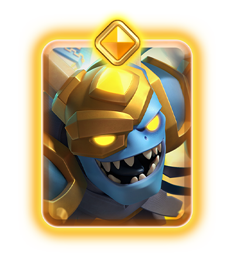

| 调整项目 | 调整前 | 调整后 |
|---|---|---|
| 对塔伤害减免 | 50% | 75% |
| 对塔伤害减免持续时间 | 5 秒 | 永久 |
| 传送伤害 | 373 | 399 |

精英重甲亡灵这组调整主要是让它在对塔交互里更有特色。永久减免对塔伤害听起来很夸张，但具体强不强，要看它在实战里能不能稳定创造进攻机会。

#### 迫击炮和觉醒迫击炮

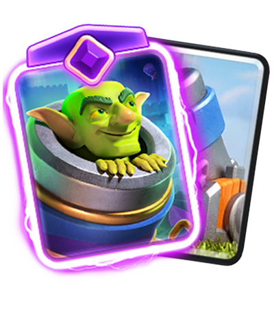

| 调整项目 | 调整前 | 调整后 |
|---|---|---|
| 普通迫击炮攻击速度 | 5 秒 | 4.7 秒 |
| 觉醒迫击炮攻击速度 | 4 秒 | 4.7 秒 |

迫击炮这组改动也有意思。普通迫击炮变快，觉醒迫击炮变慢，等于把基础形态往上抬，把觉醒形态往下压。这个思路比单纯砍觉醒更健康一点，毕竟现在很多觉醒卡的问题就是基础形态一般，觉醒形态突然离谱。

#### 野蛮人和觉醒野蛮人

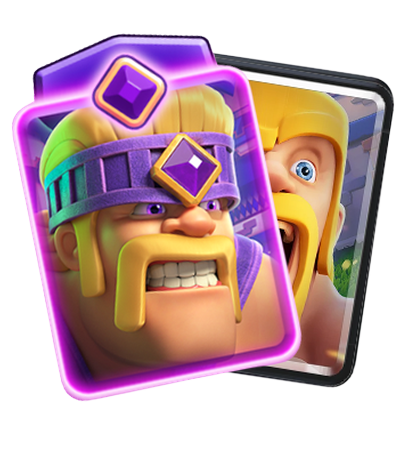

| 调整项目 | 调整前 | 调整后 |
|---|---|---|
| 普通野蛮人生命值 | 691 | 716 |
| 觉醒野蛮人额外生命值 | 10% | 0% |
| 觉醒野蛮人狂暴时间 | 3 秒 | 5 秒 |

野蛮人这组也是同一个思路：基础形态加强，觉醒形态不要只靠血量硬撑。狂暴时间变长后，觉醒野蛮人会更吃站场输出，但额外生命值取消，也会更怕法术和范围伤害。

### WIP 削弱

这批削弱基本都能看出官方在处理两个方向：觉醒卡过强，以及部分远程/冲塔单位的压迫感过高。

#### 精英哥布林

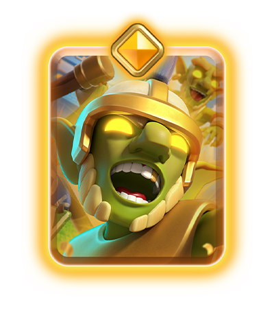

| 调整项目 | 调整前 | 调整后 |
|---|---|---|
| 复活哥布林数量 | 3 | 2 |
| 部署时间 | 1.3 秒 | 1 秒 |

复活数量少一个是削弱，但部署更快是补偿。这个方向像是在降低上限，同时让它落地更干脆。

#### 弓箭手觉醒

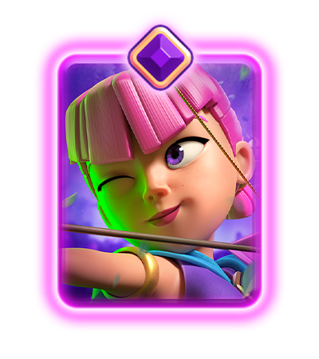

| 调整项目 | 调整前 | 调整后 |
|---|---|---|
| 强力射击伤害 | 168 | 140 |

弓箭手觉醒削强力射击，主要是砍她们远距离白嫖后排的能力。只要保持安全距离，她们原本的输出太稳定了。

#### 巨型雪球觉醒

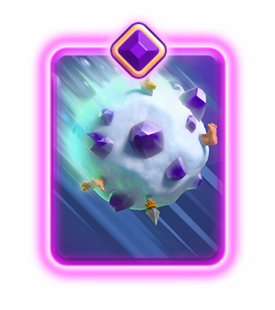

| 调整项目 | 调整前 | 调整后 |
|---|---|---|
| 滚动距离 | 4.5 格 | 4 格 |

巨型雪球觉醒削滚动距离，影响的是控场范围。少 0.5 格不算大，但很多边缘命中的场景会变少。

#### 哥布林飞桶觉醒

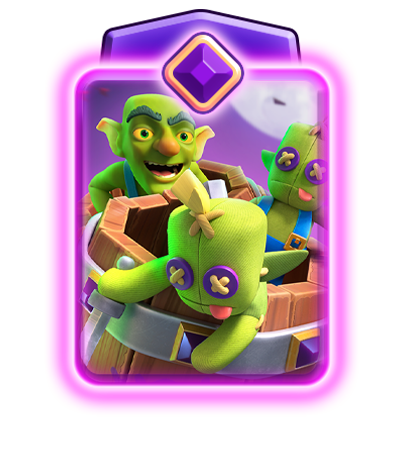

| 调整项目 | 调整前 | 调整后 |
|---|---|---|
| 假哥布林伤害 | 89 | 66 |

哥布林飞桶觉醒削假哥布林伤害，就是降低骗法术后的惩罚。你猜错位置仍然会亏，但不至于被假哥布林也偷太多血。

#### 哥布林牢笼觉醒

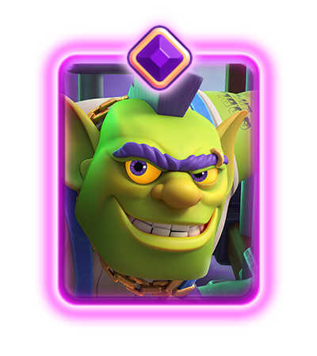

| 调整项目 | 调整前 | 调整后 |
|---|---|---|
| 觉醒周期 | 1 | 2 |

哥布林牢笼觉醒从 1 周期变 2 周期，如果实装就是大削。现在很多强觉醒最烦的地方就是出得太快，尤其是建筑类觉醒，防守一次就能攒出下一轮压力。

#### 超级骑士觉醒

| 调整项目 | 调整前 | 调整后 |
|---|---|---|
| 击飞频率 | 每次攻击 | 每隔一次攻击 |
| 重型单位击退阈值 | 2500 | 4000 |

超级骑士觉醒从每次击飞改成隔次击飞，也算是终于对“落地之后一路把人掀走”的体验动刀。不过它对重型单位的击退阈值提高，意味着一些大单位会更不容易被击飞，防守推进时不会那么憋屈。

#### 女武神觉醒

| 调整项目 | 调整前 | 调整后 |
|---|---|---|
| 旋风伤害 | 84 | 42 |

女武神觉醒这刀很直接，旋风伤害砍半。她仍然能聚怪，但不能再靠旋风顺手把一堆小单位刮没。

#### 巨石投手

| 调整项目 | 调整前 | 调整后 |
|---|---|---|
| 投射物距离 | 7.5 格 | 7 格 |

#### 飞斧屠夫

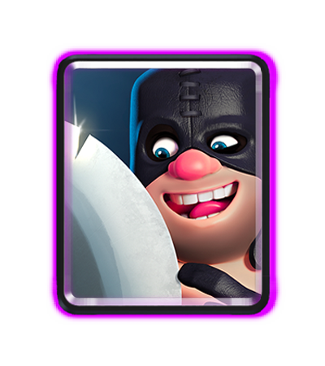

| 调整项目 | 调整前 | 调整后 |
|---|---|---|
| 投射物距离 | 7.5 格 | 7 格 |

巨石投手和飞斧屠夫都是射程小削。这个调整看起来只有 0.5 格，但这类穿透远程单位的很多强度都来自“站得太舒服”。少半格射程，可能会让它们更容易被反打。

#### 攻城炸弹人

| 调整项目 | 调整前 | 调整后 |
|---|---|---|
| 伤害 | 350 | 281 |

攻城炸弹人伤害 350 -> 281，这个幅度不小。如果真这么改，桥头偷鸡能力会明显下降。它现在的问题不是不能解，而是只要一次没处理干净，塔血掉得太快。

### WIP 增强

这批增强里，公主觉醒和投矛哥布林最值得看。

#### 精英墓碑

| 调整项目 | 调整前 | 调整后 |
|---|---|---|
| 伤害 | 320 | 422 |

精英墓碑加伤害，是在提高它的主动威胁。墓碑本来偏防守，如果精英形态能打出更高伤害，进攻反打会更有存在感。

#### 亡灵大军觉醒

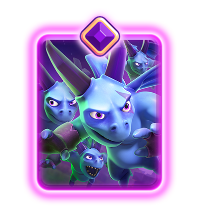

| 调整项目 | 调整前 | 调整后 |
|---|---|---|
| 攻速减缓效果 | 50% | 33% |

这个数字看起来是从 50% 到 33%，但按效果理解是削弱减速幅度，也就是让被影响的目标没那么难受。官方把它放在增强里，可能是因为实际机制或显示口径比较特殊，最终还是要看实装说明。

#### 公主觉醒

| 调整项目 | 调整前 | 调整后 |
|---|---|---|
| 减速触发频率 | 每 3 次攻击 | 每隔一次攻击 |
| 减速持续时间 | 7 秒 | 5.5 秒 |

公主觉醒减速触发更频繁，但持续时间变短。这个调整不是纯加强，更像是把她的节奏做得更稳定。以前 7 秒减速太长，但三次攻击才触发又有点不顺。改成隔次触发后，她的存在感会更连续。

#### 哥布林

| 调整项目 | 调整前 | 调整后 |
|---|---|---|
| 伤害 | 120 | 125 |

哥布林伤害小加强，幅度不大，但低费卡最怕的就是这种“看着没啥、实际交互变多”的调整。

#### 投矛哥布林

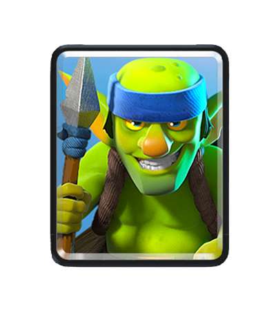

| 调整项目 | 调整前 | 调整后 |
|---|---|---|
| 攻击速度 | 1.7 秒 | 1.6 秒 |

投矛哥布林攻速从 1.7 秒到 1.6 秒，看起来小，但低费远程杂毛只要效率高一点，就可能进入很多速转和 bait 卡组。再加上哥布林本体也加伤害，哥布林系低费卡可能会一起回暖。

#### 可疑灌木

| 调整项目 | 调整前 | 调整后 |
|---|---|---|
| 灌木哥布林生命值 | 304 | 337 |

可疑灌木加强生命值，更多是补强冷门卡。它的问题一直不是单个数值，而是定位比较尴尬。多一点血会舒服些，但要靠这个改动翻身，可能还不够。

## 这次调整对环境意味着什么？

如果只看 8 月确定上线的部分，最大赢家未必是某张卡，而是传统法术和支援单位。

四精灵削弱后，很多卡组不能再那么无脑靠 1 费过牌和控场。玩家可能要重新带回小电、滚木、雪球、毒药、火球这类法术，也可能更愿意带一些真正能站场的支援单位。

英雄技能一次性使用之后，中后期反复靠技能翻盘的场面会少一些。这个改动会让对局更清楚，但也会让一些英雄卡失去特色。后续官方大概率还要继续补数值，否则部分英雄可能会直接掉出环境。

WIP 部分则更像是官方在给未来几个月铺路。女巫觉醒、战斗天使、虚空、迫击炮、觉醒超级骑士这些卡，都是过去一段时间里要么体验差、要么强度难控、要么被削到没人用的典型案例。官方这次没有只调数字，而是尝试改机制，这点比单纯加减伤害更值得关注。

## 总结

这次调整我觉得方向是对的，但风险也不小。

四精灵确实该动。现在很多对局里，精灵不只是辅助循环，而是直接替代了法术和支援卡。1 费卡如果能稳定带来正收益，环境最后一定会变得很挤。

英雄技能改一次性也能理解。技能冷却让局面复杂了很多，尤其后期圣水一快，很多技能会从“关键抉择”变成“好了就按”。改成一次性之后，对局会少一点乱战感。

但问题是，这会让部分英雄卡变得很吃初始数值。技能只能用一次，本体如果不够强，那这张卡就很难撑起一个卡位。官方说后续会继续观察，这个应该不是客套话，8 月之后很可能还有补丁。

WIP 里面我最期待的是虚空重做和战斗天使重做。虚空如果真变成 5 费法术，皇室战争会多一个新的法术档位；战斗天使如果去掉自奶，也许终于能摆脱“强了恶心，弱了没人用”的循环。

当然，预案就是预案，一切以实装为准。

那么，各位挑战者，你怎么看？
