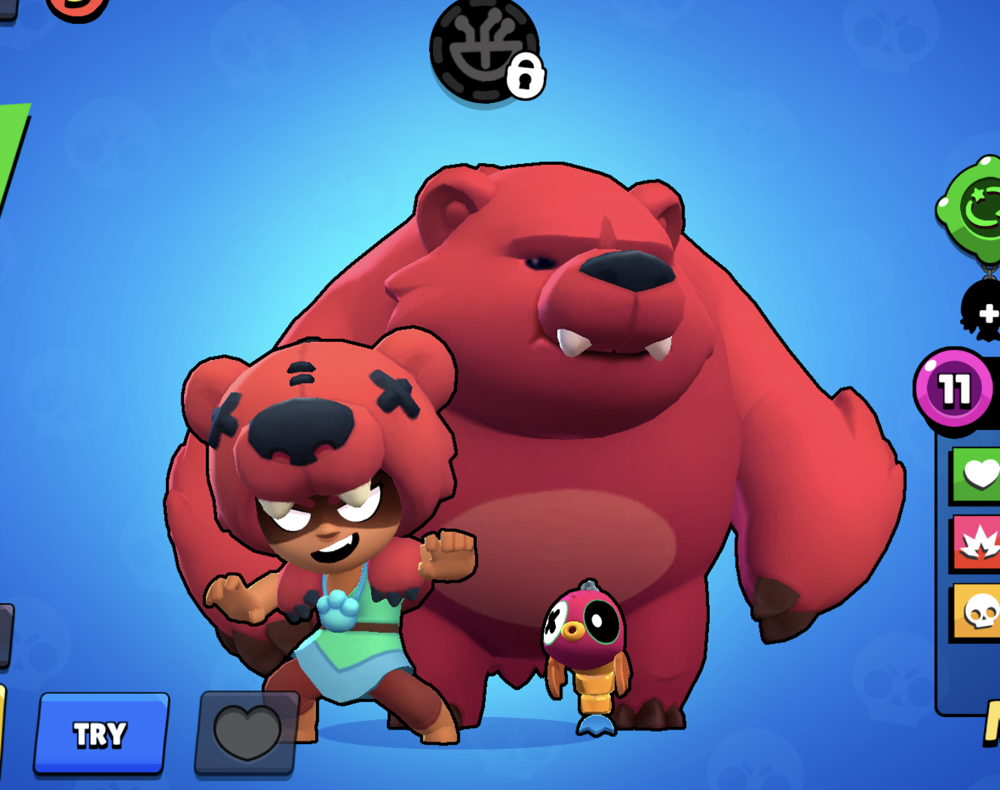
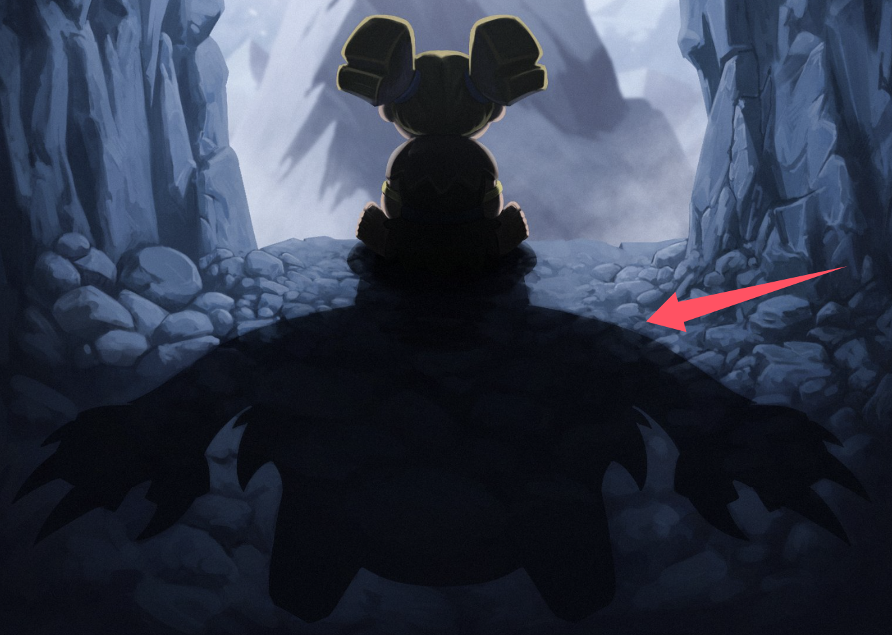

皇室战争官方又开始发月底预热图了。

2026 年 7 月 23 日晚，官方 X 账号发了一张图，文案只有一句：**She's had enough.**

图里，一个很像狂战士的小人坐在山洞口，前面是雪山，背后压着一个巨大的影子。影子的轮廓不像普通投影，更像是某种放大后的怪物形态。

这类图一般不会只是普通美术。皇室战争经常在月底用这种方式给下赛季内容做预热，尤其是新精英、觉醒卡牌或主题季主角。考虑到当前 7 月主题季「荣耀与离乡」的主要内容已经进入后半段，这张图很像是在给 8 月主题季铺路。

## 为什么大家第一眼想到狂战士？

最直接的原因是角色轮廓。

图中小人的发型、体型和双手姿势都很像狂战士。狂战士本来就是一个小体型、双斧、近战高速攻击单位，官方这张图又特意把她放在画面中心，很难让人不往这张卡上想。

更有意思的是下方的影子。

如果只是普通预热图，官方完全可以画一个站立姿势，或者直接给出武器局部。但这张图刻意让狂战士背对玩家，前景放出一个巨大的黑影。这个构图很像在暗示“她身体里还有另一个形态”，也就是社区现在讨论最多的两个方向：

- **狂战士精英形态**
- **狂战士觉醒形态**

有人认为影子像狼人或野兽，有人觉得金色头发和手臂装饰更像精英形态，也有人猜她可能会召唤一个单位。

这也是目前最主流的两种猜测：如果是觉醒，重点可能是狂战士在满足条件后进入暴走；如果是精英，重点可能会变成主动技能，玩家按下技能后触发变身或召唤。

## 精英形态呼声更高

现在社区里，猜“精英狂战士”的声音明显不少。

原因主要有三个。

第一，官方文案是 “She's had enough.”，语气像是在说她终于忍不了了。这种表达更像主动爆发，而不是普通卡牌觉醒的被动强化。

第二，图里的影子不是简单变大，而是有点像另一个生物。很多玩家把它联想到狼人、野兽形态，也有人开玩笑说像荒野乱斗里的妮塔和熊。

第三，狂战士本身是 2 费单位。如果直接做成觉醒，设计空间会比较紧。2 费卡进速转体系太容易，如果觉醒效果强，玩家会很快把她塞进各种循环卡组；如果效果弱，又撑不起月底预热的期待。精英形态反而有一个技能费用和释放时机，可以给平衡多留一点空间。

这不代表精英形态就一定成立。官方也可能只是用更夸张的画面来包装觉醒。

## 如果是觉醒，会怎么设计？

如果最后真是狂战士觉醒，我觉得比较可能的方向不是单纯加伤害。

狂战士已经是低费高速攻击单位，直接加攻速或伤害很容易失控。她最适合的觉醒方向，可能是“进入某种短时间暴走状态”，比如：

- 血量降低后获得短暂加速。
- 首次击杀单位后冲向下一个目标。
- 受到一定伤害后触发一次范围斩击。
- 觉醒后拥有更强的单体压制能力，但持续时间有限。

这些方向都能贴合“She's had enough.” 这句话，也能解释图里的巨大影子。

但这里有个问题：狂战士只有 2 费。低费觉醒最怕的就是循环太快，尤其是她这种本来就能当小肉盾、能解后排、能配合反打的单位。如果觉醒条件太容易刷出来，环境可能会很快变成狂战士速转。

如果是觉醒，官方应该会在触发条件、持续时间或目标选择上卡得比较紧。

## 如果是精英，可能会更有看头

如果是精英狂战士，设计空间会大很多。

精英形态可以给她一个主动技能。比如按下技能后短暂变身，获得更高攻速、冲锋、免控，或者召唤影子里的那个“大东西”。这样玩家要考虑什么时候交技能，而不是只靠循环次数堆强度。

这也更符合官方这张图的氛围。

狂战士坐在洞口，看起来不是已经在战斗，而是在压着情绪。底部那个巨大影子像是“还没放出来”的力量。如果做成精英技能，画面逻辑会比较顺：平时是小狂战士，技能一开才暴走。

从玩法角度看，精英狂战士也能解决一个问题：普通狂战士现在存在感不算特别高。她有自己的定位，但不是那种每个玩家都会围绕她组卡组的主轴牌。如果给她精英形态，官方就可以让她从“低费近战组件”变成一个能被围绕构筑的进攻点。

不过风险也很明显。2 费本体加主动技能，稍微做强一点就会很烦。尤其是速转、桥头压迫、矿工毒药、迫击炮、皇家野猪这类体系，都有可能拿她当低费节奏点。

## 狂战士这张牌本来就很敏感

狂战士不是一张普通的冷门卡。

她在 2025 年 2 月加入皇室战争，当时官方介绍她是新的 **2 费近战单位**，特点是攻速非常快。后来她也经历过几次平衡调整：一开始偏弱，官方给过攻速加强；强起来之后，又因为 2 费小肉盾加高输出太好用，被削过攻速。

这段历史说明一个问题：狂战士的强度很吃数值。

她不像大费推进卡，强一点也要等费用和节奏；狂战士只要效率高一点，就能立刻进入很多卡组。2 费、近战、能抗、能砍，这几个标签放在一起，本来就容易影响环境。

所以这次如果真是她的新形态，不管是精英还是觉醒，官方应该都会很谨慎。玩家担心的不是“狂战士有没有新东西”，而是她会不会一上线就变成每套速转都想带的卡。

## 社区现在在猜什么？

目前几个主要猜法是：

- **精英狂战士**：社区讨论最多的方向之一，理由是图里的金色细节、巨大影子和主动爆发感。
- **狂战士觉醒**：也很合理，月底预热图经常对应下赛季觉醒卡牌。
- **变身机制**：不管是精英还是觉醒，很多玩家都觉得她会进入类似野兽、狼人或巨大形态。
- **召唤机制**：有人从影子判断，她可能不是自己变大，而是召唤一个单位。
- **C.H.A.O.S 或特殊模式改动**：也有人猜和 7 月 C.H.A.O.S 的混沌玩法有关，但从发布时间看，更像下赛季内容。

YouTube 创作者这边也已经开始跟进。Boss 的视频标题直接写成 “Berserker Evolution or Hero is Crazy”，葡语区创作者也在用“新精英？”的角度分析这张图。

社区现在没有统一答案，但方向很集中：**狂战士肯定不是普通出镜，很可能有新形态。**

## 你怎么看？

我现在更倾向于 **精英狂战士**，但只给“偏向”，不说确定。

原因很简单：这张图最强的线索不是狂战士本人，而是她背后的巨大影子。觉醒也能做变身，但如果官方想强调“玩家主动释放某种暴走能力”，精英形态会更合适。

另外，狂战士本身是 2 费卡。觉醒版如果只靠循环触发，平衡压力会很大；精英版可以通过技能费用、冷却和释放时机来限制强度。对设计来说，后者更好控。

但如果最后是觉醒，也不意外。皇室战争现在每个主题季都需要一个清晰的视觉记忆点，狂战士背后的大影子，很适合做成觉醒宣传图。

玩家现在不用急着囤资源。等官方下一张预热或 TV Royale / 赛季公告出来，再判断是要准备狂战士卡牌、精英碎片，还是觉醒相关资源会更稳。

## 先等下一张图

目前能确认的只有三件事：

- 官方在 2026 年 7 月 23 日发布了狂战士疑似预热图。
- 配文是 “She's had enough.”
- 社区主流猜测集中在狂战士精英形态或狂战士觉醒。

其他都还不是官宣。

如果这是 8 月主题季的预热，那接下来几天应该还会有更多线索。到时候重点看三件事：官方会不会出现技能按钮、会不会出现觉醒标识，以及图里的影子到底是狂战士自己，还是一个被召唤出来的单位。

只看这张图，我的判断是：**狂战士要有大动作了，而且这次不像普通加强。**

资料来源：

- [Clash Royale 官方 X：She's had enough.](https://x.com/ClashRoyale/status/2080305685238345967)
- [Reddit 讨论：Something's coming for the Berserker](https://www.reddit.com/r/ClashRoyale/comments/1v4geao/somethings_coming_for_the_berserker/)
- [RoyaleAPI / Boss：Berserker Evolution or Hero is Crazy](https://royaleapi.com/content/boss?id=2fRh8ysS5kI)
- [Supercell 官方：Berserker 新卡介绍](https://supercell.com/en/games/clashroyale/blog/release-notes/february-events-challenges-2/)
- [Supercell 官方：Berserker 攻速加强记录](https://supercell.com/en/games/clashroyale/blog/release-notes/balance-changes-and-2v2-ladder-bug-fix/)
- [Supercell 官方：Berserker 攻速削弱记录](https://supercell.com/en/games/clashroyale/blog/release-notes/october-balance-changes-2/)
